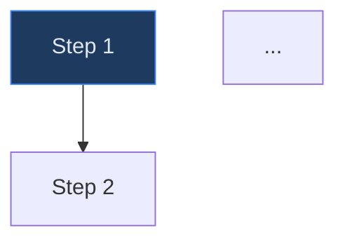

# User Manual Enhancement — Implementation Plan

> **For Claude:** REQUIRED SUB-SKILL: Use superpowers:executing-plans to implement this plan task-by-task.

**Goal:** Comprehensive rewrite of the Virtual Analyst user manual — 26 chapters + glossary + README, organized by sidebar nav groups, each with Mermaid process flows, troubleshooting, and quick-reference sections.

**Architecture:** Pure documentation task. Each chapter is an independent Markdown file following an approved template. Chapters are written by reading the corresponding frontend page + backend router to ensure accuracy. Old chapter files are removed before writing new ones.

**Tech Stack:** Markdown, Mermaid flowcharts

---

## Conventions

### Chapter Template (every chapter follows this)

```markdown
# [Chapter Title]

## Overview
2-3 sentences: what the feature does and when you'd use it.

## Process Flow

High-level process flow (5-8 nodes).

## Key Concepts
| Term | Definition |
|------|-----------|
| ... | ... |

## Step-by-Step Guide
### 1. First Action
Numbered walkthrough of the primary workflow.

### 2. Second Action
...

## [Detailed Sub-Workflow]

Detailed Mermaid diagram for the most complex sub-workflow (15-30 nodes).

## Quick Reference
| Action | How |
|--------|-----|
| ... | ... |

## Troubleshooting
| Symptom | Cause | Resolution |
|---------|-------|------------|
| ... | ... | ... |
3-5 common issues.

## Related Chapters
- [Chapter N: Title](filename.md) — brief reason
```

### Mermaid Color Scheme (match existing chapters)
- Blue nodes: `fill:#1e3a5f,stroke:#3b82f6,color:#e2e8f0`
- Purple nodes: `fill:#2d1b4e,stroke:#8b5cf6,color:#e2e8f0`
- Green nodes: `fill:#1a3a2a,stroke:#22c55e,color:#e2e8f0` or `fill:#1a3a2a,stroke:#10b981,color:#e2e8f0`
- Yellow/warning nodes: `fill:#3a2a1a,stroke:#f59e0b,color:#e2e8f0`
- Red/error nodes: `fill:#3a1a1a,stroke:#ef4444,color:#e2e8f0`
- Pink nodes: `fill:#3a1a3a,stroke:#ec4899,color:#e2e8f0`

### Tone
- Professional, instructional, user-focused
- Address user as "you" directly
- Avoid jargon without explanation
- Tables for configuration fields and options

### Target Length
- Regular chapters: 250-350 lines
- Complex chapters (AFS, Runs, Settings): 300-400 lines
- Simple chapters (Marketplace, Ventures): 200-280 lines

---

## Phase 1: Scaffolding

### Task 1: Remove old chapter files and create new README

**Files:**
- Delete: all files in `docs/user-manual/` except keep the directory
- Create: `docs/user-manual/README.md`

**Step 1: Remove old files**

```bash
rm docs/user-manual/*.md
```

**Step 2: Write new README.md**

Write `docs/user-manual/README.md` with:
- Welcome section (reuse existing intro paragraph)
- Quick-Start Checklist (8 steps, reuse existing with minor updates)
- Navigation Map organized by sidebar groups: GETTING STARTED, SETUP, CONFIGURE, ANALYZE, COLLABORATE & REPORT, ADMIN
- Platform Overview Flow (Mermaid diagram, reuse existing with updates)
- Chapters table listing all 26 chapters + glossary with correct file names
- Getting Help section

The chapters table must list:

| # | Chapter | File |
|---|---------|------|
| 01 | Getting Started | `01-getting-started.md` |
| 02 | Dashboard | `02-dashboard.md` |
| 03 | Marketplace | `03-marketplace.md` |
| 04 | Data Import | `04-data-import.md` |
| 05 | Excel Live Connections | `05-excel-connections.md` |
| 06 | AFS Module | `06-afs-module.md` |
| 07 | AFS Review and Tax | `07-afs-review-and-tax.md` |
| 08 | AFS Consolidation and Output | `08-afs-consolidation-and-output.md` |
| 09 | Org Structures | `09-org-structures.md` |
| 10 | Baselines | `10-baselines.md` |
| 11 | Drafts | `11-drafts.md` |
| 12 | Scenarios | `12-scenarios.md` |
| 13 | Changesets | `13-changesets.md` |
| 14 | Runs | `14-runs.md` |
| 15 | Monte Carlo and Sensitivity | `15-monte-carlo-and-sensitivity.md` |
| 16 | Valuation | `16-valuation.md` |
| 17 | Budgets | `17-budgets.md` |
| 18 | Covenants | `18-covenants.md` |
| 19 | Benchmarking and Competitor Analysis | `19-benchmarking.md` |
| 20 | Entity Comparison | `20-entity-comparison.md` |
| 21 | Ventures | `21-ventures.md` |
| 22 | Workflows, Tasks, and Inbox | `22-workflows-and-tasks.md` |
| 23 | Board Packs | `23-board-packs.md` |
| 24 | Memos and Documents | `24-memos-and-documents.md` |
| 25 | Collaboration | `25-collaboration.md` |
| 26 | Settings and Administration | `26-settings-and-admin.md` |
| A | Glossary | `appendix-a-glossary.md` |

**Step 3: Commit**

```bash
git add docs/user-manual/
git commit -m "docs: scaffold new user manual structure"
```

---

## Phase 2: Getting Started Chapters (Tasks 2-3)

### Task 2: Chapter 01 — Getting Started

**Files:**
- Create: `docs/user-manual/01-getting-started.md`
- Reference: `apps/web/app/login/page.tsx`, `apps/web/app/signup/page.tsx`, `apps/web/app/page.tsx`

**Content to cover:**
- Account creation (email+password or OAuth via Google/Microsoft)
- Email verification flow
- First login and redirect to dashboard
- Platform orientation: sidebar navigation groups (Setup, Configure, Analyze, Report, Other, Settings)
- Three onboarding paths: Marketplace, Excel Import, AFS
- Quick-start checklist

**Process flows:**
1. High-level: Sign Up → Verify → Log In → Choose Path → First Baseline
2. Detailed: Authentication flow with OAuth/email branching, error states, redirect logic

**Troubleshooting:** Failed verification email, OAuth popup blocked, redirect loop after login

**Step 1: Read existing chapter**
Read `docs/user-manual/01-getting-started.md` (old file, now deleted but content was captured in audit)

**Step 2: Read source pages**
Read `apps/web/app/login/page.tsx`, `apps/web/app/signup/page.tsx`, `apps/web/app/page.tsx`

**Step 3: Write chapter**
Write `docs/user-manual/01-getting-started.md` using the chapter template, incorporating existing content where accurate and adding troubleshooting + quick-reference sections.

**Step 4: Commit**
```bash
git add docs/user-manual/01-getting-started.md
git commit -m "docs: rewrite chapter 01 — getting started"
```

### Task 3: Chapter 02 — Dashboard

**Files:**
- Create: `docs/user-manual/02-dashboard.md`
- Reference: `apps/web/app/(app)/dashboard/page.tsx`

**Content to cover:**
- Summary cards (recent runs, pending tasks, unread notifications, API metrics)
- Activity feed
- Quick actions and navigation shortcuts
- Customization options (if any)

**Process flows:**
1. High-level: Log In → Dashboard → Quick Actions → Navigate to Feature
2. Detailed: Dashboard widget interaction flow (cards → drill-down → feature pages)

**Troubleshooting:** Dashboard cards not loading, stale data, missing notifications

**Step 1: Read source page and existing chapter content**
**Step 2: Write chapter following template**
**Step 3: Commit**
```bash
git add docs/user-manual/02-dashboard.md
git commit -m "docs: rewrite chapter 02 — dashboard"
```

---

## Phase 3: Setup Chapters (Tasks 4-10)

### Task 4: Chapter 03 — Marketplace

**Files:**
- Create: `docs/user-manual/03-marketplace.md`
- Reference: `apps/web/app/(app)/marketplace/page.tsx`, `apps/api/app/routers/marketplace.py`

**Content to cover:**
- Browsing templates by industry and type (budget/model)
- Search and filter functionality
- Applying a template: enter label + fiscal year → create baseline
- Template types: pre-built budgets, financial models, venture templates
- Saving a baseline as a reusable template

**Process flows:**
1. High-level: Browse → Filter → Select → Configure → Create Baseline
2. Detailed: Template application flow with validation, error handling, and success redirect

**Troubleshooting:** No templates found, template creation fails, duplicate label

**Step 1: Read source files**
**Step 2: Write chapter**
**Step 3: Commit**
```bash
git add docs/user-manual/03-marketplace.md
git commit -m "docs: write chapter 03 — marketplace"
```

### Task 5: Chapter 04 — Data Import

**Files:**
- Create: `docs/user-manual/04-data-import.md`
- Reference: `apps/web/app/(app)/excel-import/page.tsx`, `apps/api/app/routers/excel_ingestion.py`, `apps/web/app/(app)/import/csv/page.tsx`, `apps/api/app/routers/import_csv.py`

**Content to cover:**
- Excel import wizard: upload → AI classify → map → review → create baseline
- AI-assisted field mapping and Q&A chat during import
- CSV import: single-file upload with auto-detection
- Supported file formats and size limits
- Mapping preview and confirmation

**Process flows:**
1. High-level: Upload → Classify → Map → Review → Create
2. Detailed: 4-step import wizard with AI chat branching, error states, and retry logic

**Troubleshooting:** Upload fails, mapping errors, AI chat timeout, unsupported format

**Step 1: Read source files**
**Step 2: Write chapter**
**Step 3: Commit**
```bash
git add docs/user-manual/04-data-import.md
git commit -m "docs: rewrite chapter 04 — data import"
```

### Task 6: Chapter 05 — Excel Live Connections (NEW)

**Files:**
- Create: `docs/user-manual/05-excel-connections.md`
- Reference: `apps/web/app/(app)/excel-connections/page.tsx`, `apps/api/app/routers/excel.py`

**Content to cover:**
- Creating a connection: label, mode (read-only/read-write), target JSON, bindings JSON
- Understanding cell bindings: binding_id, path syntax (e.g., "income_statement.0.revenue", "kpis.net_income")
- Pull operation: fetch current values from run/baseline
- Push operation: send changes back (read-write mode only, max 500 changes)
- Managing connections: update, delete, view pull results
- Difference between static import (Ch. 04) and live connections

**Process flows:**
1. High-level: Create Connection → Configure Bindings → Pull Values → (Optional) Push Changes
2. Detailed: Pull/push sync flow with mode validation, error handling, and sync event logging

**Troubleshooting:** Invalid binding path, push rejected (read-only mode), target not found, JSON validation errors

**Step 1: Read source files**
**Step 2: Write chapter from scratch**
**Step 3: Commit**
```bash
git add docs/user-manual/05-excel-connections.md
git commit -m "docs: write chapter 05 — excel live connections"
```

### Task 7: Chapter 06 — AFS Module

**Files:**
- Create: `docs/user-manual/06-afs-module.md`
- Reference: `apps/web/app/(app)/afs/page.tsx`, `apps/web/app/(app)/afs/[id]/setup/page.tsx`, `apps/web/app/(app)/afs/[id]/sections/page.tsx`, `apps/api/app/routers/afs.py`

**Content to cover:**
- AFS dashboard: engagement list, status tracking, create new engagement
- Setup wizard: framework selection (IFRS/GAAP), entity details, fiscal year, trial balance upload
- Section editor: disclosure drafting with AI assistance, IFRS/GAAP parsers
- Engagement lifecycle and status progression

**Process flows:**
1. High-level: Create Engagement → Setup → Upload TB → Draft Sections → Review → Output
2. Detailed: Setup wizard flow with framework selection, validation, and section generation

**Troubleshooting:** Trial balance upload fails, framework not recognized, section editor errors

**Step 1: Read source files and existing chapter 10**
**Step 2: Write chapter**
**Step 3: Commit**
```bash
git add docs/user-manual/06-afs-module.md
git commit -m "docs: rewrite chapter 06 — AFS module"
```

### Task 8: Chapter 07 — AFS Review and Tax

**Files:**
- Create: `docs/user-manual/07-afs-review-and-tax.md`
- Reference: `apps/web/app/(app)/afs/[id]/review/page.tsx`, `apps/web/app/(app)/afs/[id]/tax/page.tsx`, `apps/api/app/routers/afs.py`

**Content to cover:**
- Three-stage review workflow: Preparer → Manager → Partner
- Review decision outcomes: approve, request changes, reject
- Tax computation: permanent vs. temporary differences
- AI-generated tax notes
- Feedback loops and correction tracking

**Process flows:**
1. High-level: Draft → Preparer Review → Manager Review → Partner Sign-off
2. Detailed: Review workflow with approval/rejection branching, feedback loops, and tax computation integration

**Troubleshooting:** Review stuck in wrong stage, tax computation errors, missing reviewer permissions

**Step 1: Read source files and existing chapter 11**
**Step 2: Write chapter**
**Step 3: Commit**
```bash
git add docs/user-manual/07-afs-review-and-tax.md
git commit -m "docs: rewrite chapter 07 — AFS review and tax"
```

### Task 9: Chapter 08 — AFS Consolidation and Output

**Files:**
- Create: `docs/user-manual/08-afs-consolidation-and-output.md`
- Reference: `apps/web/app/(app)/afs/[id]/consolidation/page.tsx`, `apps/web/app/(app)/afs/[id]/output/page.tsx`, `apps/api/app/routers/afs.py`, `apps/api/app/services/afs/output_generator.py`

**Content to cover:**
- Multi-entity consolidation: entity selection, intercompany elimination, FX translation
- Consolidation perimeter configuration
- Output generation: PDF, DOCX, iXBRL formats
- Output customization and preview

**Process flows:**
1. High-level: Select Entities → Configure Eliminations → Consolidate → Generate Output
2. Detailed: Consolidation engine flow with FX translation, elimination rules, and output format branching

**Troubleshooting:** Consolidation imbalance, missing intercompany entries, output generation timeout

**Step 1: Read source files and existing chapter 12**
**Step 2: Write chapter**
**Step 3: Commit**
```bash
git add docs/user-manual/08-afs-consolidation-and-output.md
git commit -m "docs: rewrite chapter 08 — AFS consolidation and output"
```

### Task 10: Chapter 09 — Org Structures

**Files:**
- Create: `docs/user-manual/09-org-structures.md`
- Reference: `apps/web/app/(app)/org-structures/page.tsx`, `apps/web/app/(app)/org-structures/[orgId]/page.tsx`, `apps/api/app/routers/org_structures.py`

**Content to cover:**
- Creating organizational groups
- Adding entities and defining parent-subsidiary relationships
- Ownership percentages and consolidation rules
- Intercompany elimination setup
- Hierarchy visualization

**Process flows:**
1. High-level: Create Group → Add Entities → Define Hierarchy → Set Ownership → Enable Consolidation
2. Detailed: Entity hierarchy management with ownership, intercompany, and consolidation perimeter flows

**Troubleshooting:** Circular ownership, missing entity, consolidation perimeter mismatch

**Step 1: Read source files and existing chapter 19**
**Step 2: Write chapter**
**Step 3: Commit**
```bash
git add docs/user-manual/09-org-structures.md
git commit -m "docs: rewrite chapter 09 — org structures"
```

---

## Phase 4: Configure Chapters (Tasks 11-14)

### Task 11: Chapter 10 — Baselines

**Files:**
- Create: `docs/user-manual/10-baselines.md`
- Reference: `apps/web/app/(app)/baselines/page.tsx`, `apps/web/app/(app)/baselines/[id]/page.tsx`, `apps/api/app/routers/baselines.py`

**Content to cover:**
- Baseline concept: master data record with version history
- Creating baselines (from marketplace, import, or manual)
- Searching, filtering, and paginating baselines
- Viewing baseline configuration and version history
- Status tracking (active, archived)

**Process flows:**
1. High-level: Create → Configure → Version → Archive
2. Detailed: Baseline lifecycle with versioning, draft creation, and changeset integration

**Troubleshooting:** Baseline locked, version conflict, missing configuration fields

**Step 1: Read source files and existing chapter 4 (baselines portion)**
**Step 2: Write chapter**
**Step 3: Commit**
```bash
git add docs/user-manual/10-baselines.md
git commit -m "docs: rewrite chapter 10 — baselines"
```

### Task 12: Chapter 11 — Drafts

**Files:**
- Create: `docs/user-manual/11-drafts.md`
- Reference: `apps/web/app/(app)/drafts/page.tsx`, `apps/web/app/(app)/drafts/[id]/page.tsx`, `apps/api/app/routers/drafts.py`

**Content to cover:**
- Draft workspace: working copy of a baseline
- Editing assumptions: revenue streams, cost items, capital expenditures
- AI chat assistance for financial modeling
- Integrity checks before commit
- Committing a draft back to baseline (creates new version)
- Proposals and collaborative editing

**Process flows:**
1. High-level: Create Draft → Edit Assumptions → AI Assist → Check → Commit
2. Detailed: Draft editing workflow with AI chat branching, proposal flow, and commit validation

**Troubleshooting:** Draft validation fails, AI chat not responding, commit conflicts

**Step 1: Read source files and existing chapter 4 (drafts portion)**
**Step 2: Write chapter**
**Step 3: Commit**
```bash
git add docs/user-manual/11-drafts.md
git commit -m "docs: rewrite chapter 11 — drafts"
```

### Task 13: Chapter 12 — Scenarios

**Files:**
- Create: `docs/user-manual/12-scenarios.md`
- Reference: `apps/web/app/(app)/scenarios/page.tsx`, `apps/api/app/routers/scenarios.py`

**Content to cover:**
- Scenario concept: named sets of assumption overrides
- Creating scenarios: best case, base case, worst case
- Defining variable overrides per scenario
- Comparing scenario outcomes side by side
- Scenario management: edit, duplicate, delete

**Process flows:**
1. High-level: Create Scenario → Define Overrides → Run → Compare Results
2. Detailed: Scenario comparison workflow with multiple run execution and side-by-side visualization

**Troubleshooting:** Override path invalid, scenario not appearing in comparison, duplicate names

**Step 1: Read source files and existing chapter 5 (scenarios portion)**
**Step 2: Write chapter**
**Step 3: Commit**
```bash
git add docs/user-manual/12-scenarios.md
git commit -m "docs: rewrite chapter 12 — scenarios"
```

### Task 14: Chapter 13 — Changesets (NEW)

**Files:**
- Create: `docs/user-manual/13-changesets.md`
- Reference: `apps/web/app/(app)/changesets/page.tsx`, `apps/web/app/(app)/changesets/[id]/page.tsx`, `apps/api/app/routers/changesets.py`

**Content to cover:**
- Changeset concept: immutable snapshot of targeted overrides to a baseline
- Creating changesets: select baseline, define path-value overrides, label
- Override syntax: dot-separated paths (e.g., "assumptions.revenue_growth_rate")
- Testing (dry-run): run engine with overrides applied, preview time-series results
- Merging: apply tested changeset to create new baseline version
- Status lifecycle: draft → tested → merged (or abandoned)

**Process flows:**
1. High-level: Create → Add Overrides → Test → Merge
2. Detailed: Changeset lifecycle with dry-run engine execution, validation gates, and merge versioning

**Troubleshooting:** Override path not found, dry-run produces unexpected results, merge fails (not tested), invalid JSON values

**Step 1: Read source files**
Read `apps/web/app/(app)/changesets/page.tsx`, `apps/web/app/(app)/changesets/[id]/page.tsx`, `apps/api/app/routers/changesets.py`

**Step 2: Write chapter from scratch**
**Step 3: Commit**
```bash
git add docs/user-manual/13-changesets.md
git commit -m "docs: write chapter 13 — changesets"
```

---

## Phase 5: Analyze Chapters (Tasks 15-22)

### Task 15: Chapter 14 — Runs

**Files:**
- Create: `docs/user-manual/14-runs.md`
- Reference: `apps/web/app/(app)/runs/page.tsx`, `apps/web/app/(app)/runs/[id]/page.tsx`, `apps/api/app/routers/runs.py`

**Content to cover:**
- Run concept: execute financial model against a draft
- Deterministic vs. Monte Carlo run modes
- Run configuration: iterations, confidence intervals
- Results overview: financial statements (IS, BS, CF), KPIs
- Drilling into run details
- Exporting run results

**Process flows:**
1. High-level: Select Draft → Configure → Execute → View Results → Export
2. Detailed: Run execution flow with deterministic/MC branching, progress tracking, and result generation

**Troubleshooting:** Run fails to start, incomplete results, timeout, export errors

**Step 1: Read source files and existing chapter 5/8**
**Step 2: Write chapter**
**Step 3: Commit**
```bash
git add docs/user-manual/14-runs.md
git commit -m "docs: rewrite chapter 14 — runs"
```

### Task 16: Chapter 15 — Monte Carlo and Sensitivity

**Files:**
- Create: `docs/user-manual/15-monte-carlo-and-sensitivity.md`
- Reference: `apps/web/app/(app)/runs/[id]/mc/page.tsx`, `apps/web/app/(app)/runs/[id]/sensitivity/page.tsx`

**Content to cover:**
- Monte Carlo simulation: fan charts, distribution interpretation, confidence bands
- Correlation matrix configuration
- Sensitivity analysis: tornado charts, sensitivity tables, heat maps
- Identifying key value drivers
- Interpreting P10/P50/P90 outcomes

**Process flows:**
1. High-level: Configure Distributions → Run MC → View Fan Charts → Analyze Sensitivity
2. Detailed: MC simulation flow with correlation setup, iteration execution, and multi-output visualization

**Troubleshooting:** MC results look flat (no variance), tornado chart empty, correlation matrix invalid

**Step 1: Read source files and existing chapter 6**
**Step 2: Write chapter**
**Step 3: Commit**
```bash
git add docs/user-manual/15-monte-carlo-and-sensitivity.md
git commit -m "docs: rewrite chapter 15 — monte carlo and sensitivity"
```

### Task 17: Chapter 16 — Valuation

**Files:**
- Create: `docs/user-manual/16-valuation.md`
- Reference: `apps/web/app/(app)/runs/[id]/valuation/page.tsx`

**Content to cover:**
- DCF valuation: WACC setup, terminal growth rate, terminal value methods (Gordon growth, exit multiple)
- Multiples-based valuation: EV/Revenue, EV/EBITDA, P/E
- Method comparison and reconciliation
- Sensitivity analysis on valuation inputs
- Interpreting valuation outputs

**Process flows:**
1. High-level: Configure WACC → Set Terminal Value → Run DCF → Compare Methods
2. Detailed: Valuation computation flow with method selection, sensitivity overlay, and output formatting

**Troubleshooting:** WACC inputs missing, negative terminal value, valuation not appearing in run results

**Step 1: Read source files and existing chapter 7**
**Step 2: Write chapter**
**Step 3: Commit**
```bash
git add docs/user-manual/16-valuation.md
git commit -m "docs: rewrite chapter 16 — valuation"
```

### Task 18: Chapter 17 — Budgets

**Files:**
- Create: `docs/user-manual/17-budgets.md`
- Reference: `apps/web/app/(app)/budgets/page.tsx`, `apps/web/app/(app)/budgets/[id]/page.tsx`, `apps/api/app/routers/budgets.py`

**Content to cover:**
- Budget creation from templates or from scratch
- Period configuration (monthly, quarterly, annual)
- Line item management and departmental allocation
- Actuals entry and variance tracking
- Variance charts and performance visualization
- Reforecasting workflow
- Budget approval process

**Process flows:**
1. High-level: Create Budget → Define Periods → Add Line Items → Track Actuals → Analyze Variance
2. Detailed: Budget lifecycle with actuals import, variance calculation, reforecast triggers, and approval flow

**Troubleshooting:** Period mismatch, variance calculation errors, budget locked for editing

**Step 1: Read source files and existing chapter 8**
**Step 2: Write chapter**
**Step 3: Commit**
```bash
git add docs/user-manual/17-budgets.md
git commit -m "docs: rewrite chapter 17 — budgets"
```

### Task 19: Chapter 18 — Covenants

**Files:**
- Create: `docs/user-manual/18-covenants.md`
- Reference: `apps/web/app/(app)/covenants/page.tsx`, `apps/api/app/routers/covenants.py`

**Content to cover:**
- Covenant concept: financial metrics with threshold constraints
- Creating covenants: metric selection, operator (>=, <=, etc.), threshold value
- Automatic evaluation against financial runs
- Dashboard compliance visibility with traffic-light indicators
- Breach notifications and alerts
- Covenant history tracking

**Process flows:**
1. High-level: Define Covenant → Link to Run → Monitor → Alert on Breach
2. Detailed: Covenant evaluation flow with metric resolution, threshold comparison, and notification dispatch

**Troubleshooting:** Covenant not evaluating, wrong metric reference, false breach alerts

**Step 1: Read source files and existing chapter 14**
**Step 2: Write chapter**
**Step 3: Commit**
```bash
git add docs/user-manual/18-covenants.md
git commit -m "docs: rewrite chapter 18 — covenants"
```

### Task 20: Chapter 19 — Benchmarking and Competitor Analysis

**Files:**
- Create: `docs/user-manual/19-benchmarking.md`
- Reference: `apps/web/app/(app)/benchmark/page.tsx`, `apps/web/app/(app)/competitors/page.tsx`, `apps/api/app/routers/benchmark.py`

**Content to cover:**
- Peer benchmarking with anonymized data
- Industry and company-size segmentation
- Percentile comparison (P25/Median/P75)
- Opt-in/opt-out for data sharing
- Competitor analysis: industry detection, competitor identification
- Competitive positioning and comparison reports

**Process flows:**
1. High-level: Opt In → Select Peer Group → View Percentiles → Analyze Position
2. Detailed: Benchmarking flow with data anonymization, segmentation, and competitor comparison overlay

**Troubleshooting:** No peers in segment, opt-in not reflected, competitor data unavailable

**Step 1: Read source files and existing chapter 16**
**Step 2: Write chapter (expanded with competitor analysis)**
**Step 3: Commit**
```bash
git add docs/user-manual/19-benchmarking.md
git commit -m "docs: rewrite chapter 19 — benchmarking and competitor analysis"
```

### Task 21: Chapter 20 — Entity Comparison

**Files:**
- Create: `docs/user-manual/20-entity-comparison.md`
- Reference: `apps/web/app/(app)/compare/page.tsx`

**Content to cover:**
- Entity comparison: KPIs across organizational groups
- Run comparison: variance analysis between two financial runs
- Side-by-side visualization
- Metric selection and filtering
- Export comparison results

**Process flows:**
1. High-level: Select Entities/Runs → Choose Metrics → Compare → Export
2. Detailed: Comparison workflow with entity selection, metric resolution, variance calculation, and visualization

**Troubleshooting:** Entities not comparable (different structures), metric mismatch, no data for selected period

**Step 1: Read source files and existing chapter 17**
**Step 2: Write chapter (expanded from 137 lines to 250+)**
**Step 3: Commit**
```bash
git add docs/user-manual/20-entity-comparison.md
git commit -m "docs: rewrite chapter 20 — entity comparison"
```

### Task 22: Chapter 21 — Ventures (NEW)

**Files:**
- Create: `docs/user-manual/21-ventures.md`
- Reference: `apps/web/app/(app)/ventures/page.tsx`, `apps/api/app/routers/ventures.py`

**Content to cover:**
- Venture concept: guided questionnaire-to-model wizard
- Selecting a template (SaaS, E-commerce, etc.)
- Answering the questionnaire: sections and questions
- AI-generated financial assumptions with confidence levels and evidence citations
- Draft creation from generated assumptions
- Transitioning to the draft editor for refinement

**Process flows:**
1. High-level: Select Template → Answer Questions → AI Generates → Create Draft → Refine
2. Detailed: Venture creation flow with template loading, questionnaire interaction, LLM generation, and draft workspace initialization

**Troubleshooting:** Template not found, AI generation fails, draft creation error, questionnaire answers not saving

**Step 1: Read source files**
**Step 2: Write chapter from scratch**
**Step 3: Commit**
```bash
git add docs/user-manual/21-ventures.md
git commit -m "docs: write chapter 21 — ventures"
```

---

## Phase 6: Collaborate & Report Chapters (Tasks 23-26)

### Task 23: Chapter 22 — Workflows, Tasks, and Inbox

**Files:**
- Create: `docs/user-manual/22-workflows-and-tasks.md`
- Reference: `apps/web/app/(app)/workflows/page.tsx`, `apps/web/app/(app)/inbox/page.tsx`, `apps/api/app/routers/workflows.py`, `apps/api/app/routers/assignments.py`

**Content to cover:**
- Workflow templates: Self-Service, Standard Review, Full Approval
- Creating workflow instances and defining stages
- Assignee rules: explicit, team pool, reports_to, chain
- Task routing and inbox management
- Claiming pool tasks
- Review decisions: approve, request changes, reject
- Feedback and learning points
- Assignment deadlines and reminders

**Process flows:**
1. High-level: Create Template → Instantiate → Route Tasks → Work → Review → Approve
2. Detailed: Multi-stage approval flow with assignee rule resolution, decision branching, and feedback loops

**Troubleshooting:** Task not appearing in inbox, wrong assignee, review stuck, deadline not triggering

**Step 1: Read source files and existing chapter 13**
**Step 2: Write chapter**
**Step 3: Commit**
```bash
git add docs/user-manual/22-workflows-and-tasks.md
git commit -m "docs: rewrite chapter 22 — workflows, tasks, and inbox"
```

### Task 24: Chapter 23 — Board Packs

**Files:**
- Create: `docs/user-manual/23-board-packs.md`
- Reference: `apps/web/app/(app)/board-packs/page.tsx`, `apps/web/app/(app)/board-packs/[id]/builder/page.tsx`, `apps/api/app/routers/board_packs.py`, `apps/api/app/routers/board_pack_schedules.py`

**Content to cover:**
- Board pack concept: presentation-ready packages from run data
- Section types: executive summary, financial statements, KPIs, charts, narrative
- Visual builder for section arrangement
- AI-powered narrative generation
- Export formats: PDF, PPTX, HTML
- Scheduled recurring generation
- Distribution to stakeholders

**Process flows:**
1. High-level: Select Run → Choose Sections → Customize → Generate → Export/Distribute
2. Detailed: Board pack builder flow with section configuration, AI narrative, format selection, and scheduling

**Troubleshooting:** Generation timeout, missing chart data, schedule not running, export format errors

**Step 1: Read source files and existing chapter 9**
**Step 2: Write chapter**
**Step 3: Commit**
```bash
git add docs/user-manual/23-board-packs.md
git commit -m "docs: rewrite chapter 23 — board packs"
```

### Task 25: Chapter 24 — Memos and Documents

**Files:**
- Create: `docs/user-manual/24-memos-and-documents.md`
- Reference: `apps/web/app/(app)/memos/page.tsx`, `apps/web/app/(app)/documents/page.tsx`, `apps/api/app/routers/memos.py`, `apps/api/app/routers/documents.py`

**Content to cover:**
- Investment memos: structured narratives with run data
- Memo types: Internal Note, Draft Memo, Investment Memo
- Creating and editing memos
- Document library: central repository for all generated outputs
- Document management: upload, download, version tracking, delete
- Export and sharing

**Process flows:**
1. High-level: Create Memo → Add Sections → Attach Data → Finalize → Store in Library
2. Detailed: Memo creation flow with data attachment, review, and document library integration

**Troubleshooting:** Memo generation fails, document upload limit, missing attachments

**Step 1: Read source files and existing chapter 15 (memos/documents portions)**
**Step 2: Write chapter**
**Step 3: Commit**
```bash
git add docs/user-manual/24-memos-and-documents.md
git commit -m "docs: rewrite chapter 24 — memos and documents"
```

### Task 26: Chapter 25 — Collaboration

**Files:**
- Create: `docs/user-manual/25-collaboration.md`
- Reference: `apps/api/app/routers/comments.py`, `apps/web/app/(app)/activity/page.tsx`, `apps/web/app/(app)/notifications/page.tsx`, `apps/api/app/routers/notifications.py`

**Content to cover:**
- Threaded comments on assumptions, sections, and documents
- Activity feed: change tracking across the platform
- Notification system: completed runs, approval requests, covenant breaches, system alerts
- Notification preferences and filtering (read/unread)
- Team communication patterns

**Process flows:**
1. High-level: Comment → Discuss → Resolve → Track in Activity Feed
2. Detailed: Collaboration flow with comment threading, notification dispatch, and activity logging

**Troubleshooting:** Comments not appearing, notifications not received, activity feed delays

**Step 1: Read source files and existing chapter 15 (collaboration portions)**
**Step 2: Write chapter**
**Step 3: Commit**
```bash
git add docs/user-manual/25-collaboration.md
git commit -m "docs: rewrite chapter 25 — collaboration"
```

---

## Phase 7: Admin + Glossary (Tasks 27-28)

### Task 27: Chapter 26 — Settings and Administration

**Files:**
- Create: `docs/user-manual/26-settings-and-admin.md`
- Reference: `apps/web/app/(app)/settings/page.tsx` and all settings sub-pages, `apps/api/app/routers/teams.py`, `apps/api/app/routers/billing.py`, `apps/api/app/routers/audit.py`, `apps/api/app/routers/compliance.py`, `apps/api/app/routers/currency.py`, `apps/api/app/routers/auth_saml.py`, `apps/api/app/routers/integrations.py`

**Content to cover:**
- Billing: plans, subscriptions, usage meters
- Integrations: Xero, QuickBooks connection setup and sync
- Teams: member management, hierarchy, job functions
- SSO/SAML: configuration, login flow, ACS callback
- Audit log: event catalog, search, export
- Compliance: GDPR tools, data export, user anonymization
- Currency: multi-currency settings, FX rate management

**Process flows:**
1. High-level: Navigate Settings → Configure Area → Save → Verify
2. Detailed: Integration connection flow with OAuth, sync, and error handling

**Troubleshooting:** SSO login fails, integration sync errors, billing issues, audit log export timeout

**Step 1: Read source files and existing chapter 18**
**Step 2: Write chapter**
**Step 3: Commit**
```bash
git add docs/user-manual/26-settings-and-admin.md
git commit -m "docs: rewrite chapter 26 — settings and administration"
```

### Task 28: Appendix A — Glossary

**Files:**
- Create: `docs/user-manual/appendix-a-glossary.md`
- Reference: all chapters for term extraction

**Content to cover:**
- Expand existing glossary (was ~90 lines) to 150+ lines
- Add terms from new chapters: changeset, venture, excel connection, binding, competitor analysis
- Add missing financial terms referenced across chapters
- Alphabetical organization
- Cross-reference to chapter where term is primarily explained

**Step 1: Read existing glossary**
**Step 2: Write expanded glossary incorporating terms from all 26 chapters**
**Step 3: Commit**
```bash
git add docs/user-manual/appendix-a-glossary.md
git commit -m "docs: rewrite appendix A — expanded glossary"
```

---

## Phase 8: Final Review (Task 29)

### Task 29: Cross-reference validation and final commit

**Step 1: Verify all 28 files exist**
```bash
ls -la docs/user-manual/
```
Expected: README.md + 26 chapter files + appendix-a-glossary.md = 28 files

**Step 2: Verify all Mermaid diagrams render**
Check each file for at least 2 `\`\`\`mermaid` blocks (except README and glossary).

**Step 3: Verify cross-references**
Check that every "Related Chapters" section links to files that actually exist.

**Step 4: Verify README TOC matches files**
Confirm every chapter listed in README.md has a corresponding file on disk.

**Step 5: Final commit**
```bash
git add docs/user-manual/
git commit -m "docs: complete user manual enhancement — 26 chapters + glossary"
```
