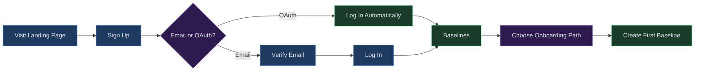
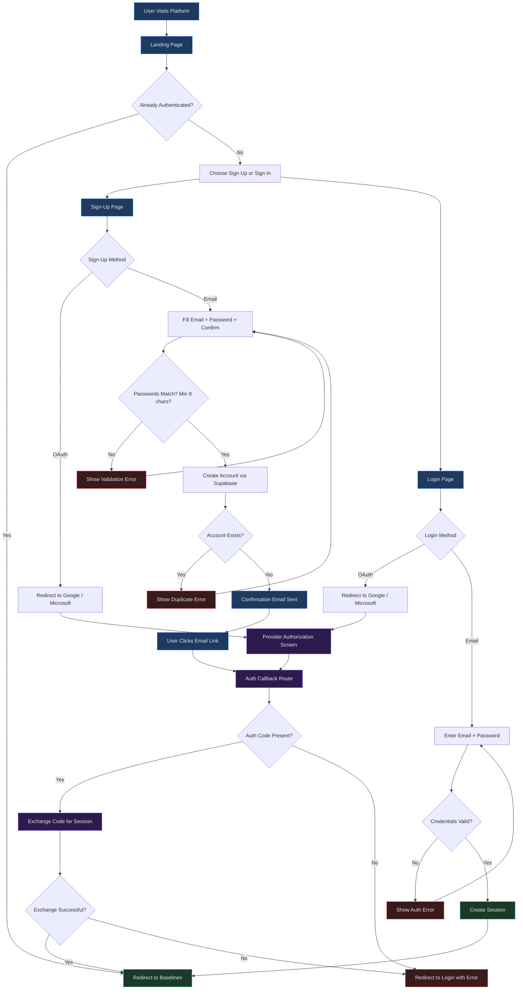

# Getting Started

## Overview

This chapter walks you through creating your Virtual Analyst account, verifying your email, logging in for the first time, and finding your way around the platform. Whether you are a financial analyst building your first model, an auditor preparing annual financial statements, or an administrator setting up your organization, this guide will have you oriented and productive within minutes.

**Prerequisites:** A modern web browser (Chrome, Firefox, Safari, or Edge) and a valid email address. If your organization uses Google Workspace or Microsoft 365, you can use single sign-on instead of creating a separate password.

---

## Process Flow

The diagram below shows the high-level path from first visit to your first baseline:

---

## Key Concepts

Before you begin, familiarize yourself with the core terms you will encounter throughout the platform:

| Term | Definition |
|------|------------|
| **Tenant** | Your organization's isolated workspace. All users, data, and models belong to a single tenant. Each tenant has its own billing, settings, and team membership. |
| **Baseline** | A complete, versioned snapshot of financial line items and assumptions. Baselines are the foundation of every model -- you create one from a template, Excel import, AFS upload, or venture wizard. |
| **Draft** | A working copy of a baseline where you adjust assumptions, tweak drivers, and prepare for analysis. Drafts are editable; baselines are not. |
| **Run** | An executed analysis against a draft. Each run produces financial statements, KPIs, Monte Carlo distributions, sensitivity tables, and valuation outputs. |
| **Scenario** | An alternative assumption set (e.g., best case, worst case, base case) that you apply to a draft to compare outcomes side by side. |

---

## Step-by-Step Guide

### 1. Create Your Account

Virtual Analyst supports two sign-up methods:

- **Email and password** -- Provide your email address and choose a password (minimum 8 characters). You will need to verify your email before you can log in.
- **OAuth single sign-on** -- Click **Continue with Google** or **Continue with Microsoft** to authenticate through your existing provider. No email verification is required.

To get started:

1. Navigate to the Virtual Analyst landing page.
2. Click the **Get started free** button in the hero section. This takes you to the sign-up page.
3. Choose your preferred sign-up method:
   - For OAuth, click the appropriate provider button. You will be redirected to Google or Microsoft to authorize, then returned to the platform automatically.
   - For email, fill in the **Email**, **Password**, and **Confirm password** fields, then click **Create account**.
4. No credit card is required. Your free trial begins immediately upon account creation.

> **Tip:** If you already have an account, click the **Sign in** link at the bottom of the sign-up page.

### 2. Verify Your Email

If you signed up with email and password, you must verify your address before logging in:

1. Check the inbox for the email address you registered with.
2. Open the message from Virtual Analyst and click the confirmation link.
3. The link redirects you through the platform's auth callback, which activates your account.
4. You are now ready to sign in.

If you do not see the email, check your spam or junk folder. You can also return to the sign-up page and click **try again** to resend the confirmation.

> **Note:** OAuth users (Google, Microsoft) skip this step entirely. Your account is activated the moment you authorize through your provider.

### 3. Log In

Once your account is active, sign in to reach your workspace:

1. Navigate to the login page (or click **Sign in** from the landing page).
2. Choose your authentication method:
   - **OAuth:** Click **Continue with Google** or **Continue with Microsoft**. After authorization, you are redirected to your Baselines page.
   - **Email:** Enter your email and password, then click **Sign in**.
3. On successful authentication, the platform redirects you to the Baselines list -- your default landing page within the app.

### 4. Explore the Navigation

After signing in, the navigation bar gives you access to every area of the platform. Pages are organized into five logical groups that mirror the financial modeling workflow:

#### SETUP

| Page | Purpose |
|------|---------|
| **Dashboard** | Your home screen with summary cards, recent activity, and performance metrics. |
| **Marketplace** | Browse pre-built industry templates and apply them to create baselines. |
| **Import Excel** | Upload Excel workbooks through the AI-assisted multi-step import wizard. |
| **Excel Connections** | Create persistent bidirectional sync links between Excel files and models. |
| **AFS** | Annual Financial Statements -- create engagements, draft disclosures, and generate outputs. |
| **Groups** | Define parent-subsidiary hierarchies and entity groupings for consolidation. |

#### CONFIGURE

| Page | Purpose |
|------|---------|
| **Baselines** | Your master data records. Search, filter, and drill into any baseline. |
| **Drafts** | Working copies of baselines where you adjust assumptions before running analysis. |
| **Scenarios** | Define and compare alternative assumption sets across multiple cases. |
| **Changesets** | Create immutable snapshots of targeted overrides, test with dry-runs, and merge. |

#### ANALYZE

| Page | Purpose |
|------|---------|
| **Runs** | Execute model runs and review financial statements, KPIs, and simulation results. |
| **Budgets** | Track budget performance with variance analysis and visual charts. |
| **Covenants** | Monitor debt covenant compliance with threshold alerts. |
| **Benchmarking** | Compare your metrics against anonymized industry peers. |
| **Compare** | Side-by-side comparison of entities or runs with variance drivers. |
| **Ventures** | Guided questionnaire-to-model wizard with AI-generated assumptions. |

#### COLLABORATE & REPORT

| Page | Purpose |
|------|---------|
| **Workflows** | Approval workflows for baselines, drafts, and reports with role-based sign-off. |
| **Board Packs** | Assemble presentation-ready packages for board meetings. |
| **Memos** | Create investment memos with structured narratives and supporting data. |
| **Documents** | Central document repository for all generated outputs. |
| **Collaboration** | Threaded comments, activity feed, and notification management. |

#### ADMIN

| Page | Purpose |
|------|---------|
| **Settings** | Billing, integrations, teams, SSO/SAML, audit log, compliance, and currency management. |

### 5. Choose Your Onboarding Path

Virtual Analyst offers four paths to get your first data into the platform. Choose the one that best matches your starting point:

- **Marketplace** -- Browse pre-built industry templates (14+ available), select one that matches your business, and apply it to create a baseline instantly. Best for users who want a fast start with industry-standard structures.

- **Import Excel** -- Upload an existing Excel workbook. The AI-assisted importer detects revenue streams, cost items, and capital expenditures, then lets you review and confirm mappings before creating a baseline. Best for users migrating from spreadsheet-based models.

- **AFS Import** -- Create an engagement in the AFS module and upload a trial balance. The system supports IFRS and GAAP frameworks for disclosure drafting, tax computation, and multi-entity consolidation. Best for accountants and auditors preparing annual financial statements.

- **Ventures** -- Answer a guided questionnaire about your business, and AI generates initial financial assumptions as a draft. Best for startups and early-stage companies building their first financial model from scratch.

Whichever path you choose, the end result is a baseline -- the foundation for all modeling, analysis, and reporting in Virtual Analyst.

> **What happens next?** Once your baseline is created, open it to create a draft. In the draft, you can adjust assumptions, apply scenarios, and configure correlations. When you are ready, execute a run to generate Monte Carlo simulations, sensitivity analyses, and financial projections. Finally, package your results into board packs, investment memos, or other documents for stakeholders. Each of these steps is covered in detail in the chapters that follow.

---

## Authentication Flow

The following diagram shows the detailed authentication flow, including branching for email and OAuth, error handling, and redirect logic:

---

## Quick Reference

| Action | How |
|--------|-----|
| Create an account | Landing page > **Get started free** > choose OAuth or email |
| Sign in | Login page > enter credentials or click OAuth provider |
| Sign out | Click **Sign out** in the top-right corner of the navigation bar |
| Resend verification email | Return to sign-up page > click **try again** |
| Switch OAuth provider | Sign out, then sign in with the alternate provider |
| Navigate to Dashboard | Click **Dashboard** in the SETUP section of the navigation |
| Access Settings | Click **Settings** in the ADMIN section of the navigation |
| View notifications | Click the bell icon in the navigation bar |

---

## Page Help

Every page in Virtual Analyst includes a floating **Instructions** button positioned in the bottom-right corner of the screen. On the Getting Started and authentication pages, clicking this button opens a help drawer that provides:

- Step-by-step guidance for creating an account, verifying your email, and signing in.
- An overview of the two sign-up methods (email/password and OAuth single sign-on).
- Guidance on choosing your onboarding path (Marketplace, Import Excel, AFS, or Ventures).
- Prerequisites and links to related chapters.

The help drawer can be dismissed by clicking outside it or pressing the close button. It is available on every page, so you can access context-sensitive guidance wherever you are in the platform.

---

## Troubleshooting

| Symptom | Cause | Resolution |
|---------|-------|------------|
| Verification email not received | Email landed in spam, or the address was mistyped | Check your spam/junk folder. Return to the sign-up page and click **try again** to resend. If the problem persists, verify you entered the correct email address. |
| OAuth popup blocked by browser | Browser popup blocker is preventing the Google or Microsoft authorization window | Allow popups for the Virtual Analyst domain in your browser settings, then try again. |
| Redirect loop after login | Stale authentication cookies or cached session data | Clear your browser cookies for the Virtual Analyst domain, then sign in again. |
| "Sign-in failed. Please try again." error | The OAuth authorization code exchange failed, or the callback was interrupted | Click **Sign in** to retry. If the error recurs, try a different browser or clear cookies. |
| "An account with this email may already exist" | You previously signed up with this email address | Click **Sign in** instead and use your existing credentials. If you used OAuth originally, click the corresponding provider button on the login page. |
| Account locked after multiple failed attempts | Too many incorrect password entries triggered a temporary lockout | Wait 15 minutes, then try again. If you have forgotten your password, use the password reset flow or sign in with OAuth. |
| Page loads but shows no data | You are authenticated but no baseline or tenant data exists yet | This is normal for new accounts. Follow one of the onboarding paths in Step 5 to create your first baseline. |
| Password rejected during sign-up | Password does not meet the minimum 8-character requirement | Choose a password with at least 8 characters. The platform accepts any combination of letters, numbers, and symbols. |
| Cannot find the sign-out button | Navigation layout differs on mobile devices | On smaller screens, open the hamburger menu to access all navigation items. The **Sign out** button remains visible in the top-right area of the navigation bar. |

---

## Security Notes

- Virtual Analyst uses Supabase Auth with industry-standard session management. All authentication traffic is encrypted over HTTPS.
- OAuth tokens are exchanged server-side through a secure callback route. Authorization codes are single-use and expire immediately after exchange.
- If your organization requires SAML-based single sign-on, your tenant administrator can configure it under **Settings > SSO**. See [Chapter 26: Settings and Administration](26-settings-and-admin.md) for details.
- Sessions expire after a period of inactivity. If you are redirected to the login page unexpectedly, simply sign in again to resume where you left off.

---

## Related Chapters

- [Chapter 02: Dashboard](02-dashboard.md) -- Understanding your home screen, summary cards, and recent activity.
- [Chapter 03: Marketplace](03-marketplace.md) -- Browsing and applying pre-built industry templates.
- [Chapter 04: Data Import](04-data-import.md) -- Importing Excel workbooks with the AI-assisted wizard.
- [Chapter 06: AFS Module](06-afs-module.md) -- Creating engagements and drafting annual financial statements.
- [Chapter 21: Ventures](21-ventures.md) -- Using the guided questionnaire-to-model wizard.
