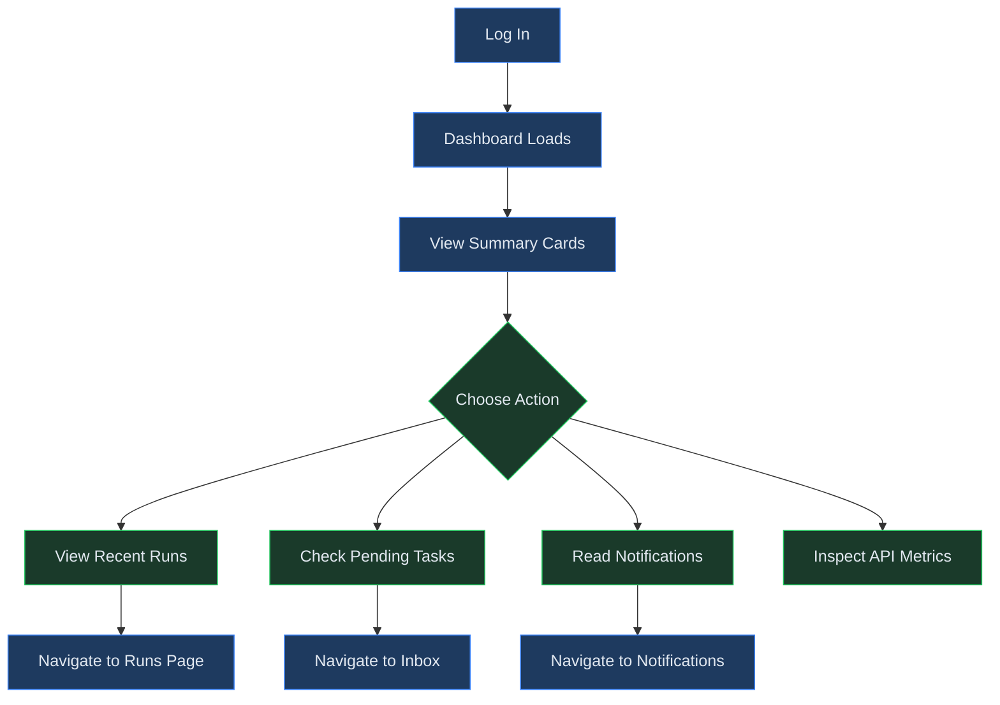
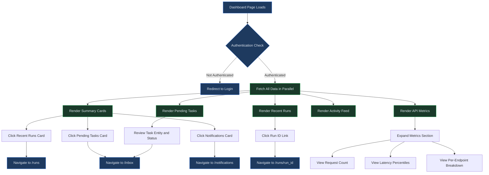

# Dashboard

## Overview

The Dashboard is your home screen in Virtual Analyst. Every time you log in, this is the first page you see. It provides at-a-glance visibility into your recent model runs, pending task assignments, unread notifications, and system-level API performance metrics. From here you can quickly navigate to any area of the platform that needs your attention.

The Dashboard is organized into three tiers: summary cards at the top for key counts, a two-column detail area in the middle for runs and tasks, and a full-width activity feed and collapsible metrics panel at the bottom.

---

## What You See on First Login

If you have just created your account and have not yet imported any data, the Dashboard will still load successfully, but every widget will show empty or zero-count states. This is expected behavior. Here is what to expect:

- **Summary cards** will display 0 for Recent Runs, Pending Tasks, and Unread Notifications.
- **Recent runs** will show "No runs yet."
- **My pending tasks** will show "No pending tasks."
- **Recent activity** will show "No recent activity."
- **API performance metrics** may not appear at all until your tenant generates API traffic.

To populate your Dashboard, complete one of the onboarding paths described in [Chapter 01: Getting Started](01-getting-started.md): import an Excel workbook, apply a Marketplace template, upload annual financial statements, or use the Ventures wizard. Once you have created a baseline and executed your first run, the Dashboard will begin reflecting your work.

---

## Process Flow

The following diagram shows how you arrive at the Dashboard and what actions you can take from it:

---

## Key Concepts

| Concept | Description |
|---------|-------------|
| **Summary Card** | A compact widget at the top of the Dashboard that displays a single key metric (such as run count or notification count) with a link to the relevant detail page. |
| **Activity Feed** | A chronological list of recent events across the platform, including completed runs, created baselines, and submitted reviews. Each entry shows a date and event description. |
| **Pending Task** | An open assignment routed to you through a workflow. Pending tasks appear in both the Dashboard summary card and the detailed task list. |
| **API Performance Metrics** | System-level statistics including request counts and latency percentiles (P50 and P95) for the most recent 1,000 API requests, broken down by endpoint. |
| **Recent Runs** | The five most recent model runs for your tenant, shown with their run ID and current status (completed, failed, or in progress). |

---

## Step-by-Step Guide

### 1. Understanding Summary Cards

When the Dashboard loads, four summary cards appear in a row across the top of the page. Each card displays a count and a link to drill deeper.

- **Recent Runs** -- Shows the number of model runs returned for your tenant (up to five). Click the **View all** link to navigate to the full Runs page where you can search, filter, and inspect every run in your history.

- **Pending Tasks** -- Displays the count of open assignments currently assigned to you. These are items routed through approval workflows that require your action. Click **View inbox** to navigate directly to your Inbox.

- **Unread Notifications** -- Shows how many new alerts you have not yet read. Notifications cover events like completed runs, review requests, and system alerts. Click **View all** to open the Notifications page.

- **API Latency (P50)** -- Displays the median response time in milliseconds for your tenant's recent API calls. Below the main number, you will also see the P95 latency (the 95th percentile). This card is visible when metrics data is available.

### 2. Reviewing Recent Runs

Below the summary cards, the page transitions to a two-column layout. The left column contains a **Recent runs** panel. This panel lists up to five of your most recent model runs.

- Each run is displayed as a clickable link showing the run ID. Click any run ID to navigate directly to that run's detail page, where you can review financial statements, KPIs, Monte Carlo results, and sensitivity outputs.
- Each run shows a colored status badge to indicate its current state:
  - **Green** indicates a completed run -- the model executed successfully and results are ready for review.
  - **Red** indicates a failed run -- an error occurred during execution. Click through to the run detail page to view error logs.
  - **Yellow** indicates a run that is still in progress -- the model is currently computing. Results will appear once execution completes.
- The list is ordered by recency, with your most recent run at the top.
- If you have not executed any runs yet, the panel displays the message "No runs yet." To create your first run, navigate to the Drafts page and execute a model from there.

### 3. Managing Pending Tasks

The right column contains a **My pending tasks** panel listing your open assignments.

- Each task row shows the entity type (such as "baseline" or "draft") and the entity ID, along with the current status.
- Tasks are generated by approval workflows. When a colleague submits a baseline or draft for review and routes it to you, the assignment appears here.
- To act on a task, navigate to your Inbox by clicking the **View inbox** link on the Pending Tasks summary card. The Inbox provides the full detail view with options to approve, reject, or comment.
- If you have no pending tasks, the panel displays "No pending tasks."

### 4. Reading the Activity Feed

Below the two-column layout, a full-width **Recent activity** panel shows the ten most recent events across your tenant.

- Each activity entry includes a date and a description. Descriptions use human-readable labels derived from the event type (for example, "run completed on baseline abc123").
- Where applicable, entries reference a resource type and resource ID so you can trace the event back to a specific baseline, draft, run, or other entity.
- Entries are listed in reverse chronological order, with the most recent event at the top.
- The activity feed covers events from all users in your tenant, giving you a shared view of what has changed recently. This is useful for teams where multiple analysts may be working on different baselines or models simultaneously.
- Common event types you will see in the feed include:
  - **run completed** -- A model run finished executing.
  - **baseline created** -- A new baseline was created from an import, template, or venture wizard.
  - **review submitted** -- A team member submitted work for approval.
  - **draft updated** -- Assumptions or line items were modified in a draft.
- If no activity has been recorded, the panel displays "No recent activity."

### 5. Inspecting API Performance Metrics

At the bottom of the Dashboard, a collapsible **API performance metrics** section provides system health details. Click the section header to expand it.

- **Request count** -- The total number of API requests in the sample window (last 1,000 requests).
- **Latency P50** -- The median response time in milliseconds. Half of all requests completed faster than this value.
- **Latency P95** -- The 95th-percentile response time. Only 5% of requests took longer than this value.
- **Latency by endpoint** -- A ranked list showing average response time per API endpoint, sorted from slowest to fastest. This breakdown helps you identify which operations are contributing most to latency.

> **Note:** API performance metrics are a tenant-level feature. If you do not see this section, confirm with your administrator that metrics collection is enabled for your organization.

### 6. Returning to the Dashboard

You can return to the Dashboard at any time by clicking **Dashboard** in the sidebar navigation. The page fetches all data fresh on every load, so you will always see the most current counts and activity. There is no manual refresh button -- simply navigate to the page or reload it in your browser to update the data.

---

## Dashboard Layout Reference

The Dashboard is organized into the following visual zones, from top to bottom:

| Zone | Content | Width |
|------|---------|-------|
| Header | Page title ("Dashboard") | Full width |
| Summary Cards | Four metric cards in a responsive grid | Full width (4 columns on desktop, 2 on tablet, 1 on mobile) |
| Detail Panels | Recent Runs (left) and My Pending Tasks (right) | Two columns on desktop, stacked on mobile |
| Activity Feed | Recent activity log with dates and event descriptions | Full width |
| API Metrics | Collapsible section with request counts, latency percentiles, and per-endpoint breakdown | Full width |

On smaller screens, the four-column summary card grid collapses to two columns and then to a single column. The two-column detail panels stack vertically with Recent Runs appearing above My Pending Tasks.

---

## Dashboard Widget Interaction

The following diagram illustrates the detailed interaction flow when you engage with each Dashboard widget:

---

## Quick Reference

| Action | How |
|--------|-----|
| Navigate to the Dashboard | Click **Dashboard** in the sidebar, or log in to land here automatically. |
| View all model runs | Click the **View all** link on the Recent Runs summary card. |
| Open your Inbox | Click the **View inbox** link on the Pending Tasks summary card. |
| Read all notifications | Click the **View all** link on the Unread Notifications summary card. |
| Drill into a specific run | Click the run ID link in the Recent Runs panel. |
| Check API latency | Expand the **API performance metrics** section at the bottom of the page. |
| Identify slow endpoints | Expand API metrics and review the **Latency by endpoint** list, sorted slowest first. |
| Refresh Dashboard data | Reload the page in your browser. All data is fetched fresh on each page load. |

---

## Troubleshooting

| Symptom | Cause | Resolution |
|---------|-------|------------|
| All summary cards show zero | You have not yet created any baselines, runs, or tasks. | Complete your first data import using the Marketplace, Excel Import, or AFS module to populate the Dashboard. |
| Recent runs panel says "No runs yet" | No model runs have been executed for your tenant. | Navigate to **Drafts**, open a draft, and execute a run. The Dashboard will show it on your next visit. |
| Pending tasks panel is empty | No workflow assignments are currently routed to you. | This is normal if no reviews are pending. Tasks will appear when a colleague submits work for your approval. |
| Activity feed says "No recent activity" | No events have been recorded in the activity log. | Activity populates automatically as you and your team use the platform. Import data or run a model to generate your first entries. |
| API Latency card is missing | Metrics data has not been collected yet, or the feature is not enabled. | Contact your tenant administrator to confirm that API metrics collection is turned on. |
| API metrics section does not expand | No metrics summary data was returned from the server. | The collapsible section only renders when data is available. Ensure your tenant has recorded API requests, or check with your administrator. |
| Dashboard shows a loading spinner indefinitely | A network issue or session timeout may be preventing data from loading. | Refresh the page. If the spinner persists, log out and log back in to re-establish your session. |
| You are redirected to the login page | Your session has expired or you are not authenticated. | Log in again. The Dashboard requires an active session to load. |

---

## Related Chapters

- [Chapter 01: Getting Started](01-getting-started.md) -- Account creation, email verification, and first login.
- [Chapter 14: Runs](14-runs.md) -- Executing model runs, reviewing results, and exporting outputs.
- [Chapter 22: Workflows, Tasks, and Inbox](22-workflows-and-tasks.md) -- Configuring approval workflows and managing your task assignments.
- [Chapter 25: Collaboration](25-collaboration.md) -- Activity feed, notifications, and comments across the platform.
- [Chapter 26: Settings and Administration](26-settings-and-admin.md) -- Tenant configuration, including API metrics and permissions.
