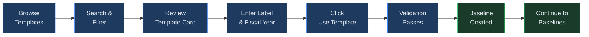
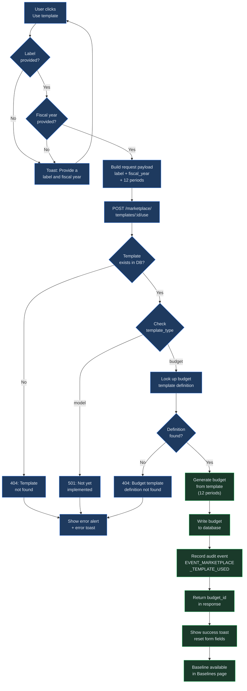

# Marketplace

## Overview

The Marketplace is the starting point for building financial models and budgets in
Virtual Analyst. It provides a browsable catalog of pre-built templates organized by
industry and type, allowing you to quickly create a new baseline or budget without
configuring revenue streams, cost categories, or account structures from scratch.
Select a template, provide a label and fiscal year, and Virtual Analyst generates a
fully structured baseline ready for customization.

## Process Flow

## Key Concepts

| Concept | Description |
|---------|-------------|
| **Template** | A pre-built financial structure (revenue streams, cost categories, funding instruments) that serves as a starting point for a new baseline or budget. Each template belongs to an industry and has a type. Templates do not contain actual financial values -- only structural definitions. |
| **Industry** | The business sector a template targets (e.g., SaaS, Healthcare, Manufacturing). Used to filter the catalog so you see only templates relevant to your organization. |
| **Template Type** | Either **budget** (period-based operating budget) or **model** (financial projection model). The type determines which creation workflow is triggered when the template is applied. |
| **Baseline** | The output produced when you apply a template. A baseline is a complete set of assumptions, account structures, and period definitions that you can then refine with your own data. Every template application creates exactly one baseline. |
| **Fiscal Year** | The accounting year the new baseline will cover (e.g., "2026" or "FY2026"). Entered at template-application time and used to set the period boundaries in the generated baseline. |
| **Label** | A short, unique name you assign to identify the baseline created from a template (e.g., "Q1 2026 SaaS Forecast"). Must be between 1 and 255 characters. |

## Step-by-Step Guide

### 1. Browsing Templates

Navigate to the Marketplace by clicking **Marketplace** in the main navigation bar.
The page loads a paginated grid of template cards, displaying up to 20 templates per
page. Templates are sorted alphabetically by name.

Each card in the grid displays three pieces of information:

- **Template name** and a **type badge** (budget or model) aligned to the right of the
  name. The badge provides a quick visual indicator of the template category.
- A short **description** paragraph explaining what the template covers and the kind of
  financial structure it provides.
- An **industry tag** below the description indicating the target business sector.

Below the card grid, **pagination controls** let you move between pages. The current
page number, total template count, and page-size are all reflected in the controls. If
the catalog contains 20 or fewer templates, the pagination controls are still present
but only a single page is shown.

While the page is loading, a skeleton placeholder animation appears in place of the
cards. If the catalog is completely empty for your tenant, an empty-state message
reading "No templates available" is displayed with an icon.

### 2. Filtering by Industry and Type

A toolbar sits above the template grid with two complementary mechanisms for narrowing
the visible results:

**Search bar.** Type into the "Search templates..." text field to filter templates by
name. The grid updates in real time as you type, showing only templates whose name
contains your search text. Matching is case-insensitive, so searching for "saas" will
match a template named "SaaS Revenue Model."

**Filter dropdowns.** Two dropdown menus appear beside the search bar:

- **All industries** -- Opens a list of every industry represented in the current
  catalog. Selecting an industry restricts the grid to templates tagged with that
  industry. The dropdown options are derived dynamically from the loaded templates, so
  you will only see industries that have at least one template.
- **All types** -- Opens a list of template types (budget, model). Selecting a type
  restricts the grid to templates of that category.

Search and filters work together additively. For example, selecting "Healthcare" from
the industry dropdown while typing "operating" in the search bar will show only
Healthcare-industry templates with "operating" in their name.

When filters produce zero results, a "No matching templates" empty state appears. This
state includes a **Clear filters** action that resets the search field and returns both
dropdowns to their default "All" state. You can also clear filters manually using the
toolbar's clear-filters button at any time.

Changing a filter automatically resets pagination back to page 1 so you always see
results from the beginning of the filtered set.

### 3. Applying a Template

Once you locate the template you want, look at the bottom portion of its card. Two
input fields and an action button are displayed inline:

1. **Label** -- Enter a descriptive, unique name for the baseline that will be created.
   For example: "2026 Operating Budget" or "Series A Revenue Model." This label is how
   you will identify the baseline throughout the platform. It must be between 1 and 255
   characters.

2. **Fiscal Year** -- Enter the fiscal year the baseline will cover. Common formats
   include "2026", "FY2026", or "2025-2026". This value must be between 1 and 32
   characters.

Click the **Use template** button to apply the template. The following outcomes are
possible:

- **Validation failure.** If either the label or fiscal year field is empty, a toast
  notification appears with the message "Provide a label and fiscal year." No request
  is sent to the server. Fill in both fields and try again.
- **Success.** A confirmation toast reading "Template applied -- baseline created"
  appears. Both input fields on the card are reset to empty, ready for another
  application if desired. The newly created baseline is immediately available in the
  Baselines section of the application.
- **Server error.** If the API returns an error (template not found, definition
  missing, or a server-side failure), an error alert banner appears at the top of the
  page with the error message. A toast notification also appears. The error alert
  includes a **Retry** button you can use to reload the template catalog.

Behind the scenes, applying a template creates a 12-period budget structure and records
an audit event (`EVENT_MARKETPLACE_TEMPLATE_USED`) that logs the template ID, template
name, and the ID of the newly created budget. This audit trail is visible to
administrators in the platform's audit log.

### 4. Saving a Baseline as a Template

If you have built or refined a baseline and want to make its structure available for
reuse, you can save it back to the Marketplace as a new template. This is useful for
standardizing financial structures across departments or preserving a proven model
layout for future fiscal periods.

The save-as-template operation requires four pieces of information:

- **Source baseline ID** -- The identifier of the completed, active baseline you want
  to use as the template source. The baseline must be in an active state.
- **Name** -- A human-readable name for the new template, up to 255 characters.
- **Industry** -- The industry classification for the template, up to 100 characters.
  This determines where the template appears when users filter by industry.
- **Description** -- An optional free-text description of what the template covers and
  when it should be used. Maximum 2,000 characters.

When the template is saved, the system performs the following extraction:

1. **Revenue stream structure** -- Stream types, labels, and business-line assignments
   are extracted without any dollar amounts.
2. **Funding instruments** -- The names of funding instruments (e.g., term loan,
   revolving credit) are captured without balances or terms.
3. **Cost account references** -- Unique account reference names from the cost
   structure are preserved as a template skeleton.

The resulting template receives a unique ID (prefixed with `user-`) and is immediately
added to the Marketplace catalog with a template type of "model." No actual financial
values from the source baseline are included in the template.

## Template Application Flow (detailed)

## Quick Reference

| Action | How |
|--------|-----|
| Open the Marketplace | Click **Marketplace** in the main navigation |
| Search by name | Type in the "Search templates..." field above the grid |
| Filter by industry | Select an industry from the "All industries" dropdown |
| Filter by type | Select "budget" or "model" from the "All types" dropdown |
| Clear all filters | Click the **Clear filters** action in the toolbar |
| Apply a template | Enter a label and fiscal year on the card, then click **Use template** |
| Navigate between pages | Use the pagination controls below the template grid |
| Save a baseline as a template | Use the save-as-template action from an existing baseline (requires baseline ID, name, industry) |

## Page Help

Every page in Virtual Analyst includes a floating **Instructions** button positioned in the bottom-right corner of the screen. On the Marketplace page, clicking this button opens a help drawer that provides:

- Guidance on browsing, searching, and filtering templates by industry and type.
- Step-by-step instructions for previewing template details and applying a template to create a new baseline.
- An explanation of how template assumptions are populated and how to customize them after creation.
- Prerequisites and links to related chapters.

The help drawer can be dismissed by clicking outside it or pressing the close button. It is available on every page, so you can access context-sensitive guidance wherever you are in the platform.

---

## Troubleshooting

| Symptom | Cause | Resolution |
|---------|-------|------------|
| "No templates available" empty state | The Marketplace catalog is empty for your tenant | Contact your administrator to ensure marketplace templates have been provisioned for your organization. |
| "No matching templates" after filtering | The search text or filter combination is too narrow to match any templates | Click **Clear filters** to reset all criteria, then apply filters one at a time to locate the desired template. |
| Validation toast: "Provide a label and fiscal year" | One or both required fields are empty on the template card | Fill in both the **Label** and **Fiscal Year** inputs before clicking **Use template**. |
| "Template not found" error (404) | The template was removed from the catalog between page load and application | Refresh the Marketplace page to reload the current catalog and verify the template still exists. |
| "Budget template definition not found" error (404) | The template record exists in the database but its underlying JSON definition file is missing or corrupted | Report this to your system administrator. The template definition file may need to be redeployed to the server. |
| "Not yet implemented" error (501) | You attempted to apply a template of type "model," which is not yet supported | Use a "budget" type template instead, or wait for model-type support in a future release. |
| Duplicate label conflict | A baseline or budget already exists with the same label within your tenant | Choose a different, unique label for the new baseline. |
| Error alert banner with Retry button | A network timeout or server error occurred while loading the template catalog | Click the **Retry** button on the error alert to reload. If the problem persists, check your network connection or contact support. |

## Related Chapters

- [Chapter 01: Getting Started](01-getting-started.md)
- [Chapter 04: Data Import](04-data-import.md)
- [Chapter 10: Baselines](10-baselines.md)
