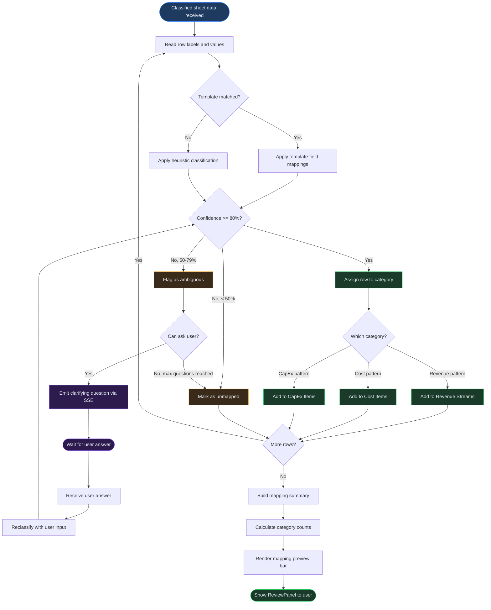
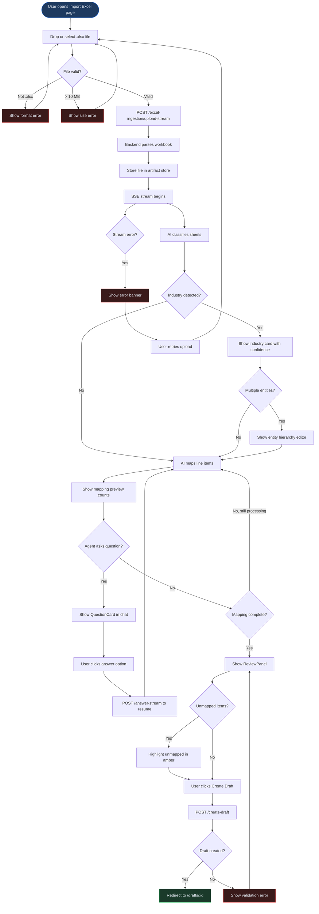

# Chapter 4 -- Data Import

## Overview

Data Import is how you bring existing financial information into Virtual Analyst. The platform supports two import methods: the **Excel Import Wizard**, an AI-assisted multi-step process for `.xlsx` workbooks, and a lighter **CSV Import** endpoint for flat tabular data. Both paths end with the creation of a baseline or draft session that feeds into the rest of the modeling workflow.

Most users will rely on the Excel Import Wizard. It handles multi-sheet workbooks, detects formulas and cross-references, classifies rows into revenue streams, cost items, and capital expenditures using AI, and lets you ask clarifying questions before committing. CSV Import is available when you have a single flat file and already know which columns map to which model references.

This chapter covers both methods in detail, including the full wizard flow, AI interaction patterns, supported file formats, and common troubleshooting scenarios. If you prefer to connect a workbook for ongoing bidirectional sync rather than a one-time import, see Chapter 5 (Excel Live Connections) instead.

---

## Process Flow

Every Excel import follows five stages:

```
Upload --> Classify --> Map --> Review --> Create Draft
```

1. **Upload** -- You drop or select a `.xlsx` file. The backend stores the file in the artifact store, parses every sheet, and extracts headers, sample rows, row and column counts, formula patterns, and cross-sheet references.
2. **Classify** -- The AI agent reads the parsed sheet data and classifies rows into categories such as revenue, cost of sales, operating expenses, and capital expenditure. It also detects the entity name, industry, and a matching budget template.
3. **Map** -- Classified rows are mapped to concrete model line items (revenue streams, cost items, CapEx items). Rows the AI cannot confidently place are flagged as unmapped.
4. **Review** -- You see the full proposed mapping in a review panel. Unmapped items are highlighted. You can accept, adjust, or discard individual mappings.
5. **Create Draft** -- Once you confirm, the system creates a draft session populated with the mapped data. You are redirected to the Drafts page to continue modeling.

The stepper bar at the top of the import page tracks your progress through these stages. Each step shows a numbered circle; completed steps display a green check mark. The connectors between steps fill in with your accent color as you advance, giving a clear visual indicator of where you are.

---

## Key Concepts

**Template.** A pre-built financial model structure associated with a specific industry. During classification the AI attempts to match your workbook to a known template, which speeds up mapping. Templates are maintained in the Marketplace (see Chapter 3).

**Mapping.** The association between a row in your uploaded workbook and a line item in the financial model. Mappings fall into four buckets: revenue streams, cost items, CapEx items, and unmapped rows.

**Classification.** The AI's initial pass over your workbook. Classification produces a model summary that includes the detected entity name, industry, detection confidence score, and suggested revenue drivers.

**Baseline.** The immutable data record created at the end of the import process. A baseline holds every line item and assumption that was mapped. It becomes the foundation for drafts, scenarios, and analysis runs (see Chapter 10).

**Ingestion session.** The server-side record that tracks the lifecycle of a single import attempt. Each upload creates an ingestion session with a unique ID, and every subsequent step (classify, map, answer, create draft) updates that session. You can view past ingestion sessions from the Import Excel page; they are listed in reverse chronological order.

**Agent session.** When the agentic import mode is enabled, the AI operates through a managed agent session that streams Server-Sent Events (SSE) to your browser. The agent session can be in one of four states: `running` (actively processing), `paused` (waiting for your answer to a question), `complete` (finished successfully), or `error` (failed and needs retry).

---

## Step-by-Step Guide

### 1. Uploading an Excel Workbook

1. Navigate to **Import Excel** in the sidebar.
2. You will see a drop zone in the center of the page with the message "No Excel connections yet."
3. Either drag a `.xlsx` file onto the drop zone or click **Select .xlsx file** to open your system file picker.
4. The file is uploaded to the backend. A spinner labeled "Uploading and parsing..." appears while the server stores the file and parses its contents.
5. When parsing completes, the stepper advances from Upload to Classify and the AI chat thread opens.

**Requirements:**
- File must be `.xlsx` format. Other spreadsheet formats (`.xls`, `.xlsb`, `.ods`) are not accepted.
- Maximum file size is 10 MB.
- The workbook must contain at least one sheet with data rows.

### 2. AI Classification

Once the file is parsed, the AI agent begins classifying the workbook automatically. You do not need to take any action during this step. The chat thread shows real-time messages from the agent as it works through the sheets.

During classification the agent:
- Reads headers and sample rows from every sheet.
- Identifies the entity name and industry.
- Matches the workbook structure against known budget templates.
- Detects revenue drivers, cost categories, and CapEx patterns.
- Assigns a confidence score to its industry detection.

When classification finishes, you may see an industry detection card showing the matched industry, confidence percentage, suggested template, and detected revenue drivers. If the workbook contains multiple entities, a hierarchy editor appears so you can confirm or adjust the entity structure.

The stepper advances to Map once the agent begins producing line-item mappings.

The entire classification and mapping process runs over a streaming connection, so you see progress in real time. Each SSE event updates the chat thread with the agent's latest message, and intermediate state snapshots (classification results, partial mappings) are persisted to the database so no work is lost if the connection drops.

### 3. Reviewing Mappings

After classification and mapping complete, the mapping preview bar appears above the chat thread. It shows four counts:

| Category | Color | Meaning |
|----------|-------|---------|
| Revenue | Green | Rows mapped to revenue streams |
| Cost | Default | Rows mapped to cost items |
| CapEx | Default | Rows mapped to capital expenditures |
| Unmapped | Amber | Rows the AI could not confidently classify |

The review panel displays the full breakdown organized by entity name:

- **Revenue Streams** -- Each detected revenue line with its label.
- **Cost Items** -- Operating expenses, COGS, and other cost lines.
- **CapEx Items** -- Capital expenditure lines.
- **Unmapped** -- Items that require manual attention (highlighted in amber).

Review the mappings carefully. If you need to change how a row was classified, you can ask the AI for help using the chat thread (see the next section) or note the items to adjust after the draft is created.

A zero unmapped count is ideal but not required. The import can proceed with unmapped items; they are simply excluded from the draft. You can add them manually later from the Drafts page if needed.

#### AI Mapping and Review Sub-Process

The following diagram details the internal flow that the AI follows when mapping rows to model line items, evaluating confidence, and resolving ambiguities through clarifying questions.



### 4. Asking AI Questions During Import

At any point after the upload, the AI agent may pause and ask you a clarifying question. When this happens:

1. A question card appears at the bottom of the chat thread with the question text, optional context, and a set of answer options.
2. Click one of the option buttons to submit your answer.
3. The agent resumes processing with your answer incorporated into its classification and mapping logic.

You can also use the chat thread to ask your own questions about the mapping results. For example, you might ask why a particular row was classified as CapEx rather than an operating expense. The agent will explain its reasoning and, if appropriate, adjust the mapping.

If the agent's question times out or you want to skip it, you can dismiss the question card and proceed with the current mapping state. Unanswered questions may result in more items appearing in the unmapped category.

Questions typically arise when the AI encounters ambiguous row labels, unusual account structures, or line items that could reasonably belong to more than one category. Answering them improves mapping accuracy and reduces the number of unmapped items in the final review.

### 5. Confirming and Creating a Baseline

When the agent finishes and the stepper reaches Review:

1. Inspect the review panel for accuracy. Pay attention to the unmapped items count.
2. Click **Create Draft**.
3. A loading state ("Creating...") appears on the button while the backend builds the draft session.
4. On success you are automatically redirected to the Drafts page where your new draft is open and ready for further configuration.

The draft inherits the entity name, all mapped revenue streams, cost items, and CapEx items. From the Drafts page you can adjust assumptions, add scenarios, and run your first analysis.

If you are not satisfied with the import and want to start over, you can navigate back to Import Excel and upload the same or a different file. Each upload creates a new ingestion session; previous sessions are retained for reference and can be deleted from the ingestion list.

### 6. CSV Import (Alternative)

CSV Import is a single-step process for flat tabular data. It is best suited for updating an existing baseline with new actuals or overriding specific driver values.

1. Prepare a `.csv` file with a header row. Each column should correspond to a model reference or be a value you want to import.
2. Call the CSV import endpoint (or use the API client) with the following parameters:
   - `file` -- Your `.csv` file.
   - `parent_baseline_id` -- The baseline to attach the imported data to.
   - `parent_baseline_version` -- Defaults to `v1`.
   - `label` -- A descriptive name for the import (defaults to "CSV Import").
   - `column_mapping` (optional) -- A JSON object mapping column names or zero-based indices to model references (e.g., `{"Revenue": "drv:csv_revenue"}`).
3. If you omit `column_mapping`, the system auto-generates references from the header row using the pattern `drv:csv_<sanitized_column_name>`.
4. The endpoint creates a draft session and a scenario containing the imported values as overrides, then returns the draft session ID and scenario ID.

**Requirements:**
- File must be `.csv` format.
- Maximum file size is 2 MB.
- The file must contain at least one header row and one data row.
- Numeric values should use standard formatting (commas are stripped automatically).
- Non-numeric values in mapped columns are silently skipped; only numeric data produces overrides.

**How column mapping works.** When you supply a `column_mapping` object, each key is either a column header name (e.g., `"Revenue"`) or a zero-based column index as a string (e.g., `"0"`). Each value is the model reference the column maps to (e.g., `"drv:csv_revenue"`). If you omit `column_mapping` entirely, the system reads the header row and generates references automatically by sanitizing each column name and prefixing it with `drv:csv_`.

**What gets created.** A successful CSV import produces two records: a draft session (your working copy of the model) and a scenario containing the imported values as numeric overrides. The response includes both IDs so you can navigate directly to the draft or reference the scenario later.

---

## Excel Import Wizard Flow

The following diagram shows the detailed flow through the Excel Import Wizard, including AI interactions, error states, and retry paths.



---

## Supported Formats

| Format | Extension | Max Size | Method | Notes |
|--------|-----------|----------|--------|-------|
| Excel workbook | `.xlsx` | 10 MB | Excel Import Wizard | Multi-sheet, formulas, and cross-references supported |
| CSV | `.csv` | 2 MB | CSV Import endpoint | Header row required; numeric values only |
| Legacy Excel | `.xls` | -- | Not supported | Convert to `.xlsx` before uploading |
| Excel Binary | `.xlsb` | -- | Not supported | Convert to `.xlsx` before uploading |
| OpenDocument | `.ods` | -- | Not supported | Convert to `.xlsx` before uploading |
| TSV / Tab-delimited | `.tsv` | -- | Not supported | Save as `.csv` with comma delimiter |
| Google Sheets | -- | -- | Not supported | Export as `.xlsx` from File > Download |
| Numbers (Apple) | `.numbers` | -- | Not supported | Export as `.xlsx` from File > Export To |

---

## Quick Reference

| Task | Where | How |
|------|-------|-----|
| Upload an Excel workbook | Import Excel page | Drag-and-drop or click **Select .xlsx file** |
| View AI classification results | Chat thread during import | Read agent messages; check industry detection card |
| Answer an AI question | QuestionCard in chat thread | Click one of the answer option buttons |
| Check mapping counts | Mapping preview bar | Review revenue / cost / capex / unmapped counts |
| Review full mapping details | ReviewPanel below chat | Inspect each category; note unmapped items |
| Adjust entity hierarchy | Entity hierarchy editor | Edit detected entities when multi-entity workbook is found |
| Create a draft from import | ReviewPanel | Click **Create Draft** to generate the draft session |
| Import a CSV file | API or CSV Import endpoint | POST `/import/csv` with file and baseline ID |

---

## Page Help

Every page in Virtual Analyst includes a floating **Instructions** button positioned in the bottom-right corner of the screen. On the Import Excel page, clicking this button opens a help drawer that provides:

- Step-by-step guidance for each stage of the AI-assisted import wizard (upload, mapping review, confirmation).
- Tips for preparing your Excel workbook before upload to ensure clean data mapping.
- An explanation of how the AI detects revenue streams, cost items, and capital expenditures.
- Prerequisites and links to related chapters.

The help drawer can be dismissed by clicking outside it or pressing the close button. It is available on every page, so you can access context-sensitive guidance wherever you are in the platform.

---

## Troubleshooting

**Upload fails -- file too large or unsupported format.**
The Excel Import Wizard accepts only `.xlsx` files up to 10 MB. If your file exceeds the limit, reduce its size by removing unused sheets or clearing cached data in Excel before re-exporting. If your file is in `.xls`, `.xlsb`, or `.ods` format, open it in Excel or LibreOffice and save as `.xlsx`.

**Mapping errors -- AI misclassified rows.**
The AI classification is a best-effort process. If rows appear in the wrong category (for example, a maintenance contract classified as CapEx instead of an operating expense), note the items and correct them in the Drafts page after import. You can also ask the AI during import why a row was classified a certain way; the agent may adjust the mapping based on your feedback.

**AI asks a question you cannot answer.**
If the agent pauses with a clarifying question and you are unsure of the answer, you can select the closest option or dismiss the question. Skipping a question may result in the affected rows being placed in the unmapped category. You can reclassify them later in the draft.

**AI chat times out or stream disconnects.**
Network interruptions can break the SSE stream. If the chat thread stops updating and no error banner appears, refresh the page and re-upload your file. The previous ingestion session remains in the database and will not conflict with a new attempt.

**Baseline creation fails -- validation errors in mapped data.**
The Create Draft step validates that the mapping contains at least one revenue stream or cost item. If validation fails, an error message appears on the review panel. Check that the mapping is not entirely unmapped. If the AI did not produce usable mappings, consider re-uploading with a cleaner workbook or using a Marketplace template as a starting point instead.

**CSV import returns "Baseline not found."**
The CSV Import endpoint requires a valid `parent_baseline_id`. Verify that the baseline exists and that you are passing the correct tenant ID in the request headers.

**CSV column mapping does not match.**
If your `column_mapping` JSON references column names that do not appear in the CSV header, those columns are silently skipped. Double-check that column names match exactly, including capitalization and whitespace.

**All rows appear as unmapped after classification.**
This can happen when the workbook uses non-standard layouts such as merged cells, pivot tables, or unconventional header structures. The AI works best with standard tabular layouts where headers are in the first row and data follows in subsequent rows. Try restructuring the workbook into a clean table format before re-uploading.

**Error banner shows "Internal error during ingestion."**
This indicates a server-side failure during classification or mapping. The error is logged on the server for investigation by your administrator. Wait a moment and try re-uploading the file. If the error persists, check that the workbook is not corrupt by opening it in Excel and verifying it loads correctly. Password-protected workbooks are not supported and will produce an error during the parse step.

---

## Related Chapters

- [Chapter 03: Marketplace](03-marketplace.md) -- Browse industry templates that the import wizard may match your workbook against.
- [Chapter 05: Excel Live Connections](05-excel-connections.md) -- Set up persistent bidirectional sync instead of one-time import.
- [Chapter 10: Baselines](10-baselines.md) -- Manage the baselines created by the import process.
- [Chapter 11: Drafts](11-drafts.md) -- Continue configuring your model after import.
- [Chapter 12: Scenarios](12-scenarios.md) -- Work with the scenarios created by CSV Import.
