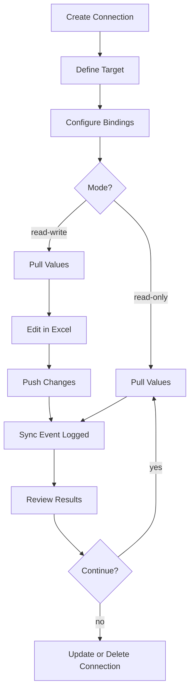
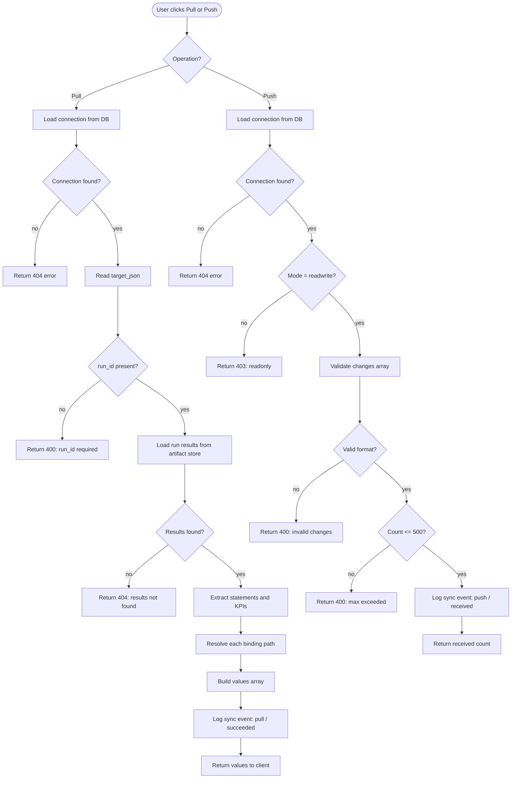

# Chapter 05 -- Excel Live Connections

## Overview

Excel Live Connections establish persistent, bidirectional sync links between your Excel workbooks and the financial model runs or baselines stored in Virtual Analyst. Unlike a one-time import (covered in [Chapter 04](04-data-import.md)), a live connection remains active so you can repeatedly **pull** the latest computed values into Excel and, when the connection mode allows it, **push** updated assumptions back into the platform. This lets analysts continue working in familiar spreadsheet environments while keeping Virtual Analyst as the single source of truth for model logic and outputs.

Each connection defines a **target** (which run or baseline to sync with), a set of **bindings** (which cells map to which data paths), and a **mode** (read-only or read-write). Every pull and push operation is recorded as a **sync event** with timing metadata, giving you a complete audit trail of data movement between the two systems.

---

## Process Flow



---

## Key Concepts

| Concept | Definition |
|---------|-----------|
| **Connection** | A persistent link between an Excel workbook and a Virtual Analyst run or baseline. Identified by a unique ID and an optional human-readable label. |
| **Target** | A JSON object specifying which run or baseline the connection points to. Contains `run_id`, `baseline_id`, and `baseline_version` fields. |
| **Binding** | A single mapping between an Excel cell and a data path inside the target. Each binding has a `binding_id` and a dot-notation `path`. |
| **Pull** | A read operation that gathers the current computed values for all bindings from the target run or baseline and returns them to Excel. |
| **Push** | A write operation that sends changed values from Excel back into the platform. Only available on read-write connections. Limited to 500 changes per request. |
| **Sync Event** | An audit record created for every pull or push operation. Captures direction, status, number of bindings synced, timing, and the user who initiated the action. |
| **Read-only mode** | The connection can pull values but cannot push changes. Use this when Excel consumers should see results without modifying underlying assumptions. |
| **Read-write mode** | The connection can both pull and push. Use this when analysts need to update assumptions from their spreadsheet and feed changes back into the model. |

---

## Step-by-Step Guide

### 1. Creating a Connection

1. Navigate to **Excel Connections** in the sidebar under the Setup section.
2. In the **Create connection** card at the top of the page, fill in the following fields:
   - **Label** -- A descriptive name such as "Q3 Revenue Model" or "Board Pack Actuals". This field is optional but strongly recommended for identifying connections later.
   - **Mode** -- Select **Read-only** or **Read-write** from the dropdown. Choose read-only if the connection is for reporting consumers; choose read-write if analysts will push assumption changes back.
   - **Target (JSON)** -- Enter a JSON object specifying the run and/or baseline to connect to. The default template is:
     ```json
     {
       "baseline_id": "",
       "baseline_version": "v1",
       "run_id": ""
     }
     ```
     At minimum, provide a `run_id` for pull operations. The `baseline_id` and `baseline_version` fields are used when you want to anchor the connection to a specific baseline version.
   - **Bindings (JSON)** -- Enter a JSON array of binding objects. Each object requires a `binding_id` (your chosen identifier) and a `path` (the dot-notation path to the data point). See the Binding Path Syntax section below for details.
3. Click **Create connection**. A success toast confirms creation, and the new connection card appears in the list below.

### 2. Configuring Cell Bindings

Bindings map individual data points in your model to cells in your Excel workbook. Each binding is a JSON object with at least two fields:

```json
{
  "binding_id": "rev_year1",
  "path": "income_statement.0.revenue"
}
```

- **binding_id** -- A unique string you choose to identify this binding. Use descriptive names that correspond to your Excel cell references (e.g., `rev_year1`, `cogs_q3`, `net_income_total`).
- **path** -- A dot-separated path that navigates the model output structure. Numeric segments represent array indices (zero-based). See the Binding Path Syntax section for the full reference.

You can include as many bindings as needed in the array. When you pull values, the system resolves every binding and returns results for each one.

A complete bindings array for a simple three-period income statement might look like this:

```json
[
  { "binding_id": "rev_y1", "path": "income_statement.0.revenue" },
  { "binding_id": "rev_y2", "path": "income_statement.1.revenue" },
  { "binding_id": "rev_y3", "path": "income_statement.2.revenue" },
  { "binding_id": "cogs_y1", "path": "income_statement.0.cost_of_goods_sold" },
  { "binding_id": "ni_kpi", "path": "kpis.net_income" }
]
```

### 3. Pulling Values from a Run or Baseline

1. Locate the connection card in the list.
2. Click the **Pull** button. The system reads the current computed values for every binding from the target run.
3. The first five resolved values appear in a preview panel below the connection card, showing each `binding_id` and its current `value`.
4. A sync event is recorded with direction "pull", status "succeeded", and the count of bindings resolved.

If the target run has not been executed yet or its results are not found, the pull operation returns an error. Verify that the `run_id` in your target JSON points to a completed run.

### 4. Pushing Changes Back (Read-Write Mode)

Pushing is only available for connections with mode set to **read-write**. Attempting to push on a read-only connection returns a 403 error.

1. In the connection card, locate the **Push changes (JSON)** textarea.
2. Enter a JSON array of change objects. Each object must include a `binding_id` and a `new_value`:
   ```json
   [
     { "binding_id": "rev_year1", "new_value": 1250000 },
     { "binding_id": "cogs_q3", "new_value": 340000 }
   ]
   ```
3. Click the **Push** button. The system validates the payload, checks that the connection is read-write, and logs a sync event with direction "push" and status "received".
4. A maximum of **500 changes** can be included in a single push request. If you have more, split them across multiple push calls.

### 5. Managing Connections

**Updating a connection.** You can update a connection's label, mode, bindings, or status through the API (`PATCH /excel/connections/{id}`). This is useful when you need to add new bindings, switch a connection from read-only to read-write, or pause syncing by setting the status.

**Deleting a connection.** Click the **Delete** button on any connection card. A confirmation dialog appears warning that the action cannot be undone. Confirm to permanently remove the connection and its associated configuration. Sync event history is retained for audit purposes.

**Pagination.** Connections are displayed 20 per page. Use the pagination controls at the bottom of the list to navigate between pages when you have many connections.

**Permissions.** Creating, updating, and deleting connections requires a write-capable role in your tenant. If you receive a permissions error, contact your tenant administrator to verify your role assignment. See [Chapter 26](26-settings-and-admin.md) for role management details.

---

## Pull/Push Sync Flow

The following diagram shows the detailed internal flow for both pull and push operations, including validation, error handling, and sync event logging.



---

## Binding Path Syntax

Bindings use dot-separated paths to navigate the hierarchical structure of model outputs. Numeric path segments are treated as zero-based array indices.

| Path | Resolves To |
|------|-------------|
| `income_statement.0.revenue` | Revenue value from the first period in the income statement |
| `income_statement.1.cost_of_goods_sold` | COGS from the second period |
| `income_statement.2.ebitda` | EBITDA from the third period |
| `balance_sheet.0.total_assets` | Total assets from the first period in the balance sheet |
| `balance_sheet.1.total_liabilities` | Total liabilities from the second period |
| `cash_flow.0.operating_cash_flow` | Operating cash flow from the first period |
| `kpis.net_income` | Net income from the KPIs section (no array index needed for named KPIs) |
| `kpis.gross_margin` | Gross margin percentage from KPIs |

**Rules:**
- Path segments are separated by dots (`.`).
- Numeric segments (e.g., `0`, `1`, `2`) index into arrays. These are zero-based: `0` is the first element.
- Named segments (e.g., `revenue`, `total_assets`) look up keys in objects.
- KPI paths start with `kpis.` followed by the KPI name. The `kpis.` prefix is stripped internally, and the remaining path is resolved against the KPIs list.
- If a path cannot be resolved (missing key, index out of range), the pull returns `null` for that binding.
- Paths are case-sensitive. `Revenue` and `revenue` are treated as different keys.
- Deeply nested paths are supported. For example, `income_statement.0.operating_expenses.marketing` resolves into a nested object structure if the model output contains one.

---

## Static Import vs. Live Connections

| Feature | Static Import (Ch. 04) | Live Connection (Ch. 05) |
|---------|----------------------|--------------------------|
| **Direction** | One-way: Excel into Virtual Analyst | Bidirectional: pull and push |
| **Persistence** | One-time upload; no ongoing link | Persistent connection remains active |
| **Data freshness** | Snapshot at time of import | Pull retrieves latest computed values on demand |
| **Write-back** | Not supported | Supported in read-write mode (up to 500 changes per push) |
| **Setup complexity** | Upload wizard with AI mapping | JSON target and bindings configuration |
| **Use case** | Initial model creation from existing workbook | Ongoing sync for reporting, dashboards, and iterative analysis |
| **Audit trail** | Import event recorded once | Every pull and push logged as a sync event with timing |
| **Cell-level mapping** | AI-assisted row detection | Manual binding paths with dot-notation syntax |

---

## Quick Reference

| Action | How |
|--------|-----|
| Create a connection | Fill in the Create connection form with label, mode, target JSON, and bindings JSON; click **Create connection** |
| Pull latest values | Click **Pull** on a connection card |
| Push changes | Enter changes JSON in the push textarea; click **Push** (read-write mode only) |
| View pull results | Check the preview panel below the connection card (shows first 5 values) |
| Update a connection | Use `PATCH /excel/connections/{id}` to modify label, mode, bindings, or status |
| Delete a connection | Click **Delete** on the connection card and confirm in the dialog |
| Change connection mode | Update the `mode` field via PATCH (switch between `readonly` and `readwrite`) |
| Navigate pages | Use pagination controls at the bottom of the connection list (20 per page) |

---

## Troubleshooting

| Problem | Likely Cause | Solution |
|---------|-------------|----------|
| Pull returns "Run results not found" | The `run_id` in your target JSON does not point to a completed run, or the run has not been executed yet. | Verify the run ID is correct and that the run has been executed. See [Chapter 14](14-runs.md). |
| Push rejected with 403 error | The connection is set to read-only mode. | Update the connection mode to `readwrite` before pushing changes. |
| "Excel connection not found" on any operation | The connection ID is incorrect or the connection has been deleted. | Check the connection list and verify you are using the correct ID. |
| "Invalid JSON in target" or "Invalid JSON in bindings" | The JSON entered in the target or bindings textarea is malformed. | Validate your JSON syntax. Ensure objects use double quotes and arrays are properly bracketed. |
| Pull returns `null` for a binding | The dot-path does not match any value in the model output structure. | Review the binding path syntax. Check that array indices are within range and key names match exactly. |
| "Maximum 500 changes per push" error | The push payload contains more than 500 change objects. | Split your changes into multiple push calls, each containing 500 or fewer items. |
| "changes must be an array" error | The push payload is not formatted as a JSON array. | Wrap your change objects in a JSON array: `[{ "binding_id": "...", "new_value": ... }]`. |
| "Each change must have a binding_id" | One or more change objects in the push array is missing the `binding_id` field. | Ensure every object in the changes array includes a `binding_id` key. |
| Connection mode field not updating | The PATCH request body does not include the `mode` field. | Include `"mode": "readwrite"` or `"mode": "readonly"` in your PATCH request body. |

---

## Best Practices

- **Name bindings descriptively.** Use binding IDs that mirror your spreadsheet layout (e.g., `B12_revenue_y1`) so you can quickly trace which cell each binding feeds.
- **Start with read-only.** Create connections in read-only mode first to verify that pull values are correct before enabling read-write mode for push operations.
- **Keep push batches small.** Although the limit is 500 changes per push, smaller batches (50--100) are easier to audit and troubleshoot if individual values are rejected.
- **Pull after every run.** When you re-execute a model run, pull again to refresh the values in your Excel workbook. Stale connections do not auto-refresh.
- **Use labels consistently.** Assign labels that include the model name, period, and purpose (e.g., "FY26 Budget -- Board Reporting") to keep your connection list organized.

---

## Related Chapters

- [Chapter 04: Data Import](04-data-import.md) -- One-time Excel and CSV import via the AI-assisted wizard.
- [Chapter 10: Baselines](10-baselines.md) -- Creating and managing the baselines that connections target.
- [Chapter 14: Runs](14-runs.md) -- Executing model runs whose outputs are pulled through live connections.
