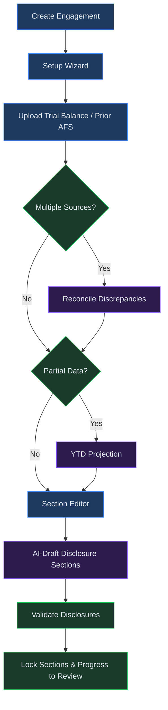

# AFS Module

## Overview

The AFS (Annual Financial Statements) module is a dedicated workspace for creating, drafting, and managing financial statement engagements that comply with IFRS or GAAP frameworks. Within this module you can create engagements for individual entities, upload trial balances and prior-year financial statements, use AI to draft disclosure sections in natural language, reconcile data from multiple sources, and validate your disclosures against framework requirements.

The module is designed around a linear workflow: you create an engagement, run the setup wizard to upload data, draft each disclosure section with AI assistance, validate completeness, and then progress the engagement through review to publication. For recurring annual filings, the roll-forward feature carries prior-period sections into new engagements so you do not start from scratch each year.

The AFS module integrates tightly with the Review and Tax, Consolidation and Output, and Org Structures modules described in subsequent chapters. Together, these modules form a complete end-to-end pipeline from raw trial balance data to published, framework-compliant financial statements.

---

## Process Flow

The following diagram shows the end-to-end workflow through the AFS module, from creating an engagement to progressing it toward review:

---

## Key Concepts

| Concept | Description |
|---------|-------------|
| **Engagement** | The top-level container for one entity's annual financial statements. Each engagement is tied to a single accounting framework, a fiscal period, and a reporting entity. Engagements progress through a defined lifecycle from setup to publication. |
| **Framework** | An accounting standards framework such as IFRS for SMEs, Full IFRS, or US GAAP. The framework determines which disclosure items are required and how validation rules are applied. Frameworks are seeded automatically the first time you open the AFS module, or you can create custom frameworks. |
| **Trial Balance** | A structured upload of your entity's general ledger balances, typically in Excel (.xlsx) or CSV format. The trial balance provides the numerical foundation for all disclosure sections. |
| **Prior AFS** | A previously issued set of annual financial statements uploaded as a PDF or Excel file. When both a PDF and an Excel version are uploaded, the system can reconcile differences between them. |
| **Disclosure Section** | An individual component of the financial statements, such as a note, a primary statement, a directors' report, or an accounting policy. Sections are drafted by AI using natural-language instructions you provide. |
| **IFRS** | International Financial Reporting Standards. A globally adopted set of accounting standards issued by the IASB. Virtual Analyst supports both full IFRS and IFRS for SMEs. |
| **GAAP** | Generally Accepted Accounting Principles. Typically refers to US GAAP issued by FASB, though the platform supports other national GAAP variants through custom frameworks. |
| **Roll Forward** | The process of carrying disclosure sections and comparative data from a prior engagement into a new engagement for the next reporting period, reducing repetitive work. |

---

## Step-by-Step Guide

### 1. Creating an Engagement

Navigate to the **AFS** page from the sidebar. The AFS dashboard shows all existing engagements as cards arranged in a responsive grid. Each card displays the entity name, accounting framework, fiscal period dates, and a colored status badge. Use the search bar to filter engagements by entity name, or select a status from the filter dropdown to narrow the list.

To create a new engagement:

1. Click the **New Engagement** button in the upper-right corner. A dialog appears with a form for the engagement details.
2. Enter the **Entity Name** -- the legal name of the reporting entity (for example, "Acme Holdings (Pty) Ltd"). This field is required.
3. Select an **Accounting Framework** from the dropdown. If no frameworks appear, the system will seed default IFRS and GAAP frameworks automatically on first load. This field is required.
4. Set the **Period Start** date -- the first day of the fiscal year you are reporting on.
5. Set the **Period End** date -- the last day of the fiscal year. The end date must be after the start date; the form validates this before submission.
6. Optionally, link a **Prior Engagement** by selecting one from the dropdown. Only engagements with an "approved" or "published" status are available for linking. Linking a prior engagement enables roll-forward of disclosure sections and comparative data into the new period.
7. Click **Create Engagement**. A success notification appears and you are redirected to the Setup Wizard to continue preparing the engagement.

> **Tip:** If you want to create a custom accounting framework before creating engagements, click the **Custom Framework** button on the AFS dashboard to navigate to the framework editor. Custom frameworks allow you to define your own set of required disclosure items and validation rules beyond the standard IFRS and GAAP defaults.

### 2. Running the Setup Wizard

The Setup Wizard walks you through four steps to prepare your engagement for section drafting.

**Step 1 -- Framework & Entity.** This step displays a read-only summary of the engagement details you entered during creation: entity name, framework, and fiscal period. If the engagement is linked to a prior period, a "Roll Forward Available" panel appears. Click **Roll Forward Sections** to copy disclosure sections and comparative data from the prior engagement into the current one. This saves significant time for recurring annual filings. After reviewing, click **Next: Upload Data**.

**Step 2 -- Upload Financial Data.** This step provides three upload zones:

- **Excel / CSV Trial Balance** -- Upload your general ledger trial balance in .xlsx or .csv format.
- **PDF Annual Financial Statements** -- Upload a PDF copy of a prior or draft set of annual financial statements.
- **Excel-Based AFS (optional)** -- Upload an Excel-format annual financial statement for comparison with the PDF version.

You must upload at least one file to proceed. After uploading, each file appears in the "Uploaded Files" list with a badge indicating its type (Trial Balance, PDF, or Excel). Click **Next** to continue.

**Step 3 -- Source Reconciliation.** This step appears only when both a PDF and an Excel source are detected. The system automatically runs a reconciliation process, comparing line items across both sources and identifying any discrepancies. Results are displayed in a table with the following columns:

- **Line Item** -- The account or disclosure line being compared.
- **PDF Value** -- The amount extracted from the PDF source.
- **Excel Value** -- The amount from the Excel source.
- **Difference** -- The calculated variance between the two values.
- **Resolution** -- A dropdown where you select how to handle the discrepancy: "Use PDF," "Use Excel," or "Noted."
- **Note** -- A free-text field for recording the reason behind your resolution.

Above the table, you must select a **Base Source** using radio buttons to designate whether Excel or PDF takes priority as the authoritative source for this engagement. If no discrepancies are detected, the table is replaced with a confirmation message. Click **Next** after resolving all discrepancies and selecting a base source.

**Step 4 -- YTD Projection.** This step appears only when the uploaded trial balance covers a partial year. The system detects which months are missing from the data and displays each one with a "Missing" badge. For each missing month:

1. Enter a natural-language description of how the figures should be projected (for example, "Assume flat revenue from prior month, 5% seasonal uplift").
2. Click **Save Projection**. The badge changes to "Projected" and the basis description is displayed below the month label.

If all months are already covered, the step displays a message confirming that no projections are needed. After addressing all missing months, click **Complete Setup**.

After completing the wizard, the engagement status moves from "setup" to "ingestion" and you are redirected to the Section Editor.

### 3. Uploading a Trial Balance

Trial balances are uploaded during Step 2 of the Setup Wizard, but it is worth understanding the requirements, expected format, and how the system processes your data.

- **Supported formats:** .xlsx and .csv files. Excel workbooks with multiple sheets are accepted; the system reads the first sheet unless a specific sheet is designated.
- **Required columns:** The system expects a structured trial balance with account codes, account names, and balance amounts. At minimum, include columns for the account identifier, the account description, and the debit or credit balance. Avoid merged cells, multi-row headers, or empty rows interspersed with data, as these can cause parsing errors.
- **Partial data handling:** If your trial balance covers only part of the fiscal year, the system flags it as "Partial" and presents the YTD Projection step so you can describe how the remaining months should be estimated. A "Partial" badge appears next to the file in the Uploaded Files list.
- **Upload confirmation:** After a successful upload, a success toast notification appears and the file is listed in the Uploaded Files panel with a "Trial Balance" badge.
- **Multiple uploads:** You can upload more than one trial balance file if your data is split across periods or segments. Each file appears as a separate entry in the Uploaded Files list.

### 4. Working with Disclosure Sections

After completing setup, you land on the **Section Editor** -- a split-panel interface for managing all disclosure sections within the engagement.

- **Left panel:** Lists all sections with their title, type (note, statement, directors' report, or accounting policy), version number, and status badge. Sections carried forward from a prior engagement display a "Carried Forward" badge.
- **Right panel:** Shows the full content of the selected section, including headings, paragraphs, tables, warnings, and IFRS/GAAP references.

**Section types** available when creating a new section:

| Type | Description |
|------|-------------|
| Note | A disclosure note (e.g., Revenue Recognition, Related Parties). |
| Statement | A primary financial statement (e.g., Statement of Financial Position). |
| Directors' Report | The directors' report or equivalent governance narrative. |
| Accounting Policy | An accounting policy disclosure describing the entity's basis of preparation. |

**Section content display:** The right panel renders the AI-generated content in a structured format. Headings, body paragraphs, and tables are displayed in distinct visual blocks. If the AI flagged any warnings during generation (for example, missing data or assumptions it made), those warnings appear in a highlighted panel above the content. Framework references (such as "IAS 16" or "IFRS 15") are shown as badges below the content for quick identification.

**Locking and unlocking sections:** When you are satisfied with a section, click **Lock Section** to prevent further changes. A locked section displays a green "locked" badge and the feedback panel is hidden. To make further edits, click **Unlock** first, which returns the section to an editable state.

### 5. Using AI to Draft Disclosures

AI drafting is the core feature of the Section Editor. You can generate a new section from scratch or refine an existing one.

**Drafting a new section:**

1. Click the **+ New** button in the Section Editor toolbar.
2. Select a **Section Type** from the dropdown (Note, Statement, Directors' Report, or Accounting Policy).
3. Enter a **Title** -- for example, "Revenue Recognition."
4. Write a natural-language **Instruction** describing what the section should contain. Be specific. For example: "Revenue increased 15% due to new mining contracts. We adopted IFRS 15 this year. Include a breakdown by segment."
5. Click **Generate Draft**. The button label changes to "Drafting with AI..." while the request is in progress. The AI processes your instruction against the engagement's trial balance data and framework requirements, then produces structured disclosure text with headings, paragraphs, and tables as appropriate. Once complete, the new section appears in the left panel and is automatically selected for viewing.

**Re-drafting with feedback:**

If a section needs changes, use the feedback panel below the content area (available only for unlocked sections):

1. Enter your feedback in the text area. For example: "Add more detail about the lease modifications" or "The revenue figure should be R1.2m not R1.5m."
2. Click **Re-draft**. The AI regenerates the section incorporating your feedback. The section version number increments with each re-draft.

**Validating disclosures:**

Click the **Validate** button in the toolbar to run a compliance check against the selected framework. The validation engine identifies:

- **Missing disclosures** -- Required items that do not yet have a corresponding section. Each missing disclosure shows a severity level (critical, important, or informational) and a framework reference.
- **Suggestions** -- Recommendations for improving existing sections.

If all required disclosures are present, a success message confirms compliance. You can re-run validation at any point as you add or modify sections.

> **Best practice:** Run validation before locking your final sections and submitting the engagement for review. This ensures you have not missed any required disclosures and gives you an opportunity to address suggestions while sections are still editable.

### 6. Engagement Status Progression

Every engagement follows a defined lifecycle. The current status is displayed as a colored badge on the AFS dashboard and determines which page the engagement card links to.

| Status | Badge Color | Description | Links To |
|--------|-------------|-------------|----------|
| **Setup** | Gray | The engagement has been created but the Setup Wizard has not been completed. | Setup Wizard |
| **Ingestion** | Gray | Setup is complete and data has been uploaded. Sections are ready to be drafted. | Section Editor |
| **Drafting** | Violet | Sections are actively being drafted or edited. | Section Editor |
| **Review** | Yellow | All sections are locked and the engagement has been submitted for review. | Review Page |
| **Approved** | Green | The review process is complete and the engagement has been signed off. | Review Page |
| **Published** | Green | Final outputs (PDF, DOCX, or iXBRL) have been generated. | Output Page |

Status transitions occur automatically based on your actions (completing setup, submitting for review) or can be triggered explicitly by reviewers during the approval process. On the AFS dashboard, clicking an engagement card navigates you to the most relevant page for that engagement's current status -- for example, a card in "setup" status opens the Setup Wizard, while a card in "drafting" status opens the Section Editor.

**Navigating between AFS sub-pages:** Once inside an engagement, the Section Editor toolbar provides quick-access buttons to related pages: **Tax**, **Review**, **Consolidation**, **Output**, and **Analytics**. Use these buttons to move between modules without returning to the dashboard. A breadcrumb trail at the top of every sub-page shows your current position (AFS > Entity Name > Current Page) and lets you navigate back to the dashboard or the engagement root at any time.

---

## Setup Wizard Flow

The following diagram provides a detailed view of the Setup Wizard's internal branching logic, including validation, reconciliation, and projection paths:

```mermaid
flowchart TD
    A[Enter Setup Wizard] --> B[Step 1: Review Framework & Entity]
    B --> B1{Prior Engagement Linked?}
    B1 -->|Yes| B2[Show Roll Forward Panel]
    B2 --> B3{User Clicks Roll Forward?}
    B3 -->|Yes| B4[Copy Sections & Comparatives]
    B3 -->|No| B5[Continue Without Roll Forward]
    B4 --> B5
    B1 -->|No| B5
    B5 --> C[Step 2: Upload Financial Data]

    C --> C1[Upload Excel/CSV Trial Balance]
    C --> C2[Upload PDF AFS]
    C --> C3[Upload Excel AFS]
    C1 --> D{At Least One File Uploaded?}
    C2 --> D
    C3 --> D
    D -->|No| D1[Disable Next Button]
    D -->|Yes| E{Both PDF and Excel Sources?}

    E -->|Yes| F[Step 3: Source Reconciliation]
    F --> F1[Display Discrepancy Table]
    F1 --> F2[Resolve Each Discrepancy]
    F2 --> F3[Select Base Source]
    F3 --> G{Trial Balance Partial?}

    E -->|No| G
    G -->|Yes| H[Step 4: YTD Projection]
    H --> H1[Identify Missing Months]
    H1 --> H2[Enter Projection Basis per Month]
    H2 --> H3[Save Projections]
    H3 --> I[Complete Setup]

    G -->|No| I
    I --> J[Update Status to Ingestion]
    J --> K[Redirect to Section Editor]

    style A fill:#1e3a5f,stroke:#3b82f6,color:#e2e8f0
    style B fill:#1e3a5f,stroke:#3b82f6,color:#e2e8f0
    style B1 fill:#1a3a2a,stroke:#22c55e,color:#e2e8f0
    style B2 fill:#2d1b4e,stroke:#8b5cf6,color:#e2e8f0
    style B3 fill:#1a3a2a,stroke:#22c55e,color:#e2e8f0
    style B4 fill:#2d1b4e,stroke:#8b5cf6,color:#e2e8f0
    style B5 fill:#1e3a5f,stroke:#3b82f6,color:#e2e8f0
    style C fill:#1e3a5f,stroke:#3b82f6,color:#e2e8f0
    style C1 fill:#1e3a5f,stroke:#3b82f6,color:#e2e8f0
    style C2 fill:#1e3a5f,stroke:#3b82f6,color:#e2e8f0
    style C3 fill:#1e3a5f,stroke:#3b82f6,color:#e2e8f0
    style D fill:#1a3a2a,stroke:#22c55e,color:#e2e8f0
    style D1 fill:#3a1a3a,stroke:#ec4899,color:#e2e8f0
    style E fill:#1a3a2a,stroke:#22c55e,color:#e2e8f0
    style F fill:#2d1b4e,stroke:#8b5cf6,color:#e2e8f0
    style F1 fill:#2d1b4e,stroke:#8b5cf6,color:#e2e8f0
    style F2 fill:#2d1b4e,stroke:#8b5cf6,color:#e2e8f0
    style F3 fill:#2d1b4e,stroke:#8b5cf6,color:#e2e8f0
    style G fill:#1a3a2a,stroke:#22c55e,color:#e2e8f0
    style H fill:#2d1b4e,stroke:#8b5cf6,color:#e2e8f0
    style H1 fill:#2d1b4e,stroke:#8b5cf6,color:#e2e8f0
    style H2 fill:#2d1b4e,stroke:#8b5cf6,color:#e2e8f0
    style H3 fill:#2d1b4e,stroke:#8b5cf6,color:#e2e8f0
    style I fill:#1a3a2a,stroke:#22c55e,color:#e2e8f0
    style J fill:#1a3a2a,stroke:#22c55e,color:#e2e8f0
    style K fill:#1e3a5f,stroke:#3b82f6,color:#e2e8f0
```

---

## Quick Reference

| Action | How |
|--------|-----|
| Open the AFS module | Click **AFS** in the sidebar. |
| Create a new engagement | Click **New Engagement** on the AFS dashboard, fill in entity details and framework, then click **Create Engagement**. |
| Upload a trial balance | In the Setup Wizard Step 2, use the Excel/CSV upload zone and select your file. |
| Roll forward from a prior period | In Step 1 of the Setup Wizard, click **Roll Forward Sections** (available only when a prior engagement is linked). |
| Draft a new disclosure section | In the Section Editor, click **+ New**, fill in the section type, title, and instruction, then click **Generate Draft**. |
| Re-draft a section with feedback | Select an unlocked section, enter feedback in the text area below the content, and click **Re-draft**. |
| Lock a section | Select the section and click **Lock Section** in the content header. |
| Validate disclosures | Click **Validate** in the Section Editor toolbar to check all sections against framework requirements. |

---

## Troubleshooting

| Symptom | Cause | Resolution |
|---------|-------|------------|
| Trial balance upload fails | The file format does not match expected structure, or required columns (account code, description, balance) are missing. | Ensure your file is a valid .xlsx or .csv with clearly labeled columns. Remove merged cells or extraneous header rows before uploading. |
| Framework dropdown is empty | Frameworks have not been seeded for your tenant. | Refresh the AFS dashboard page. The system auto-seeds default IFRS and GAAP frameworks on first load. If the issue persists, click **Custom Framework** to create one manually. |
| AI draft generation is slow or times out | The section instruction is very broad, or the trial balance contains a large volume of data. | Narrow your instruction to focus on a specific disclosure topic. If the request times out, wait a moment and try again. Large engagements may require longer processing. |
| Section editor shows no content after drafting | The AI response may not have been saved correctly, or a network interruption occurred during generation. | Try re-drafting the section with the same instruction. Ensure your network connection is stable. |
| Engagement is stuck in "setup" status | The Setup Wizard was not completed. At least one file must be uploaded and all required steps finished. | Return to the Setup Wizard by clicking the engagement card on the AFS dashboard (cards in "setup" status link directly to the wizard). Complete all steps through to **Complete Setup**. |
| Validation reports missing disclosures | Required disclosure sections for the selected framework have not yet been created. | Review the missing disclosure list, noting the severity and framework reference for each item. Create new sections to address critical and important gaps. |
| Discrepancy table is empty but sources differ | The reconciliation engine did not detect material differences between the uploaded PDF and Excel sources. | This is normal when both sources agree. Proceed by selecting a base source and continuing. |
| Roll Forward button is disabled | The roll-forward has already been performed for this engagement. | Each engagement supports a single roll-forward operation. The button shows "Rolled Forward" once completed. To re-import sections, create a new engagement linked to the same prior period. |

---

## Related Chapters

- [Chapter 07: AFS Review and Tax](07-afs-review-and-tax.md) -- Three-stage review workflow and tax computation with AI-generated notes.
- [Chapter 08: AFS Consolidation and Output](08-afs-consolidation-and-output.md) -- Multi-entity consolidation and PDF/DOCX/iXBRL output generation.
- [Chapter 09: Org Structures](09-org-structures.md) -- Managing organizational hierarchies, entity groups, and consolidation rules.
- [Chapter 04: Data Import](04-data-import.md) -- Importing Excel workbooks using the AI-assisted wizard (separate from AFS trial balance upload).
- [Chapter 05: Excel Live Connections](05-excel-connections.md) -- Bidirectional sync between Excel workbooks and Virtual Analyst models.
