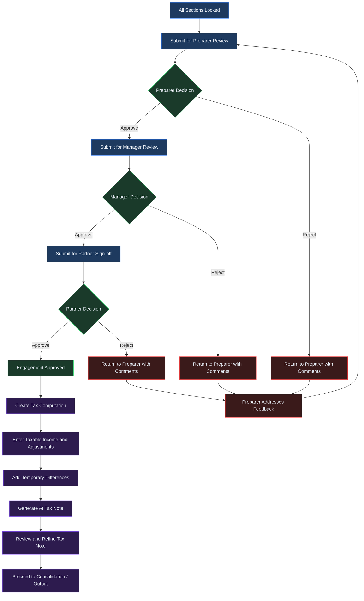
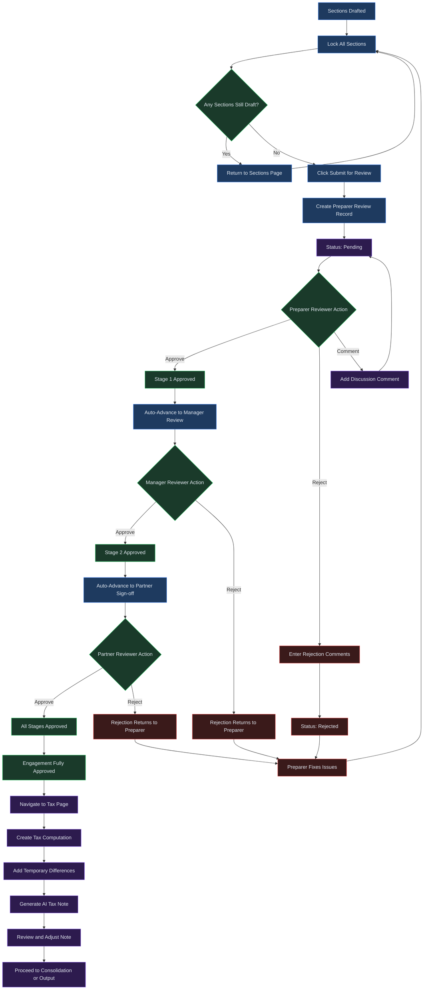

# AFS Review and Tax

## Overview

The AFS Review and Tax page brings together two critical processes in the annual financial statements lifecycle: the multi-stage review workflow that ensures every disclosure is examined by the right people, and the tax computation engine that calculates current tax, deferred tax, and generates AI-drafted tax notes ready for inclusion in your financial statements.

The review workflow enforces a three-stage gate: Preparer Review, Manager Review, and Partner Sign-off. Each stage must be approved before the engagement can advance to the next. Reviewers can approve, reject with comments, or leave discussion comments for the preparer to address. Rejected reviews loop the engagement back to the preparer with actionable feedback, ensuring nothing moves forward until the issues are resolved.

The tax computation side allows you to create jurisdiction-specific tax calculations, record permanent adjustments, add temporary differences between carrying amounts and tax bases, and let AI generate a structured tax note that references the applicable accounting standards.

---

## Process Flow

The following diagram shows the end-to-end flow from draft completion through all three review stages and into tax computation:

---

## Key Concepts

| Concept | Description |
|---------|-------------|
| **Review Stage** | One of three sequential gates -- Preparer Review, Manager Review, or Partner Sign-off -- that the engagement must pass through before it is considered approved. Each stage is handled by a different role. |
| **Approval Gate** | The decision point within a review stage. The assigned reviewer evaluates the engagement and either approves it (advancing to the next stage), rejects it (sending it back with comments), or leaves discussion comments for the preparer. |
| **Permanent Difference** | A tax adjustment that does not reverse over time. Examples include non-deductible expenses (such as fines or entertainment) and exempt income (such as certain dividend income). Permanent differences affect the current tax charge but do not create deferred tax. |
| **Temporary Difference** | A timing difference between the carrying amount of an asset or liability on the balance sheet and its tax base. Examples include accelerated depreciation and provision timing differences. Temporary differences give rise to deferred tax assets or liabilities. |
| **Deferred Tax** | A balance sheet item representing the future tax consequence of temporary differences. A deferred tax asset (DTA) arises when the carrying amount is less than the tax base for an asset, meaning tax will be lower in the future. A deferred tax liability (DTL) arises when the carrying amount exceeds the tax base. |
| **Tax Note** | An AI-generated disclosure note that explains the tax computation, reconciles the statutory rate to the effective rate, describes temporary differences, and references the applicable accounting standards (IFRS or GAAP). |

---

## Step-by-Step Guide

### 1. Understanding the Review Stages

The review page is accessed from the AFS engagement by clicking the **Review** button in the top navigation bar or by navigating to the engagement and selecting the Review tab.

The left panel displays a vertical timeline with three stages, each represented by a numbered card:

- **Stage 1 -- Preparer Review.** The preparer (the person who drafted the sections) submits the engagement for an initial quality check. A peer or senior team member reviews the disclosure content for completeness and accuracy.

- **Stage 2 -- Manager Review.** After preparer approval, the engagement advances to the manager level. The manager checks for compliance with the chosen accounting framework, consistency across sections, and overall presentation quality.

- **Stage 3 -- Partner Sign-off.** The final gate. The engagement partner reviews and signs off on the financial statements before they can be finalized, consolidated, or exported.

Each stage card shows a status badge: **Not submitted** (grey), **Pending** (amber), **Approved** (green), or **Rejected** (red). Below the badge, submission and review timestamps are displayed along with the names of the submitter and reviewer.

### 2. Submitting for Review

Before you can submit for review, all disclosure sections must be locked. If any section remains in a draft or unlocked state, the **Submit for Review** button in the top-right corner will be disabled.

1. Navigate to the **Sections** page and confirm that every section shows a status of **Locked**.
2. Return to the **Review** page.
3. Click **Submit for Review**. The system creates a review record for the next available stage (Preparer Review first, then Manager Review, then Partner Sign-off).
4. A success notification confirms the submission, and the timeline updates to show the new review with a **Pending** status badge.

> **Note:** You cannot submit for a new review stage while a review at the current stage is still pending. The button will remain disabled until the pending review is resolved.

### 3. Performing a Review (Approve / Request Changes / Reject)

When a review is pending, the assigned reviewer sees action buttons on the pending stage card:

- **Approve** -- Click this button to mark the stage as approved. The engagement automatically advances to the next stage. If this is the final stage (Partner Sign-off), the entire engagement is marked as approved.

- **Reject** -- Click this button to expand a text area where you must provide a reason for rejection. After entering your feedback, click **Confirm Rejection**. The engagement status reverts and the preparer is notified with your comments.

Reviewers can also add discussion comments at any time by selecting a review stage and using the comment panel on the right side of the page.

### 4. Handling Feedback and Corrections

When a review is rejected, the rejection reason is displayed in a highlighted panel on the relevant stage card. The preparer should:

1. Read the rejection comments on the Review page.
2. Navigate back to the **Sections** page and unlock the relevant sections that require changes.
3. Make the necessary corrections to the disclosure content.
4. Lock the sections again once corrections are complete.
5. Return to the **Review** page and click **Submit for Review** to resubmit.

The rejected review record is preserved in the timeline for audit trail purposes, and a new review record is created for the resubmission.

### 5. Tax Computation Setup

The Tax page is accessed by clicking the **Tax** button in the engagement navigation bar. If no tax computation exists yet, a creation form is displayed.

1. **Select a jurisdiction.** Choose from the available jurisdictions (South Africa, United States, United Kingdom, or Australia). The jurisdiction determines which statutory defaults and accounting standards are referenced.

2. **Set the statutory rate.** The rate field pre-populates with the default for the selected jurisdiction (for example, 0.27 for South Africa). Adjust this if your entity is subject to a different rate.

3. **Enter taxable income.** Provide the taxable income figure from your trial balance or income statement.

4. **Add adjustments.** Click **+ Add Row** to record permanent differences -- non-deductible expenses or exempt income items. Each adjustment requires a description and an amount. Add as many rows as needed, and remove any that are no longer required.

5. **Compute.** Click **Compute Tax** to submit the data. The system calculates current tax at the statutory rate, applies your adjustments, and generates a reconciliation table showing each line item's tax effect.

### 6. Reviewing Tax Computations

After computation, the page displays the results in three panels:

- **Tax Summary** -- Four metric cards showing taxable income, statutory rate, current tax, and the effective tax rate.

- **Tax Reconciliation** -- A table listing each adjustment with its description, amount, and tax effect. This table demonstrates the bridge from the statutory rate to the effective rate.

- **Temporary Differences** -- A table for recording timing differences between carrying amounts and tax bases. Click **+ Add Temporary Difference** to open the input form, which asks for a description, carrying amount, tax base, and type (asset or liability). The system calculates the difference and the deferred tax effect automatically. Below the table, summary totals show the total deferred tax asset (DTA), total deferred tax liability (DTL), and the net deferred tax position.

### 7. AI-Generated Tax Notes

Once a tax computation exists, you can generate an AI-drafted tax note for inclusion in your financial statements.

1. Scroll to the **Tax Note** panel at the bottom of the Tax page.
2. Optionally enter instructions in the text area to guide the AI. For example, you might write "Emphasise the capital allowance impact" or "Include a deferred tax reconciliation table."
3. Click **Generate Tax Note**. The system sends the tax computation data to the AI engine, which returns a structured note containing headings, narrative paragraphs, tables, and standard references.
4. The generated note displays directly on the page with its section headings, body text, and reference badges (such as IAS 12 or ASC 740).
5. To refine the output, enter new instructions and click **Regenerate Tax Note**. Each regeneration replaces the previous note while preserving the underlying computation data.

> **Note:** AI-generated tax notes should always be reviewed by a qualified professional. The note is a starting point that reflects the computation data you provided, but it may require adjustments for entity-specific circumstances or evolving regulatory guidance.

---

## Review Workflow Detail

The following diagram shows the complete review and tax workflow with all branching paths:

---

## Quick Reference

| Action | How |
|--------|-----|
| Open the review page | Navigate to an AFS engagement and click **Review** in the top navigation bar. |
| Submit for review | Ensure all sections are locked, then click **Submit for Review** on the Review page. |
| Approve a pending review | Click **Approve** on the pending stage card. |
| Reject a review | Click **Reject**, enter your reason in the text area, and click **Confirm Rejection**. |
| Add a review comment | Select a review stage in the left panel, then type your comment in the right panel and click **Add Comment**. |
| Create a tax computation | Navigate to the **Tax** page, fill in jurisdiction, statutory rate, taxable income, and adjustments, then click **Compute Tax**. |
| Add a temporary difference | On the Tax page, click **+ Add Temporary Difference**, enter the description, carrying amount, tax base, and type, then click **Add**. |
| Generate a tax note | Scroll to the Tax Note panel, optionally enter instructions, and click **Generate Tax Note**. |

---

## Troubleshooting

| Symptom | Cause | Resolution |
|---------|-------|------------|
| Submit for Review button is disabled | One or more disclosure sections are still in a draft or unlocked state. | Navigate to the Sections page, confirm every section shows a status of **Locked**, then return to the Review page. |
| Review appears stuck at a stage | A review is currently pending and has not been approved or rejected yet. | The assigned reviewer must take action (approve or reject) before the engagement can advance. Check with the reviewer or contact your administrator if the reviewer is unavailable. |
| Tax computation returns an error | The taxable income field is empty, or one or more adjustment rows have missing data. | Verify that the taxable income field contains a valid number and that every adjustment row has both a description and an amount. Remove incomplete rows before computing. |
| Missing reviewer for a stage | No team member has been assigned the appropriate review role for the current stage. | Contact your tenant administrator to assign a reviewer with the correct role (preparer, manager, or partner) under **Settings > Teams**. |
| AI tax note is inaccurate or incomplete | The generated note reflects only the data provided in the tax computation. If adjustments or temporary differences are missing, the note will be incomplete. | Review the computation inputs, add any missing adjustments or temporary differences, then click **Regenerate Tax Note** with updated instructions to guide the AI output. |
| Deferred tax totals do not match expectations | Temporary differences may have been entered with incorrect carrying amounts, tax bases, or type classifications. | Review each temporary difference row in the table. Verify that the carrying amount and tax base are correct and that the type (asset or liability) is properly assigned. |
| Rejection comments are not visible | You may not have selected the rejected review stage in the left panel. | Click on the rejected stage card in the timeline. The rejection reason is displayed in a highlighted panel below the stage badge. |
| Tax note references the wrong accounting standard | The jurisdiction or framework selection may not match your entity's reporting requirements. | Check the jurisdiction setting on the Tax page and ensure the engagement's accounting framework (IFRS or GAAP) is correctly configured in the engagement setup. |

---

## Related Chapters

- [Chapter 06: AFS Module](06-afs-module.md) -- Engagements, AI disclosure drafting, and section editing.
- [Chapter 08: AFS Consolidation and Output](08-afs-consolidation-and-output.md) -- Multi-entity consolidation and PDF/DOCX/iXBRL output generation.
- [Chapter 22: Workflows, Tasks, and Inbox](22-workflows-and-tasks.md) -- Configuring approval chains, routing review requests, and managing your inbox.
