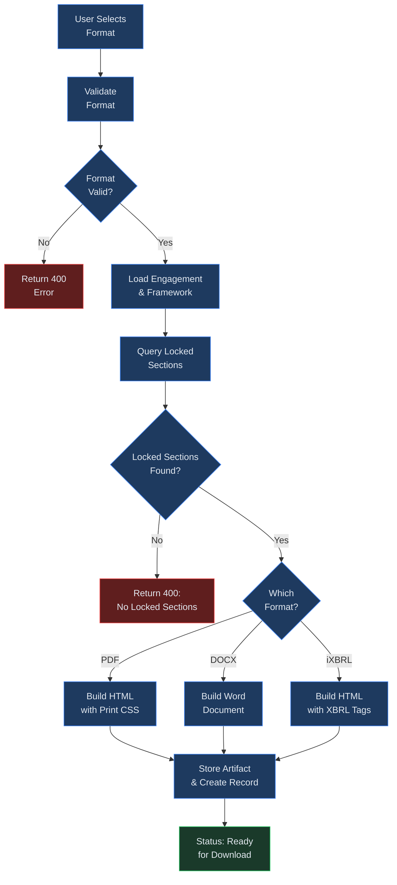
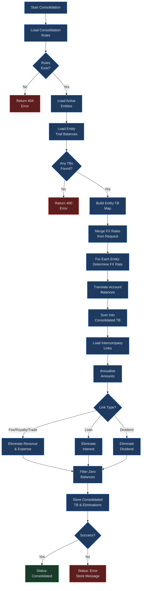

# AFS Consolidation and Output

## Overview

The Consolidation and Output module is the final production stage of the AFS workflow. Consolidation combines trial balances from multiple legal entities within a group structure into a single set of financial statements, applying foreign exchange translation and intercompany elimination rules along the way. Once consolidation is complete (or for single-entity engagements, once sections are locked), you generate downloadable output in PDF, DOCX, or iXBRL format.

This chapter covers linking an engagement to an organisational structure, configuring FX rates and elimination rules, running the consolidation engine, and producing formatted output files ready for review or regulatory filing.

**Prerequisites** -- Before beginning consolidation, ensure the following are in place:

- An AFS engagement exists with at least one framework assigned (see Chapter 06).
- An organisational structure has been created with active entities and, if applicable, intercompany links defined (see Chapter 09).
- Trial balances have been uploaded for each entity that will participate in the consolidation.
- All disclosure sections have been drafted and reviewed. Output generation requires sections to be in "locked" status (see Chapter 07).

## Process Flow

## Key Concepts

| Concept | Description |
|---------|-------------|
| **Consolidation Perimeter** | The set of active entities within a linked org-structure that are included in the consolidated financial statements. Only entities with status "active" and an uploaded trial balance participate. |
| **Intercompany Elimination** | The process of removing transactions between entities in the same group so that the consolidated statements reflect only external activity. Supported link types include management fees, royalties, trade, loans, and dividends. |
| **FX Translation** | Currency conversion applied when an entity's functional currency differs from the group reporting currency. Rates are supplied as currency-pair maps (e.g., `USD/ZAR`). |
| **Closing Rate** | The exchange rate at the balance sheet date. Used for translating balance sheet items such as assets and liabilities. Supplied via the `fx_closing_rates` field. |
| **Average Rate** | The weighted-average exchange rate over the reporting period. Used for translating income statement items such as revenue and expenses. Supplied via the `fx_avg_rates` field. |
| **Historical Rate** | The exchange rate at the date of a specific transaction or the acquisition date of an asset. Applied manually to equity-related items when required by the applicable standard. |
| **Reporting Currency** | The target currency for the consolidated financial statements, set when linking the org-structure (defaults to ZAR). All entity balances are translated into this currency. |
| **iXBRL** | Inline eXtensible Business Reporting Language. A format that embeds XBRL taxonomy tags inside an HTML document, allowing both human-readable presentation and machine-readable regulatory data in a single file. |

## Step-by-Step Guide

### 1. Setting the Consolidation Perimeter

Before consolidation can run, you link the AFS engagement to an existing organisational structure.

1. Navigate to the engagement dashboard and open the **Consolidation** tab.
2. Click **Link Org-Structure** to open the linking dialog.
3. Select an org-structure from the dropdown. This determines which entities form the consolidation perimeter.
4. Set the **Reporting Currency** (three-letter ISO code such as ZAR, USD, or GBP).
5. Optionally provide initial FX average and closing rate maps at this stage.
6. Click **Link** to save. The system creates a consolidation record tying the engagement to the org-structure.

Once linked, the entity list loads automatically. Each entity card displays its name, entity type, functional currency, and whether a trial balance has been uploaded for this engagement.

Only entities with status "active" in the org-structure participate. To exclude an entity, deactivate it from the Organisation Structures page before running consolidation.

### 2. Configuring Intercompany Eliminations

Intercompany eliminations are driven by the intercompany links defined in the org-structure. The consolidation engine reads these links and generates elimination journal entries automatically.

Supported link types and their treatment:

- **Management fee / Royalty / Trade** -- Revenue is eliminated from the receiving entity and the corresponding expense is reversed on the paying entity. The engine annualises amounts based on the frequency field (monthly amounts are multiplied by 12, quarterly by 4).
- **Loan** -- Interest income and interest expense between the lender and borrower entities are offset. The `amount_or_rate` field represents the interest amount to eliminate.
- **Dividend** -- Dividend income received by the parent from a subsidiary is eliminated against the subsidiary's distribution.

To add or edit intercompany links, navigate to the org-structure editor (see Chapter 09). The links feed into the consolidation automatically; no separate configuration is needed on the AFS consolidation page.

Each elimination entry generated by the engine records the link type, the names of the from-entity and to-entity, and the amounts eliminated. After the consolidation run completes, you can review these entries in the **Eliminations** panel to verify accuracy before proceeding to output generation.

### 3. FX Translation Methods

When entities report in different currencies, the consolidation engine translates each entity's trial balance into the group reporting currency before aggregation.

You can supply or update FX rates in two ways:

- **At link time** -- Provide `fx_avg_rates` and `fx_closing_rates` when linking the org-structure.
- **At consolidation time** -- Pass updated rate maps in the consolidation run request. New rates merge with and override any previously stored rates.

Rate maps use the format `{ "USD/ZAR": 18.50, "GBP/ZAR": 23.10 }`. The key is a currency pair where the first code is the entity currency and the second is the reporting currency.

**Translation method by account type:**

| Account Category | Rate Applied | Rationale |
|-----------------|-------------|-----------|
| Revenue and expenses | Average rate | Approximates the rate at the date each transaction occurred over the period |
| Assets and liabilities | Closing rate | Reflects the value at the reporting date |
| Equity items | Historical rate | Preserves the value at the original transaction or acquisition date |

The current engine applies the average rate uniformly during the automated consolidation pass. For closing-rate and historical-rate adjustments to specific balance sheet lines, apply manual journal entries to the consolidated trial balance after the initial run.

### 4. Running the Consolidation

With entities linked, trial balances uploaded, and FX rates configured:

1. Navigate to the **Consolidation** tab within the engagement.
2. Review the entity list. Confirm each entity shows a green "TB uploaded" indicator.
3. Optionally update FX rates using the rate editor panel.
4. Click **Run Consolidation**.

The engine performs the following steps in sequence:

1. Loads all active entities from the linked org-structure.
2. Retrieves the latest trial balance for each entity (grouped by `entity_id`, taking the most recent upload).
3. Translates each account balance using the applicable FX rate.
4. Sums translated balances across all entities to produce the consolidated trial balance.
5. Reads intercompany links and generates elimination entries.
6. Adjusts the consolidated balances for eliminations.
7. Filters out zero-balance accounts (absolute value below 0.005).
8. Stores the consolidated trial balance, elimination entries, entity-TB map, and updated FX rates.

On success, the consolidation status changes to **consolidated** and the `consolidated_at` timestamp is recorded. If an error occurs, the status changes to **error** and the error message is stored for troubleshooting.

### 5. Generating Output (PDF, DOCX, iXBRL)

Output generation assembles all locked AFS sections into a formatted document. Sections must be in "locked" status before output can be produced.

1. Navigate to the **Output** tab within the engagement.
2. Select the desired format from the format selector: **PDF**, **DOCX**, or **iXBRL**.
3. Click **Generate**.

The system builds the output by:

- Querying all locked sections ordered by `section_number`.
- Extracting the `content_json` structure from each section (title, paragraphs, tables, references, warnings).
- Assembling a cover page with the entity name, reporting period, framework, and generation date.
- Building a table of contents from section titles.
- Rendering each section with headings, narrative paragraphs, formatted tables, reference lists, and warning notes.
- For iXBRL output, injecting XBRL namespace declarations, taxonomy schema references, and context elements into the HTML structure.

**Format-specific details:**

- **PDF** -- Produces print-ready HTML with CSS page-break rules, a serif font (Times New Roman), and a professional cover page layout. Tables use collapsed borders with a light grey header row. This format is optimised for browser printing or conversion to PDF via the browser's print dialog.
- **DOCX** -- Produces a Word document using `python-docx`. Sections are rendered as Heading 1 elements, sub-headings as Heading 2, and tables use the "Table Grid" style. The document includes page breaks between sections and a numbered table of contents.
- **iXBRL** -- Produces the same HTML structure as the PDF format, with additional XBRL namespace declarations (`ix`, `xbrli`, `ifrs-full` or `us-gaap`), a taxonomy schema reference, and a context element defining the reporting entity and period. This format is suitable for direct submission to regulators that accept inline XBRL filings.

The generated file is stored as an artifact and a record is created in the `afs_outputs` table with the filename, format, file size, and status.

### 6. Previewing and Downloading

After generation completes:

1. The output appears in the **Generated Outputs** list, showing filename, format, file size, generation date, and status.
2. For PDF and iXBRL formats (which produce HTML), click **Preview** to view the rendered document in the browser.
3. Click **Download** to save the file locally.

The filename follows the pattern `{EntityName}_AFS_{PeriodEnd}.{ext}`, where special characters are replaced with underscores and the name is truncated to 50 characters. For example: `Acme_Holdings_AFS_2026-02-28.html` for PDF output or `Acme_Holdings_AFS_2026-02-28.docx` for Word output.

You can generate multiple outputs in different formats from the same engagement. Each generation creates a separate record, so previous outputs are preserved in the list.

## Output Generation Flow

## Consolidation Engine Flow

## Output Format Comparison

| Feature | PDF (HTML) | DOCX | iXBRL |
|---------|-----------|------|-------|
| **Primary Use Case** | Presentation and printing | Editing and collaboration | Regulatory filing |
| **File Extension** | `.html` | `.docx` | `.html` |
| **Human-Readable** | Yes | Yes | Yes |
| **Machine-Readable Tags** | No | No | Yes (XBRL taxonomy) |
| **Editable After Download** | Limited (HTML source) | Full editing in Word | Limited (HTML source) |
| **Cover Page** | Included | Included | Included |
| **Table of Contents** | Included | Included | Included |
| **Financial Tables** | HTML tables | Word tables with grid style | HTML tables with XBRL tags |
| **Print Optimised** | Yes (CSS print rules) | Via Word print | Yes (CSS print rules) |
| **Taxonomy Support** | None | None | IFRS or US-GAAP |
| **Best For** | Board presentations, internal review | Auditor mark-up, client edits | CIPC, HMRC, SEC submissions |

## Quick Reference

| Task | Action | Location |
|------|--------|----------|
| Link org-structure to engagement | Click **Link Org-Structure**, select org, set currency | Consolidation tab |
| Upload entity trial balance | Upload TB with `entity_id` tag on each entity | Trial Balance upload page |
| Update FX rates | Edit rate maps before running consolidation | Consolidation tab, rate editor |
| Run consolidation | Click **Run Consolidation** after all TBs uploaded | Consolidation tab |
| View elimination entries | Expand **Eliminations** panel after consolidation run | Consolidation tab |
| Generate PDF output | Select PDF format, click **Generate** | Output tab |
| Generate DOCX output | Select DOCX format, click **Generate** | Output tab |
| Generate iXBRL output | Select iXBRL format, click **Generate** | Output tab |
| Download a generated file | Click **Download** on the output row | Output tab, Generated Outputs list |
| Preview HTML-based output | Click **Preview** on a PDF or iXBRL output row | Output tab, Generated Outputs list |
| Re-run consolidation with new rates | Update FX rates, click **Run Consolidation** again | Consolidation tab |

## Troubleshooting

| Problem | Likely Cause | Resolution |
|---------|-------------|------------|
| Consolidation imbalance (debits do not equal credits) | Intercompany entries on one side are missing or have mismatched amounts | Verify that every intercompany link in the org-structure has a corresponding entry on both the sender and receiver entity trial balances. |
| Missing intercompany entries in eliminations | Entity relationships are not configured in the org-structure | Navigate to the org-structure editor and add intercompany links between the relevant entities with the correct link type, amount, and frequency. |
| Entity shows "TB missing" in the entity list | Trial balance was uploaded without an `entity_id` tag or the entity is not active | Re-upload the trial balance with the correct `entity_id` matching the entity in the org-structure. Confirm the entity status is "active". |
| Output generation fails with "No locked sections" | Sections have not been moved to "locked" status | Complete the review workflow and lock all sections before generating output. See Chapter 07 for the review and locking process. |
| Output generation timeout | Large number of sections or complex table content | Retry the generation. If the problem persists, consider splitting the engagement into fewer sections or simplifying table content. |
| iXBRL validation errors from the regulator | Taxonomy references do not match the filing requirements | Confirm the engagement framework is set to the correct standard (IFRS or US-GAAP). The iXBRL generator uses the taxonomy URL matching the selected standard. |
| FX translation produces unexpected amounts | Rate map key format is incorrect | Ensure rate keys follow the `{EntityCurrency}/{ReportingCurrency}` pattern (e.g., `USD/ZAR`). Verify the numeric rate value is correct. |
| Consolidation status stuck on "error" | An exception occurred during the consolidation run | Check the `error_message` field on the consolidation record for details. Fix the underlying issue (usually a data problem) and re-run. |
| DOCX tables appear without borders | Word application or viewer does not render the "Table Grid" style | Open the DOCX in Microsoft Word or a compatible editor. The table grid style should render correctly; some lightweight viewers may not display borders. |
| Engagement already linked (409 error) | A consolidation record already exists for this engagement | Unlink the existing org-structure first, then link the new one. Each engagement supports a single org-structure link at a time. |

## Related Chapters

- [Chapter 06: AFS Module](06-afs-module.md) -- engagement setup, frameworks, and section editing
- [Chapter 07: AFS Review and Tax](07-afs-review-and-tax.md) -- review workflow, tax computations, and section locking
- [Chapter 09: Org Structures](09-org-structures.md) -- managing entities, hierarchies, and intercompany links
