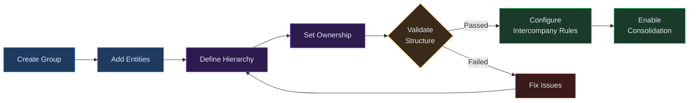
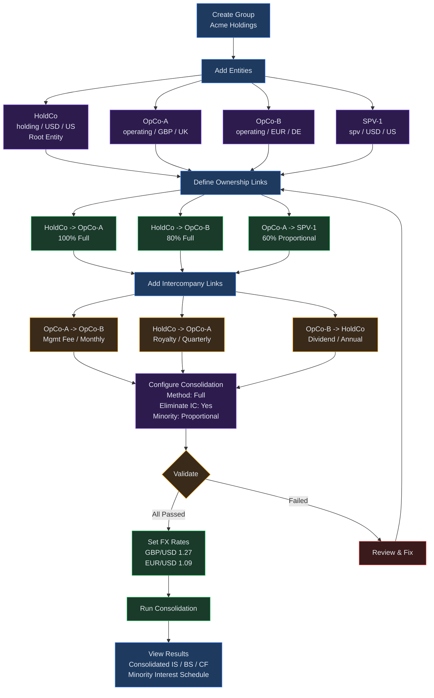

# Chapter 9: Org Structures

## Overview

The Org Structures module manages organizational hierarchies for multi-entity
financial consolidation. It provides the structural backbone that connects
individual entity baselines into a single consolidated group, defining who owns
whom, at what percentage, and how intercompany transactions should be eliminated
during consolidation.

A typical corporate group contains a holding company at the top, one or more
operating subsidiaries beneath it, and potentially special-purpose vehicles,
joint ventures, associates, or branch offices. Org Structures lets you model
this tree of relationships, assign ownership percentages, configure
intercompany links, and then trigger a consolidated run that rolls every
entity's financial statements into group-level results.

The module is used in two primary contexts:

- **Standalone hierarchy management** -- accessed from the Org Structures list
  page where you create groups, add entities, and define relationships.
- **AFS Consolidation** -- the hierarchy defined here feeds directly into the
  AFS Consolidation and Output workflow described in Chapter 8.

---

## Process Flow

1. **Create Group** -- name the structure and set a reporting currency.
2. **Add Entities** -- register each legal entity with its currency, country,
   entity type, and tax details.
3. **Define Hierarchy** -- mark one entity as root and link parents to children.
4. **Set Ownership** -- specify ownership percentages, voting percentages,
   consolidation methods, and effective dates.
5. **Enable Consolidation** -- configure settings, add intercompany rules, and
   trigger a consolidated run.

---

## Key Concepts

| Concept | Definition |
|---|---|
| **Organizational Group** | A named container holding all entities in a consolidated group. Has a reporting currency and status (draft, active, or archived). |
| **Entity** | A legal or operational unit. Types: `holding`, `operating`, `spv`, `jv`, `associate`, `branch`. Tracks currency, country, tax jurisdiction, tax rate, and withholding tax rate. |
| **Root Entity** | The ultimate parent at the top of the hierarchy. Exactly one per group. |
| **Parent-Subsidiary Relationship** | An ownership link from parent to child carrying an ownership percentage and optional voting percentage. |
| **Ownership Percentage** | The share (1--100%) a parent holds in a child. Total across all parents for one child cannot exceed 100%. |
| **Consolidation Method** | How a subsidiary's financials are combined: **Full** (line-by-line), **Proportional** (owner's share), **Equity Method** (single-line investment), or `not_consolidated`. |
| **Intercompany Link** | A transaction flow between two group entities (management fees, royalties, loans, trade, or dividends). Eliminated during consolidation. |
| **Consolidation Perimeter** | The set of active entities with linked baselines included in a consolidated run. |
| **Minority Interest** | The portion of subsidiary equity not owned by the parent. Treatment: `proportional` or `full_goodwill`. |

---

## Step-by-Step Guide

### 1. Creating an Organizational Group

1. Navigate to **Org Structures** from the sidebar.
2. Click **Create New** in the top-right corner.
3. Enter a **Group name** (for example, "Acme Holdings Group").
4. Set the **Reporting currency** using a three-letter ISO code (defaults to
   USD). All entity results are translated into this currency during
   consolidation.
5. Click **Create**. You are taken to the group detail page.

The group is created in `draft` status. Change it to `active` or `archived`
later from the detail page.

### 2. Adding Entities

From the group detail page, open the **Entities** tab.

1. Click **Add Entity**.
2. Fill in the required fields:
   - **Name** -- the legal or display name.
   - **Entity type** -- `holding`, `operating`, `spv`, `jv`, `associate`, or
     `branch`.
   - **Currency** -- functional currency (three-letter ISO code).
   - **Country** -- country of incorporation (two-letter ISO code).
3. Optionally provide tax jurisdiction, corporate tax rate (0--1), withholding
   tax rate, and a **Baseline** link to an existing model.
4. Check **Is root** for the single ultimate parent entity.
5. Click **Save**.

Repeat for every entity. Entities default to `active` status. Mark an entity as
`dormant` or `disposed` to exclude it from consolidation runs.

### 3. Defining Parent-Subsidiary Relationships

1. From the group detail page, create an ownership record by selecting a
   **Parent entity** and a **Child entity**.
2. Parent and child must differ -- self-ownership is not permitted.
3. Each record appears automatically in the hierarchy tree on the **Hierarchy**
   tab.

The system builds the tree from the root entity downward. If no entity is
flagged as root, it infers roots as entities that are not children of any other.

### 4. Setting Ownership Percentages

Each ownership link carries these fields:

| Field | Description | Default |
|---|---|---|
| Ownership % | Economic interest the parent holds (1--100) | 100 |
| Voting % | Voting interest, if different from ownership | Same as ownership |
| Consolidation method | Full, proportional, equity method, or not consolidated | Full |
| Effective date | Date from which ownership applies (YYYY-MM-DD) | None |

Total ownership for any child cannot exceed 100%. Attempting to exceed this
triggers an error. If a link for the same parent-child pair already exists, the
new values overwrite the previous record.

### 5. Configuring Intercompany Rules

Open the **Intercompany** tab on the group detail page.

1. Click **Add Intercompany Link**.
2. Select **From entity** and **To entity**.
3. Choose a **Link type**: `management_fee`, `royalty`, `loan`, `trade`, or
   `dividend`.
4. Set the **Amount or rate** and **Frequency** (`monthly`, `quarterly`,
   `annual`, or `one_time`).
5. Toggle **Withholding tax applicable** if the flow is subject to withholding.
6. Add an optional **Description** and **Driver reference**.
7. Click **Save**.

During consolidation, matching receivable/payable and revenue/expense entries
from intercompany links are eliminated so only external transactions remain.

### 6. Viewing the Hierarchy

The **Hierarchy** tab displays the ownership tree as a nested structure. Each
node shows the entity name, type, and ownership percentage. Child entities are
indented below parents with a connecting border line. Entities with no parent
links and no root flag appear labelled as **Unlinked** so you can identify
orphans.

Before consolidation, click **Validate**. The validation engine checks:

- Exactly one root entity exists.
- No child exceeds 100% total ownership.
- All intercompany links reference valid entities.

Results appear as a list of checks marked `passed`, `warning`, or `failed`.

---

## Entity Hierarchy Management Flow

---

## Quick Reference

| Action | Where | Notes |
|---|---|---|
| Create a new group | Org Structures list > Create New | Name and reporting currency |
| Add an entity | Group detail > Entities tab | Type, currency, country, tax rates |
| Mark root entity | Entity form > Is Root checkbox | Exactly one per group |
| Create ownership link | Group detail > Ownership section | Parent + child + percentage |
| Add intercompany link | Group detail > Intercompany tab | From/to + type + amount |
| Validate structure | Group detail > Validate button | Root, ownership, link checks |
| Configure consolidation | Consolidation Settings tab | Method, elimination, minority |
| Run consolidation | Run tab > Run Consolidation | Requires active entities with baselines |

---

## Troubleshooting

**Circular ownership detected**
The hierarchy builder uses cycle detection. If an entity disappears from the
tree, check for circular chains (A owns B, B owns C, C owns A). Restructure so
ownership flows in one direction from root to leaves.

**Missing entity in consolidation**
Only entities with `active` status and an assigned baseline are included. Verify
the entity is not `dormant` or `disposed`, and confirm a baseline ID is linked.

**Ownership percentages do not sum correctly**
When a subsidiary has multiple parents, total ownership cannot exceed 100%.
Review existing links for the child entity. Minority interests are calculated
as 100% minus total parent ownership.

**Hierarchy not rendering**
If the Hierarchy tab shows "No hierarchy," confirm entities exist with ownership
links. If links are missing, create them. The system infers roots from entities
that are not children of any other entity. Try refreshing the page.

**Validation fails with "No root entity"**
Exactly one entity must have the **Is Root** flag. Open the Entities tab and
ensure one -- and only one -- entity is marked as root.

**Intercompany link references missing entity**
This warning appears when an intercompany link references an entity ID that no
longer exists in the group. Delete the orphaned link and recreate it with valid
entity references.

---

## Related Chapters

- [Chapter 06: AFS Module](06-afs-module.md) -- setting up annual financial
  statements that feed into the consolidation pipeline.
- [Chapter 08: AFS Consolidation and Output](08-afs-consolidation-and-output.md)
  -- running consolidated outputs and generating PDF/DOCX/iXBRL reports.
- [Chapter 20: Entity Comparison](20-entity-comparison.md) -- comparing
  financial results across entities within a group.
