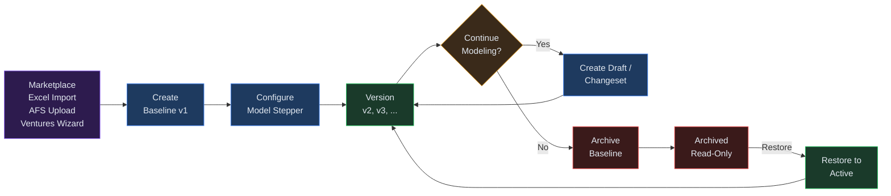
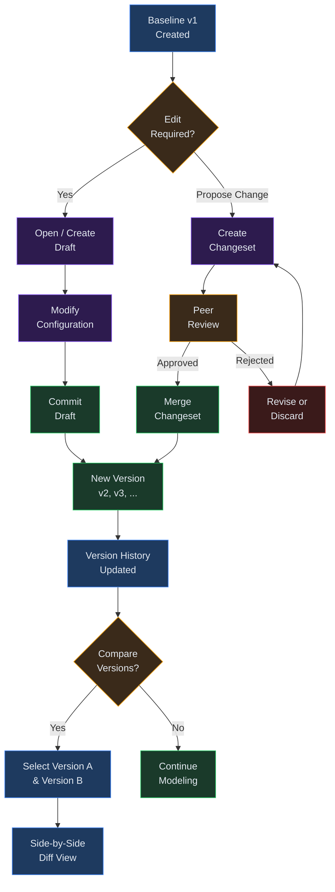

# Chapter 10 — Baselines

## Overview

A **baseline** is the immutable master record at the foundation of every financial model
in Virtual Analyst. It stores a complete snapshot of your model configuration — company
metadata, revenue streams, cost assumptions, funding terms, driver distributions, and
correlation matrices — under a single identifier (e.g. `bl_a7c3e9f01b24`).

Every draft you create, every run you execute, and every changeset you merge traces back
to a baseline. Because baselines are versioned (v1, v2, v3, ...), you always have a
clear audit trail of how your model evolved over time, and you can compare any two
versions side by side to see exactly what changed.

Baselines carry one of two statuses:

| Status       | Meaning                                                         |
|--------------|-----------------------------------------------------------------|
| **Active**   | The current working version. Only one baseline is active at a time per tenant. |
| **Archived** | Retired from active use but preserved for historical reference. |

---

## Process Flow

The lifecycle of a baseline follows four stages:



1. **Create** — A new baseline is generated via one of four creation paths (see below).
   It is assigned a unique ID and starts at version v1.
2. **Configure** — The 7-step Model Stepper guides you through completing the model
   configuration: company details, historical data, assumptions, correlations, and more.
3. **Version** — Each time a draft is committed or a changeset is merged back into the
   baseline, a new version is created automatically (v2, v3, ...). The latest version
   becomes the active one.
4. **Archive** — When a baseline is no longer needed for active modeling, you archive it.
   It remains accessible for reference but no longer appears as the active baseline.

---

## Key Concepts

**Baseline ID** — A system-generated identifier in the format `bl_<12-char-hex>`
(e.g. `bl_a7c3e9f01b24`). This ID is permanent and never changes across versions.

**Version** — A sequential label (v1, v2, v3, ...) representing a point-in-time snapshot
of the model configuration. Version v1 is created at baseline creation. Subsequent
versions are created when drafts are committed or changesets are merged.

**Configuration** — The complete model definition stored inside a baseline. This includes
entity metadata, revenue streams (with business lines, markets, launch months, and ramp
curves), cost assumptions, funding structures, driver distributions, and correlation
matrices.

**Model Stepper** — A 7-step progress indicator displayed on the baseline detail page.
The steps are:

| Step          | Purpose                                            |
|---------------|----------------------------------------------------|
| Start         | Baseline created, initial entry point              |
| Company       | Entity name and company metadata                   |
| Historical    | Historical financial data and revenue streams      |
| Assumptions   | Revenue assumptions, cost drivers, funding terms   |
| Correlations  | Driver correlation matrix                          |
| Run           | Execute the model engine                           |
| Review        | Inspect outputs, statements, and KPIs              |

Each step shows one of four states: **done** (green check), **current** (blue dot),
**pending** (numbered, grey), or **locked** (lock icon, inaccessible until prior steps
are completed).

**Active vs. Archived** — Only one baseline can be active per tenant at any given time.
When you create or restore a baseline, any previously active baseline is automatically
deactivated. Archived baselines are read-only and preserved for audit purposes.

---

## Step-by-Step Guide

### 1. Creating a Baseline

There are four paths to create a new baseline. Each produces an identical baseline record
with a v1 configuration — only the source of the initial data differs.

**Path A — From the Marketplace**
Navigate to the Marketplace, select a template, and click "Use template." The template's
pre-built configuration becomes the v1 of your new baseline. This is the fastest way to
get started with industry-standard assumptions. See [Chapter 03: Marketplace](03-marketplace.md).

**Path B — Excel Import**
Upload a spreadsheet containing historical financials via the Excel Import page. The
import wizard maps your columns to model fields and generates a baseline configuration
from the extracted data. See [Chapter 04: Data Import](04-data-import.md).

**Path C — AFS Upload**
Upload audited financial statements through the AFS module. The system parses the
statements and populates a baseline with the extracted financial data.

**Path D — Ventures Wizard**
Use the ventures creation wizard to build a baseline from scratch by entering company
details, revenue streams, and assumptions step by step.

After creation through any path, the system:
- Assigns a unique baseline ID (e.g. `bl_a7c3e9f01b24`)
- Sets the initial version to v1
- Marks the baseline as active (deactivating any previously active baseline)
- Records an audit event for the creation

### 2. Viewing Baseline Configuration

From the **Baselines** list page, click any baseline row to open its detail page. The
detail page displays:

- **Model Stepper** — A visual progress bar showing which configuration steps are
  complete, in progress, or still pending.
- **Funding panel** — A summary of funding terms (equity, debt, grants) if funding
  assumptions are present in the configuration.
- **Revenue Streams table** — Visible when revenue streams include business line data.
  Shows each stream's label, type, business line, market, launch month, ramp-up period,
  and ramp curve.
- **Driver Correlations** — The correlation matrix editor, displayed when two or more
  driver distributions are defined.
- **Configuration Viewer** — A collapsible JSON viewer showing the full model
  configuration for inspection and debugging.
- **History timeline** — An audit log of all actions taken on this baseline.
- **Comments** — A threaded comment section for team discussion about the baseline.

From the detail page, you can also:
- Click **Edit Configuration** to open or create a draft for modifying the baseline.
- Click **Run model** to execute the financial model against this configuration.
- Click **Save as Template** to publish the baseline's configuration to the Marketplace
  as a reusable template.

### 3. Understanding Version History

The **Version History** panel appears on the baseline detail page whenever a baseline has
more than one version. It lists every version in reverse chronological order, showing:

- The version label (e.g. v1, v2, v3)
- Whether the version is the currently active one (marked with "active")
- The creation date



**Comparing versions:** Select two versions from the dropdown menus (Version A and
Version B) and click **Compare versions**. The system fetches both configurations and
displays a side-by-side diff table highlighting every key that differs between the two
versions. Values from Version A appear in red; values from Version B appear in green.

New versions are created automatically in two situations:
1. **Draft commit** — When you commit a draft session, the modified configuration is
   saved as a new version of the parent baseline. See [Chapter 11: Drafts](11-drafts.md).
2. **Changeset merge** — When a changeset is approved and merged, the resulting
   configuration becomes a new baseline version. See [Chapter 13: Changesets](13-changesets.md).

### 4. Searching and Filtering

The Baselines list page provides a search toolbar at the top. Type a baseline ID (full
or partial) into the search field to filter the displayed list in real time. The search
is case-insensitive and matches against the baseline ID.

Results are paginated at 20 baselines per page. Use the pagination controls at the
bottom of the list to navigate between pages. Each row shows:

- Baseline ID
- Status (Active or the stored status value)
- Current version number
- Creation date

If no baselines exist yet, the page displays an empty state with a link to the
Marketplace to help you create your first baseline.

### 5. Archiving a Baseline

To archive a baseline, change its status from "active" to "archived." Archiving is
appropriate when:

- The model has been superseded by a newer baseline
- The financial period the model covers has concluded
- You want to preserve the baseline for audit purposes without it appearing as active

Archiving does not delete any data. All versions, configurations, and audit history
remain accessible. You can restore an archived baseline to active status at any time,
which will deactivate the current active baseline.

**Important:** You cannot archive a baseline that has active (uncommitted) drafts. Commit
or discard all open drafts before archiving.

---

## Baseline Lifecycle Flow

```
 Marketplace ──┐
 Excel Import ─┤
 AFS Upload ───┼──> BASELINE CREATED (v1)
 Ventures ─────┘           |
                           v
                   Model Stepper Config
                      |            |
                      v            v
                 Create Draft   Run Model --> View Results
                      |
                      v
                 Edit Config
                      |
                      v
                 Commit Draft
                      |
                      v
                 NEW VERSION (v2, v3, ...)
                      |
            +---------+---------+
            |                   |
            v                   v
      Create Changeset    Create More Drafts
            |                   |
            v                   |
      Review & Approve          |
            |                   |
            v                   |
      Merge Changeset <---------+
            |
            v
      New Version Created
            |
            v
      Archive Baseline
       |          |
       v          v
   Archived    Restore to
   (read-only) Active
```

---

## Quick Reference

| Task                        | How                                                              |
|-----------------------------|------------------------------------------------------------------|
| Create a baseline           | Marketplace template, Excel import, AFS upload, or Ventures wizard |
| View configuration          | Baselines list > click baseline row > detail page                |
| Check model progress        | Review the Model Stepper on the detail page                      |
| Edit configuration          | Click "Edit Configuration" to open/create a draft                |
| Compare two versions        | Version History panel > select Version A and B > Compare         |
| Run the model               | Click "Run model" on the detail page                             |
| Save as marketplace template| Click "Save as Template" and provide a name and industry tag     |
| Archive a baseline          | Change status to "archived" (commit all drafts first)            |

---

## Page Help

Every page in Virtual Analyst includes a floating **Instructions** button positioned in the bottom-right corner of the screen. On the Baselines page, clicking this button opens a help drawer that provides:

- Guidance on searching, filtering, and drilling into baselines.
- Step-by-step instructions for creating drafts, running models, and comparing baseline versions.
- An explanation of the model stepper and baseline lifecycle (active, archived, locked).
- Prerequisites and links to related chapters.

The help drawer can be dismissed by clicking outside it or pressing the close button. It is available on every page, so you can access context-sensitive guidance wherever you are in the platform.

---

## Troubleshooting

**Baseline is locked / cannot edit**
Another user (or you, in a different session) has an active draft against this baseline.
Only one active draft per baseline is permitted at a time. Coordinate with your team to
commit or discard the open draft before creating a new one.

**Version conflict after editing**
If two users attempt concurrent edits, the second commit may encounter a conflict. Refresh
the baseline detail page to load the latest version, then create a new draft from the
updated baseline. Your changes will need to be re-applied to the current version.

**Missing configuration fields or incomplete Model Stepper**
This typically occurs when a baseline was created via import and the source data did not
map to all required fields. Open the draft editor and complete the missing steps in the
Model Stepper. The most common gaps are company metadata (Company step) and driver
correlations (Correlations step).

**Cannot archive baseline — active drafts exist**
All open drafts must be committed or discarded before a baseline can be archived. Navigate
to the Drafts page, filter by this baseline's ID, and resolve each open draft session.

**Baseline not found**
If the baseline detail page shows "Baseline not found," the baseline may have been
archived or the ID may be incorrect. Check the baselines list for the correct ID, and
note that only the active version is returned by default on the detail page.

**"HTML content not allowed" error on creation**
The baseline configuration payload is validated to reject any HTML tags for security
purposes. If you receive this error during import or API-based creation, inspect your
source data for stray HTML markup and remove it before retrying.

---

## Related Chapters

- [Chapter 03: Marketplace](03-marketplace.md) — Browse and apply templates to create baselines
- [Chapter 04: Data Import](04-data-import.md) — Import Excel data to create baselines
- [Chapter 11: Drafts](11-drafts.md) — Create drafts to modify baseline configurations
- [Chapter 13: Changesets](13-changesets.md) — Merge approved changes into new baseline versions
