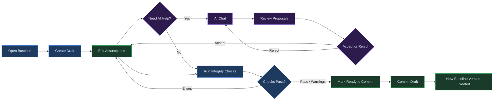
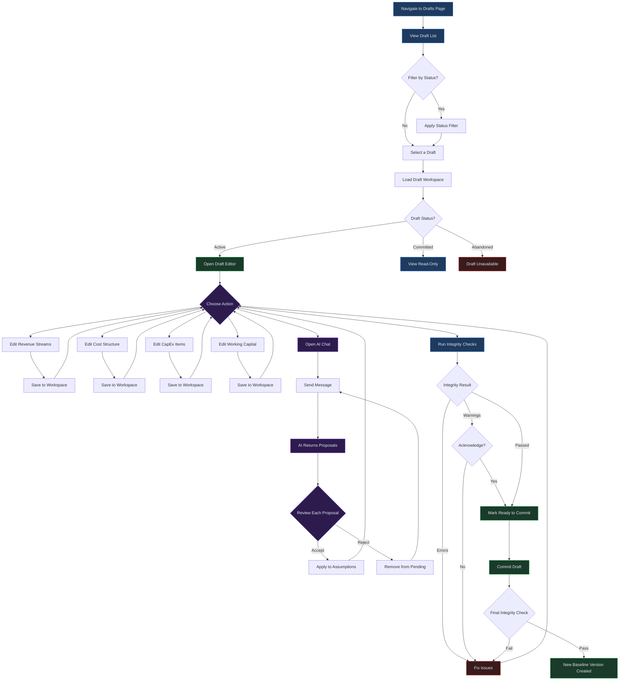

# Drafts

## Overview

Drafts are editable working copies of baselines where you adjust financial assumptions before running analysis. While baselines are immutable versioned records, drafts give you a sandbox to modify revenue streams, cost structures, capital expenditures, and other model inputs without affecting the underlying data. When you are satisfied with your changes, you commit the draft to create a new baseline version.

Every draft is linked to a workspace -- a JSON document that holds your current assumptions, driver blueprints, distributions, evidence, chat history, and pending proposals. The workspace persists across sessions, so you can leave a draft and return to it later without losing progress.

**Prerequisites:** At least one baseline must exist before you can create a draft. See [Chapter 10: Baselines](10-baselines.md) for instructions on creating your first baseline.

> **Instructions Button:** Every page in the application features a floating **Instructions** button in the bottom-right corner. Click it to open a help drawer showing step-by-step guidance for the current page, prerequisites, and links to related sections.

---

## Process Flow

The diagram below illustrates the end-to-end lifecycle of a draft, from creation through to a committed baseline version:

---

## Key Concepts

| Term | Definition |
|------|------------|
| **Draft** | A mutable working copy of a baseline. Drafts have a status lifecycle: active, ready to commit, committed, or abandoned. Only active drafts can be edited. |
| **Workspace** | The underlying data store for a draft. Contains assumptions, driver blueprints, distributions, scenarios, evidence, chat history, and pending proposals. |
| **Assumption** | A configurable model input such as pricing, volume growth, cost rates, or working capital days. Assumptions are organized into categories within the workspace. |
| **Revenue Stream** | A distinct source of income in the model. Each stream has a type (e.g., unit sale, subscription, recurring) and contains drivers for volume, pricing, and direct costs. |
| **Cost Item** | An expense entry within the cost structure. Costs are classified as either variable (scaling with revenue) or fixed (independent of volume). |
| **CapEx** | Capital expenditure assumptions that define planned asset purchases, depreciation methods, and investment timing. |
| **Proposal** | An AI-generated suggestion to change an assumption value. Each proposal includes a target path, proposed value, supporting evidence, and a confidence rating (high, medium, or low). |
| **Integrity Check** | A validation pass that examines the workspace for errors (such as circular dependencies in the driver graph) and warnings (such as missing revenue streams) before commit. |
| **Commit** | The action of converting a draft workspace into a new baseline version. Once committed, the draft becomes read-only and the new baseline is marked as active. |

---

## Step-by-Step Guide

### 1. Creating a Draft from a Baseline

To begin editing assumptions, create a draft from an existing baseline:

1. Navigate to the **Baselines** page and locate the baseline you want to work from.
2. Click **Create Draft** on the baseline detail view. You can also navigate to the **Drafts** page and click **New Draft**, then select the parent baseline and version.
3. The platform creates a new draft session with status **active** and initializes an empty workspace linked to the parent baseline.
4. You are redirected to the draft editor, where the workspace is ready for editing.

Each draft receives a unique session ID (e.g., `ds_a1b2c3d4e5f6`) and records the parent baseline ID and version for traceability.

> **Note:** You can have multiple active drafts at the same time, each based on the same or different baselines. This is useful when exploring alternative modeling approaches in parallel.

### 2. Editing Revenue Assumptions

The revenue section of the workspace organizes income into individual streams. Each stream includes drivers for volume, pricing, and direct costs.

1. Open your active draft from the **Drafts** page.
2. Navigate to the **Revenue Streams** section of the workspace editor.
3. To add a new stream, click **Add Revenue Stream** and provide:
   - **Label** -- A descriptive name (e.g., "SaaS Subscriptions", "Professional Services").
   - **Stream type** -- Select from unit sale, subscription, recurring, or other available types.
   - **Volume drivers** -- Define how units are projected over the forecast horizon.
   - **Pricing drivers** -- Set unit prices, escalation rates, or tiered pricing structures.
   - **Direct costs** -- Attach cost-of-goods-sold or direct cost items to this stream.
4. To edit an existing stream, click its row to expand the detail view and modify any driver values.
5. Changes are saved to the workspace automatically as you edit.

### 3. Editing Cost and CapEx Assumptions

Cost and capital expenditure assumptions define the expense side of your model.

**Cost structure:**

1. In the draft editor, navigate to the **Cost Structure** section.
2. Costs are divided into two categories:
   - **Variable costs** -- Expenses that scale with revenue or volume (e.g., raw materials, sales commissions). Each variable cost entry links to a driver that defines the scaling relationship.
   - **Fixed costs** -- Expenses that remain constant regardless of output (e.g., rent, salaries, insurance).
3. Click **Add Cost Item** under the appropriate category and fill in the label, amount or rate, and any driver references.

**Capital expenditures:**

1. Navigate to the **CapEx** section.
2. Define planned asset purchases with their cost, timing, useful life, and depreciation method. The default depreciation method is straight-line, but you can adjust this per asset.
3. CapEx items feed into the driver blueprint, which calculates depreciation charges automatically.

**Working capital:**

1. Navigate to the **Working Capital** section.
2. Set the following parameters:
   - **Accounts receivable days** -- Average collection period.
   - **Accounts payable days** -- Average payment period.
   - **Inventory days** -- Average days inventory is held.
   - **Minimum cash** -- The floor cash balance the model should maintain.

### 4. Using AI Chat for Modeling Help

Each active draft includes a built-in AI chat assistant that understands your current workspace context. The assistant can suggest assumption values, explain modeling concepts, and generate proposals.

1. Open the **AI Chat** panel in the draft editor.
2. Type a question or request. Examples:
   - "What is a reasonable gross margin for a B2B SaaS company?"
   - "Suggest pricing assumptions for my subscription revenue stream."
   - "Help me set working capital days for a manufacturing business."
3. The AI reviews your current assumptions, driver blueprint, and any evidence you have attached, then responds with commentary and, where applicable, structured proposals.
4. Each proposal includes:
   - **Path** -- The specific assumption field the change targets (e.g., `revenue_streams[0].drivers.pricing`).
   - **Value** -- The suggested value.
   - **Evidence** -- The source or reasoning behind the suggestion, such as an industry benchmark or user-provided data.
   - **Confidence** -- Rated as high, medium, or low. Low-confidence proposals are flagged as placeholders requiring your verification.
5. Review each proposal and click **Accept** to apply it to your workspace or **Reject** to discard it.

> **Tip:** The AI chat maintains a rolling history of your last ten messages, so you can have a back-and-forth conversation to refine assumptions iteratively. Chat is only available while the draft status is active.

> **Connection resilience:** The AI Chat panel includes automatic retry logic for transient connection failures. If the backend AI model is still loading (cold start), the chat will automatically retry the request once. Should the retry also fail, you will see a clear message: "Chat request timed out -- the AI model may be loading. Please try again in a moment." rather than a generic connection error. Simply wait a few seconds and resend your message.

### 5. Creating Proposals for Team Review

When working collaboratively, you can create proposals that other team members can review before changes are applied:

1. From the AI Chat panel, any generated proposals are added to the **Pending Proposals** list in your workspace.
2. Share the draft with your team by providing the draft session ID or navigating to the draft from the shared Drafts list.
3. Reviewers can inspect each pending proposal, view its evidence and confidence rating, and accept or reject it.
4. Accepted proposals are immediately applied to the workspace assumptions. Rejected proposals are removed from the pending list.

Proposals enforce safety boundaries: values outside reasonable financial bounds are filtered, and paths are restricted to valid assumption categories (revenue streams, cost structure, working capital, CapEx, and funding).

> **Technical note:** Comments and discussion threads on drafts use the entity type `draft_session` internally. This is the identifier used when posting comments, filtering the activity feed, or querying comment history for a draft. See [Chapter 25: Collaboration](25-collaboration.md) for the full list of supported entity types.

### 6. Running Integrity Checks

Before committing a draft, run integrity checks to validate your workspace:

1. Click **Run Integrity Checks** in the draft editor toolbar. The system performs the following validations:
   - **Graph acyclicity** -- Confirms that the driver blueprint contains no circular dependencies. Cycles would cause infinite calculation loops at run time.
   - **Revenue stream presence** -- Warns if no revenue streams are defined. A model without revenue inputs will produce empty financial statements.
   - **Blueprint validity** -- Verifies that the driver blueprint structure is parseable and well-formed.
2. Each check returns a severity level:
   - **Error** -- A blocking issue that must be resolved before you can commit. Fix the underlying problem and re-run checks.
   - **Warning** -- A non-blocking issue. You can commit with warnings if you acknowledge them, but review the warning to confirm it is acceptable.
   - **Info** -- A confirmation that the check passed successfully.
3. The integrity report is displayed in the editor. Address any errors, then re-run checks until the report is clear.

### 7. Committing a Draft

Once integrity checks pass, commit the draft to create a new baseline version:

1. Change the draft status to **Ready to Commit** by clicking the **Mark Ready** button. This transitions the draft from active status and sends a notification to your team.
2. Click **Commit Draft** to finalize. The system performs a final integrity check at commit time.
3. If there are errors, the commit is blocked. Fix the issues and try again.
4. If there are warnings only, you will be prompted to acknowledge them. Check the acknowledgment box and confirm.
5. On successful commit:
   - A new baseline is created with a unique ID and version `v1`.
   - The workspace is compiled into a validated `model_config` artifact.
   - The draft status changes to **committed** and becomes read-only.
   - The new baseline is marked as the active baseline for your tenant.
   - An audit trail entry is recorded with the commit details.

> **Note:** If you decide not to proceed with a draft, you can abandon it instead. Abandoning sets the draft status to **abandoned**, which is a soft delete. Abandoned drafts cannot be edited or committed, but they remain in the system for audit purposes.

---

## Draft Editing Workflow

The following diagram shows the detailed interaction flow across all draft editing activities, including branching for AI chat, proposals, validation, and status transitions:

---

## Quick Reference

| Action | How |
|--------|-----|
| Create a new draft | Baselines page > select baseline > **Create Draft**, or Drafts page > **New Draft** |
| View all drafts | Navigate to **Drafts** in the sidebar. Use the status filter to narrow the list. |
| Edit revenue assumptions | Open an active draft > **Revenue Streams** section > add or modify stream entries |
| Edit cost assumptions | Open an active draft > **Cost Structure** section > add variable or fixed cost items |
| Ask AI for help | Open an active draft > **AI Chat** panel > type your question |
| Accept an AI proposal | AI Chat panel > Pending Proposals > click **Accept** on the proposal |
| Run integrity checks | Draft editor toolbar > **Run Integrity Checks** > review the report |
| Commit a draft | Mark draft as **Ready to Commit** > click **Commit Draft** > acknowledge any warnings |
| Abandon a draft | Draft detail page > **Abandon Draft** (sets status to abandoned, cannot be undone) |

---

## Page Help

Every page in Virtual Analyst includes a floating **Instructions** button positioned in the bottom-right corner of the screen. On the Drafts pages, clicking this button opens a help drawer that provides:

- Step-by-step guidance for creating, editing, and committing drafts.
- An explanation of the draft lifecycle (active, ready to commit, committed, abandoned).
- Tips for using the AI Chat panel, including how to review and accept proposals.
- Prerequisites such as having an existing baseline before creating a draft.
- Quick links to related chapters on baselines, scenarios, and runs.

The help drawer can be dismissed by clicking outside it or pressing the close button. It is available on every page, so you can access context-sensitive guidance wherever you are in the platform.

---

## Troubleshooting

| Symptom | Cause | Resolution |
|---------|-------|------------|
| Draft validation fails with errors | The driver blueprint contains circular dependencies, or required fields are missing. | Open the integrity report, identify the failing check (e.g., `IC_GRAPH_ACYCLIC`), and resolve the cycle or missing data. Re-run checks. |
| AI chat not responding | The LLM service may be temporarily unavailable, or your tenant has exceeded its quota. | The chat panel automatically retries once on transient failures. If the retry also fails, you will see a message: "Chat request timed out -- the AI model may be loading. Please try again in a moment." Wait a few seconds and resend your message. If you receive a quota error (HTTP 429), contact your administrator to review usage limits. |
| Commit is blocked with "must be ready_to_commit" | The draft status is still active. You must transition it before committing. | Click **Mark Ready** to change the status to ready to commit, then retry the commit action. |
| Commit conflicts or produces unexpected baseline | Another draft was committed first, making a different baseline active. | Refresh the Baselines page to see the current active baseline. Create a new draft from the latest version if needed. |
| Proposal rejected or filtered out | The proposal path targeted an invalid assumption category, or the value was outside reasonable bounds. | Review the AI response commentary for details. Rephrase your request to the AI with more specific guidance, or set the value manually. |
| Cannot edit draft | The draft status is committed or abandoned. Only active drafts are editable. | Create a new draft from the latest baseline version. Committed and abandoned drafts are read-only. |
| "Draft workspace not found" error | The workspace storage artifact is missing or corrupted. | This is rare. Try reloading the page. If the error persists, create a new draft from the same baseline. |
| Warnings block the commit | Integrity checks returned warnings and you did not acknowledge them. | Review each warning in the integrity report. If the warnings are acceptable (e.g., missing revenue streams in a cost-only model), check the acknowledgment box and commit again. |

---

## Related Chapters

- [Chapter 10: Baselines](10-baselines.md) -- Creating and managing baselines, the immutable foundation of every model.
- [Chapter 12: Scenarios](12-scenarios.md) -- Defining alternative assumption sets to compare outcomes across cases.
- [Chapter 14: Runs](14-runs.md) -- Executing model runs against a draft to generate financial projections and simulations.
