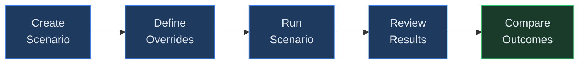

# Scenarios

## Overview

Scenarios let you explore "what if" questions by creating named sets of assumption overrides and running them against a baseline. Instead of editing your baseline directly, you define a scenario that modifies specific variables -- revenue growth rate, cost ratios, headcount assumptions, or any other configurable input -- and then execute the model with those overrides applied. Virtual Analyst supports running multiple scenarios against the same baseline and presenting the results in a side-by-side comparison table, making it straightforward to evaluate best-case, worst-case, and moderate outcomes in a single view.

Each scenario is tied to a specific baseline and baseline version. When you create a scenario, the system records which version of the baseline it targets, ensuring that comparison results are always consistent even if the baseline is updated later. This version pinning means you can safely update a baseline without invalidating the scenarios already built against a prior version.

Scenarios are commonly used during planning cycles to stress-test projections, evaluate strategic alternatives, and communicate the range of possible financial outcomes to stakeholders. A typical workflow involves creating three to five scenarios (e.g., optimistic, base, conservative, downside) and comparing the resulting KPIs to understand how sensitive the model is to key assumptions.

Unlike changesets, which permanently alter a baseline's structure, scenarios are non-destructive. The baseline remains unchanged; overrides are applied only at execution time. This means you can freely create, modify, and discard scenarios without affecting the underlying model. Multiple team members can build their own scenario variants against the same baseline and compare results independently.

Common use cases for scenarios include:

- **Board presentations** -- Show best, base, and worst-case projections to communicate the range of possible outcomes.
- **Budget negotiations** -- Model the financial impact of different cost and revenue assumptions before committing to a plan.
- **Risk assessment** -- Stress-test the model under adverse conditions (e.g., revenue decline, cost inflation, delayed market entry).
- **Strategic planning** -- Compare outcomes of alternative growth strategies, pricing changes, or expansion plans.
- **Sensitivity exploration** -- Isolate individual variables to understand which assumptions drive the most variance in outcomes.

## Process Flow

## Key Concepts

| Concept | Description |
|---------|-------------|
| **Scenario** | A named collection of assumption overrides tied to a specific baseline. Each scenario has a label, an optional description, and one or more overrides that modify the baseline's inputs. |
| **Override** | A single variable adjustment within a scenario. An override specifies a reference path (`ref`), the field to change (typically `value`), and the new numeric value to apply. |
| **Base Case** | The unmodified baseline run with no overrides applied. The base case is always included as the first row in a comparison so you can see the effect of each scenario relative to the original assumptions. |
| **Best Case** | A scenario where assumptions are set to optimistic values -- for example, higher revenue growth, lower churn, or reduced cost ratios. This represents the upper bound of expected outcomes. |
| **Worst Case** | A scenario where assumptions are set to pessimistic values -- lower growth, higher costs, or unfavorable market conditions. This represents the lower bound of expected outcomes. |
| **Comparison** | A side-by-side view of KPI results (revenue, EBITDA, net income, free cash flow, margins) across the base case and all selected scenarios, displayed in a single table for easy analysis. |
| **Baseline Version** | The specific version of the baseline that a scenario targets. Version pinning ensures that scenario results remain reproducible even if the baseline is updated after the scenario is created. |
| **Terminal Period** | The final projection period in the model. Comparison KPIs are drawn from the terminal period to show the long-run impact of each scenario's assumptions. |

## Step-by-Step Guide

### 1. Creating a Scenario

Navigate to the Scenarios section for your baseline. The scenarios list displays all scenarios associated with the selected baseline, ordered by creation date (newest first). The list is paginated with up to 50 scenarios per page.

Click **New Scenario** to open the creation form. Provide the following fields:

- **Label** -- A short, descriptive name for the scenario (e.g., "Aggressive Growth", "Recession Case", "Conservative Q3"). If you leave this blank, the system assigns the default label "Unnamed". Labels do not need to be unique, but using distinct names will help you identify scenarios in the comparison view.
- **Description** -- An optional longer explanation of the scenario's purpose and the assumptions it modifies (e.g., "Models a 20% reduction in revenue growth with a 5% increase in operating costs"). This field is free-text and has no character limit.
- **Baseline** -- The baseline this scenario targets. The system records the current baseline version at the time of creation. Only active baselines can be selected.

Click **Create** to save the scenario. A confirmation toast appears, and the new scenario is added to the top of the list. The system assigns a unique scenario ID (prefixed with `sc_`) for internal tracking. You can then proceed to define its overrides.

You can create scenarios at any time after a baseline exists. There is no limit to the number of scenarios you can create for a single baseline, though in practice most analyses use between three and seven scenarios to keep comparisons manageable.

### 2. Defining Variable Overrides

Each override modifies a single assumption in the baseline. An override consists of three fields:

- **ref** -- The reference path identifying which assumption to change. This must exactly match a variable reference in the baseline's configuration (e.g., `revenue_growth_rate`, `cogs_pct`, `headcount_year_1`). Reference paths are case-sensitive.
- **field** -- The property of the assumption to modify, typically `value`. This defaults to `value` if not specified. In most cases you will not need to change this field.
- **value** -- The new numeric value to apply. This replaces the baseline's default for that variable when the scenario is run. Values are stored as floating-point numbers.

You can add multiple overrides to a single scenario. For example, a "Best Case" scenario might include:

| ref | field | value |
|-----|-------|-------|
| `revenue_growth_rate` | value | 0.25 |
| `cogs_pct` | value | 0.30 |
| `churn_rate` | value | 0.02 |

A corresponding "Worst Case" scenario might adjust the same variables in the opposite direction:

| ref | field | value |
|-----|-------|-------|
| `revenue_growth_rate` | value | 0.05 |
| `cogs_pct` | value | 0.55 |
| `churn_rate` | value | 0.10 |

Overrides without a valid `ref` are silently skipped during execution. Non-numeric values are converted to zero. There is no limit to the number of overrides you can attach to a single scenario, but each override should target a distinct variable reference. If you include multiple overrides for the same `ref`, only the last one in the list is applied.

To edit overrides after creation, open the scenario detail view and modify the override list. Add new rows, update existing values, or remove rows you no longer need. Click **Save** to persist your changes.

### 3. Running a Scenario

Scenarios are executed through the Runs system. When creating a new run, select the scenario you want to apply:

1. Navigate to the Runs section and click **New Run**.
2. Select the target **baseline**.
3. In the scenario selector, choose the scenario to apply. The dropdown lists all scenarios associated with the selected baseline. The run will use the scenario's overrides to modify the baseline assumptions before executing the financial engine.
4. Choose the run mode -- **deterministic** for a single-path projection, or **Monte Carlo** for a stochastic simulation with configurable iteration count and seed.
5. Configure any additional options such as valuation parameters (DCF discount rate, terminal growth rate, or comparable multiples).
6. Click **Execute** to start the run.

The engine loads the baseline configuration, applies the scenario's overrides on top of the base assumptions, and generates the resulting financial statements and KPIs. The run record stores the scenario ID so you can trace which scenario produced the results.

You can also run a scenario with inline overrides by providing the overrides directly in the run creation form instead of selecting a saved scenario. This is useful for quick ad-hoc tests where you do not need to persist the scenario for later reuse.

When using Monte Carlo mode with a scenario, the overrides are applied before the simulation begins. Each iteration uses the overridden values as its starting assumptions, with stochastic variation applied on top. This allows you to see both the expected outcome under the scenario and the range of possible outcomes around it.

Once a run completes, you can view its full results -- income statement, balance sheet, cash flow statement, and KPI dashboard -- from the run detail page. The scenario label is displayed alongside the run metadata so you can quickly identify which assumptions produced the output.

Note that running a scenario does not modify the baseline or the scenario itself. The run is an independent execution record. You can run the same scenario multiple times (for example, with different Monte Carlo seeds) and each run is stored separately.

### 4. Comparing Scenario Outcomes

The comparison feature runs the baseline and multiple scenarios in a single operation and returns a side-by-side KPI table. To compare scenarios:

1. Navigate to the **Scenario Comparison** view for your baseline.
2. Select the scenarios you want to compare. You can include up to 10 scenarios in a single comparison. Use the checkboxes next to each scenario in the list to select or deselect them.
3. Click **Compare** to execute.

The system runs the financial engine once for the base case (no overrides) and once for each selected scenario. The results are presented in a comparison table with one row per scenario. The base case always appears as the first row. Each row displays the following terminal-period metrics:

- **Label** -- The scenario name (or "Base" for the unmodified baseline).
- **Revenue** -- Terminal-period revenue, rounded to two decimal places.
- **EBITDA** -- Terminal-period EBITDA, rounded to two decimal places.
- **Net Income** -- Terminal-period net income, rounded to two decimal places.
- **Free Cash Flow (FCF)** -- Terminal-period free cash flow, rounded to two decimal places.
- **Gross Margin %** -- Terminal-period gross margin as a percentage.
- **EBITDA Margin %** -- Terminal-period EBITDA margin as a percentage.

Use this table to identify which assumptions have the greatest impact on financial outcomes and to support decision-making around planning and risk. Large deviations between the best and worst cases highlight assumptions that warrant closer scrutiny or additional sensitivity analysis.

All monetary values in the comparison table are rounded to two decimal places. Margin percentages are displayed as-is from the engine output. The comparison endpoint returns the data in JSON format, which the frontend renders as a formatted table. You can copy the table contents or use the underlying run data for further analysis.

The comparison operation is read-only and does not create new run records. Each time you click Compare, the engine recalculates results from the stored baseline configuration and scenario overrides. This means the comparison always reflects the current state of each scenario's overrides. If you edit a scenario's overrides and re-run the comparison, the updated values are used immediately.

### 5. Managing Scenarios (Edit, Duplicate, Delete)

**Viewing scenario details.** Click any scenario in the list to open its detail view. The detail view shows the scenario's label, description, creation date, baseline ID, baseline version, and the full list of overrides. From this view you can edit, duplicate, or delete the scenario.

**Editing a scenario.** In the detail view, you can modify the label, description, or override list. Changes to the label and description take effect immediately upon saving. Changes to overrides affect future runs only -- existing completed runs are not retroactively recalculated. Click **Save** to persist your changes. If you navigate away without saving, unsaved changes are discarded.

**Duplicating a scenario.** To create a variant of an existing scenario, open the original and use the **Duplicate** action. The system creates a new scenario with the same baseline reference, description, and overrides, and appends "(Copy)" to the label. This is useful when you want to explore a slight variation -- for example, testing the same cost assumptions with a different revenue growth rate -- without modifying the original. Adjust the overrides and rename the scenario to reflect its new purpose.

**Deleting a scenario.** Open the scenario and click **Delete**. A confirmation prompt appears. Once confirmed, the scenario and its overrides are permanently removed from the database. Existing runs that reference the deleted scenario retain their results and can still be viewed, but the scenario can no longer be selected for new runs or comparisons. Deletion is recorded as an audit event for traceability.

**Listing and filtering scenarios.** The scenario list for a baseline supports pagination (up to 50 items per page) and can optionally be filtered by baseline ID. When working with a large number of scenarios across multiple baselines, use the baseline filter to narrow the list to the relevant set. The list is sorted by creation date in descending order so the most recent scenarios appear first.

## Scenario Comparison Workflow (detailed)

The following diagram illustrates the full end-to-end workflow for building a multi-scenario comparison. The first half (blue nodes) covers the preparation phase -- creating scenarios and defining overrides. The second half (green nodes) covers the execution, review, and iteration phase.

```mermaid
flowchart TD
    A["Identify baseline\nfor comparison"]:::blue --> B["Review baseline\nassumptions\nand variables"]:::blue
    B --> C["Create 'Best Case'\nscenario with\ndescriptive label"]:::blue
    C --> D["Define optimistic\noverrides\n(high growth,\nlow costs)"]:::blue
    D --> E["Create 'Moderate'\nscenario\n(optional)"]:::blue
    E --> F["Define moderate\noverrides\n(realistic\nadjustments)"]:::blue
    F --> G["Create 'Worst Case'\nscenario"]:::blue
    G --> H["Define pessimistic\noverrides\n(low growth,\nhigh costs)"]:::blue
    H --> I["Create additional\nscenarios as\nneeded"]:::blue
    I --> J["Review all\nscenarios and\noverride values"]:::blue
    J --> K["Open Scenario\nComparison view"]:::blue
    K --> L["Select baseline\nfrom dropdown"]:::blue
    L --> M["Select scenarios\nto compare\n(max 10)"]:::blue
    M --> N["Click Compare"]:::blue
    N --> O["Engine loads\nbaseline config\nfrom artifact store"]:::blue
    O --> P["Engine runs\nbase case\n(no overrides)"]:::blue
    P --> Q["Engine applies\noverrides for\neach scenario"]:::blue
    Q --> R["Financial statements\ngenerated per\nscenario"]:::green
    R --> S["KPIs calculated\nfor terminal period"]:::green
    S --> T["Results assembled\ninto comparison\ntable"]:::green
    T --> U["Review side-by-side\nKPI metrics"]:::green
    U --> V["Identify highest-\nimpact assumptions"]:::green
    V --> W{"Need to\nrefine?"}:::green
    W -- Yes --> X["Adjust overrides\nor create new\nscenarios"]:::blue
    X --> N
    W -- No --> Y["Export or share\ncomparison results"]:::green

    classDef blue fill:#1e3a5f,stroke:#3b82f6,color:#e2e8f0
    classDef green fill:#1a3a2a,stroke:#22c55e,color:#e2e8f0
```

The iterative loop between the refinement decision and the comparison execution allows you to progressively narrow the analysis. Start with broad scenarios to identify the most impactful variables, then create targeted scenarios that isolate those variables for deeper investigation.

## Best Practices

- **Use descriptive labels.** Name scenarios clearly so that comparison tables are self-explanatory. Include the dimension being tested (e.g., "High Growth / Low Churn" rather than "Scenario A").
- **Keep overrides focused.** Limit each scenario to a small number of related overrides so that you can attribute differences in results to specific assumption changes. A scenario with 20 overrides makes it difficult to determine which variable drove the outcome.
- **Create paired scenarios.** When testing a single assumption, create both an upside and downside scenario that adjust the same variable in opposite directions. This reveals the symmetry (or asymmetry) of the model's response.
- **Version awareness.** Scenarios are pinned to the baseline version at the time of creation. If you update the baseline significantly, consider creating fresh scenarios against the new version rather than reusing old ones.
- **Document your rationale.** Use the description field to record why you chose specific override values. This context is valuable when revisiting scenarios weeks or months later.
- **Limit comparison scope.** Although the system supports up to 10 scenarios per comparison, tables with more than five rows become harder to read. Focus each comparison on a single dimension or question.
- **Combine with sensitivity analysis.** Use scenarios to set broad strategic alternatives, and then run sensitivity analysis within each scenario to understand the range of outcomes for individual variables. This two-tier approach gives you both strategic breadth and analytical depth.
- **Review before sharing.** Before presenting scenario comparisons to stakeholders, review the override values and labels for clarity. Stakeholders will focus on the comparison table, so the labels and values should be self-explanatory without requiring additional context.
- **Start from the base case.** Always include the unmodified base case in your comparison. Without a reference point, it is difficult to assess whether scenario results represent an improvement or a deterioration. The comparison tool includes the base case automatically as the first row.
- **Iterate in stages.** Run an initial comparison with broad scenarios to identify the highest-impact variables. Then create a second round of more targeted scenarios that isolate those variables with finer-grained overrides. This staged approach produces more actionable insights than a single comparison with many variables changing simultaneously.

## Quick Reference

| Action | How |
|--------|-----|
| Open the Scenarios section | Navigate to the baseline, then select the **Scenarios** tab |
| Create a scenario | Click **New Scenario**, enter a label and description, then click **Create** |
| Add an override | In the scenario detail view, add a row with the variable `ref`, `field`, and `value` |
| Edit a scenario | Open the scenario from the list, modify fields or overrides, and click **Save** |
| Duplicate a scenario | Open the scenario and use the **Duplicate** action to create a copy with the same overrides |
| Delete a scenario | Open the scenario, click **Delete**, and confirm the removal |
| Run a single scenario | Create a new run and select the scenario in the scenario selector before executing |
| Compare scenarios | Open the Scenario Comparison view, select up to 10 scenarios, and click **Compare** |

## Troubleshooting

| Symptom | Cause | Resolution |
|---------|-------|------------|
| Override has no effect on results | The `ref` path does not match any variable in the baseline configuration | Verify the override's `ref` value exactly matches a variable reference defined in the baseline. Reference paths are case-sensitive; check for typos, extra spaces, or incorrect casing. |
| Scenario not appearing in comparison results | The scenario was selected but its run did not complete successfully | Ensure each scenario has been executed without errors. Check the Runs section for failed or pending runs associated with the scenario. |
| Duplicate scenario names cause confusion | Multiple scenarios share the same label | Rename scenarios to use unique, descriptive labels (e.g., "Best Case Q3 2026" instead of "Best Case"). Labels do not need to be unique, but distinct names improve clarity. |
| Unexpected results in scenario output | Override values use incorrect units or scale | Verify that override values match the expected format. For example, a 25% growth rate should be entered as `0.25`, not `25`. All values are stored as floating-point numbers. |
| "Baseline not found" error when creating a scenario | The selected baseline has been deactivated or deleted | Select an active baseline. Deactivated baselines cannot be used as the target for new scenarios. |
| "Too many scenarios to compare" error | More than 10 scenarios were selected for comparison | Reduce the selection to 10 or fewer scenarios. Run multiple comparisons if you need to evaluate more than 10 scenarios. |
| Comparison shows stale results | The baseline was updated after the scenarios were created | Scenarios are pinned to a baseline version. Create new scenarios against the updated baseline version to reflect the latest assumptions. |
| "Baseline artifact not found" during comparison | The baseline's model configuration artifact is missing from storage | This indicates a storage issue. Contact your administrator to verify that the baseline's artifact has been correctly persisted. |

## Permissions

Creating, editing, and deleting scenarios requires a write role (`ROLES_CAN_WRITE`). Any user with read access (`ROLES_ANY`) can view existing scenarios, their override lists, and run comparisons. The comparison endpoint is available to all authenticated users with at least read access, since it does not modify data.

Audit events are recorded for the following actions:

- **Scenario created** -- Logged when a new scenario is saved, including the user ID of the creator.
- **Scenario deleted** -- Logged when a scenario is permanently removed, including the user ID of the person who deleted it.

These events are visible to administrators in the audit log and can be used for compliance tracking and change management.

## Related Chapters

- [Chapter 11: Drafts](11-drafts.md)
- [Chapter 13: Changesets](13-changesets.md)
- [Chapter 14: Runs](14-runs.md)
