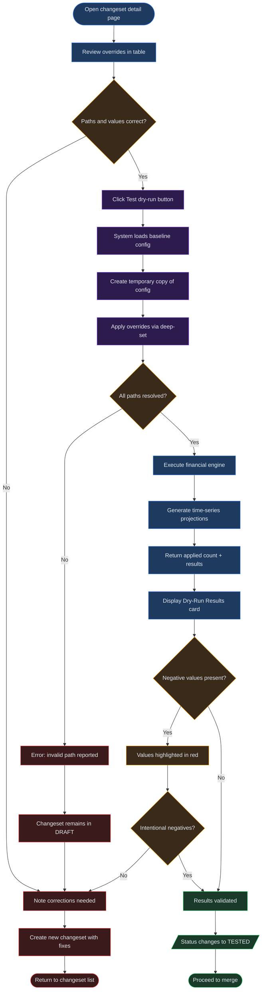
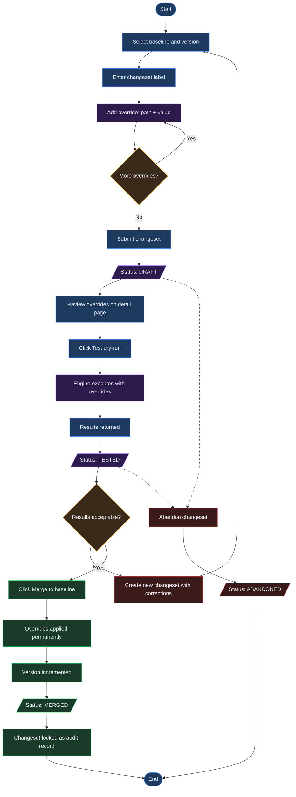

# Chapter 13: Changesets

## Overview

Changesets provide a lightweight mechanism for applying targeted overrides to a baseline without opening a full draft workspace. A changeset is an immutable snapshot of one or more overrides -- specific value changes addressed by dot-separated paths into your baseline configuration. You create a changeset, define the overrides you want to apply, test them with a dry-run to preview the impact on your financial model, and then merge the changeset to produce a new baseline version. This workflow gives you a controlled, auditable way to make precise adjustments while preserving the integrity of your existing baseline.

Changesets are best suited for focused modifications: updating a single growth rate assumption, adjusting a cost line item, or correcting a parameter without rebuilding the entire model. For broader structural changes, consider using a full draft workspace instead (see [Chapter 11: Drafts](11-drafts.md)).

---

## Process Flow

The changeset workflow follows a linear progression:

1. **Create** a new changeset linked to a specific baseline and base version.
2. **Add overrides** that target individual values within the baseline configuration.
3. **Test** the changeset with a dry-run to execute the engine and preview results.
4. **Review** the dry-run output, including the generated time-series data.
5. **Merge** the changeset to apply overrides permanently, producing a new baseline version.

Each step must be completed in order. You cannot merge a changeset that has not been tested, and you cannot modify a changeset after it has been merged.

---

## Key Concepts

| Concept | Definition |
|---|---|
| **Changeset** | An immutable collection of overrides linked to a specific baseline and base version. |
| **Override** | A single targeted change, defined by a dot-separated path and a new value. |
| **Dry-run** | A test execution that applies overrides to a copy of the baseline configuration, runs the financial engine, and returns projected results without modifying the actual baseline. |
| **Merge** | The action of permanently applying overrides to the baseline, generating a new version. |
| **Base version** | The specific version of the baseline (e.g., v1, v2) that the changeset targets. |
| **Dot-path** | A dot-separated string that identifies a specific field within the nested baseline configuration (e.g., `assumptions.revenue_growth_rate`). |

---

## Step-by-Step Guide

### 1. Creating a Changeset

1. Navigate to the **Changesets** page from the main navigation.
2. Click the **New changeset** button in the upper-right corner.
3. In the creation form, fill in the following fields:
   - **Baseline** -- Select the target baseline from the dropdown. This determines which configuration your overrides will apply to.
   - **Base version** -- Enter the version identifier (e.g., `v1`) of the baseline snapshot you are working against.
   - **Label** -- Provide a descriptive label for the changeset (e.g., "Q3 revenue adjustment" or "Fix COGS line item 12").
4. Add at least one override (described in the next section).
5. Submit the form to create the changeset. It will appear in the changesets table with a status of **Draft**.

### 2. Adding Overrides

Each override consists of two fields:

- **Path** -- A dot-separated string pointing to the value you want to change within the baseline configuration.
- **Value** -- The new value to apply at that path.

To add overrides during changeset creation:

1. Enter the path in the **Path** field (e.g., `assumptions.revenue_growth_rate`).
2. Enter the new value in the **Value** field (e.g., `0.07`).
3. Click the **+ Add override** button to append another override row.
4. Repeat for each additional override you need to include.

You can add multiple overrides to a single changeset. Each override targets a different path within the configuration. If two overrides target the same path, the last one defined takes precedence.

### 3. Understanding Override Path Syntax

Override paths use dot-separated notation to address nested fields in the baseline configuration. Array elements are accessed by their zero-based index.

| Path | Target |
|---|---|
| `assumptions.revenue_growth_rate` | The `revenue_growth_rate` field inside the `assumptions` object |
| `assumptions.cost_of_goods.0.amount` | The `amount` field of the first element in the `cost_of_goods` array |
| `assumptions.tax_rate` | The top-level `tax_rate` field inside `assumptions` |
| `parameters.discount_rate` | The `discount_rate` field inside the `parameters` object |
| `assumptions.operating_expenses.2.label` | The `label` field of the third element in `operating_expenses` |

The system uses a deep-set operation internally, which means intermediate objects in the path must already exist in the baseline configuration. If you specify a path that does not match the baseline structure, the dry-run will report an error.

### 4. Testing with a Dry-Run

Before merging, you must validate your overrides by running a dry-run:

1. Open the changeset detail page by clicking its row in the changesets table.
2. Review the overrides listed in the overrides table to confirm the paths and values are correct.
3. Click the **Test (dry-run)** button.
4. The system loads the baseline configuration, applies your overrides to a temporary copy, and executes the financial engine.
5. Results appear in the **Dry-Run Results** card below the overrides table.

The dry-run does not modify the baseline in any way. It is a safe, read-only operation that shows you what the merged result would look like.

The following diagram illustrates the dry-run testing and validation process in detail:

### 5. Reviewing Dry-Run Results

After the dry-run completes, the results card displays:

- **Applied count** -- The number of overrides that were successfully applied to the configuration.
- **Time-series table** -- A projection table showing the financial model output with your overrides in effect. This table follows the same format as baseline projections, with rows for each period and columns for key metrics.

When reviewing the time-series output:

- Compare values against your current baseline to verify the overrides had the intended effect.
- Check for negative values, which are highlighted in red and may indicate data entry errors or unintended consequences of your overrides.
- If the results are not what you expected, go back and verify your override paths and values. You may need to create a new changeset with corrected overrides.

After a successful dry-run, the changeset status changes from **Draft** to **Tested**.

### 6. Merging to Create a New Baseline Version

Once the changeset is in **Tested** status, you can merge it:

1. On the changeset detail page, the **Merge to baseline** button becomes enabled after a successful dry-run. (This button is disabled for changesets that have not been tested.)
2. Click **Merge to baseline**.
3. The system applies all overrides to the baseline configuration, generates the next version number (e.g., v1 becomes v2), and saves the updated configuration as a new baseline version.
4. The changeset status changes to **Merged**.

After merging:

- The new baseline version is immediately available for use across the platform.
- The changeset becomes read-only and serves as an audit record of what was changed and when.
- The original baseline version remains intact and accessible for reference.

### 7. Changeset Status Lifecycle

Every changeset passes through a defined sequence of statuses:

| Status | Description |
|---|---|
| **Draft** | The changeset has been created and overrides have been defined, but no dry-run has been executed. |
| **Tested** | A dry-run has been successfully completed. The changeset is eligible for merging. |
| **Merged** | The overrides have been permanently applied to the baseline, producing a new version. The changeset is now read-only. |
| **Abandoned** | The changeset has been discarded without merging. No changes were applied to the baseline. |

Status transitions are one-directional. A merged changeset cannot be reverted to tested, and a tested changeset cannot be reverted to draft. If you need to undo the effect of a merged changeset, create a new changeset that reverses the overrides.

---

## Override Path Syntax

The following table provides common override path examples and their corresponding values:

| Path | Example Value | Description |
|---|---|---|
| `assumptions.revenue_growth_rate` | `0.07` | Sets the annual revenue growth rate to 7% |
| `assumptions.cost_of_goods.0.amount` | `50000` | Sets the amount for the first COGS line item to 50,000 |
| `assumptions.tax_rate` | `0.21` | Sets the effective tax rate to 21% |
| `parameters.discount_rate` | `0.10` | Sets the discount rate to 10% |
| `assumptions.operating_expenses.2.amount` | `12000` | Sets the third operating expense amount to 12,000 |
| `assumptions.operating_expenses.1.label` | `"Marketing"` | Renames the second operating expense line item |
| `assumptions.depreciation_method` | `"straight_line"` | Changes the depreciation method |

Value formatting rules:

- **Numbers** are entered without quotes: `0.07`, `50000`, `12000`.
- **Strings** are entered with quotes: `"straight_line"`, `"Marketing"`.
- **Booleans** are entered as `true` or `false` without quotes.

---

## Changeset Lifecycle Flow

The diagram below traces the complete lifecycle of a changeset from creation through final disposition:

At any point before merging, a changeset can be abandoned, which sets its status to **Abandoned** and leaves the baseline unchanged.

---

## Quick Reference

| Task | Action |
|---|---|
| Create a changeset | Click **New changeset**, select baseline, enter version and label, add overrides |
| Add an override | Enter a dot-separated path and value, click **+ Add override** for more |
| Run a dry-run | Open changeset detail, click **Test (dry-run)** |
| Review results | Check the time-series table and applied count in the Dry-Run Results card |
| Merge to baseline | Click **Merge to baseline** (available only after a successful dry-run) |
| Search changesets | Use the search bar on the list page to filter by label or ID |
| Navigate pages | Use pagination controls at the bottom of the table (20 changesets per page) |
| Check status | View the status badge in the changesets table (Draft, Tested, Merged, Abandoned) |

---

## Page Help

Every page in Virtual Analyst includes a floating **Instructions** button positioned in the bottom-right corner of the screen. On the Changesets page, clicking this button opens a help drawer that provides:

- Guidance on creating changesets with targeted overrides and testing them with dry-runs.
- Step-by-step instructions for reviewing dry-run results and merging changesets into baselines.
- An explanation of changeset statuses (Draft, Tested, Merged, Abandoned) and their transitions.
- Prerequisites and links to related chapters.

The help drawer can be dismissed by clicking outside it or pressing the close button. It is available on every page, so you can access context-sensitive guidance wherever you are in the platform.

---

## Troubleshooting

**Override path not found**
The dot-separated path you entered does not match any field in the baseline configuration. Open the baseline detail view to inspect its structure and verify that each segment of your path corresponds to an existing key or array index. Paths are case-sensitive.

**Dry-run returns unexpected results**
Check that your override values are the correct data type. For example, entering a growth rate as `7` instead of `0.07` would set it to 700% rather than 7%. Also verify that you are targeting the correct baseline and version.

**Merge button is disabled**
The merge action is only available for changesets in **Tested** status. You must complete a successful dry-run before merging. If the changeset is still in **Draft** status, click the **Test (dry-run)** button first.

**Invalid JSON values**
Ensure that numeric values are entered without quotes (`0.07`, not `"0.07"`). String values must be enclosed in quotes (`"straight_line"`, not `straight_line`). Boolean values use lowercase without quotes (`true`, `false`).

**Negative values highlighted in results**
Red-highlighted negative values in the dry-run time-series table may indicate an override that produces unintended consequences. Review the affected overrides to confirm the values are correct. Negative values are not necessarily errors -- they may represent legitimate outcomes such as net losses -- but they warrant careful inspection.

**Changeset stuck in Draft status after dry-run**
If the dry-run encountered errors (such as an invalid path), the changeset remains in Draft status. Check the dry-run output for error messages, correct the override paths or values, and create a new changeset.

---

## Related Chapters

- [Chapter 10: Baselines](10-baselines.md) -- Creating and managing baseline configurations
- [Chapter 11: Drafts](11-drafts.md) -- Using full draft workspaces for broader changes
- [Chapter 12: Scenarios](12-scenarios.md) -- Comparing multiple what-if scenarios
