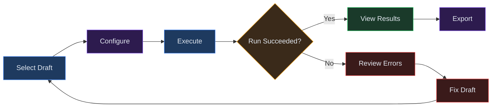
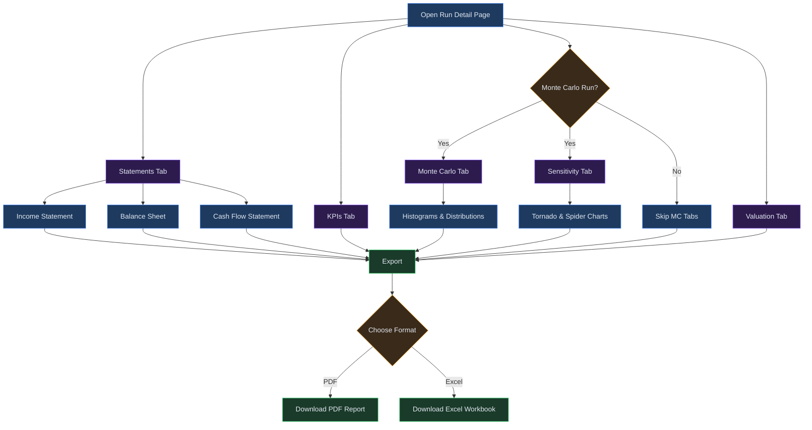

# Chapter 14: Runs

## Overview

A **run** is the execution of your financial model against a specific draft. When you trigger a run, Virtual Analyst takes the assumptions, line items, and structure defined in your draft and passes them through the forecasting engine to produce a complete set of outputs: financial statements, key performance indicators, Monte Carlo distributions, sensitivity analyses, and valuations.

Runs are the bridge between your model inputs (drafts) and the analytical outputs you need for decision-making. Each run is immutable once complete -- it captures a point-in-time snapshot of your model so you can compare results across different assumption sets or track how your forecasts evolve over time.

You can execute runs in two modes. **Deterministic mode** performs a single pass through the engine using the exact values in your assumptions. **Monte Carlo mode** performs N iterations, sampling from probability distributions you have defined on your assumptions, to produce a range of possible outcomes with confidence intervals.

---

## Process Flow

Running a model follows a five-stage workflow:



1. **Select Draft** -- Choose the draft that contains the assumptions and structure you want to model. Only drafts that pass validation can be run.
2. **Configure** -- Set the run mode (deterministic or Monte Carlo), number of iterations, and confidence interval.
3. **Execute** -- Submit the run. The engine processes your model and generates all output artifacts.
4. **View Results** -- Navigate the run detail page to review financial statements, KPIs, Monte Carlo distributions, sensitivity tables, and valuations.
5. **Export** -- Download the results as PDF or Excel for reporting and distribution.

---

## Key Concepts

| Term | Definition |
|------|-----------|
| **Run** | A single execution of the financial model against a draft. Each run produces a complete set of outputs and is assigned a unique run ID. |
| **Deterministic Mode** | A run mode that performs one pass through the engine using the exact assumption values. Produces a single set of financial statements and KPIs. |
| **Monte Carlo Mode** | A run mode that performs multiple iterations, sampling from assumption distributions. Produces probability-weighted outcomes and confidence intervals. |
| **Iteration** | One complete pass through the financial model. In deterministic mode there is one iteration. In Monte Carlo mode you configure the number of iterations (e.g., 1,000 or 10,000). |
| **Confidence Interval** | The probability range used to bound Monte Carlo results. A 90% confidence interval means that 90% of simulated outcomes fall within the reported range. |
| **Financial Statement** | The core accounting outputs: Income Statement, Balance Sheet, and Cash Flow Statement. Generated for every run. |
| **KPI** | Key Performance Indicator. Summary metrics computed from the financial statements, such as revenue growth rate, gross margin, EBITDA margin, and cash runway. |

---

## Step-by-Step Guide

### 1. Creating a Run

To create a new run:

1. Navigate to the **Runs** page from the sidebar.
2. Click the **New Run** button in the upper-right corner.
3. Select a draft from the dropdown. Only validated drafts appear in this list. If your draft is missing, return to the Drafts page and resolve any validation errors.
4. The system displays a summary of the selected draft, including the number of line items, assumption count, and forecast horizon.
5. Proceed to configuration.

You can also start a run directly from the draft detail page by clicking **Run Model** in the draft's action bar. This pre-selects the draft and takes you straight to the configuration step.

### 2. Configuring Run Parameters

The run configuration panel presents the following options:

- **Mode** -- Choose between Deterministic and Monte Carlo. Deterministic is faster and appropriate when you want a single-point forecast. Monte Carlo is appropriate when your assumptions include probability distributions and you want to understand the range of outcomes.
- **Iterations** (Monte Carlo only) -- The number of simulation passes. Higher values produce more stable distributions but take longer to compute. Common choices are 1,000 for quick analysis and 10,000 for final reporting.
- **Confidence Interval** (Monte Carlo only) -- The probability band for result ranges. The default is 90%. You can set this to any value between 50% and 99%.

Once configured, click **Execute Run** to submit.

### 3. Understanding Run Modes

**Deterministic Mode**

The engine evaluates every line item and formula using the exact values stored in your assumptions. This produces one Income Statement, one Balance Sheet, and one Cash Flow Statement. KPIs are computed from these single-point statements.

Use deterministic mode when:

- You are building and testing your model structure.
- Your assumptions are fixed values without distributions.
- You need a quick baseline forecast.

**Monte Carlo Mode**

The engine runs your model multiple times. On each iteration, it samples values from the probability distributions defined on your assumptions (e.g., revenue growth drawn from a normal distribution with mean 8% and standard deviation 2%). After all iterations complete, the system aggregates the results to produce:

- Median, mean, and percentile values for each line item.
- Confidence interval bands on every financial statement line.
- Full probability distributions for KPIs.
- Sensitivity rankings showing which assumptions have the greatest impact on outputs.

Use Monte Carlo mode when:

- You want to quantify forecast uncertainty.
- Your assumptions have defined distributions.
- You are preparing scenario analysis for stakeholders.

### 4. Viewing Financial Statements

After a run completes, open the run detail page by clicking the run ID in the runs list. The **Statements** tab displays three sub-views:

- **Income Statement** -- Revenue, cost of goods sold, gross profit, operating expenses, EBITDA, interest, taxes, and net income. Each line item shows values across the forecast horizon.
- **Balance Sheet** -- Assets, liabilities, and equity. Includes current and non-current breakdowns.
- **Cash Flow Statement** -- Operating, investing, and financing activities. Shows net change in cash and ending cash balance.

For Monte Carlo runs, each line item displays the median value with the confidence interval shown as a shaded band. You can hover over any cell to see the full distribution statistics (mean, P10, P25, P50, P75, P90).

### 5. Reviewing KPIs

The **KPIs** tab provides a summary dashboard of key metrics derived from the financial statements. Typical KPIs include:

- Revenue growth rate (year-over-year)
- Gross margin
- EBITDA margin
- Net income margin
- Current ratio
- Debt-to-equity ratio
- Free cash flow
- Cash runway (months)

Each KPI is displayed as a card showing the current period value, trend over the forecast horizon, and (for Monte Carlo runs) the confidence interval. KPIs that fall outside acceptable thresholds are flagged with a warning indicator.

### 6. Navigating Sub-Pages

The run detail page includes additional tabs for deeper analysis:

**Monte Carlo Tab**

Available only for Monte Carlo runs. Displays:

- Histogram distributions for key output variables.
- Cumulative probability curves.
- Summary statistics table (mean, median, standard deviation, skewness, kurtosis).
- Iteration convergence chart showing how the distribution stabilizes as iteration count increases.

**Sensitivity Tab**

Shows how changes in individual assumptions affect key outputs. The sensitivity analysis includes:

- Tornado charts ranking assumptions by impact magnitude.
- Spider plots showing the relationship between assumption changes and output changes.
- Correlation matrix between assumptions and outputs.

**Valuation Tab**

Presents valuation outputs derived from the financial model:

- Discounted Cash Flow (DCF) valuation with terminal value.
- Valuation range based on Monte Carlo distributions (if applicable).
- Key valuation metrics such as implied enterprise value and equity value.

See Chapter 15 for detailed guidance on interpreting Monte Carlo and sensitivity results, and Chapter 16 for valuation methodology.

The following diagram summarises how you navigate the run detail page to review results and export them.



### 7. Exporting Results

To export a completed run:

1. Open the run detail page.
2. Click the **Export** button in the top action bar.
3. Choose a format:
   - **PDF** -- Formatted report suitable for distribution. Includes all statements, KPIs, and charts.
   - **Excel** -- Workbook with separate sheets for each statement, KPIs, and raw data. Suitable for further analysis.
4. The system generates the file and downloads it to your browser.

For Monte Carlo runs, the Excel export includes a sheet with the full iteration data, allowing you to perform custom analysis on the raw simulation output.

---

## Run Execution Flow

The following diagram illustrates the internal execution sequence when you submit a run. Understanding this flow helps you diagnose issues when a run fails or produces unexpected results.

```
Start
  |
  v
[1. Create run record] --> Run ID assigned, status = "pending"
  |
  v
[2. Load draft] --> Fetch draft with all assumptions and line items
  |
  v
[3. Validate draft] --> Check integrity: all references resolve,
  |                      formulas parse, no circular dependencies
  |--- Fail --> [3a. Mark run "failed"] --> Record validation errors --> End
  |
  v
[4. Initialize engine] --> Load forecast horizon, periods, base data
  |
  v
[5. Check mode] --+--> Deterministic --> [6. Single-pass execution]
                  |                         |
                  |                         v
                  |                      [7. Compute line items in dependency order]
                  |                         |
                  |                         v
                  |                      [8. Generate statements (IS/BS/CF)]
                  |                         |
                  |                         v
                  |                      [9. Compute KPIs] --> Jump to step 14
                  |
                  +--> Monte Carlo --> [10. Sample assumption distributions]
                                        |
                                        v
                                     [11. Execute iteration (repeat N times)]
                                        |
                                        v
                                     [12. Aggregate iteration results]
                                        |
                                        v
                                     [13. Compute MC distributions,
                                          sensitivity tables,
                                          confidence intervals]
                                        |
                                        v
                                     [9. Compute KPIs]
                                        |
                                        v
                                     [14. Run valuation model]
                                        |
                                        v
                                     [15. Store all results]
                                        |
                                        v
                                     [16. Mark run "completed"]
                                        |
                                        v
                                      End
```

Steps 10-11 are the computationally intensive portion of a Monte Carlo run. The engine parallelizes iterations where possible, but very high iteration counts (above 50,000) may result in longer processing times.

---

## Quick Reference

| Action | How |
|--------|-----|
| Create a run | Runs page > **New Run**, or Draft detail > **Run Model** |
| Choose run mode | Configuration panel > **Mode** dropdown |
| Set iterations | Configuration panel > **Iterations** field (Monte Carlo only) |
| Set confidence interval | Configuration panel > **Confidence Interval** slider (Monte Carlo only) |
| View financial statements | Run detail > **Statements** tab > select IS, BS, or CF |
| Review KPIs | Run detail > **KPIs** tab |
| View Monte Carlo distributions | Run detail > **Monte Carlo** tab |
| Export results | Run detail > **Export** button > choose PDF or Excel |

---

## Page Help

Every page in Virtual Analyst includes a floating **Instructions** button positioned in the bottom-right corner of the screen. On the Runs pages, clicking this button opens a help drawer that provides:

- Guidance on executing model runs, configuring Monte Carlo iterations, and setting confidence intervals.
- Step-by-step instructions for reviewing financial statements, KPIs, and simulation results on the run detail page.
- Tips for exporting run results in PDF or Excel format.
- Prerequisites and links to related chapters.

The help drawer can be dismissed by clicking outside it or pressing the close button. It is available on every page, so you can access context-sensitive guidance wherever you are in the platform.

---

## Troubleshooting

**Run fails to start**

The most common cause is a draft validation failure. Return to the draft and check for:

- Unresolved line item references (formulas pointing to deleted or renamed items).
- Circular dependencies in formulas.
- Missing required assumptions (e.g., a growth rate referenced but never defined).
- Incomplete forecast horizon configuration.

The run detail page shows the specific validation errors under the **Errors** section when a run fails at the validation stage.

**Incomplete or partial results**

If a run completes but some tabs show missing data:

- The engine may have timed out during execution. This is more likely with Monte Carlo runs at high iteration counts. Try reducing the iteration count (e.g., from 10,000 to 1,000) and re-running.
- Check whether the draft contains line items with no upstream assumptions. These will compute as zero and may cause downstream calculations to be empty.

**Export errors**

Large Monte Carlo runs with high iteration counts can produce very large datasets:

- If the Excel export fails or times out, try exporting as PDF instead. The PDF export summarizes distributions rather than including raw iteration data.
- For very large exports, consider reducing the iteration count or exporting individual statement tabs rather than the full run.

**KPIs showing zero or unexpected values**

- Verify that the underlying assumptions are configured with non-zero values. A KPI such as gross margin will be zero if both revenue and COGS assumptions are zero.
- Check that the assumption time series covers the forecast horizon. If assumptions are defined only for year 1 but the forecast extends to year 5, later periods may default to zero.
- Review the formula dependencies in the draft to ensure KPI source line items are correctly linked.

**Run stuck in "pending" status**

- The engine queue may be processing other runs. Runs are executed sequentially per workspace. Wait a few minutes and refresh the page.
- If the run remains pending for more than 10 minutes, it may have encountered an internal error. Create a new run from the same draft.

---

## Related Chapters

- [Chapter 11: Drafts](11-drafts.md) -- Creating and managing the drafts that serve as inputs to runs.
- [Chapter 15: Monte Carlo and Sensitivity](15-monte-carlo-and-sensitivity.md) -- Detailed guidance on interpreting Monte Carlo distributions and sensitivity analyses.
- [Chapter 16: Valuation](16-valuation.md) -- Understanding the valuation models and outputs generated by runs.
