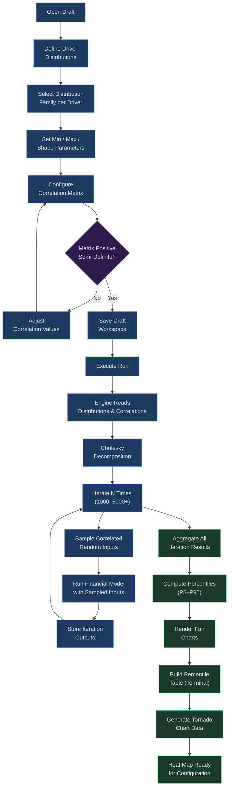

# Monte Carlo and Sensitivity

## Overview

Monte Carlo simulation and sensitivity analysis are the two primary tools Virtual Analyst provides for quantifying uncertainty in your financial models. Monte Carlo simulation runs thousands of iterations with randomized inputs drawn from the distributions you configure, producing probability-weighted fan charts and percentile tables that show the range of plausible outcomes. Sensitivity analysis complements this by isolating individual variables -- tornado charts reveal which assumptions have the greatest impact on results, heat maps expose two-variable interactions, and sensitivity tables let you trace how specific input ranges map to output values.

Together, these tools answer two fundamental questions: "How wide is the range of possible outcomes?" (Monte Carlo) and "Which assumptions matter most?" (sensitivity). Both are accessed from a completed run and rely on the distribution ranges and correlations you configure at the draft stage.

**Prerequisites:** A completed run with at least one forecast period. Distribution ranges must be defined on your draft before running Monte Carlo. Sensitivity analysis requires at least one variable eligible for perturbation.

**Where to find these tools:** Monte Carlo results are available at `runs/{id}/mc` and sensitivity analysis at `runs/{id}/sensitivity` within the ANALYZE section of the navigation. Distribution and correlation configuration happen on the draft page in the CONFIGURE section.

---

## Process Flow

---

## Key Concepts

| Concept | Definition |
|---------|------------|
| **Monte Carlo Simulation** | A technique that runs the financial model thousands of times, each time sampling random values from the configured distributions, to produce a probability distribution of outcomes rather than a single point estimate. |
| **Iteration** | A single pass through the model with one set of randomly drawn inputs. Virtual Analyst aggregates results across all iterations to build percentile distributions. The default is 1,000 iterations; you can increase to 5,000 or more for smoother distributions. |
| **Fan Chart** | A time-series visualization where nested shaded bands represent different confidence intervals. Wider bands indicate greater uncertainty; narrowing bands indicate convergence. |
| **Confidence Band** | A shaded region on the fan chart bounded by two percentile lines (e.g., P25 to P75). The area between the bounds represents the probability that the true outcome falls within that range. |
| **P10 / P50 / P90** | Percentile markers. P10 means 10% of simulated outcomes fall below this value (optimistic floor in a profit context). P50 is the median outcome. P90 means 90% of outcomes fall below this value (conservative ceiling). |
| **Tornado Chart** | A horizontal bar chart where each bar represents one input variable. The length of the bar shows how much the output changes when that variable is perturbed by a given percentage (e.g., plus or minus 10%). Variables are sorted by total impact, largest at the top. |
| **Sensitivity Table** | A matrix showing how a single output metric changes across a range of values for two input parameters. Rows correspond to one parameter's range; columns correspond to the other. |
| **Heat Map** | A color-coded grid that visualizes the sensitivity table. Cool colors (blue) indicate higher output values; warm colors (red) indicate lower values. The gradient makes interaction effects immediately visible. |
| **Correlation Matrix** | A symmetric matrix defining the statistical relationships between input distributions. A correlation of +1 means two variables move in perfect lockstep; -1 means they move in opposite directions; 0 means they are independent. The matrix must be positive semi-definite for valid sampling. |

---

## Step-by-Step Guide

### 1. Configuring Distribution Ranges

Distribution ranges tell the Monte Carlo engine how much each assumption can vary. You configure them on the draft before executing a run.

1. Open your draft from the **Drafts** page.
2. Navigate to the **Distributions** section within the draft workspace.
3. For each driver you want to include in the simulation, specify:
   - **Reference** -- the driver identifier (e.g., `drv:revenue_growth`, `drv:cogs_pct`).
   - **Family** -- the statistical distribution type. Supported families include:
     - **Uniform** -- equal probability across a min-max range. Use when you have no reason to favor any value within bounds.
     - **Triangular** -- defined by min, mode (most likely), and max. Use when you can estimate a most likely value but outcomes can fall anywhere in a range.
     - **Normal** -- bell-curve defined by mean and standard deviation. Use for variables with symmetric uncertainty around a central estimate.
     - **Lognormal** -- skewed right; values cannot go below zero. Use for variables like revenue multiples or asset prices that have a natural floor at zero.
   - **Parameters** -- distribution-specific values such as mean and standard deviation (normal), min/mode/max (triangular), or low and high bounds (uniform).
4. Add at least two distributions to enable correlation configuration.
5. Save your draft. The distribution configuration is stored in the draft workspace and used when the run is executed.

> **Tip:** Start with uniform or triangular distributions if you are unsure of the exact shape. These require only a minimum and maximum (or min, mode, max), which are easier to estimate from historical data or expert judgment. You can always switch to a normal or lognormal family later as you refine your understanding of each variable's behavior.

### 2. Setting Up the Correlation Matrix

By default, all input variables are treated as independent. If your assumptions are related -- for example, revenue growth and headcount growth tend to move together -- you should configure correlations to produce realistic joint outcomes.

1. On the draft page, scroll to the **Driver Correlations** section (visible when you have two or more distributions).
2. The CorrelationMatrixEditor displays a grid with your distribution references along both axes. The diagonal cells are fixed at 1.00.
3. Click any off-diagonal cell to edit the correlation coefficient. Enter a value between -1 and +1.
   - **Positive values** (e.g., 0.6): the two variables tend to increase together.
   - **Negative values** (e.g., -0.4): when one increases, the other tends to decrease.
   - **Zero** (default): the variables are independent.
4. Press **Enter** to confirm or **Escape** to cancel the edit.
5. Watch the validation indicator below the matrix:
   - **Green** ("Matrix is valid") -- the matrix is positive semi-definite and ready for use.
   - **Amber** ("Matrix is not positive semi-definite") -- the combination of correlations is mathematically inconsistent. Adjust values until the indicator turns green.
6. The **Active correlations** list below the matrix summarizes all non-zero pairs for quick review. Each entry shows the two variable references and the correlation coefficient with a color-coded sign (blue for positive, red for negative).

> **Note:** The matrix must be positive semi-definite for the Cholesky decomposition used during sampling to work correctly. If it is not, the simulation may produce unexpected or distorted correlations between variables. When working with more than five or six correlated drivers, achieving PSD validity requires careful attention to the consistency of pairwise values.

### 3. Reading Fan Charts

Fan charts are the primary visualization for understanding the range of possible outcomes over your forecast horizon. After executing a run that includes Monte Carlo simulation, navigate to the MC results page:

1. Go to **Runs** and open your completed run.
2. Click the **Monte Carlo** link (or navigate to `runs/{id}/mc`).
3. The page displays a summary card showing the number of simulations and the random seed used.
4. Below the summary, a **Percentile table (terminal)** shows the P5, P50, and P95 values for each metric (Revenue, EBITDA, Net Income, FCF) at the final forecast period.
5. Use the **metric tabs** (Revenue, EBITDA, Net Income, FCF) to switch between fan charts for different financial metrics.

Each fan chart shows time (forecast periods) on the horizontal axis and the metric value on the vertical axis. Three nested bands are drawn:

- **Outermost band (P5--P95):** 90% of simulated outcomes fall within this range. Light shading.
- **Middle band (P10--P90):** 80% of outcomes. Medium shading.
- **Inner band (P25--P75):** 50% of outcomes (the interquartile range). Darker shading.
- **Median line (P50):** The solid center line representing the most likely trajectory.

### 4. Interpreting Confidence Bands (P10 / P50 / P90)

Hover over any point on the fan chart to see a tooltip with the exact percentile values for that period:

| Percentile | Interpretation |
|------------|----------------|
| **P5** | Only 5% of simulations produced a value below this. Represents a near-best-case floor. |
| **P10** | 10% of outcomes fall below. Often used as the "downside case" in reporting. |
| **P25** | First quartile boundary. One in four simulations falls below this. |
| **P50** | The median. Half of all simulations fall above, half below. This is the central expectation. |
| **P75** | Third quartile boundary. Only 25% of simulations exceed this. |
| **P90** | 90% of outcomes fall below. Often reported as the "upside case." |
| **P95** | Near-ceiling. Only 5% of simulations produced a value above this. |

Wide bands at a given period indicate high uncertainty; narrow bands indicate the model converges on a tighter range. If bands widen over time, compounding uncertainty is dominating. If they narrow, the model's assumptions are constraining outcomes.

When comparing fan charts across metrics, look for divergent shapes. For example, if Revenue shows tight bands but Net Income shows wide bands, the uncertainty is concentrated in cost or tax assumptions rather than in revenue drivers. This kind of comparison helps you pinpoint where the model needs more precise inputs.

### 5. Using Tornado Charts

Tornado charts show which variables have the greatest influence on your output metric. To access them:

1. From your completed run, navigate to the **Sensitivity Analysis** page (`runs/{id}/sensitivity`).
2. Select the perturbation percentage using the toggle buttons at the top: **5%**, **10%**, or **20%**.
3. The tornado chart displays automatically, with variables sorted from highest total impact (top) to lowest (bottom).

Each variable has two bars extending from a central baseline axis:

- **Left bar (red/negative impact):** Shows how much the output metric decreases when the variable is perturbed downward by the selected percentage.
- **Right bar (blue/positive impact):** Shows how much the output metric increases when the variable is perturbed upward by the selected percentage.
- **Bar length** is proportional to the magnitude of impact relative to the highest-impact variable. This makes it easy to see at a glance which variables dominate.

The **Base FCF** value is displayed above the chart for reference. Numeric impact values appear to the right of each bar pair in the format `low / high`.

**Reading asymmetric bars:** If a variable's left bar is much longer than its right bar (or vice versa), the output metric responds asymmetrically to that variable. This often occurs with percentage-based inputs near natural boundaries (e.g., a tax rate cannot go below 0% but can increase substantially).

> **Tip:** Focus your refinement effort on the top three to five variables in the tornado chart. These are the assumptions where estimation errors will have the largest effect on your projections. Variables near the bottom of the chart can generally be left at their base-case values without materially affecting the analysis.

### 6. Reading Sensitivity Tables

The percentile table on the Monte Carlo results page functions as a sensitivity summary. It presents a three-column view (P5, P50, P95) for each of the four key metrics at the terminal forecast period. To read it effectively:

1. **Compare the spread.** The gap between P5 and P95 for a given metric tells you the total uncertainty range. A large gap signals high sensitivity to input assumptions.
2. **Focus on the median.** The P50 column represents your most likely outcome and serves as the anchor for all comparisons.
3. **Look for asymmetry.** If the distance from P50 to P95 is much larger than from P5 to P50, the distribution is skewed to the upside (right-skewed). The reverse indicates downside skew. Asymmetric distributions may warrant different risk management strategies for upside versus downside scenarios.

For a more granular two-variable sensitivity analysis, use the heat map feature described below, which produces a full matrix of input-to-output mappings.

### 7. Exploring Heat Maps

The Two-Variable Heat Map lets you examine how two input parameters interact to affect a chosen output metric.

1. On the Sensitivity Analysis page, scroll below the tornado chart to the **Two-Variable Heat Map** section.
2. Configure **Parameter A (rows):** enter the parameter path (e.g., `metadata.tax_rate`) and set the low value, high value, and number of steps.
3. Configure **Parameter B (columns):** enter the second parameter path (e.g., `metadata.initial_cash`) and set its range and steps.
4. Select the **Metric** to measure (net income, EBITDA, revenue, or FCF) from the dropdown.
5. Click **Generate Heat Map**.

The resulting grid shows:

- Row headers corresponding to Parameter A values across its range.
- Column headers corresponding to Parameter B values across its range.
- Each cell contains the output metric value for that specific combination of inputs.
- Cells are color-coded on a four-tier gradient: deep red (lowest values) through light red, light blue, to deep blue (highest values).
- A legend below the grid explains the color scale.

Use heat maps to identify "sweet spots" where both parameters contribute positively, or to find dangerous combinations where two downside assumptions compound into severe outcomes.

**Reading the grid:** Start by scanning for the deepest red cells -- these represent the worst-case output for the chosen metric. Then locate the deepest blue cells for the best-case output. The transition gradient between them reveals the rate of change: a sharp color shift between adjacent cells indicates high sensitivity in that region, while gradual changes indicate a more stable relationship.

> **Tip:** For the most informative heat maps, choose the two highest-ranked variables from your tornado chart as Parameter A and Parameter B. Set step counts between 5 and 10 for a good balance of resolution and computation time. Step counts above 10 increase computation without adding much visual clarity.

### 8. Identifying Key Value Drivers

Combine insights from the tornado chart and heat map to build a prioritized list of key value drivers:

1. **Start with the tornado chart.** The top-ranked variables are your primary drivers -- small changes in these assumptions produce the largest swings in output.
2. **Cross-reference with the heat map.** If two top tornado variables interact (i.e., the heat map shows non-linear patterns when both vary simultaneously), their combined effect may be larger than the sum of their individual impacts.
3. **Check confidence bands.** If the fan chart shows wide bands, your key drivers likely have broad distribution ranges. Consider whether those ranges reflect genuine uncertainty or can be tightened with better data.
4. **Document findings.** Use the identified drivers to guide scenario planning (see Chapter 12) and to focus due diligence or data collection efforts on the assumptions that matter most.
5. **Iterate on distributions.** After identifying key drivers, revisit their distribution configurations. Narrow the ranges for drivers where you can obtain better data, and widen ranges for drivers with genuine uncertainty. Re-run the simulation to see how the updated distributions affect your fan charts.

---

## Best Practices

- **Start with 1,000 iterations for exploratory work.** This provides a reasonable distribution shape in seconds. Increase to 5,000 or more only when you need smooth percentile curves for final reporting or presentation.
- **Validate distributions against historical data.** If you have three or more years of actuals for a given driver, compare the historical range to the distribution you configured. The distribution should encompass the historical range unless you have specific reasons to believe the future will be narrower.
- **Set correlations deliberately.** Most users configure distributions but leave all correlations at zero. Independent sampling can produce unrealistic scenarios (e.g., revenue doubling while headcount halves). Even rough correlation estimates (0.3 for moderate, 0.6 for strong) improve simulation realism.
- **Use multiple perturbation levels on tornado charts.** Run the tornado at 5%, 10%, and 20% to see whether driver rankings change. If a variable ranks first at 5% but drops at 20%, it may have a non-linear relationship with the output -- a finding worth investigating with the heat map.
- **Compare fan charts before and after correlation changes.** Adding positive correlations between key drivers typically widens the fan chart bands because favorable and unfavorable outcomes are more likely to cluster together. This is an important modeling insight that point estimates cannot reveal.
- **Document your distribution rationale.** For audit and review purposes, record why you chose each distribution family and parameter range. This makes it easier for reviewers to assess the credibility of your simulation outputs.
- **Run sensitivity before Monte Carlo.** If you are short on time, start with the tornado chart (which is fast to compute) to identify the top drivers. Then configure distributions only for those top drivers rather than every assumption in the model. This focused approach produces meaningful Monte Carlo results without the overhead of parameterizing every variable.

---

## Monte Carlo Simulation Flow (detailed)

---

## Quick Reference

| Action | How |
|--------|-----|
| Configure distributions | Open draft > Distributions section > add driver refs, families, and parameters |
| Edit correlations | Open draft > Driver Correlations grid > click a cell, enter value between -1 and +1 |
| View fan charts | Runs > open run > **Monte Carlo** link > use metric tabs to switch |
| Read percentile tooltip | Hover over any point on the fan chart |
| Open tornado chart | Runs > open run > **Sensitivity Analysis** link |
| Change perturbation range | Click **5%**, **10%**, or **20%** toggle on the sensitivity page |
| Generate heat map | Sensitivity page > configure two parameters and metric > click **Generate Heat Map** |
| Check matrix validity | Look for the green or amber validation message below the correlation matrix |

---

## Page Help

Every page in Virtual Analyst includes a floating **Instructions** button positioned in the bottom-right corner of the screen. On the Monte Carlo and Sensitivity Analysis pages, clicking this button opens a help drawer that provides:

- Guidance on interpreting fan charts, percentile distributions, and confidence intervals from Monte Carlo simulations.
- Step-by-step instructions for configuring tornado charts, heat maps, and sensitivity perturbation ranges.
- Tips for setting up the correlation matrix and validating positive semi-definiteness.
- Prerequisites and links to related chapters.

The help drawer can be dismissed by clicking outside it or pressing the close button. It is available on every page, so you can access context-sensitive guidance wherever you are in the platform.

---

## Troubleshooting

| Symptom | Cause | Resolution |
|---------|-------|------------|
| MC results look flat with no visible spread between bands | Distribution ranges are too narrow, so sampled inputs barely differ from the base case. | Widen the min/max bounds on your driver distributions. For example, if revenue growth is set to 4.9%--5.1%, try 3%--7% to see meaningful variance. |
| Tornado chart shows "No tornado data for this run" | No variables in the model are eligible for sensitivity perturbation, or the run did not include sensitivity analysis. | Verify that your draft has at least one adjustable assumption. Re-execute the run if necessary. |
| Correlation matrix validation shows amber warning | The combination of correlation coefficients is not positive semi-definite. This happens when values are mutually inconsistent (e.g., A correlates strongly with B and C, but B and C are set as negatively correlated in a way that is mathematically impossible). | Reduce the magnitude of one or more correlation values until the indicator turns green. Start by lowering the largest off-diagonal absolute values. |
| Monte Carlo takes too long to complete | Too many iterations combined with a complex model produces excessive computation time. | Reduce the iteration count to 1,000--5,000. For exploratory analysis, 1,000 iterations is usually sufficient. Increase to 5,000+ only for final reporting. |
| Heat map cells all show the same color | The parameter ranges are too narrow, or the selected metric is insensitive to both parameters. | Widen the low/high range for both parameters, increase the number of steps, or try a different output metric. |
| Fan chart tooltip shows dashes instead of values | The selected metric has no percentile data for the run, likely because that metric was not computed. | Switch to a different metric tab (Revenue, EBITDA, Net Income, or FCF). If all metrics show dashes, re-execute the run with Monte Carlo enabled. |
| Sensitivity page shows an error alert | The API call to compute sensitivity failed, possibly due to a missing or incompatible run configuration. | Check that the run completed successfully. Navigate back to the run detail page and verify its status before retrying. |

---

## Glossary of Notation

The following notation appears throughout the Monte Carlo and sensitivity pages:

| Symbol | Meaning |
|--------|---------|
| **P** followed by a number | Percentile. P50 = median, P10 = 10th percentile, etc. |
| **rho** | The Greek letter used for correlation coefficients. Displayed as a decimal between -1 and +1 in the correlation matrix. |
| **N** | The number of Monte Carlo iterations (e.g., N = 1,000). |
| **FCF** | Free Cash Flow. The default output metric for tornado charts. |
| **PSD** | Positive Semi-Definite. A mathematical property required of the correlation matrix for valid random sampling. |

---

## Related Chapters

- [Chapter 14: Runs](14-runs.md) -- Executing model runs and reviewing financial statements.
- [Chapter 16: Valuation](16-valuation.md) -- DCF and comparable company analysis using run outputs.
- [Chapter 12: Scenarios](12-scenarios.md) -- Defining alternative assumption sets for side-by-side comparison.
