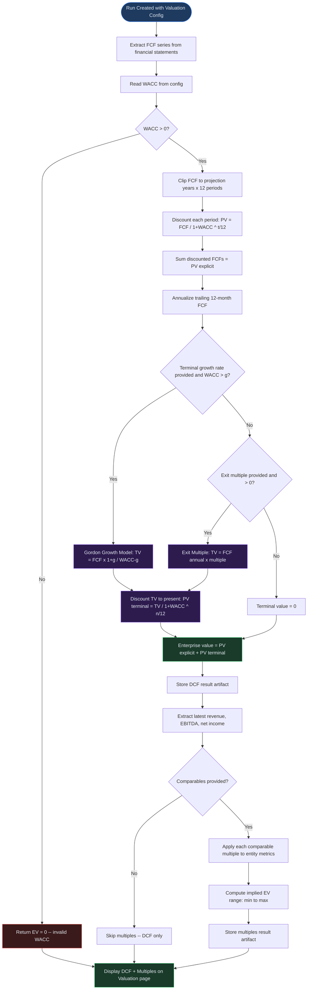

# Valuation

## Overview

The Valuation module produces intrinsic and relative value estimates as part of a completed model run. Virtual Analyst supports two complementary approaches: **Discounted Cash Flow (DCF)** analysis, which derives enterprise value from projected free cash flows discounted at a weighted average cost of capital, and **multiples-based valuation**, which applies comparable company trading multiples to your entity's financial metrics. Both methods execute automatically when you include a valuation configuration in a run, and their results appear side by side on the Valuation page so you can compare, reconcile, and stress-test the outputs.

Valuation results are stored as run artifacts. You can revisit them at any time by navigating to a completed run and selecting the Valuation tab. The page displays a DCF card showing enterprise value, present value of explicit cash flows, and present value of the terminal value, alongside a Multiples card showing the implied enterprise value range derived from comparable companies.

---

## Process Flow

1. **Configure WACC** -- Provide cost of equity and cost of debt inputs that determine the discount rate applied to projected cash flows.
2. **Set Terminal Value Parameters** -- Choose a terminal growth rate (for the Gordon Growth Model) or an exit multiple, along with the number of projection years.
3. **Run DCF** -- The engine discounts each period's free cash flow at the WACC, computes terminal value, and sums them to arrive at enterprise value.
4. **Apply Multiples** -- Comparable company multiples (EV/Revenue, EV/EBITDA, P/E) are applied to the entity's latest financial metrics to produce an implied enterprise value range.
5. **Compare Methods** -- DCF and multiples results are displayed side by side so you can evaluate convergence or divergence between intrinsic and relative valuations.
6. **Sensitivity Analysis** -- Vary WACC, terminal growth rate, or exit multiple to understand how enterprise value responds to changes in key assumptions.

---

## Key Concepts

| Term | Definition |
|------|------------|
| **DCF (Discounted Cash Flow)** | A valuation method that estimates enterprise value by discounting projected free cash flows back to their present value using a risk-adjusted discount rate. |
| **WACC (Weighted Average Cost of Capital)** | The blended rate of return required by all capital providers (equity and debt). It serves as the discount rate in the DCF calculation. |
| **Terminal Value** | The value of all cash flows beyond the explicit projection period, representing the bulk of enterprise value in most models. Computed via either the Gordon Growth Model or an exit multiple. |
| **Gordon Growth Model** | A perpetuity growth formula that calculates terminal value as FCF x (1 + g) / (WACC - g), where g is the long-term sustainable growth rate. Requires that WACC exceeds g. |
| **Exit Multiple** | An alternative terminal value method that multiplies the final year's annualized free cash flow by a chosen multiple (e.g., 8x or 12x), reflecting expected market pricing at the end of the projection period. |
| **EV/Revenue** | Enterprise value divided by revenue. A common multiple for high-growth or pre-profit companies where earnings-based multiples are not meaningful. |
| **EV/EBITDA** | Enterprise value divided by earnings before interest, taxes, depreciation, and amortization. The most widely used comparable multiple for operating businesses. |
| **P/E (Price-to-Earnings)** | Share price divided by earnings per share, or equivalently equity value divided by net income. Used when the entity is profitable and capital structure effects are secondary. |
| **Enterprise Value** | The total value of a business's operating assets, before deducting net debt. In Virtual Analyst this equals the sum of PV of explicit cash flows and PV of terminal value. |
| **Equity Value** | Enterprise value minus net debt (interest-bearing debt less cash and equivalents). Represents the residual value attributable to equity holders. |

---

## Step-by-Step Guide

### 1. Configuring WACC Inputs

WACC is supplied as part of the valuation configuration when you create a run. To set it:

1. Navigate to **Runs** and click **New Run** (or use the run creation dialog from a draft).
2. Expand the **Valuation** section of the run configuration form.
3. Enter the **WACC** as a decimal (e.g., `0.10` for 10%). This single input encapsulates the blended cost of equity and cost of debt. If your organization tracks these components separately, compute the weighted average offline and enter the result here.
4. The WACC must be a positive number. Values of zero or below will cause the DCF engine to return an enterprise value of zero with no further computation.

> **Tip:** Typical WACC values for established companies range from 7% to 12%. Early-stage or high-risk businesses may warrant 15% to 25% or higher.

### 2. Setting Terminal Value Parameters

Still within the valuation configuration panel:

1. Enter the **Terminal Growth Rate** as a decimal (e.g., `0.025` for 2.5%). This is the rate at which free cash flows are assumed to grow in perpetuity beyond the projection horizon.
2. Alternatively, enter a **Terminal Multiple** (e.g., `10` for 10x trailing free cash flow). This replaces the perpetuity calculation with an exit multiple approach.
3. Set the **Projection Years** (defaults to 5). This controls how many years of explicit free cash flow are discounted before the terminal value kicks in.

You may provide both a terminal growth rate and an exit multiple, but the engine prioritizes the Gordon Growth Model when a valid terminal growth rate is present (i.e., WACC exceeds the growth rate). The exit multiple is used as a fallback when the growth rate is absent or would produce a negative terminal value.

### 3. Choosing Terminal Value Method

Virtual Analyst supports two terminal value methods. Choose the one that best fits your modeling context:

- **Gordon Growth Model (Perpetuity Growth)** -- Best for stable, mature businesses with predictable long-term growth. The terminal growth rate should not exceed long-term GDP or inflation expectations (typically 1.5% to 3%). If the terminal growth rate equals or exceeds WACC, the formula produces a negative or infinite result, and the engine returns zero.

- **Exit Multiple** -- Best when you have reliable comparable transaction data or when the business is expected to be sold at the end of the projection period. The multiple is applied to the annualized trailing free cash flow from the final twelve months of the projection.

### 4. Running DCF Valuation

Once you have configured WACC, terminal value parameters, and projection years, click **Run** to execute the analysis. The DCF engine performs the following steps automatically:

1. Extracts the projected free cash flow (FCF) series from the model's financial statements.
2. Discounts each period's FCF back to present value using the formula: PV = FCF / (1 + WACC) ^ (t / 12), where t is the period index in months.
3. Annualizes the trailing twelve months of FCF to compute a representative annual cash flow.
4. Computes terminal value using either the Gordon Growth Model or exit multiple.
5. Discounts terminal value to present value at the end of the projection horizon.
6. Sums PV of explicit cash flows and PV of terminal value to arrive at enterprise value.

When the run completes, navigate to **Runs > [Run ID] > Valuation** to view the results. The DCF card displays:

- **Enterprise value** -- the sum of PV explicit and PV terminal.
- **PV explicit** -- the present value of all projected free cash flows within the projection period.
- **PV terminal** -- the present value of the terminal value.
- **WACC** -- the discount rate used, displayed as a percentage.

The DCF result represents **enterprise value** -- the value of operating assets before adjusting for capital structure. To derive equity value (the value attributable to shareholders), subtract net debt (total interest-bearing debt minus cash and equivalents) from enterprise value. While Virtual Analyst displays enterprise value as the primary DCF output, you can perform the equity bridge calculation offline or within a downstream board pack or memo.

### 5. Applying Multiples-Based Valuation

Multiples-based valuation runs alongside the DCF when you include comparable company data in the valuation configuration:

1. In the valuation configuration panel, expand the **Comparables** section.
2. Add one or more comparable companies. For each comparable, provide the company name and one or more trading multiples: `ev_ebitda`, `ev_revenue`, and `p_e`.
3. The engine extracts your entity's latest revenue, EBITDA, and net income from the most recent period of the run's income statement.
4. Each comparable's multiples are applied to the corresponding entity metric to produce an implied enterprise value. For example, a comparable with an EV/EBITDA of 12x applied to your entity's EBITDA of 5,000,000 implies an enterprise value of 60,000,000.
5. The Multiples card on the Valuation page displays the **Implied EV range** -- the minimum and maximum implied enterprise values across all comparable-metric combinations.

> **Note:** If no comparables are provided, the Multiples card is omitted from the results page and only the DCF card appears.

### 6. Comparing Valuation Methods

The Valuation page presents DCF and multiples results in a two-column grid layout. Use this view to assess whether the intrinsic value (DCF) aligns with relative market pricing (multiples):

- If DCF enterprise value falls within the implied EV range from multiples, the two methods are broadly consistent and the valuation carries higher confidence.
- If DCF enterprise value sits above the implied range, the model may be embedding aggressive growth assumptions or an optimistic terminal value.
- If DCF enterprise value sits below the implied range, either the WACC is too high, the FCF projections are conservative, or the comparable companies trade at a premium that your entity does not warrant.

Use this comparison as a diagnostic tool to refine assumptions rather than as a definitive answer. When presenting valuation results to stakeholders, showing both methods together strengthens the narrative: a single-method valuation invites challenge, while a triangulated view demonstrates rigor.

Common reconciliation patterns:

| Scenario | Likely Cause | Recommended Action |
|----------|-------------|-------------------|
| DCF within multiples range | Methods agree | High-confidence valuation; proceed to sensitivity testing |
| DCF above multiples range | Aggressive growth or low WACC | Stress-test terminal growth rate; verify WACC reflects actual risk |
| DCF below multiples range | Conservative FCF or high WACC | Review revenue and margin assumptions; check if WACC is overstated |
| Wide multiples range | Diverse peer set or mixed metrics | Narrow comparables to closest peers; focus on a single dominant multiple |

### 7. Sensitivity on Valuation Inputs

To understand how sensitive enterprise value is to changes in key assumptions, use the sensitivity analysis features available on the run:

1. Navigate to **Runs > [Run ID] > Sensitivity**.
2. Configure a **parameter sweep** targeting the WACC, terminal growth rate, or exit multiple.
3. Set the low and high bounds and number of steps. For example, sweep WACC from 0.08 to 0.14 in 7 steps.
4. Run the sweep. The results show how enterprise value changes across the range of input values.
5. For two-dimensional analysis, use the **heatmap** feature to vary two parameters simultaneously (e.g., WACC on one axis and terminal growth rate on the other).

Recommended sensitivity ranges for common valuation inputs:

| Parameter | Typical Base | Suggested Sweep Range | Steps |
|-----------|-------------|----------------------|-------|
| WACC | 8% -- 12% | Base +/- 3 percentage points | 7 |
| Terminal growth rate | 2% -- 3% | 0% to 4% | 5 |
| Exit multiple | 8x -- 12x | 5x to 15x | 6 |
| Projection years | 5 years | 3 to 10 years | 4 |

Sensitivity analysis helps you identify which assumptions have the greatest leverage on valuation and where further research or due diligence should be focused. When WACC changes of 1% produce enterprise value swings greater than 20%, the model is highly rate-sensitive and warrants careful justification of cost of capital inputs. Similarly, if the terminal growth rate dominates the sensitivity tornado, consider whether the perpetuity assumption is appropriate or whether an exit multiple better reflects the business's trajectory.

---

## Valuation Computation Flow

The following diagram traces the complete computation from run inputs through to the final valuation outputs:

---

## Quick Reference

| Task | Where | How |
|------|-------|-----|
| Set WACC for a run | Run creation dialog > Valuation section | Enter WACC as a decimal (e.g., `0.10`) |
| Choose terminal value method | Run creation dialog > Valuation section | Provide `terminal_growth_rate` for Gordon Growth or `terminal_multiple` for exit multiple |
| Set projection horizon | Run creation dialog > Valuation section | Enter number of projection years (default: 5) |
| Add comparable companies | Run creation dialog > Valuation > Comparables | Enter company name and multiples (`ev_ebitda`, `ev_revenue`, `p_e`) |
| View valuation results | Runs > select run > Valuation tab | Review DCF card and Multiples card |
| Run sensitivity on WACC | Runs > select run > Sensitivity | Configure parameter sweep targeting WACC |
| Compare DCF to multiples | Valuation page | Check whether DCF enterprise value falls within the implied EV range |
| Export valuation data | Runs > select run > Export | Download run results including valuation artifacts |

---

## Troubleshooting

**WACC inputs missing -- enterprise value shows zero.**
The DCF engine requires a positive WACC to compute present values. If enterprise value displays as zero or a dash, return to the run configuration and verify that the WACC field is populated with a value greater than zero. A WACC of zero or a negative number causes the engine to skip the entire DCF computation.

**Negative or infinite terminal value -- terminal growth rate exceeds WACC.**
The Gordon Growth Model formula divides by (WACC - g). If the terminal growth rate equals or exceeds WACC, the denominator becomes zero or negative, producing an invalid result. The engine guards against this by requiring WACC > g. Reduce the terminal growth rate below WACC, or switch to the exit multiple method.

**Valuation not appearing on the run page.**
Valuation results are only generated when the run includes a `valuation_config`. If you created the run without valuation parameters, no valuation artifact is stored and the Valuation tab will show "No valuation data for this run." Create a new run with valuation configuration enabled.

**Multiples card missing -- no implied EV range.**
The multiples-based valuation requires at least one comparable company with at least one valid multiple. If the comparables list is empty or none of the provided multiples match the entity's available metrics (revenue, EBITDA, net income), the Multiples card is omitted. Add comparable companies with relevant multiples to the valuation configuration.

**Multiples look wrong -- implied EV range is unexpectedly wide.**
A wide implied range indicates that comparable multiples vary significantly or that different metrics (revenue vs. EBITDA vs. earnings) produce divergent valuations. Review the comparables for outliers, ensure the entity's financial metrics are accurate, and consider narrowing the peer set to more closely matched companies.

**PV terminal dominates enterprise value (90%+ of total).**
This is common in early-stage models with low near-term free cash flows. It signals heavy reliance on terminal assumptions. Consider extending the explicit projection period, revisiting the terminal growth rate, or switching to an exit multiple to cross-check the Gordon Growth result.

**FCF series is all zeros -- enterprise value is unexpectedly low.**
If your model does not produce free cash flow outputs, the DCF engine receives an empty or zero-valued series and computes an enterprise value near zero. Verify that your draft includes working capital, capital expenditure, and depreciation assumptions so that the financial statements generate meaningful free cash flow figures. Review the run's financial statements tab to confirm FCF is being calculated.

**P/E multiple not producing implied values.**
The P/E ratio requires positive net income. If your entity reports a net loss in the most recent period, the engine skips P/E-based implied values even when comparables include P/E data. This is by design -- applying an earnings multiple to a loss-making company produces a meaningless negative result. Rely on EV/Revenue or EV/EBITDA multiples for pre-profit entities.

**Sensitivity sweep produces a flat line.**
If varying a parameter does not change the enterprise value, that parameter may not be connected to the valuation calculation in the current run configuration. Verify that the parameter path targets a valuation input (WACC, terminal growth rate, or terminal multiple) rather than an unrelated model driver.

---

## Related Chapters

- [Chapter 14: Runs](14-runs.md) -- Creating and managing model runs that produce valuation outputs.
- [Chapter 15: Monte Carlo and Sensitivity](15-monte-carlo-and-sensitivity.md) -- Running sensitivity sweeps on valuation parameters.
- [Chapter 11: Drafts](11-drafts.md) -- Configuring the draft assumptions that feed into valuation projections.
