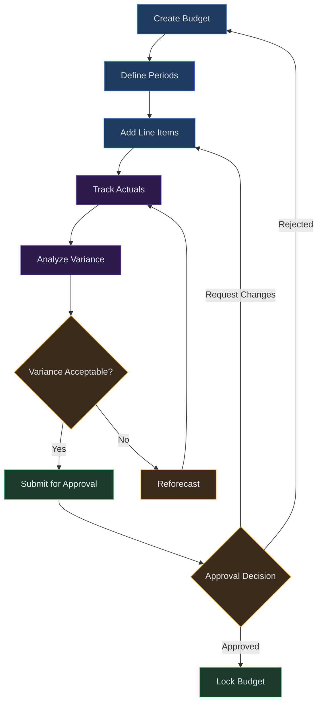

# Chapter 17: Budgets

## Overview

The Budgets module in Virtual Analyst provides a structured environment for building, tracking, and analyzing financial budgets. Whether you start from a pre-built template or construct a budget from scratch, the module guides you through period configuration, line item entry, actuals tracking, and variance analysis. Built-in reforecasting and approval workflows ensure that budgets remain living documents that reflect changing business conditions.

This chapter walks through the full budget lifecycle, from initial creation to final approval, and explains how to interpret variance data and charts along the way.

---

## Process Flow

The budget workflow follows a six-stage progression:

Each stage builds on the previous one. You cannot enter actuals until periods and line items exist, and variance analysis requires at least partial actuals data. Reforecasting and approval happen once variance results indicate the need for adjustments or sign-off.

---

## Key Concepts

**Budget** -- A named financial plan spanning a defined time horizon. Each budget contains one or more periods and a set of line items that represent expected revenues, costs, or other financial figures.

**Period** -- A time slice within the budget. Periods can be monthly, quarterly, or annual. Every line item carries a value for each period, enabling time-based tracking and comparison.

**Line Item** -- A single financial entry within the budget, such as "Office Rent" or "Software Licenses." Line items hold the budgeted amount per period and can be grouped by department or category.

**Actual** -- The real financial figure recorded for a line item in a given period. Actuals are entered manually or imported from external sources and serve as the comparison baseline for variance analysis.

**Variance** -- The difference between the budgeted amount and the actual amount for a line item and period. Variance can be expressed as an absolute value or a percentage. Favorable variance means actuals came in better than planned; unfavorable means they came in worse.

**Reforecast** -- An updated projection that revises remaining budget periods based on actuals observed so far. Reforecasting preserves the original budget for reference while creating adjusted targets going forward.

**Departmental Allocation** -- The assignment of line items to specific departments or cost centers. Allocation enables per-department budget tracking and accountability.

---

## Step-by-Step Guide

### 1. Creating a Budget

1. Navigate to **Budgets** from the main sidebar.
2. Click **New Budget** in the top-right corner of the budget list.
3. Choose your starting point:
   - **From Template** -- Select a pre-built budget template from the marketplace or your saved templates. Templates pre-populate common line items and period structures appropriate for the template type.
   - **From Scratch** -- Start with a blank budget. You will define all periods and line items manually.
4. Enter the budget name, fiscal year, and an optional description.
5. Click **Create** to generate the budget. You will be taken to the budget detail view.

When creating from a template, line items and period configuration are pre-filled but fully editable. You can add, remove, or modify any element after creation.

### 2. Configuring Periods

1. From the budget detail view, open the **Periods** tab.
2. Click **Add Period** to define a new time slice.
3. Select the period type:
   - **Monthly** -- Twelve periods per fiscal year.
   - **Quarterly** -- Four periods per fiscal year (Q1 through Q4).
   - **Annual** -- A single period covering the full fiscal year.
4. Set the start and end dates for each period. The system validates that periods do not overlap and that they align with the budget's fiscal year.
5. Repeat until all periods are defined, or use **Auto-Generate** to create a full set of periods based on the selected type and fiscal year.

Period configuration determines the granularity of all subsequent data entry and analysis. Monthly periods provide the most detailed tracking; annual periods offer a high-level view.

### 3. Adding Line Items

1. Switch to the **Line Items** tab on the budget detail view.
2. Click **Add Line Item**.
3. Fill in the following fields:
   - **Name** -- A descriptive label (e.g., "Marketing Spend," "Server Costs").
   - **Category** -- Revenue, Cost of Goods Sold, Operating Expense, Capital Expenditure, or a custom category.
   - **Department** -- The department or cost center responsible for this item. Used for departmental allocation reporting.
   - **Amounts** -- Enter the budgeted amount for each period. The total is calculated automatically.
4. Click **Save** to add the line item to the budget.
5. Repeat for each planned financial entry.

To edit an existing line item, click its row in the list and modify the fields inline. Changes are saved when you click away from the field or press Enter.

### 4. Entering Actuals

1. Navigate to the **Actuals** tab on the budget detail view.
2. For each line item and period, enter the actual financial figure in the corresponding cell.
3. Alternatively, use **Import Actuals** to upload actuals from a CSV or Excel file. The import process maps columns to line items and periods, previewing the data before committing.
4. Saved actuals appear alongside budgeted amounts, and variance calculations update immediately.

Partial actuals entry is supported. You can enter actuals for completed periods while leaving future periods blank. Variance analysis will only compute for periods where both budget and actual values exist.

### 5. Viewing Variance Analysis

1. Open the **Variance** tab on the budget detail view.
2. The variance table displays each line item with columns for:
   - Budgeted amount
   - Actual amount
   - Variance (absolute)
   - Variance (percentage)
   - Favorable or unfavorable indicator
3. Use the period selector at the top to filter variance data by a specific period, or view the cumulative year-to-date variance.
4. Click any line item row to expand a period-by-period breakdown of its variance.

Variance values are color-coded: green for favorable variance (actuals better than budget) and red for unfavorable variance (actuals worse than budget). The threshold for color intensity scales with the magnitude of the variance.

### 6. Reading Variance Charts

The **Charts** section of the Variance tab provides visual representations of budget performance:

- **Bar Chart (Budget vs. Actual)** -- Side-by-side bars for each period showing budgeted and actual totals. Quickly identifies periods where actuals diverged significantly from the plan.
- **Variance Trend Line** -- A line chart plotting variance percentage over time. Useful for spotting trends: is variance growing, shrinking, or holding steady?
- **Departmental Breakdown** -- A stacked bar chart showing variance by department. Highlights which departments are over or under budget.
- **Category Pie Chart** -- Proportional view of variance by category (revenue, operating expense, etc.).

Hover over any data point to see the exact figures. Click a chart element to drill down into the underlying line items.

### 7. Reforecasting

When variance analysis reveals that original budget assumptions no longer hold, use the reforecast workflow to adjust future projections:

1. From the budget detail view, click **Reforecast** in the toolbar.
2. The system copies the current budget into a reforecast version. The original budget is preserved as a reference.
3. Review the pre-filled reforecast values. The system suggests adjusted amounts for remaining periods based on actual trends observed so far.
4. Modify any suggested values as needed. You can override the system's suggestions with your own figures.
5. Add notes explaining the rationale for each adjustment.
6. Click **Save Reforecast** to finalize.

The reforecast appears alongside the original budget in the variance view, giving you three comparison points: original budget, reforecast, and actuals.

### 8. Budget Approval

Once a budget (or reforecast) is ready for sign-off:

1. Click **Submit for Approval** in the budget toolbar.
2. Select the approver or approval group from the dropdown.
3. Add any notes or context for the reviewer.
4. Click **Submit**. The budget status changes to "Under Review" and becomes read-only.
5. The approver receives a notification and can:
   - **Approve** -- The budget status changes to "Approved" and is locked from further edits.
   - **Request Changes** -- The budget returns to "Draft" status with reviewer comments attached. Make the requested adjustments and resubmit.
   - **Reject** -- The budget is marked as "Rejected" with an explanation. Create a new version or revise and resubmit.

Approved budgets serve as the authoritative financial plan and are referenced by other modules such as Covenants and Baselines.

---

## Budget Lifecycle Flow

The following diagram shows the detailed lifecycle of a budget from creation through approval, including decision points and feedback loops:

```mermaid
flowchart TD
    START([Start]) --> CREATE[Create Budget]
    CREATE --> TMPL{From Template?}
    TMPL -- Yes --> LOAD[Load Template Data]
    TMPL -- No --> BLANK[Blank Budget]
    LOAD --> PERIODS[Configure Periods]
    BLANK --> PERIODS
    PERIODS --> AUTOGEN{Auto-Generate Periods?}
    AUTOGEN -- Yes --> FULLSET[Generate Full Set]
    AUTOGEN -- No --> MANUAL[Add Periods Manually]
    FULLSET --> LINES[Add Line Items]
    MANUAL --> LINES
    LINES --> ASSIGN[Assign Departments & Categories]
    ASSIGN --> ACTUALS[Enter Actuals]
    ACTUALS --> MANENTRY[Manual Entry]
    ACTUALS --> IMPORT[Import from CSV / Excel]
    MANENTRY --> CALC[Calculate Variance]
    IMPORT --> CALC
    CALC --> CHARTS[Generate Charts]
    CHARTS --> REVIEW[Review Variance Results]
    REVIEW --> DECISION{Acceptable?}
    DECISION -- Yes --> SUBMIT[Submit for Approval]
    DECISION -- No --> REFORECAST[Reforecast]
    REFORECAST --> ADJUST[Adjust Projections]
    ADJUST --> SAVEREFC[Save Reforecast]
    SAVEREFC --> SUBMIT
    SUBMIT --> APPROVAL{Approval Review}
    APPROVAL -- Approve --> LOCK[Lock Budget]
    APPROVAL -- Request Changes --> REVISE[Revise & Resubmit]
    APPROVAL -- Reject --> REJECTED[Mark Rejected]
    REVISE --> LINES
    LOCK --> FINISH([End])
    REJECTED --> FINISH

    style START fill:#1e3a5f,stroke:#3b82f6,color:#e2e8f0
    style CREATE fill:#1e3a5f,stroke:#3b82f6,color:#e2e8f0
    style TMPL fill:#3a2a1a,stroke:#f59e0b,color:#e2e8f0
    style LOAD fill:#1e3a5f,stroke:#3b82f6,color:#e2e8f0
    style BLANK fill:#1e3a5f,stroke:#3b82f6,color:#e2e8f0
    style PERIODS fill:#1e3a5f,stroke:#3b82f6,color:#e2e8f0
    style AUTOGEN fill:#3a2a1a,stroke:#f59e0b,color:#e2e8f0
    style FULLSET fill:#1e3a5f,stroke:#3b82f6,color:#e2e8f0
    style MANUAL fill:#1e3a5f,stroke:#3b82f6,color:#e2e8f0
    style LINES fill:#2d1b4e,stroke:#8b5cf6,color:#e2e8f0
    style ASSIGN fill:#2d1b4e,stroke:#8b5cf6,color:#e2e8f0
    style ACTUALS fill:#2d1b4e,stroke:#8b5cf6,color:#e2e8f0
    style MANENTRY fill:#2d1b4e,stroke:#8b5cf6,color:#e2e8f0
    style IMPORT fill:#2d1b4e,stroke:#8b5cf6,color:#e2e8f0
    style CALC fill:#1a3a2a,stroke:#22c55e,color:#e2e8f0
    style CHARTS fill:#1a3a2a,stroke:#22c55e,color:#e2e8f0
    style REVIEW fill:#1a3a2a,stroke:#22c55e,color:#e2e8f0
    style DECISION fill:#3a2a1a,stroke:#f59e0b,color:#e2e8f0
    style SUBMIT fill:#1a3a2a,stroke:#22c55e,color:#e2e8f0
    style REFORECAST fill:#3a2a1a,stroke:#f59e0b,color:#e2e8f0
    style ADJUST fill:#3a2a1a,stroke:#f59e0b,color:#e2e8f0
    style SAVEREFC fill:#3a2a1a,stroke:#f59e0b,color:#e2e8f0
    style APPROVAL fill:#3a2a1a,stroke:#f59e0b,color:#e2e8f0
    style LOCK fill:#1a3a2a,stroke:#22c55e,color:#e2e8f0
    style REVISE fill:#3a1a1a,stroke:#ef4444,color:#e2e8f0
    style REJECTED fill:#3a1a1a,stroke:#ef4444,color:#e2e8f0
    style FINISH fill:#1e3a5f,stroke:#3b82f6,color:#e2e8f0
```

---

## Quick Reference

| Task | Navigation | Key Action |
|---|---|---|
| Create a budget | Budgets > New Budget | Choose template or blank, set name and fiscal year |
| Add periods | Budget detail > Periods tab | Click Add Period or use Auto-Generate |
| Add a line item | Budget detail > Line Items tab | Click Add Line Item, fill in name, category, department, amounts |
| Enter actuals | Budget detail > Actuals tab | Type values into cells or use Import Actuals |
| View variance | Budget detail > Variance tab | Review table and charts for each period |
| Reforecast | Budget detail > Reforecast button | Adjust future period projections based on actuals |
| Submit for approval | Budget detail > Submit for Approval | Select approver, add notes, submit |
| Edit a line item | Budget detail > Line Items tab | Click the row, modify inline, press Enter to save |

---

## Troubleshooting

**Period mismatch -- fiscal year does not align with periods**
Periods must fall within the budget's fiscal year boundaries. If you see a validation error when adding a period, check that the start and end dates fit within the fiscal year defined at budget creation. Adjust the period dates or update the fiscal year setting on the budget.

**Variance calculation errors -- actuals missing for some periods**
Variance is only computed for periods that have both a budgeted amount and an actual value. If variance columns show dashes or "N/A," verify that actuals have been entered for those periods. Use the Actuals tab to identify which line items and periods are incomplete.

**Budget locked -- under review, cannot edit**
When a budget has been submitted for approval, it enters a read-only state. You cannot modify line items, periods, or actuals while the budget is under review. Wait for the approver to complete their review. If the approver requests changes, the budget returns to draft status and becomes editable again.

**Line items not saving -- validation error on amounts**
Each line item requires a valid numeric amount for every defined period. If a line item fails to save, check for empty amount fields, non-numeric characters, or negative values in categories that do not permit them. The error message indicates which field triggered the validation failure.

**Import actuals failing -- column mapping issues**
When importing actuals from CSV or Excel, column headers must match line item names or use the mapping interface to assign columns manually. If the import preview shows misaligned data, re-check the source file headers and adjust the column mapping before confirming the import.

**Reforecast not available -- no actuals entered**
The reforecast feature requires at least one period with actual values. Enter actuals for completed periods before attempting to reforecast.

---

## Related Chapters

- [Chapter 10: Baselines](10-baselines.md) -- Baselines capture point-in-time snapshots of financial models, which budgets can reference as starting points.
- [Chapter 03: Marketplace](03-marketplace.md) -- Budget templates are available in the marketplace for quick setup.
- [Chapter 18: Covenants](18-covenants.md) -- Covenants can reference approved budgets to monitor compliance thresholds.
