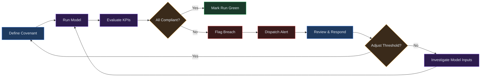
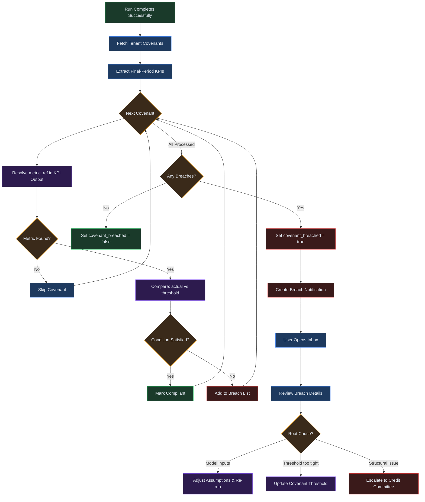

# Chapter 18 -- Covenants

## Overview

The Covenants module lets you define debt covenant thresholds against key financial
metrics and automatically evaluate them every time a model run completes. When a run
finishes, the system compares each covenant's threshold to the corresponding KPI
from the run output. If the actual metric violates the threshold, the covenant is
flagged as breached, a notification is dispatched, and the run is marked with a
breach indicator visible across the platform.

Covenants serve two audiences. Lenders and credit committees use them to monitor
borrower compliance with loan agreements. Internal finance teams use them as early
warning signals -- setting thresholds tighter than contractual limits so that
emerging risks surface before an actual default event.

Each covenant is composed of four elements:

| Element | Purpose |
|---|---|
| **Label** | A human-readable name (e.g. "Senior Debt DSCR Floor") |
| **Metric ref** | The KPI key from run output to evaluate (e.g. `dscr`) |
| **Operator** | The comparison direction: `>=`, `>`, `<=`, or `<` |
| **Threshold value** | The numeric limit the metric must satisfy |

Covenants are tenant-scoped -- every covenant applies to all future runs within
that tenant until it is deleted.

## Process Flow



1. **Define Covenant** -- Create one or more covenant definitions specifying the
   metric, operator, and threshold.
2. **Run Model** -- Execute a financial model run from any baseline.
3. **Evaluate KPIs** -- The system retrieves all covenant definitions for the
   tenant and compares each one against the run's KPI output.
4. **Determine Status** -- Each covenant is classified as compliant (condition
   holds) or breached (condition violated).
5. **Alert on Breach** -- If any covenants are breached, the run is flagged with
   `covenant_breached = true` and a notification is created listing the failures.

---

## Key Concepts

**Covenant Definition** -- A persistent rule consisting of a label, metric ref,
operator, and threshold value. Covenant IDs follow the format `cv_<12-char-hex>`
(e.g. `cv_8b3f10a2c7e4`).

**Metric Ref** -- A string key that maps to a KPI computed during model execution.
Ten metric refs are supported: `dscr`, `current_ratio`, `debt_equity`, `roe`,
`fcf`, `gross_margin_pct`, `ebitda_margin_pct`, `net_margin_pct`,
`revenue_growth_pct`, and `cash_conversion_cycle`.

**Threshold Value** -- The numeric boundary the metric must satisfy. A DSCR
covenant with operator `>=` and threshold `1.2` means the actual DSCR must be at
least 1.2 for the covenant to be compliant.

**Operator** -- Defines the comparison direction: `>=` (greater than or equal),
`>` (strictly greater), `<=` (less than or equal), `<` (strictly less).

**Compliance** -- A covenant is compliant when the actual metric value satisfies
the operator-threshold condition. If `dscr >= 1.2` and actual DSCR is 1.35, the
covenant is compliant.

**Breach** -- A covenant is breached when the actual value violates the condition.
If actual DSCR is 1.05, it is breached because 1.05 is not `>= 1.2`.

**Traffic-Light Indicator** -- Runs display covenant status using color-coded
indicators. Green means no breaches across all covenants. Red means one or more
breaches were detected. These appear on the Runs list and run detail pages.

---

## Step-by-Step Guide

### 1. Creating a Covenant

1. Navigate to **Covenants** from the sidebar.
2. In the **Create covenant** card at the top of the page, fill in all four
   fields: Label, Metric ref, Operator, and Threshold.
3. Click **Add covenant**.
4. The new covenant appears in the table below. A success toast confirms creation.

Each covenant is assigned a unique ID and an audit event is recorded.

### 2. Selecting Metrics and Operators

The **Metric ref** dropdown is populated from the server's list of allowed KPI
keys. You cannot enter arbitrary metric names -- the platform validates the metric
ref and rejects unknown values.

The **Operator** dropdown offers four choices:

| Operator | Reads as | Typical use |
|---|---|---|
| `>=` | "must be at least" | Floor covenants (DSCR, coverage ratios) |
| `>` | "must exceed" | Strict minimum thresholds |
| `<=` | "must not exceed" | Ceiling covenants (leverage ratios) |
| `<` | "must be below" | Strict maximum thresholds |

Most debt covenants use `>=` for floor tests and `<=` for ceiling tests.

### 3. Setting Threshold Values

Enter the threshold as a numeric value. The system accepts integers and decimals:

- DSCR floor: `1.2` (ratio must be at least 1.2x)
- Current ratio floor: `1.5`
- Debt-to-equity ceiling: `2.0` (ratio must not exceed 2.0x)
- Gross margin floor: `0.35` (margin must be at least 35%)

Percentage-based metrics are stored as decimals. A 35% gross margin is entered as
`0.35`, not `35`.

### 4. Linking to a Financial Run

Covenants are evaluated automatically -- there is no manual linking step. When a
model run completes successfully, the system:

1. Retrieves all covenant definitions for the tenant.
2. Extracts the KPI values from the final period of the run output.
3. Compares each covenant's metric ref against the corresponding KPI.
4. Marks the run's `covenant_breached` flag based on the results.

Covenants apply to every run within the tenant. To stop a covenant from being
evaluated, delete it from the Covenants page.

### 5. Reading the Compliance Dashboard

**Runs list page** -- Each row includes a covenant status indicator. Red appears
when `covenant_breached` is true; green when false.

**Run detail page** -- Shows the `covenant_breached` flag alongside run metadata.
When breaches are present, the notification body lists each breached covenant with
its label, metric ref, operator, threshold, and actual value.

### 6. Responding to Breach Alerts

When a breach is detected, the system creates a notification with type
`covenant_breach`. The notification body follows this format:

```
Run run_abc123: Senior Debt DSCR: dscr >= 1.2 (actual: 1.05); Max Leverage: debt_equity <= 2.0 (actual: 2.4)
```

To respond:

1. Open the notification from the Inbox (see Chapter 22).
2. Review which covenants were breached and by how much.
3. Investigate model assumptions -- revenue forecasts, cost drivers, funding terms.
4. Adjust inputs and re-run to test whether the breach resolves.
5. If the threshold is too aggressive, update or delete the covenant.

The following diagram shows the breach detection and response sub-workflow in
detail:



### 7. Tracking Covenant History

Covenant creation and deletion events are recorded in the audit trail. Each event
captures the action (`covenant.created` or `covenant.deleted`), the covenant ID,
the metric ref, operator, and threshold (for creation events), and a timestamp.

Breach history is tracked through run records. Every run stores its
`covenant_breached` flag permanently, so you can review historical runs to see
which ones triggered breaches over time.

---

## Covenant Evaluation Flow

```
[Covenant Defined by User]
       |
       v
[Model Run Triggered] --> [Run Engine Executes] --> [KPIs Computed]
       |
       v
[Fetch All Tenant Covenant Definitions]
       |
       v
[Select Final-Period KPIs from Run Output]
       |
       v
[For Each Covenant] --------+
       |                    |
       v                    |
[Resolve metric_ref]        |
    /          \             |
  Not found     Found        |
    |             |          |
    v             v          |
  [Skip]   [Compare: actual <op> threshold]
                /            \          |
          Satisfied        Violated     |
              |               |         |
              v               v         |
         [Compliant]   [Add to Breach List]
              |               |         |
              +-------+-------+         |
                      v                 |
               [Next Covenant] ---------+
                      |
                      v
              [Any Breaches?]
               /           \
             No             Yes
              |               |
              v               v
        [Flag: false]   [Flag: true + Create Notification]
              |               |
              +-------+-------+
                      v
             [Update Run Record] --> [Run Complete]
```

---

## Common Financial Covenants

The following table shows typical configurations. Adjust thresholds to match your
specific loan agreement terms.

| Covenant | Metric Ref | Operator | Threshold | Purpose |
|---|---|---|---|---|
| Debt Service Coverage | `dscr` | `>=` | 1.2 | Cash flow covers debt payments |
| Current Ratio | `current_ratio` | `>=` | 1.5 | Short-term liquidity |
| Debt-to-Equity | `debt_equity` | `<=` | 2.0 | Leverage cap |
| EBITDA Margin | `ebitda_margin_pct` | `>=` | 0.15 | Earnings adequacy |
| Gross Margin Floor | `gross_margin_pct` | `>=` | 0.30 | Core profitability |
| Net Margin Floor | `net_margin_pct` | `>=` | 0.05 | Bottom-line viability |
| Revenue Growth | `revenue_growth_pct` | `>=` | 0.10 | Minimum growth |
| Return on Equity | `roe` | `>=` | 0.08 | Minimum return |

---

## Quick Reference

| Task | How | Notes |
|---|---|---|
| Create a covenant | Covenants page > form > Add covenant | Label, metric ref, operator, threshold |
| View all covenants | Covenants page > table | Paginated at 20; search to filter |
| Delete a covenant | Table row > Delete > confirm | Permanent; creates audit event |
| Check allowed metrics | Metric ref dropdown | 10 metrics available from server |
| See breach status | Runs list or run detail page | Red/green indicator per run |
| Read breach details | Inbox notifications | Lists each breached covenant |
| Review audit trail | Audit log | `covenant.created`, `covenant.deleted` |
| Search covenants | Search toolbar above table | Filters by label, case-insensitive |

---

## Page Help

Every page in Virtual Analyst includes a floating **Instructions** button positioned in the bottom-right corner of the screen. On the Covenants page, clicking this button opens a help drawer that provides:

- Guidance on creating covenant definitions with labels, metric refs, operators, and thresholds.
- Step-by-step instructions for interpreting compliance indicators and responding to breach alerts.
- An explanation of supported metric refs and their mapping to model KPIs.
- Prerequisites and links to related chapters.

The help drawer can be dismissed by clicking outside it or pressing the close button. It is available on every page, so you can access context-sensitive guidance wherever you are in the platform.

---

## Troubleshooting

**Covenant not evaluating after a run completes**
Covenants are checked only at the end of successful runs. If a run fails or is
still in progress, covenants are not evaluated. Verify the run status is
`succeeded` and that covenant definitions exist for the current tenant.

**Wrong metric reference -- covenant never triggers**
The metric ref must match a KPI key produced by the model engine. If the baseline
lacks the required inputs for a metric, that covenant is silently skipped. Check
the run's KPI output to confirm the metric is present with a non-null value.

**False breach alerts -- threshold too aggressive**
If covenants breach on runs where the business is performing adequately, the
threshold may be too tight. Review actual metric values in the breach notification,
compare them to contractual levels, and adjust the threshold on the Covenants page.

**History not updating -- old runs unaffected**
Covenant evaluation only occurs when a new run completes. Existing runs are not
retroactively re-evaluated when definitions change. Re-run the model to test a new
covenant against existing assumptions.

**Cannot create covenant -- validation error on metric ref**
Use the metric ref dropdown rather than typing a custom value. The allowed set is:
`debt_equity`, `dscr`, `current_ratio`, `roe`, `fcf`, `gross_margin_pct`,
`ebitda_margin_pct`, `net_margin_pct`, `revenue_growth_pct`, `cash_conversion_cycle`.

**Covenant deleted but breach flag persists on old runs**
Deleting a covenant removes the definition going forward but does not clear breach
flags on previously evaluated runs. Historical flags are retained for audit integrity.

---

## Related Chapters

- [Chapter 14: Runs](14-runs.md) -- executing model runs that trigger covenant evaluation
- [Chapter 17: Budgets](17-budgets.md) -- budget assumptions that feed into the financial model
- [Chapter 22: Workflows, Tasks, and Inbox](22-workflows-and-tasks.md) -- receiving and acting on breach notifications
