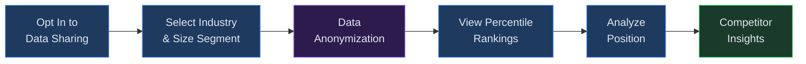
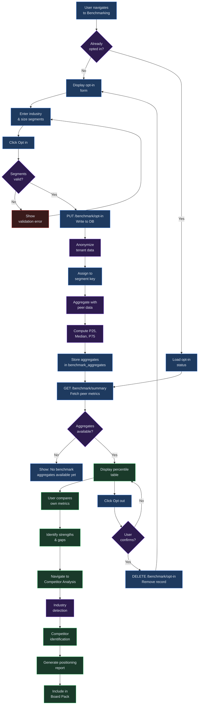

# Benchmarking and Competitor Analysis

## Overview

The Benchmarking module lets you compare your organization's financial performance against anonymized industry peers. By opting in to data sharing, your key metrics are contributed to an aggregate pool -- stripped of all identifying information -- and in return you gain access to percentile rankings that show where you stand relative to companies in your sector and size category. The companion Competitor Analysis feature layers competitive intelligence on top of those benchmarks, helping you identify peers, detect your industry positioning, and generate competitive positioning reports for stakeholders.

**Prerequisites:** At least one completed run with financial outputs. Benchmarking requires an active tenant with write-level permissions or above. The competitor analysis page is accessible to all authenticated users.

---

## Process Flow

---

## Key Concepts

| Concept | Description |
|---------|-------------|
| **Benchmarking** | The practice of comparing your financial metrics against a reference group of similar organizations. Virtual Analyst uses anonymized, aggregated data so no participant's identity is ever exposed. |
| **Peer Group** | The set of organizations that share your industry segment and size segment. Your metrics are compared only against peers in this group. A larger peer group produces more statistically meaningful percentiles. |
| **Percentile** | A ranking that indicates the percentage of peers at or below a given value. If your EBITDA margin is at the 75th percentile, 75% of peers in your segment reported an equal or lower margin. |
| **P25 / P50 / P75** | The 25th, 50th (median), and 75th percentile values for a metric within your peer group. P25 represents the lower quartile, P50 the middle, and P75 the upper quartile. Together they define the interquartile range. |
| **Anonymized Data** | Financial metrics contributed by opted-in tenants are stripped of all identifying information before aggregation. No company name, tenant ID, or user identity is included in the aggregate pool. |
| **Opt-In** | Participation in benchmarking is voluntary. You must explicitly opt in before your data is shared or before you can view peer summaries. You may opt out at any time. |
| **Competitor Analysis** | A complementary feature that identifies your industry positioning, detects likely competitors based on segment overlap, and produces competitive positioning reports. |

---

## Step-by-Step Guide

### 1. Opting In to Data Sharing

Benchmarking is entirely opt-in. No data leaves your tenant until you explicitly consent.

1. Navigate to **Benchmarking** in the ANALYZE section of the navigation bar.
2. If you have not yet opted in, the page displays an **Opt in** card with two input fields and an action button.
3. Fill in the **Industry segment** field with the sector that best describes your business (e.g., "SaaS", "Manufacturing", "Healthcare", "Retail"). This value is used to match you with peers in the same industry. If you are unsure, leave the default value of "general."
4. Fill in the **Size segment** field with a descriptor for your company size (e.g., "SMB", "Mid-Market", "Enterprise"). This further narrows your peer group to organizations of similar scale.
5. Click the **Opt in** button.

On success, a confirmation toast appears reading "Opted in to benchmarking." The page reloads to show your opt-in status and the peer summary table. Behind the scenes, the platform creates a record in the `tenant_benchmark_opt_in` table with your selected segments and a timestamp.

> **Note:** Opting in does not immediately populate benchmark data. Aggregates are computed periodically (typically within 24 hours) across all opted-in participants in your segment. Until aggregates are available, the peer summary section displays the message "No benchmark aggregates available yet."

### 2. Selecting Your Peer Group

Your peer group is determined by the combination of your industry segment and size segment. These two values form a **segment key** in the format `industry_segment|size_segment` (for example, `SaaS|SMB` or `Healthcare|Enterprise`).

To change your peer group after opting in:

1. On the Benchmarking page, note your current segment displayed beneath the "Opted in" heading (e.g., "Segment: SaaS - SMB").
2. Opt out using the process described in Section 7 below.
3. Opt in again with updated segment values.

Choose your segments thoughtfully. A segment that is too narrow (e.g., "Vertical SaaS for Dentists") may have too few peers for meaningful comparisons. A segment that is too broad (e.g., "general") may include dissimilar organizations that dilute the relevance of the benchmarks.

> **Tip:** The segment key displayed on the Benchmarking page after opt-in uses the format "Industry - Size" (e.g., "SaaS - SMB"). Internally, the system stores this as a pipe-delimited key (`SaaS|SMB`) for matching. You do not need to enter the pipe character yourself -- the platform constructs the key automatically from your two input fields.

### 3. Reading Percentile Rankings

Once benchmark aggregates are available for your segment, the **Peer summary** card on the Benchmarking page displays a table with the following columns:

| Column | Meaning |
|--------|---------|
| **Metric** | The financial KPI being compared (e.g., revenue_growth, ebitda_margin, net_income_margin). |
| **P25** | The 25th percentile value. One quarter of peers in your segment fall at or below this level. If no data is available, a dash is shown. |
| **Median** | The 50th percentile (P50). Half of peers are above this value and half are below. This is the central reference point for comparison. |
| **P75** | The 75th percentile value. Three quarters of peers fall at or below this level. Performing above P75 places you in the top quartile. |

To interpret your position, compare your own metric values (available on your Runs page and Dashboard) against the P25, Median, and P75 columns. For example:

- If your EBITDA margin is 18% and the peer median is 12%, you are outperforming the typical company in your segment.
- If your revenue growth is 8% and the P75 is 15%, your growth rate falls below the upper quartile, suggesting room for improvement relative to high-performing peers.

Each row also tracks a **sample count** (the number of tenants contributing to that metric) and a **computed at** timestamp indicating when the aggregate was last recalculated, though these values are used internally and not displayed in the table.

The metrics currently tracked in the benchmarking system include:

- **revenue_growth** -- Year-over-year revenue growth rate, expressed as a percentage.
- **ebitda_margin** -- Earnings before interest, taxes, depreciation, and amortization as a percentage of revenue.
- **net_income_margin** -- Net income as a percentage of revenue, reflecting overall profitability after all expenses.
- **operating_expense_ratio** -- Total operating expenses as a percentage of revenue.
- **current_ratio** -- Current assets divided by current liabilities, a measure of short-term liquidity.

Additional metrics may be added to the aggregation pool in future releases. The metrics displayed in your peer summary depend on which data points the participants in your segment have contributed.

### 4. Understanding Industry Segmentation

Segmentation is the foundation of meaningful benchmarking. The platform supports two dimensions of segmentation:

**Industry segment** groups organizations by business sector. Examples include:

- SaaS (Software as a Service)
- Manufacturing
- Healthcare
- Retail
- Financial Services
- Professional Services
- general (catch-all for organizations that do not fit a specific category)

**Size segment** groups organizations by scale. Examples include:

- Startup (pre-revenue or early-stage)
- SMB (small and medium businesses)
- Mid-Market
- Enterprise
- general (no size filtering)

The platform does not enforce a fixed taxonomy. Segment values are free-text strings (up to 64 characters), so organizations choose labels that best represent their context. For the most meaningful comparisons, use segment names that are commonly adopted by other participants in your industry.

The table below shows recommended segment combinations and their typical peer group characteristics:

| Industry Segment | Size Segment | Typical Peer Profile |
|------------------|--------------|---------------------|
| SaaS | SMB | Subscription-based software companies with under 200 employees |
| SaaS | Mid-Market | SaaS companies with 200-1,000 employees and established ARR |
| Manufacturing | Enterprise | Large-scale manufacturers with complex supply chains |
| Healthcare | SMB | Clinics, practices, and health-tech startups |
| Retail | Mid-Market | Multi-location retail operations with moderate revenue |
| Financial Services | Enterprise | Banks, insurers, and large financial institutions |
| general | general | Broadest possible peer group across all sectors and sizes |

### 5. Competitor Analysis

The Competitor Analysis page extends benchmarking with targeted competitive intelligence. Navigate to it from the ANALYZE section of the navigation bar by clicking **Compare**.

Key capabilities of competitor analysis include:

**Industry Detection.** The platform examines your financial structure -- revenue stream types, cost categories, and growth patterns -- to automatically suggest the industry segment that most closely matches your business. This detection helps ensure you are benchmarked against the right peer set.

**Competitor Identification.** Based on your segment and financial profile, the system identifies the subset of anonymized peers whose metrics most closely resemble yours. While individual identities are never revealed, you can see how many close competitors exist in your segment and how your metrics compare specifically against this narrower group.

**Feature Comparison.** The comparison page presents a structured table of capabilities and metrics, allowing you to evaluate your organization's strengths and gaps relative to the competitive landscape. Columns indicate support levels for each feature or metric, making it easy to identify areas of differentiation.

To use competitor analysis effectively:

1. Ensure you have opted in to benchmarking with accurate segment values. Industry detection relies on your financial data being available in the aggregation pool.
2. Navigate to the Competitor Analysis page and review the auto-detected industry suggestion. If the detected industry differs from your selected segment, consider updating your opt-in to align with the detection for more relevant peer matching.
3. Review the competitor count displayed on the page. This number reflects how many opted-in peers share your segment and have sufficiently similar financial profiles.
4. Use the comparison table to identify metrics where you lead or trail your closest competitors. Focus on the largest variances for strategic planning.

### 6. Competitive Positioning Reports

Competitive positioning reports synthesize your benchmarking data into a stakeholder-ready format. These reports are useful for board presentations, investor updates, and strategic planning sessions.

A positioning report typically includes:

- **Executive summary** -- Your overall ranking within the peer group, expressed as percentile positions across key metrics.
- **Metric-by-metric breakdown** -- Each tracked KPI with your value, the peer median, and your percentile rank.
- **Strengths and gaps** -- Metrics where you outperform the median (above P50) and metrics where you trail (below P50).
- **Trend analysis** -- How your percentile position has changed over time as new aggregates are computed.

Benchmark data can also be incorporated into Board Packs using the aggregates endpoint, which provides the raw percentile data in a format suitable for automated report assembly.

To generate a positioning report:

1. Navigate to the Benchmarking page and confirm that your peer summary table is populated with current aggregate data.
2. Review your metrics against the P25, Median, and P75 thresholds to understand your relative position.
3. Use the Board Pack builder (see [Chapter 22: Board Packs](22-board-packs.md)) to include the benchmark comparison section, which pulls data directly from the `/benchmark/aggregates` endpoint.
4. The report automatically categorizes each metric as a strength (above P50), neutral (near P50), or gap (below P50) and formats the results for presentation.

> **Tip:** Run a fresh model execution before generating a positioning report to ensure your own metrics are up to date. Stale run data compared against recently recomputed aggregates may produce misleading percentile positions.

### 7. Opting Out

You may opt out of benchmarking at any time. Opting out removes your data from future aggregate computations and revokes your access to peer summaries.

1. Navigate to the **Benchmarking** page.
2. In the "Opted in" card at the top of the page, click the **Opt out** button.
3. A confirmation dialog appears with the message "Your anonymized data will no longer be shared with peers." Click **Opt out** to confirm, or **Cancel** to keep your current participation.
4. On confirmation, a success toast appears reading "Opted out of benchmarking." The page reverts to the opt-in form.

> **Important:** Opting out removes your record from the `tenant_benchmark_opt_in` table. Your previously contributed data is excluded from future aggregate recalculations. However, aggregates that were computed before your opt-out may still reflect your historical contribution until the next recomputation cycle.

If you opt out and later decide to rejoin, you can opt in again at any time by returning to the Benchmarking page and completing the opt-in form. Your historical peer summary data is not retained between opt-out and re-enrollment -- you will start fresh with the aggregates available at the time of your new opt-in.

---

## Benchmarking Flow (detailed)

---

## Quick Reference

| Action | How |
|--------|-----|
| Open Benchmarking | Click **Benchmarking** in the ANALYZE section of the navigation |
| Opt in to data sharing | Enter industry and size segments, then click **Opt in** |
| View peer percentiles | After opting in, review the **Peer summary** table on the Benchmarking page |
| Change your peer group | Opt out, then opt in again with updated segment values |
| View competitor analysis | Navigate to **Compare** in the ANALYZE section |
| Include benchmarks in a Board Pack | Use the aggregates endpoint or Board Pack builder to pull percentile data |
| Opt out of benchmarking | Click **Opt out** on the Benchmarking page and confirm in the dialog |
| Check aggregate freshness | Review the computed_at timestamp returned with each metric (available via API) |

---

## Page Help

Every page in Virtual Analyst includes a floating **Instructions** button positioned in the bottom-right corner of the screen. On the Benchmarking page, clicking this button opens a help drawer that provides:

- Guidance on opting in to benchmarking and selecting your industry segment and size category.
- Step-by-step instructions for viewing peer summaries, percentile rankings, and competitor analysis.
- An explanation of how anonymized benchmark aggregates are computed and updated.
- Prerequisites and links to related chapters.

The help drawer can be dismissed by clicking outside it or pressing the close button. It is available on every page, so you can access context-sensitive guidance wherever you are in the platform.

---

## Troubleshooting

| Symptom | Cause | Resolution |
|---------|-------|------------|
| No peers in segment | Your segment combination is too narrow; few or no other tenants share the same industry and size values. | Broaden your segment criteria. Use more common labels such as "SaaS" instead of niche descriptors. If you are uncertain, use "general" for one or both dimensions. |
| Opt-in not reflected in peer summary | Benchmark aggregates are computed periodically, not in real time. New opt-ins take up to 24 hours to appear in aggregates. | Wait for the next aggregation cycle. Check back after 24 hours. The "No benchmark aggregates available yet" message is expected during this interval. |
| Competitor data unavailable | Competitor analysis is limited to organizations that have opted in to benchmarking. If few peers in your segment have opted in, competitor insights will be sparse. | Encourage peers and industry contacts to opt in. As participation grows, competitor analysis becomes more comprehensive. |
| Percentiles look wrong | Metric definitions may differ between your model and the aggregated peer data, or the sample count may be too small for statistical reliability. | Check that your revenue growth, EBITDA margin, and other metrics use standard definitions. Review the sample count column -- percentiles from fewer than five participants may not be representative. |
| "Opt in to benchmarking to view peer summary" error | You attempted to access the summary endpoint without first opting in. | Navigate to the Benchmarking page and complete the opt-in process before viewing peer data. |
| Error alert on Benchmarking page | A network error or server-side failure occurred while loading benchmark data. | The error message is displayed in a red banner at the top of the page. Refresh the page to retry. If the problem persists, check your network connection or contact support. |
| Opt-out confirmation not appearing | The confirmation dialog may be blocked by browser popup settings or JavaScript errors. | Ensure JavaScript is enabled and that popup blockers are not interfering. Try a different browser if the issue persists. |

---

## Related Chapters

- [Chapter 14: Runs](14-runs.md) -- Executing model runs that produce the financial metrics used in benchmarking.
- [Chapter 20: Entity Comparison](20-entity-comparison.md) -- Side-by-side comparison of entities, which complements peer benchmarking with internal analysis.
- [Chapter 26: Settings and Administration](26-settings-and-admin.md) -- Managing tenant-level settings including data sharing preferences and audit logs.
