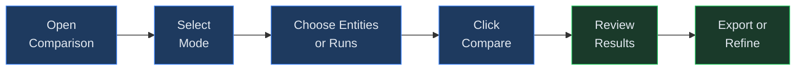
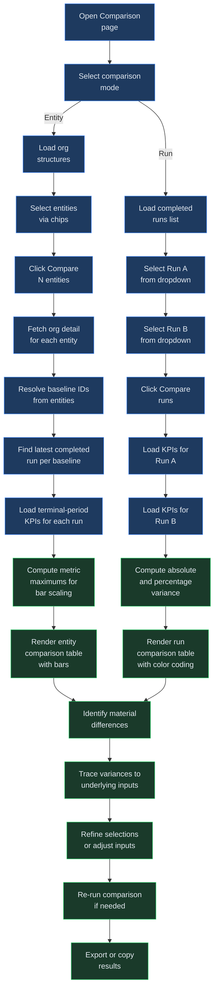

# Entity Comparison

## Overview

The Comparison page lets you evaluate financial performance across different dimensions by placing results side by side. Virtual Analyst provides two distinct comparison modes, each designed for a different analytical question.

**Entity Comparison** answers "How do my organizational entities perform relative to each other?" It pulls the latest completed run KPIs for each selected entity and presents them in a unified table with proportional bar charts, making it straightforward to see which entities lead or lag across core financial metrics. This mode is especially useful during group-level planning when you need to assess relative performance across subsidiaries, divisions, or business units within the same organizational hierarchy.

**Run Comparison** answers "How did the outputs of two specific runs differ?" It loads the terminal-period KPIs from any two completed runs and computes the absolute and percentage variance for every metric. This mode supports variance analysis between planning cycles, scenario outputs, or pre- and post-adjustment model runs. Because it dynamically surfaces every numeric KPI field from both runs, it can reveal differences in custom metrics that may not appear in the fixed entity comparison view.

Both modes display results in a structured table with inline visual indicators -- horizontal bars for entity comparison, color-coded variance columns for run comparison -- so that material differences are immediately visible without requiring manual calculation. The comparison page is accessible from the main navigation and requires at least one completed run to produce results.

### When to Use Each Mode

**Use entity comparison when:**
- You manage a group with multiple subsidiaries or business units and need to compare their current financial position.
- You want to identify the best- and worst-performing entities across standardized KPIs during a board review or planning cycle.
- You are evaluating whether to allocate additional resources to a specific entity based on relative performance.
- You want a quick visual check of financial health across the group before a board meeting or quarterly review.

**Use run comparison when:**
- You have executed a run before and after adjusting assumptions and want to quantify the impact of those changes.
- You need to compare a scenario run against the base case to measure the effect of optimistic or pessimistic overrides.
- You are performing period-over-period analysis by comparing runs from different forecast cycles against the same baseline.
- You want to validate that a changeset produced the expected directional impact on key metrics.
- You are debugging an unexpected result in a recent run and need to compare it against a known-good prior run to isolate what changed.

## Process Flow

## Key Concepts

| Concept | Description |
|---------|-------------|
| **Entity Comparison** | A mode that retrieves the latest completed run for each selected organizational entity and displays their KPIs in a shared table. Entities are drawn from your org structures. |
| **Run Comparison** | A mode that places two specific completed runs side by side, computing the absolute difference and percentage change for every KPI. Useful for variance analysis between planning cycles or scenario outputs. |
| **Variance** | The numeric difference between two values. In run comparison, variance is calculated as Run B minus Run A, with positive values shown in green and negative values shown in red. Percentage variance is computed relative to the absolute value of Run A. |
| **KPI (Key Performance Indicator)** | A summary financial metric extracted from a completed run. The standard KPIs displayed in entity comparison are Revenue, EBITDA, Gross Profit, Net Income, FCF, and EBIT. Run comparison displays all available KPI fields. |
| **Side-by-Side View** | The tabular layout that places entity columns or run columns next to each other with a shared metric axis on the left. Each entity or run occupies its own column, allowing row-by-row comparison. |
| **Variance Driver** | The underlying assumption or input change that explains a material variance between two runs. Identifying variance drivers typically involves tracing a KPI difference back to the scenario overrides or baseline edits that caused it. |
| **Terminal Period** | The final forecast period in a run's output. Comparison tables display terminal-period KPIs to show the end-state financial position rather than intermediate periods. |

## Step-by-Step Guide

### 1. Choosing Comparison Mode

When you open the Comparison page, two mode buttons appear at the top of the screen: **Entity comparison** and **Run comparison**. Click the appropriate button to switch between modes. The active mode is highlighted with a primary (filled) button style while the inactive mode appears as a ghost (outlined) button. The page content below updates immediately to show the controls relevant to the selected mode.

Entity comparison is the default mode and is best suited for cross-entity benchmarking within a group. Choose this when you want to see how multiple business units, subsidiaries, or divisions compare on the same set of financial KPIs at a glance.

Run comparison is better for tracking how a single entity's outputs changed between two model executions. Choose this when you want to quantify the impact of revised assumptions, applied changesets, or different scenario configurations -- for example, comparing a pre-adjustment run against a post-adjustment run to isolate the effect of a single variable change.

You can switch between modes at any time without losing your previous selections. However, clicking compare in one mode does not carry results into the other mode -- each mode maintains its own independent result state.

### 2. Entity Comparison: Selecting Entities

In entity comparison mode, the page loads all org structures associated with your tenant and displays them as selectable chips inside a card titled "Select entities to compare." Each chip shows the entity group name. Click a chip to select it -- it highlights with a blue border and tinted background to indicate selection. Click it again to deselect it. You can select any number of entities for comparison.

While entities are loading, a spinner with the label "Loading entities..." is displayed. Once loading completes, the chip selector appears along with a compare button.

Once you have made your selections, click the **Compare N entities** button at the bottom of the selector card. The button label updates dynamically to reflect how many entities you have selected (e.g., "Compare 3 entities"). While the comparison is running, the button label changes to "Comparing..." and becomes disabled to prevent duplicate requests.

If no org structures exist, the card displays the message "No entities found. Create org structures first." You will need to set up at least one org structure in the Org Structures section before entity comparison is available. See [Chapter 09: Org Structures](09-org-structures.md) for instructions.

**How entity data is resolved.** Behind the scenes, when you click compare, the system performs several steps for each selected entity:

1. It fetches the full org structure detail to retrieve the list of sub-entities and their associated baseline IDs.
2. For each baseline ID found, it searches for the most recent completed run.
3. It loads the KPI array from that run and extracts the terminal (last) period's values.
4. If any step fails -- no baselines linked, no completed runs, or a network error -- the entity's column shows the specific error rather than blocking the entire comparison.

This resolution runs in parallel across all selected entities, so comparing five entities takes roughly the same time as comparing two.

**Currency considerations.** Each org structure has a reporting currency. When comparing entities with different reporting currencies, be aware that the KPI values are displayed in each entity's native currency without conversion. The comparison table does not perform currency translation, so a direct numeric comparison between entities using different currencies may be misleading. For accurate cross-currency comparison, ensure all entities in the comparison use the same reporting currency, or perform the conversion externally after export.

### 3. Run Comparison: Selecting Runs

In run comparison mode, two dropdown selectors appear labeled **Run A** and **Run B**. Each dropdown is populated with all completed runs from your tenant, up to the 50 most recent. Select one run in each dropdown. The run identifiers are displayed as run IDs in the dropdown options.

Run A represents the baseline or "before" state, and Run B represents the comparison or "after" state. The variance calculation uses Run A as the denominator for percentage change, so the order of selection matters. If you want to measure "how much did performance improve from the earlier run to the later run," place the earlier run in Run A and the later run in Run B.

Click the **Compare runs** button to execute the comparison. The button is disabled until both dropdowns have a selection and the two selections are different -- comparing a run against itself is not permitted. While the comparison is in progress, the button label changes to "Comparing..." and input is disabled.

The dropdown lists show up to 50 completed runs, sorted by recency. If the run you need is not visible, it may have a status other than "completed" (such as "failed" or "running"). Navigate to the Runs section to verify the run's status. Only completed runs produce KPI outputs that can be compared.

### 4. Choosing Metrics to Compare

In entity comparison mode, the system uses a fixed set of six core financial KPIs:

- **Revenue** -- Total top-line revenue for the terminal forecast period.
- **EBITDA** -- Earnings before interest, taxes, depreciation, and amortization.
- **Gross Profit** -- Revenue minus cost of goods sold.
- **Net Income** -- Bottom-line profit after all expenses, interest, and taxes.
- **FCF** -- Free cash flow available after capital expenditures.
- **EBIT** -- Earnings before interest and taxes.

These are displayed as rows in the comparison table. All six metrics are always shown; there is no metric filtering step required.

In run comparison mode, the system displays every numeric KPI field present in either run's terminal-period output. The metric list is derived dynamically from the union of all keys in both runs' KPI objects (excluding the `period` field). Metric labels are generated by replacing underscores with spaces and capitalizing the result. This means that if a run includes custom KPI fields beyond the standard six, they will appear automatically in the comparison table.

If you need to focus on a specific subset of metrics, use the comparison table as a starting point and filter further in an exported spreadsheet. The full metric set is always displayed in the application to ensure no variance is overlooked.

### 5. Reading the Comparison View

**Entity comparison table.** The table has one column per selected entity and one row per metric. Entity names appear as column headers. Each cell displays two elements: a small horizontal bar (scaled proportionally to the maximum value across all entities for that metric) and the formatted numeric value in monospace type beside it. This combined bar-and-number layout lets you quickly spot which entity leads or lags on each metric. The bar width is calculated as the entity's value divided by the maximum value for that metric, so the entity with the highest value for a given row always has a full-width bar.

If an entity has no completed run, or no baselines are linked to it, the cell shows a red error message instead of a value. Common messages include "No baselines linked to entity" (when the org structure's entities lack baseline IDs) and "No completed runs for this entity" (when baselines exist but no run has finished).

Alternating row backgrounds (subtle striping) improve readability when comparing many entities. The table scrolls horizontally on smaller screens to accommodate additional entity columns without truncation. The minimum table width is 600 pixels, so on very narrow viewports the horizontal scroll becomes essential.

**Run comparison table.** The table has four columns: Metric, Run A (showing the first 12 characters of the run ID), Run B (showing the first 12 characters of the run ID), and Variance. Metric values are displayed in monospace type and formatted with thousands separators.

The Variance column shows the absolute difference and, where applicable, the percentage change in parentheses. The formatting follows these conventions:

- **Positive variance** -- Green text with a "+" prefix (e.g., "+150,000 (+12.5%)"). This indicates Run B has a higher value than Run A.
- **Negative variance** -- Red text (e.g., "-80,000 (-6.2%)"). This indicates Run B has a lower value than Run A.
- **Zero variance** -- Standard text color with no prefix.
- **Incalculable variance** -- A dash ("--") is shown when a metric is present in one run but not the other, or when Run A's value is zero (making percentage calculation undefined).

**Interpreting the results.** When reviewing a run comparison, start by scanning the Variance column for the largest absolute values and the largest percentage changes. A small absolute variance with a large percentage change may indicate a metric that started from a low base, while a large absolute variance with a small percentage may indicate a high-base metric where even modest percentage shifts translate to significant dollar amounts. Both patterns are worth investigating, but they require different analytical approaches.

For entity comparisons, look for entities where the bar length is dramatically shorter or longer than the group average. These outliers warrant deeper investigation -- they may reflect genuine performance differences, data quality issues, or structural differences in how the entity's baseline is configured.

### 6. Analyzing Variance Drivers

The comparison table identifies where differences exist but does not automatically explain why they exist. To perform a thorough variance driver analysis, follow this process:

1. **Identify material variances.** Scan the Variance column (in run comparison) or compare bar lengths (in entity comparison) to find the metrics with the largest absolute or percentage differences. Focus on variances that exceed your materiality threshold rather than investigating every small fluctuation.

2. **Trace to run inputs.** Navigate to the Runs section and open each run to review the baseline, scenario, and changeset that produced it. Differences in scenario overrides are the most common source of variance between runs. Compare the override lists of the two runs to identify which assumptions were changed and by how much.

3. **Check assumption frameworks.** If entities in an entity comparison show unexpected differences, verify that they use compatible baseline structures. Entities built on different templates may have fundamentally different cost structures, revenue recognition methods, or depreciation schedules that explain the variance independently of performance differences.

4. **Review changesets.** If a run comparison shows unexpected changes, check whether a changeset was applied between the two runs that modified key assumptions. Changesets can alter multiple variables simultaneously, and the interaction effects may produce variances larger than any single change would suggest.

5. **Cross-reference with scenarios.** If either run was produced under a scenario, open the Scenarios section to review the scenario's overrides. A scenario that adjusts revenue growth by 5 percentage points will cascade through gross profit, EBITDA, and net income, producing amplified variances at each level.

6. **Document findings.** Record which inputs drove each material variance. This documentation is valuable for stakeholder presentations, audit trails, and future planning cycle reviews.

7. **Iterate if needed.** If the driver analysis reveals that the variance stems from an incorrect assumption rather than a genuine performance difference, correct the assumption in the baseline or scenario, re-run the model, and then re-compare to confirm the variance is resolved.

For systematic variance analysis across many metrics, consider exporting the comparison results and performing the driver decomposition in a spreadsheet, where you can build waterfall charts or bridge analyses to visualize how individual input changes contribute to the total variance. This approach is especially useful when presenting variance explanations to non-technical stakeholders who benefit from visual decompositions.

### 7. Exporting Results

To capture comparison results for external use, you have several options:

**Copy and paste.** Select the comparison table in your browser and paste it into a spreadsheet application such as Excel or Google Sheets. The table is rendered in standard HTML, so the columnar structure is preserved on paste. This is the fastest method for ad hoc analysis.

**Browser print to PDF.** Use your browser's print functionality (Ctrl+P or Cmd+P) to generate a PDF of the comparison view. The page layout is designed to render cleanly in print mode, with the comparison table centered and properly formatted.

**Screenshot capture.** For inclusion in presentations or reports, use your operating system's screenshot tool to capture the comparison table along with its visual indicators (bars and color coding). This preserves the color-coded variance highlighting that is lost in a plain text copy.

For run comparison results, the combination of absolute and percentage variance values in the export provides a self-contained summary that does not require reference back to the individual runs. Each row includes both the raw values and the computed difference, so the exported data is complete for downstream analysis.

**Tips for effective exports:**

- When pasting into a spreadsheet, use "Paste as values" if you only need the numbers. Use the default paste to preserve formatting and column widths.
- For entity comparisons with many entities, scroll the table fully to the right before selecting to ensure all columns are captured.
- If you need to share comparison results with stakeholders who do not have Virtual Analyst access, the browser print-to-PDF method produces a self-contained document that includes all visual formatting.
- Label exported files with the comparison date and entity or run identifiers so they remain traceable in your records.
- For recurring comparisons (e.g., monthly entity benchmarking), establish a consistent export naming convention such as `entity-comparison-YYYY-MM.xlsx` to build a historical archive.

## Comparison Workflow (detailed)

The workflow diagram above shows both comparison paths from a single entry point. The entity path (left branch) involves four data-resolution steps -- fetching org details, resolving baseline IDs, finding the latest completed run per baseline, and loading terminal-period KPIs -- before results can be rendered. The run path (right branch) is simpler because run IDs are selected directly, requiring only two KPI fetch operations. Both paths converge at the analysis and export stages.

Note that the entity comparison path executes all entity lookups and KPI fetches in parallel. If one entity fails (e.g., no baseline linked), the others still succeed and display their results. The failing entity shows an inline error in the comparison table rather than blocking the entire comparison.

The run comparison path is simpler because you select runs directly by ID, bypassing the org structure and baseline resolution steps. This makes run comparison faster to execute and less likely to encounter resolution errors. However, it requires that you already know which two runs you want to compare -- if you are unsure, navigate to the Runs section first to review the run history and identify the correct IDs.

## Quick Reference

| Action | How |
|--------|-----|
| Switch to entity comparison mode | Click the **Entity comparison** button at the top of the Comparison page |
| Switch to run comparison mode | Click the **Run comparison** button at the top of the Comparison page |
| Select entities for comparison | Click entity chips in the selector card; selected entities highlight in blue |
| Deselect an entity | Click its chip again to toggle it off |
| Run an entity comparison | Click **Compare N entities** after selecting at least one entity |
| Select runs for comparison | Choose Run A and Run B from the dropdown selectors |
| Run a run comparison | Click **Compare runs** after selecting two different runs |
| Read variance direction | Green text with "+" indicates Run B exceeds Run A; red text indicates Run B is lower |

## Troubleshooting

| Symptom | Cause | Resolution |
|---------|-------|------------|
| "No entities found. Create org structures first." | No org structures have been created for the current tenant. | Navigate to the Org Structures section and create at least one org structure with entities before returning to the comparison page. See [Chapter 09: Org Structures](09-org-structures.md). |
| Entity shows "No baselines linked to entity" | The selected entity's sub-entities do not have baseline IDs assigned. | Open the org structure and link each entity to a baseline. Without a baseline, the system cannot locate runs to compare. See [Chapter 10: Baselines](10-baselines.md). |
| Entity shows "No completed runs for this entity" | No run with status "completed" exists for the baselines associated with the entity. | Execute a run against the entity's baseline and wait for it to complete. See [Chapter 14: Runs](14-runs.md). |
| Metric values show a dash instead of a number | The KPI field is not present or is non-numeric in the run output. | Verify that the run completed successfully and that the financial engine produced the expected KPI fields. Re-run the model if necessary. |
| Run comparison shows unexpected metric names | Run outputs contain custom or non-standard KPI fields from the financial engine. | The run comparison dynamically displays all numeric fields from the KPI output. Custom fields are included automatically. This is expected behavior. |
| Entities appear to have incomparable metrics | Entities are built on different assumption frameworks or templates, producing structurally different KPIs. | Ensure compared entities use the same or compatible baseline templates so that KPI definitions align across the comparison. |
| Compare button remains disabled | In run comparison, the same run is selected in both dropdowns, or one dropdown is empty. | Select two different runs. Both Run A and Run B must be set, and they cannot reference the same run ID. |
| Percentage variance shows as incalculable | Run A's value for the metric is zero, making division undefined. | A zero base value means percentage change cannot be computed. The absolute variance is still displayed. Review Run A to determine whether the zero value is expected. |
| Loading spinner does not resolve | Network error or authentication session expired while fetching org structures or run lists. | Refresh the page to re-establish the session. If the issue persists, verify your network connection and log in again. |
| Entity comparison results appear stale | The comparison uses the latest completed run at the time the compare button is clicked. If a new run completed after the comparison, the old results are still displayed. | Click **Compare** again to refresh the results with the most recent completed runs. |
| Too many entities make the table hard to read | The table extends horizontally with many columns, requiring horizontal scrolling. | Compare entities in smaller batches of three to five for readability, or export the full comparison to a spreadsheet where you can apply filters and formatting. |
| Variance percentages seem unexpectedly large | Run A has a very small base value, amplifying the percentage calculation even for modest absolute changes. | Focus on the absolute variance for metrics with small base values. Percentage variance is most meaningful when the base value is substantial. |

## Related Chapters

- [Chapter 09: Org Structures](09-org-structures.md)
- [Chapter 14: Runs](14-runs.md)
- [Chapter 12: Scenarios](12-scenarios.md)
- [Chapter 13: Changesets](13-changesets.md)
- [Chapter 19: Benchmarking and Competitor Analysis](19-benchmarking.md)
