# Ventures

## Overview

Ventures is a guided wizard that helps you build a financial model from scratch by answering a structured questionnaire. Instead of manually configuring every assumption, you select an industry template, answer targeted questions about your business, and let AI generate a complete set of initial financial assumptions as a draft workspace.

The wizard is designed for founders, analysts, and finance teams who need to stand up a financial model quickly. The AI-generated assumptions include confidence ratings and evidence citations so you know exactly which values are grounded in your inputs, which are drawn from industry benchmarks, and which are placeholders that require verification.

**Prerequisites:** Familiarity with the template catalog is helpful. See [Chapter 03: Marketplace](03-marketplace.md) for browsing available templates. Understanding drafts is also recommended; see [Chapter 11: Drafts](11-drafts.md) for details on editing and committing draft workspaces.

---

## Process Flow

The diagram below illustrates the end-to-end Ventures workflow, from template selection through to a usable draft:

```mermaid
flowchart LR
    A[Select Template] --> B[Create Venture]
    B --> C[Load Question Plan]
    C --> D[Answer Questions]
    D --> E[Save Answers]
    E --> F{Ready to Generate?}
    F -->|More answers needed| D
    F -->|Yes| G[Generate Draft with AI]
    G --> H[AI Builds Prompt]
    H --> I[LLM Generates Assumptions]
    I --> J[Create Draft Session]
    J --> K[Merge Assumptions into Workspace]
    K --> L[Draft Ready for Editing]

    style A fill:#1e3a5f,stroke:#3b82f6,color:#e2e8f0
    style B fill:#1e3a5f,stroke:#3b82f6,color:#e2e8f0
    style C fill:#1e3a5f,stroke:#3b82f6,color:#e2e8f0
    style D fill:#1a3a2a,stroke:#22c55e,color:#e2e8f0
    style E fill:#1a3a2a,stroke:#22c55e,color:#e2e8f0
    style F fill:#2d1b4e,stroke:#8b5cf6,color:#e2e8f0
    style G fill:#2d1b4e,stroke:#8b5cf6,color:#e2e8f0
    style H fill:#2d1b4e,stroke:#8b5cf6,color:#e2e8f0
    style I fill:#2d1b4e,stroke:#8b5cf6,color:#e2e8f0
    style J fill:#1a3a2a,stroke:#22c55e,color:#e2e8f0
    style K fill:#1a3a2a,stroke:#22c55e,color:#e2e8f0
    style L fill:#1a3a2a,stroke:#22c55e,color:#e2e8f0
```

---

## Key Concepts

| Term | Definition |
|------|------------|
| **Venture** | A wizard session that pairs a template with your questionnaire answers. Each venture receives a unique ID (e.g., `vc_a1b2c3d4e5f6`) and persists its state so you can return to it later. |
| **Template** | A preconfigured industry blueprint that defines the question plan, driver blueprint, default distributions, and scenario templates for a specific business model family. |
| **Question Plan** | A structured set of sections and questions within a template. Sections group related questions (e.g., "Revenue Streams", "Working Capital"), and each question has an ID and prompt text. |
| **AI-Generated Assumptions** | The JSON output produced by the LLM after processing your answers. Assumptions cover revenue streams, cost structure, working capital, CapEx, and funding, populated according to the template's driver blueprint. |
| **Confidence Level** | A rating attached to every AI-generated numeric value: **high** (directly from your input or a named benchmark), **medium** (reasonable inference from your answers), or **low** (placeholder requiring your verification). |
| **Evidence Citation** | A source reference attached to every AI-generated numeric value. Citations identify whether the value came from your questionnaire answers, a specific industry benchmark, or is a default placeholder. |
| **Draft Workspace** | The editable JSON document created at the end of the venture process. It contains assumptions, driver blueprints, distributions, and scenarios, ready for refinement in the draft editor. |

---

## Step-by-Step Guide

### 1. Creating a Venture

To start the Ventures wizard:

1. Navigate to the **Ventures** page from the sidebar.
2. In the **New venture** card, you will see two input fields:
   - **Template ID** -- The identifier of the template you want to use (e.g., `saas_b2b`, `manufacturing_discrete`).
   - **Entity name** -- A descriptive name for the business entity being modeled (e.g., "Acme SaaS", "MegaFactory South").
3. Click **Create venture**.
4. The system validates the template ID, creates a venture record, and returns the question plan for your selected template. If the template ID is invalid, an error message is displayed.

### 2. Selecting a Template

Each template is tailored to a specific business model family and includes an industry-appropriate question plan. Refer to the **Available Templates** table below for the full list.

When choosing a template, consider:

- **Business model family** -- Does it match your primary revenue model (subscription, transactional, billable hours, manufacturing)?
- **Question coverage** -- Review the question plan sections to confirm they address the areas relevant to your business.
- **Driver blueprint** -- Each template includes a preconfigured driver graph. For example, the SaaS template models customer acquisition, churn, and ARPA, while the Manufacturing template models capacity, utilization, and yield.

### 3. Answering the Questionnaire

After creating a venture, the questionnaire card appears with sections and questions from the template's question plan.

1. Each section (e.g., "Revenue Streams", "Capacity & Operations", "Working Capital") contains one or more questions.
2. Read each question carefully. Questions ask for specific data points such as unit prices, volume targets, margin percentages, AR/AP days, and competitive advantages.
3. Enter your answers in the text fields provided beneath each question. Be as specific and quantitative as possible -- the AI uses your answers as primary evidence for generating assumptions.
4. If you do not have an exact figure, provide a reasonable range or state that you are unsure. The AI will assign a lower confidence rating to assumptions derived from incomplete answers.

> **Tip:** The more detailed and quantitative your answers, the higher the confidence ratings on the generated assumptions. Vague answers such as "some revenue" produce low-confidence placeholders, while specific answers such as "150 units per month at $45 per unit" produce high-confidence values.

### 4. Saving Your Answers

Before generating a draft, save your answers to persist them:

1. Click **Save answers** in the questionnaire card. This submits your current answers to the server and stores them against the venture record.
2. You can save answers incrementally -- fill in a few sections, save, and return later to complete the rest.
3. Saving merges new answers with any previously saved answers for the same venture, so earlier responses are not overwritten unless you change them.

### 5. Generating a Draft with AI

Once your answers are saved, generate the AI-powered draft:

1. Click **Generate draft** in the questionnaire card.
2. The system builds an LLM prompt that includes:
   - Your questionnaire answers.
   - The question plan (for context on what was asked).
   - The template label and entity name.
   - Strict rules: no hallucination, cite evidence, include `_confidence` and `_evidence` fields on every numeric value.
3. The LLM processes the prompt and returns a structured JSON object containing `assumptions` with sections for revenue streams, cost structure, working capital, CapEx, and funding as appropriate to the template.
4. The system creates a new draft session, initializes an empty workspace, loads the template's driver blueprint and default distributions, and deep-merges the AI-generated assumptions into the workspace.
5. On success, the **Draft created** card appears displaying the new draft session ID (e.g., `ds_f7e8d9c0a1b2`).

> **Note:** AI generation typically takes 10-30 seconds depending on the complexity of the template and the length of your answers. If generation fails, check that your answers are complete and retry.

### 6. Understanding AI Confidence and Evidence

Every numeric value in the AI-generated assumptions includes two companion fields:

- **`_confidence`** -- One of three levels:
  - **high** -- The value was taken directly from your questionnaire answer or a named, citable industry benchmark.
  - **medium** -- The value was inferred from your answers with reasonable assumptions (e.g., deriving monthly volume from an annual target).
  - **low** -- The value is a placeholder or rough estimate. These values require your review and should be replaced with verified figures before committing the draft.

- **`_evidence`** -- A text string citing the source. Examples:
  - "User input: 150 units/month at $45/unit"
  - "Industry benchmark: median SaaS gross margin 72-78% (Bessemer Cloud Index)"
  - "Placeholder: no data provided, using industry median"

When reviewing the generated draft, prioritize reviewing and updating all **low** confidence values first, then verify **medium** confidence values against your own data.

### 7. Transitioning to the Draft Editor

After generation, your venture has produced a fully initialized draft workspace:

1. Copy the draft session ID from the **Draft created** card.
2. Navigate to the **Drafts** page and locate your new draft, or navigate directly using the session ID.
3. The draft workspace is pre-populated with:
   - **Assumptions** -- AI-generated values organized by revenue streams, cost structure, working capital, and other categories.
   - **Driver blueprint** -- The template's node-edge graph defining how drivers flow into financial outputs.
   - **Default distributions** -- Probability distributions for Monte Carlo simulation, sourced from the template defaults.
4. From here, use the standard draft editing tools to refine assumptions, run integrity checks, and eventually commit the draft to create a baseline. See [Chapter 11: Drafts](11-drafts.md) for the full editing workflow.

---

## Venture Creation Flow

The following diagram shows the detailed internal flow from venture creation through to a ready draft, including backend processing steps:

```mermaid
flowchart TD
    A[User enters Template ID and Entity Name] --> B[POST /ventures]
    B --> C{Template exists?}
    C -->|No| D[Return 404 Error]
    C -->|Yes| E[Generate Venture ID]
    E --> F[Save Venture State to Store]
    F --> G[Return venture_id + question_plan]
    G --> H[Display Questionnaire Sections]
    H --> I[User Answers Questions]
    I --> J[POST /ventures/:id/answers]
    J --> K[Merge Answers into Venture State]
    K --> L{More answers?}
    L -->|Yes| I
    L -->|No| M[POST /ventures/:id/generate-draft]
    M --> N[Load Venture State]
    N --> O[Load Template Config]
    O --> P[Build LLM Prompt with Rules]
    P --> Q[Send to LLM Router]
    Q --> R[Parse JSON Response]
    R --> S[Create Draft Session ID]
    S --> T[Initialize Empty Workspace]
    T --> U[Attach Driver Blueprint from Template]
    U --> V[Deep-Merge AI Assumptions into Workspace]
    V --> W[Attach Default Distributions]
    W --> X[Insert Draft Session into Database]
    X --> Y[Save Workspace to Artifact Store]
    Y --> Z[Record Audit Event]
    Z --> AA[Return draft_session_id]

    style A fill:#1e3a5f,stroke:#3b82f6,color:#e2e8f0
    style B fill:#1e3a5f,stroke:#3b82f6,color:#e2e8f0
    style D fill:#3a1a1a,stroke:#ef4444,color:#e2e8f0
    style E fill:#1e3a5f,stroke:#3b82f6,color:#e2e8f0
    style F fill:#1e3a5f,stroke:#3b82f6,color:#e2e8f0
    style G fill:#1a3a2a,stroke:#22c55e,color:#e2e8f0
    style H fill:#1a3a2a,stroke:#22c55e,color:#e2e8f0
    style I fill:#1a3a2a,stroke:#22c55e,color:#e2e8f0
    style J fill:#1e3a5f,stroke:#3b82f6,color:#e2e8f0
    style K fill:#1e3a5f,stroke:#3b82f6,color:#e2e8f0
    style L fill:#2d1b4e,stroke:#8b5cf6,color:#e2e8f0
    style M fill:#2d1b4e,stroke:#8b5cf6,color:#e2e8f0
    style N fill:#2d1b4e,stroke:#8b5cf6,color:#e2e8f0
    style O fill:#2d1b4e,stroke:#8b5cf6,color:#e2e8f0
    style P fill:#2d1b4e,stroke:#8b5cf6,color:#e2e8f0
    style Q fill:#2d1b4e,stroke:#8b5cf6,color:#e2e8f0
    style R fill:#2d1b4e,stroke:#8b5cf6,color:#e2e8f0
    style S fill:#1a3a2a,stroke:#22c55e,color:#e2e8f0
    style T fill:#1a3a2a,stroke:#22c55e,color:#e2e8f0
    style U fill:#1a3a2a,stroke:#22c55e,color:#e2e8f0
    style V fill:#1a3a2a,stroke:#22c55e,color:#e2e8f0
    style W fill:#1a3a2a,stroke:#22c55e,color:#e2e8f0
    style X fill:#1a3a2a,stroke:#22c55e,color:#e2e8f0
    style Y fill:#1a3a2a,stroke:#22c55e,color:#e2e8f0
    style Z fill:#1a3a2a,stroke:#22c55e,color:#e2e8f0
    style AA fill:#1a3a2a,stroke:#22c55e,color:#e2e8f0
```

---

## Available Templates

The following venture templates are available in the default catalog:

| Template ID | Label | Business Model | Question Plan Sections | Key Drivers |
|------------|-------|----------------|----------------------|-------------|
| `manufacturing_discrete` | Manufacturing (Discrete) | Manufacturing | Revenue Streams, Capacity & Operations, Costs, Working Capital, CapEx, USP / Competitive Edge | Capacity, utilization, yield rate, price per unit, material cost |
| `wholesale_distribution` | Wholesale Distribution | Distribution | Revenue Streams, Volume & Pricing, Working Capital, Supply Chain, USP / Competitive Edge | Customer count, order frequency, average order value, gross margin |
| `services_billable` | Services (Billable Hours) | Services | Revenue Streams, Delivery, Working Capital, USP | Headcount, utilization, bill rate |
| `saas_b2b` | SaaS (B2B Subscription) | Software | Revenue Streams, Go-to-Market, Unit Economics, USP | Starting customers, new customers/month, churn rate, ARPA |
| `fintech_payments_multi_stream` | Fintech Payments (Multi-Stream) | Fintech/Payments | (Advanced -- stream blueprints) | Active merchants, transaction volume, take rate, device rentals, token sales |

> **Note:** The Fintech Payments template uses a multi-stream architecture with separate blueprints for transaction fees, device rentals, and consumable sales. Its question plan is configured at the stream level rather than as a single flat questionnaire.

---

## Quick Reference

| Action | How |
|--------|-----|
| Open the Ventures wizard | Navigate to **Ventures** in the sidebar |
| Create a new venture | Enter a template ID and entity name, then click **Create venture** |
| View available template IDs | See the Available Templates table above, or browse the Marketplace |
| Answer questionnaire questions | Fill in the text fields under each section in the Questionnaire card |
| Save answers incrementally | Click **Save answers** at any point; answers are merged with previous saves |
| Generate an AI draft | Click **Generate draft** after saving your answers |
| Find your new draft | Copy the draft session ID from the Draft created card and navigate to Drafts |
| Review AI confidence levels | In the draft workspace, look for `_confidence` (high/medium/low) and `_evidence` fields on each numeric value |

---

## Troubleshooting

| Symptom | Cause | Resolution |
|---------|-------|------------|
| "Template not found" error when creating a venture | The template ID does not match any template in the catalog. | Verify the template ID against the Available Templates table. Template IDs are case-sensitive (e.g., `saas_b2b`, not `SaaS_B2B`). |
| AI generation fails with a 503 error | The LLM service is temporarily unavailable or all providers have failed. | Wait a moment and click **Generate draft** again. If the problem persists, contact your administrator to check LLM provider status. |
| AI generation fails with a 429 error | Your tenant has exceeded its LLM usage quota. | Contact your administrator to review quota limits, or wait for the quota to reset. |
| "Venture not found" when saving answers or generating | The venture ID is invalid or the venture state was not persisted. | Reload the Ventures page and create a new venture. Ensure you have a stable network connection during creation. |
| Draft creation error after generation | The template's driver blueprint is missing or malformed, causing workspace initialization to fail. | Try a different template. If the issue persists with a specific template, report it to your administrator. |
| Questionnaire shows "No question plan provided" | The selected template does not include a question plan, or it is empty. | Some advanced templates (such as the fintech multi-stream template) may not have a standard question plan. Verify you selected the correct template. |
| Answers not saving | A required field may be empty, or the network request failed. | Check that you have entered text in the answer fields and that your network connection is active. Try clicking **Save answers** again. |
| Generated assumptions have mostly low confidence | Your questionnaire answers were too vague or incomplete for the AI to derive high-confidence values. | Return to the questionnaire, provide more specific and quantitative answers, save, and regenerate the draft. |

---

## Related Chapters

- [Chapter 11: Drafts](11-drafts.md) -- Editing, validating, and committing draft workspaces created by the Ventures wizard.
- [Chapter 03: Marketplace](03-marketplace.md) -- Browsing and selecting templates from the marketplace catalog.
- [Chapter 14: Runs](14-runs.md) -- Running financial projections and simulations against your draft or committed baseline.
- [Chapter 10: Baselines](10-baselines.md) -- Understanding baselines, the immutable versioned records that drafts produce when committed.
