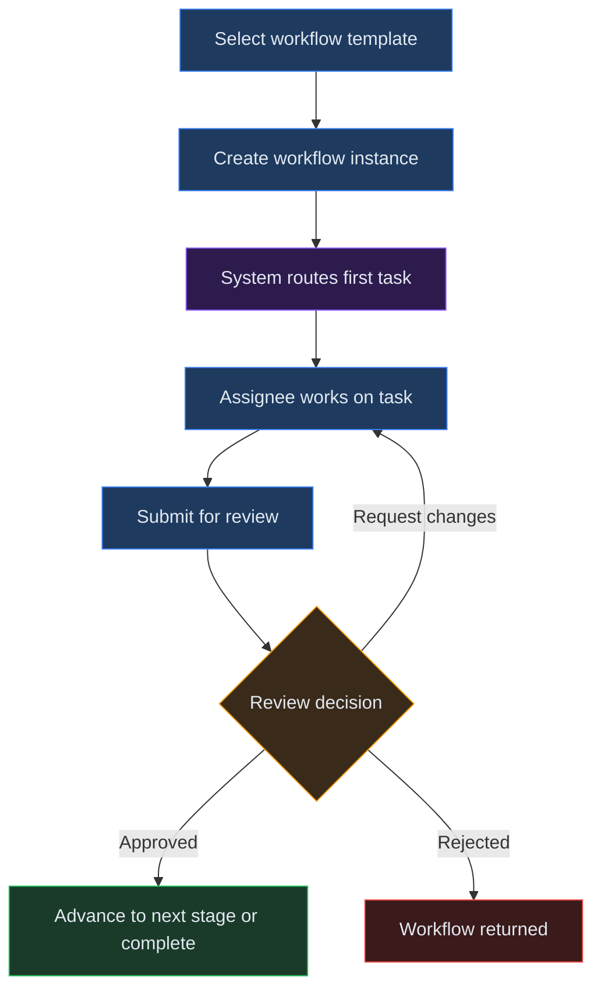
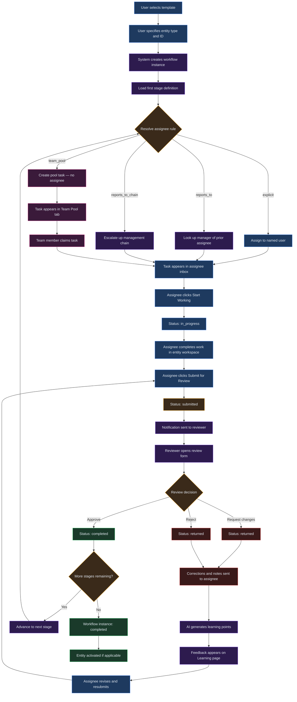

# Chapter 22: Workflows and Tasks

## Overview

Workflows and tasks provide a structured approval pipeline for financial work products in Virtual Analyst. A workflow defines the sequence of stages that an entity (budget, run, baseline, or draft) must pass through before it is considered complete -- from initial preparation through one or more review gates to final approval. Tasks are the individual assignments created at each stage, routed to specific users or team pools, and tracked through your inbox until the workflow reaches completion.

You use workflows when your organisation requires sign-off on financial outputs before they go live -- for example, ensuring an analyst's budget submission is reviewed by a manager before activation, or routing a complex model through analyst, manager, and director approval gates.

---

## Process Flow

---

## Key Concepts

| Concept | Definition |
|---|---|
| **Workflow template** | A reusable blueprint that defines the ordered stages an entity must pass through. Each template specifies the number of stages, their names, and their assignee rules. |
| **Workflow instance** | A running copy of a template, bound to a specific entity (e.g., a budget or baseline). It tracks which stage the entity is currently at and the overall status. |
| **Stage** | A single step within a workflow template. Each stage has a name and an assignee rule that determines who receives the task. |
| **Assignee rule** | The routing logic for a stage: `explicit` (named user), `team_pool` (any team member can claim), `reports_to` (the assignee's manager), or `reports_to_chain` (escalates up the management chain). |
| **Task assignment** | A concrete work item created when a workflow instance enters a stage. It appears in the assignee's inbox and tracks status, deadline, and instructions. |
| **Pool task** | A task with no specific assignee. It appears in the Team Pool tab and can be claimed by any eligible team member on a first-come, first-served basis. |
| **Review** | A formal decision (approve, request changes, or reject) submitted by a reviewer after the assignee has completed and submitted their work. |
| **Feedback / Learning points** | AI-generated insights derived from reviewer corrections, presented to the original assignee so they can learn from the review. |

---

## Step-by-Step Guide

### 1. Browsing Workflow Templates

1. Navigate to the **Workflows** page from the sidebar.
2. The **Templates** section displays all available workflow templates for your organisation. Each row shows the template name, the number of stages, and a description.
3. Three built-in templates are seeded automatically the first time you visit the page:
   - **Self-Service** -- A single stage where any team member can claim and complete the work.
   - **Standard Review** -- Two stages: an assignee prepares the work, then their manager reviews it.
   - **Full Approval** -- Three stages: analyst preparation, manager review, and director/CFO approval.
4. Contact your administrator if you need custom templates beyond these defaults.

### 2. Starting a Workflow Instance

1. In the **Start workflow** section, fill in the three required fields:
   - **Template** -- Select the workflow template from the dropdown (e.g., Standard Review).
   - **Entity type** -- Choose the type of entity being routed: `budget`, `run`, `baseline`, or `draft`.
   - **Entity ID** -- Enter the identifier of the entity (e.g., `bgt_abc123`).
2. Click **Start workflow**.
3. The system creates a new workflow instance, sets its status to `pending`, and routes the first task based on the template's first-stage assignee rule.
4. You are redirected to the workflow detail page, where you can track the instance's progress.

### 3. Monitoring Workflow Progress

1. From the **Workflows** page, the **Instances** section lists all active and completed workflow instances.
2. Use the search bar to filter instances by ID, entity type, entity ID, template name, or status.
3. Click an instance row to open its detail page.
4. The detail page displays:
   - **Template name** and **entity** information.
   - **Current stage** -- Which stage the instance is currently at.
   - **Status** -- The overall instance status (pending, in_progress, submitted, approved, returned, or completed).
   - **Stage progress** -- A visual stepper showing all stages, with completed stages marked by a green checkmark and the current stage highlighted in blue.

### 4. Working from Your Task Inbox

1. Navigate to the **Task Inbox** page from the sidebar.
2. The inbox has three tabs:
   - **My Tasks** -- Tasks assigned directly to you. This is your primary working view.
   - **Team Pool** -- Unclaimed pool tasks available for any team member to pick up.
   - **All** -- All tasks across the organisation (useful for managers and administrators).
3. Each task card shows the entity type, entity ID, current status, deadline (if set), and any instructions from the assigner.
4. Use the search bar to filter tasks by entity ID, entity type, assignment ID, status, or instruction text.

### 5. Claiming a Pool Task

1. Switch to the **Team Pool** tab in your inbox.
2. Locate the task you want to work on.
3. Click the **Claim** button on the task card.
4. The system atomically assigns the task to you and moves it to the **My Tasks** tab. If another team member claims it first, you receive a conflict error.
5. Once claimed, the task behaves identically to a directly assigned task.

### 6. Working on an Assignment

1. Click **View** on a task card to open the assignment detail page.
2. Review the assignment information:
   - **Status** -- Current status (assigned, in progress, submitted, etc.).
   - **Deadline** -- When the task is due, if a deadline has been set.
   - **Assignee** -- The user responsible for the task.
   - **Instructions** -- Guidance from the person who created the assignment.
3. Click **Open workspace** to navigate to the linked entity (draft, baseline, or run) and perform your work.
4. When you begin working, click **Start working** to change the status from `assigned` to `in_progress`.
5. After completing your work, click **Submit for review** to send it to the next stage.

### 7. Reviewing a Submission

1. When a task you oversee has been submitted, it appears in your inbox with status `submitted`.
2. Open the assignment and click **Review** to access the review form.
3. The review page shows two panels:
   - **Context** -- The original instructions and a link to the workspace.
   - **Review decision** -- The form where you record your decision.
4. Select your decision from the dropdown:
   - **Approve** -- Marks the assignment as completed and advances the workflow to the next stage.
   - **Request changes** -- Returns the assignment to the original assignee with your feedback. The task status becomes `returned`.
   - **Reject** -- Terminates the assignment with a rejection. The task status becomes `returned`.
5. Add **Notes** to provide feedback for the assignee.
6. Optionally, add **Corrections** to specify exact changes:
   - **Path** -- The dot-separated location of the value (e.g., `assumptions.revenue_growth`).
   - **Old value** -- The current value.
   - **New value** -- The corrected value.
   - **Reason** -- Why the change is needed.
   - Click **+ Add** for additional corrections, or **Remove** to delete a row.
7. Click **Submit review** to record your decision.

### 8. Reviewing Feedback and Learning Points

1. Navigate to **Inbox > Learning feedback** to see feedback from reviews of your submitted work.
2. Each feedback card shows:
   - The **review decision** (approved, request changes, or rejected).
   - The **summary text** of the reviewer's notes and corrections.
   - **Changes requested** -- A list of specific corrections with old and new values, each with the reviewer's reason.
   - **Learning points** -- AI-generated insights derived from the corrections. These are tagged with a category (e.g., methodology, assumption, formatting) to help you identify patterns in your work.
3. Toggle **Unacknowledged only** to filter for new, unread feedback.
4. Click **Acknowledge** on a feedback card to mark it as read. Acknowledged feedback remains accessible but no longer appears in the unread filter.

### 9. Understanding Deadlines and Reminders

Deadlines can be set on any task assignment. The system automatically generates notifications at key intervals:

- **24 hours before deadline** -- A `deadline_approaching_24h` notification is sent to the assignee.
- **4 hours before deadline** -- A `deadline_approaching_4h` notification is sent.
- **After deadline passes** -- A `deadline_overdue` notification is sent.

These reminders are generated by a background cron job that runs at regular intervals. Overdue tasks are visually highlighted in red in the inbox. Duplicate reminders are suppressed: the 24-hour and 4-hour reminders are not resent within 48 hours, and the overdue reminder is not resent within 7 days.

---

## Multi-Stage Approval Flow

The following diagram traces the complete lifecycle of a multi-stage workflow from instance creation through final completion, including assignee rule resolution, decision branching, and the feedback loop.

---

## Quick Reference

| Task | Action |
|---|---|
| View available templates | Navigate to **Workflows** and check the Templates table |
| Start a workflow | Select a template, entity type, and entity ID, then click **Start workflow** |
| Check workflow progress | Click an instance row on the Workflows page to see the stage stepper |
| View your tasks | Navigate to **Task Inbox** and select the **My Tasks** tab |
| Claim a pool task | Switch to the **Team Pool** tab and click **Claim** on the desired task |
| Begin work on a task | Open the assignment detail and click **Start working** |
| Submit work for review | Click **Submit for review** on the assignment detail page |
| Review a submission | Open the submitted assignment and click **Review**, then select a decision |
| Add corrections to a review | Use the Corrections section in the review form: specify path, old/new values, and reason |
| View feedback and learning points | Navigate to **Inbox > Learning feedback** |
| Acknowledge feedback | Click **Acknowledge** on an unread feedback card |
| Search tasks | Use the search bar at the top of the inbox to filter by entity, status, or instructions |
| Create a standalone assignment | Click **New assignment** from the inbox to assign work outside of a workflow |

---

## Page Help

Every page in Virtual Analyst includes a floating **Instructions** button positioned in the bottom-right corner of the screen. On the Workflows, Tasks, and Inbox pages, clicking this button opens a help drawer that provides:

- Guidance on creating approval workflows with multi-stage review chains and assignee rules.
- Step-by-step instructions for managing your inbox, claiming pool tasks, and submitting work for review.
- Tips for using standalone assignments, corrections, and learning feedback within the review process.
- Prerequisites and links to related chapters.

The help drawer can be dismissed by clicking outside it or pressing the close button. It is available on every page, so you can access context-sensitive guidance wherever you are in the platform.

---

## Troubleshooting

| Symptom | Cause | Resolution |
|---|---|---|
| Task does not appear in your inbox | The task was routed using a `team_pool` rule and has no explicit assignee. | Switch to the **Team Pool** tab and claim the task. If it was claimed by another team member, it will appear in their My Tasks instead. |
| Wrong person received the task | The stage's assignee rule resolved to an unintended user, typically because the `reports_to` hierarchy is misconfigured. | Ask your administrator to verify the team member hierarchy in **Organisation Structures**. The `reports_to` rule looks up the direct manager of the prior stage's assignee. |
| Review is stuck -- reviewer cannot submit | The assignment is not in `submitted` status, or the reviewer is the same user as the assignee. | Confirm that the assignee clicked **Submit for review** first. The system prevents self-review: a different user must perform the review. |
| Deadline notification not received | The cron job for deadline reminders has not run, or the reminder was suppressed as a duplicate. | Deadline reminders are generated by a scheduled background job. The 24h and 4h reminders are suppressed if already sent within 48 hours. Contact your administrator to verify the cron schedule is active. |
| Workflow instance shows wrong stage after approval | The workflow has multiple stages and has advanced to the next one. The stage stepper on the detail page reflects the current position. | Open the workflow detail page and check the stage stepper. Completed stages show a green checkmark. The current stage is highlighted in blue. |

---

## Related Chapters

- [Chapter 9: Organisation Structures](09-org-structures.md) -- Managing team hierarchies and the `reports_to` chain used by assignee rules
- [Chapter 17: Budgets](17-budgets.md) -- Budget entities that are commonly routed through approval workflows
- [Chapter 10: Baselines](10-baselines.md) -- Baseline entities that can be assigned for review
- [Chapter 11: Drafts](11-drafts.md) -- Draft workspaces linked to task assignments
- [Chapter 14: Runs](14-runs.md) -- Run entities that can be submitted through workflow pipelines
