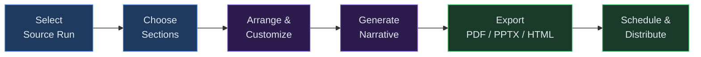
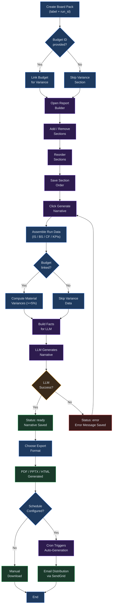

# Chapter 23: Board Packs

## Overview

Board Packs let you assemble presentation-ready reporting packages from your completed run data. You select the sections you want -- financial statements, KPI dashboards, budget variance analysis, scenario comparisons, benchmark data, and AI-generated narrative commentary -- arrange them in the order your board expects, and export the finished pack as PDF, PPTX, or HTML. Scheduled generation and email distribution mean your stakeholders can receive updated packs automatically without manual intervention.

**Prerequisites:** At least one completed run with financial outputs. Board pack creation requires write-level permissions or above.

---

## Process Flow

---

## Key Concepts

| Concept | Description |
|---------|-------------|
| **Board Pack** | A structured reporting package that combines financial data, charts, and narrative commentary from a completed run into a single distributable document. Each pack is assigned a unique pack ID. |
| **Section** | A discrete content block within a board pack. Available sections include Executive Summary, Income Statement, Balance Sheet, Cash Flow Statement, Budget Variance, KPI Dashboard, Scenario Comparison, Strategic Commentary, and Benchmark Analysis. |
| **Section Order** | The sequence in which sections appear in the exported document. You control this through the visual Report Builder interface by adding, removing, and reordering sections. |
| **Narrative** | AI-generated text content produced by the language model. The narrative includes an executive summary and strategic commentary, both derived strictly from the factual financial data in the source run. |
| **Pack Status** | The lifecycle state of a board pack: **draft** (created but not yet generated), **generating** (narrative is being produced), **ready** (generation complete, available for export), or **error** (generation failed). |
| **Branding** | Optional visual customization applied during export, including logo URL, primary color, font family, and terms footer text. |
| **Schedule** | A recurring configuration that automatically generates and optionally distributes board packs on a cron-based cadence. |
| **Distribution** | Email delivery of a completed board pack to a list of stakeholder addresses via SendGrid. |

---

## Step-by-Step Guide

### 1. Creating a Board Pack

To create a new board pack:

1. Navigate to **Board Packs** from the sidebar.
2. If you have no completed runs, the page displays a banner: "No baselines or runs yet -- complete a run before creating board packs." Follow the link to create a baseline and run first.
3. Create a pack by calling the API endpoint `POST /api/v1/board-packs` with a **label** (display name) and a **run_id** (the source run whose data will populate the pack). Optionally include a **budget_id** to enable the budget variance section.
4. The system creates the pack in **draft** status and assigns it a unique pack ID.
5. The new pack appears in your board packs list, showing the label, associated run ID, status, and creation date.

You can also optionally supply a **section_order** array at creation time to pre-configure which sections appear and in what order. If omitted, the system uses the default order: Executive Summary, Income Statement, Balance Sheet, Cash Flow, Budget Variance, KPI Dashboard, Scenario Comparison, and Strategic Commentary.

### 2. Using the Report Builder

The Report Builder is the visual interface for arranging the sections in your board pack.

1. Open a board pack from the list by clicking its name.
2. On the pack detail page, click **Edit report sections** to open the builder.
3. The builder displays two columns:
   - **Available sections** (left) -- sections not yet included in the report.
   - **Report order** (right) -- sections currently included, shown in their display sequence.
4. To add a section, click the **Add** button next to any available section. It moves to the report order column.
5. To remove a section, click the **remove** button (marked with an X) next to the section in the report order column. It returns to the available sections list.
6. To reorder sections, use the **up** and **down** arrow buttons next to each section in the report order column.
7. Click **Save order** when you are satisfied with the arrangement. A confirmation toast appears.

The nine available section types are:

| Section | Content |
|---------|---------|
| Executive Summary | AI-generated narrative overview of financial performance |
| Income Statement | Revenue, expenses, and profitability from the source run |
| Balance Sheet | Assets, liabilities, and equity snapshot |
| Cash Flow Statement | Operating, investing, and financing cash flows |
| Budget Variance | Material variances between budget and actuals (requires a linked budget) |
| KPI Dashboard | Key performance indicators computed from financial statements |
| Scenario Comparison | Side-by-side comparison of scenario outputs |
| Strategic Commentary | AI-generated forward-looking analysis grounded in the data |
| Benchmark Analysis | Industry benchmark metrics from your peer group (requires benchmarking opt-in) |

### 3. Generating the AI Narrative

Once you have arranged your sections, the next step is to generate the AI-powered narrative content.

1. On the pack detail page, verify that the status is **draft** or **error** (only these statuses allow generation).
2. Click **Generate narrative**.
3. The system assembles factual data from the source run -- last-period income statement, balance sheet, cash flow, and KPI figures. If a budget is linked, it also computes material variances (those exceeding 5% of budget).
4. This factual data package is sent to the language model with instructions to produce an executive summary and strategic commentary based solely on the provided numbers. The model does not speculate or add unsourced claims.
5. While generation is in progress, the pack status changes to **generating**.
6. On success, the status moves to **ready** and the narrative text appears on the detail page under the Executive Summary and Strategic Commentary cards.
7. If generation fails (for example, due to an LLM service outage), the status changes to **error** and an error message is displayed. You can retry by clicking **Generate narrative** again.

### 4. Reviewing and Editing Narrative Content

After generation, you can review and refine the AI-produced narrative:

1. On the pack detail page, read the Executive Summary and Strategic Commentary sections. Each is displayed in its own card with the full generated text.
2. Review the content for accuracy. The AI generates narrative from the data provided, but you may want to add context that the model cannot infer -- such as strategic decisions made by management, upcoming product launches, or known market conditions.
3. To update a specific narrative section, use the pack update endpoint (`PATCH /api/v1/board-packs/{pack_id}`) with a `sections` array containing the section key and new content text. For example, to update the executive summary, send `{"sections": [{"section_key": "executive_summary", "content": "Your revised text here."}]}`.
4. The update merges your changes into the existing narrative without overwriting other sections. You can update one section at a time or multiple sections in a single request.
5. You can also update the pack label and branding settings through the same endpoint.

> **Tip:** If you regenerate the narrative after editing, your manual edits will be overwritten. Save a copy of any custom text before re-running generation.

### 5. Exporting the Board Pack

Board packs in **ready** status can be exported in three formats.

1. On the pack detail page, locate the **Export** card.
2. Click one of the export buttons:
   - **Download HTML** -- A self-contained HTML file with inline styling. Suitable for web viewing and email embedding.
   - **Download PDF** -- A formatted PDF document ready for printing and formal distribution.
   - **Download PPTX** -- A PowerPoint presentation with one slide per section. Suitable for board meetings and screen presentations.
3. The file downloads to your browser immediately.

**Currency conversion:** You can export amounts in a different currency by adding a `currency` query parameter to the export URL (e.g., `?format=pdf&currency=EUR`). The system looks up the latest FX rate from your tenant's rate table and scales all monetary values accordingly. Non-monetary fields such as percentages, counts, and period indices are not affected.

**Benchmark inclusion:** Add `benchmark=true` to the export URL to append an industry benchmark section to the export, even if the benchmark section was not in your section order. This pulls metrics from the `benchmark_aggregates` table for your segment.

**Size limit:** Exports are capped at 10 MB. If your pack exceeds this limit, consider reducing the number of sections or simplifying the data.

### 6. Configuring Branding

You can apply custom branding to your board pack exports to match your organization's visual identity.

The following branding properties are supported:

| Property | Description |
|----------|-------------|
| `logo_url` | URL to your company logo image. Displayed in the header of HTML and PDF exports. |
| `primary_color` | Hex color code (e.g., `#1e3a5f`) used for headings and accent elements in the export. |
| `font_family` | Font family name (e.g., `Inter`, `Arial`) applied to body text in the export. |
| `terms_footer` | Legal or disclaimer text displayed in the footer of every page (e.g., "Confidential -- For Board Use Only"). |

To set branding, use `PATCH /api/v1/board-packs/{pack_id}` with a `branding_json` object containing the properties you want to apply. Only the four keys listed above are accepted; unknown keys are rejected with a 422 error.

### 7. Scheduling Recurring Generation

For packs that need to be produced regularly (e.g., monthly board reports), you can create a schedule.

1. Navigate to **Board Pack Schedules** from the sidebar (or the schedules sub-page).
2. Fill in the schedule creation form:
   - **Label** -- A descriptive name for the schedule (e.g., "Monthly Board Report").
   - **Run ID** -- The source run whose data will be used each time the schedule fires.
   - **Cron expression** -- A standard cron expression defining the cadence. For example, `0 9 1 * *` runs at 9:00 AM on the 1st of every month. Other common patterns: `0 9 * * 1` (every Monday at 9 AM), `0 17 L * *` (last day of every month at 5 PM).
   - **Emails** -- A comma-separated list of stakeholder email addresses that will receive the generated pack.
3. Click **Create schedule**. The system creates the schedule and displays it in the schedules list with its label, run ID, cron expression, and next run time.

Each schedule can be enabled or disabled, and you can update its label, run ID, cron expression, or distribution list at any time via the update endpoint.

### 8. Manual Schedule Execution

You do not have to wait for the cron timer. To generate a board pack from a schedule immediately:

1. In the schedules list, locate the schedule you want to execute.
2. Click **Run now**.
3. The system creates a new board pack from the schedule's configuration, generates the AI narrative, and records the result in the generation history table.
4. A toast notification confirms the generation has started. Once complete, the new pack appears in both the board packs list and the schedule's run history.

### 9. Distributing via Email

After a board pack has been generated through a schedule, you can distribute it to stakeholders by email.

1. Navigate to the **Run history** table on the schedules page.
2. Locate the history entry for the pack you want to distribute.
3. Trigger distribution via the API endpoint `POST /api/v1/board-packs/schedules/history/{history_id}/distribute`. You can optionally override the distribution email list for a one-time send.
4. The system sends the narrative content to the specified recipients via SendGrid.
5. On success, the history entry status updates to **distributed** and the distributed timestamp is recorded.

### 10. Monitoring Run History

The **Run history** table on the schedules page tracks every board pack generated by a schedule. Each entry shows:

- **Pack ID** -- The unique identifier of the generated board pack.
- **Run ID** -- The source run used for the generation.
- **Status** -- One of `ready` (generated successfully), `failed` (generation encountered an error), or `distributed` (emailed to stakeholders).
- **Generated at** -- The timestamp when the pack was created.

Use this table to audit which packs were produced, when they were generated, and whether distribution succeeded. If a generation failed, the error message column provides diagnostic information to help you resolve the issue before retrying.

---

## Board Pack Builder Flow

The following diagram details the complete board pack lifecycle from creation through distribution, including the internal steps for data assembly, AI narrative generation, and export formatting.

---

## Quick Reference

| Action | How |
|--------|-----|
| View all board packs | Sidebar > **Board Packs** |
| Create a board pack | `POST /api/v1/board-packs` with label and run_id |
| Open the Report Builder | Board pack detail > **Edit report sections** |
| Add a section | Builder > Available sections > click **Add** |
| Reorder sections | Builder > Report order > use **up/down** arrows |
| Save section arrangement | Builder > click **Save order** |
| Generate AI narrative | Pack detail > click **Generate narrative** (status must be draft or error) |
| Edit narrative text | `PATCH /api/v1/board-packs/{pack_id}` with sections array |
| Export as PDF | Pack detail (status: ready) > **Download PDF** |
| Export as PPTX | Pack detail (status: ready) > **Download PPTX** |
| Export as HTML | Pack detail (status: ready) > **Download HTML** |
| Export in another currency | Append `&currency=EUR` to the export URL |
| Create a schedule | Schedules page > fill form > **Create schedule** |
| Run a schedule immediately | Schedules list > click **Run now** |
| Distribute via email | `POST /api/v1/board-packs/schedules/history/{id}/distribute` |

---

## Troubleshooting

| Symptom | Cause | Resolution |
|---------|-------|------------|
| Narrative generation times out or fails with a 502 error | The LLM service is temporarily unavailable or the request exceeded the token limit. | Wait a few minutes and click **Generate narrative** again. The pack reverts to **error** status and can be retried. If the problem persists, check the API logs for LLM routing errors. |
| Export shows missing chart data or empty financial statement sections | The source run does not have stored results for all statement types, or the run results artifact was deleted. | Verify that the linked run completed successfully and its results are intact. Navigate to the run detail page and confirm that Income Statement, Balance Sheet, and Cash Flow data are present. Re-run the model if results are missing. |
| Scheduled generation does not fire | The cron expression is invalid, the schedule is disabled, or the background scheduler process is not running. | Verify the cron expression syntax (use a cron validator tool). Confirm the schedule's **enabled** flag is true via the schedules list. Contact your administrator if the scheduler service is down. |
| Export fails with "format must be html, pdf, or pptx" | An unsupported format value was passed in the export query parameter. | Use only `html`, `pdf`, or `pptx` as the `format` parameter. The parameter name in the URL is `format`, not `export_format`. |
| Currency conversion returns 404 "No FX rate" | No exchange rate exists in the tenant's FX rate table for the requested currency pair. | Add the missing rate via **Settings > Currency > FX Rates**, or use the API endpoint `POST /api/v1/currency/rates` to insert the rate before exporting. |

---

## Related Chapters

- [Chapter 14: Runs](14-runs.md) -- Creating the runs that serve as source data for board packs.
- [Chapter 17: Budgets](17-budgets.md) -- Setting up budgets that enable the budget variance section in board packs.
- [Chapter 19: Benchmarking](19-benchmarking.md) -- Opting in to industry benchmarks that can be included as a board pack section.
- [Chapter 12: Scenarios](12-scenarios.md) -- Creating scenarios whose comparisons can appear in the scenario comparison section.
- [Chapter 16: Valuation](16-valuation.md) -- Understanding the valuation outputs that inform strategic commentary.
