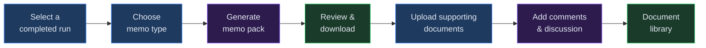

# Chapter 24 --- Memos and Documents

## Overview

Virtual Analyst provides two complementary features for capturing and organizing your financial analysis outputs. **Memos** let you generate structured narrative packs---such as investment committee memos, credit memos, and valuation notes---directly from model run results. The **Documents** library serves as a centralized repository where you can upload, download, search, and manage file attachments linked to any entity in the platform (runs, scenarios, baselines, ventures, and memo packs themselves). Together, these features ensure that every analytical deliverable is produced, stored, and retrievable in one place.

## Process Flow

## Key Concepts

| Term | Definition |
|------|-----------|
| **Memo Pack** | A structured, multi-section narrative document generated from run results. Stored with a unique `memo_id` and downloadable as HTML or PDF. |
| **Memo Type** | The template category that determines which sections are included. Options: Investment Committee, Credit Memo, Valuation Note. |
| **Source Run** | The completed model run whose financial statements and KPIs populate the memo sections. |
| **Document Attachment** | A file uploaded to the platform and linked to an entity (run, scenario, baseline, venture, or memo pack). Maximum size: 10 MB. |
| **Entity Type** | The category of platform object that a document or comment is associated with: `run`, `draft_session`, `memo_pack`, `baseline`, `scenario`, or `venture`. |
| **Comment Thread** | A discussion thread attached to any entity, allowing team members to capture notes, questions, and decisions alongside documents. |

## Step-by-Step Guide

### 1. Navigate to the Memos Page

Open the main navigation and select **Memos**. You will see the memo creation form at the top and a searchable list of previously generated memos below it.

### 2. Select a Source Run

From the **Select a run** dropdown, choose a completed model run. This dropdown displays every run available for your tenant, showing the run ID, associated model name, and execution status. Only runs with a **completed** status will produce valid memo output---selecting a run that is still in progress or that ended with errors will result in missing data.

The run's financial statements (income statement, balance sheet, cash flow) and KPIs will provide the data that populates the memo. If the run includes multiple forecast periods, the memo template will incorporate multi-year trend data into the Financial Highlights or Financial Analysis sections automatically.

When choosing a source run, consider the following:

- **Recency** --- select the most recent completed run to ensure the memo reflects your latest assumptions and inputs.
- **Scenario alignment** --- if you have run multiple scenarios, choose the run that corresponds to the base case or the scenario you want to present. You can generate separate memos for different scenarios and compare them side by side.
- **Data completeness** --- runs that include all three financial statements produce the richest memos. If a run was configured to skip the cash flow statement, certain memo sections may contain placeholder text.

> **Note:** If the dropdown is empty, you have not yet executed any model runs. Navigate to the Runs page and complete at least one run before generating a memo.

### 3. Choose a Memo Type

Select one of the three memo types from the dropdown:

| Memo Type | Sections Included | Typical Use Case |
|-----------|------------------|------------------|
| **Investment Committee** | Executive Summary, Business Overview, Financial Highlights, Key Assumptions, Risk Analysis, Valuation Summary, Recommendation | Board or IC presentations for investment decisions |
| **Credit Memo** | Borrower Overview, Purpose of Facility, Financial Analysis, Ratio Analysis, Covenant Headroom, Security/Collateral, Risk Assessment, Recommendation | Loan underwriting and credit committee submissions |
| **Valuation Note** | Executive Summary, Methodology, Assumptions, DCF Analysis, Comparable Analysis, Valuation Range, Sensitivity | Stand-alone valuation deliverables and fairness opinions |

### 4. Provide a Title (Optional)

Enter a custom title in the **Title** field. If you leave this blank, the system auto-generates a title from the memo type and run ID (for example, "Investment Committee --- run_abc123"). Custom titles are especially useful when generating multiple memos for the same run under different scenarios or when sharing memos with external stakeholders who may not recognize internal run IDs. Titles can be up to 200 characters and support standard alphanumeric characters, hyphens, and parentheses.

### 5. Generate the Memo

Click **Generate memo**. The system retrieves the run's financial data from artifact storage, applies the selected template, and produces a formatted HTML document containing data-driven tables and section headings. A success toast confirms creation, and the new memo appears at the top of the list.

### 6. Download the Memo

Each memo in the list displays a **Download PDF** link. Click it to download the memo as a PDF file. The system renders the stored HTML to PDF on the server side using the xhtml2pdf engine. You can also obtain the raw HTML version by modifying the format parameter in the download URL.

The two download formats serve different purposes:

- **PDF** --- best for distribution, archiving, and printing. The PDF preserves the formatted layout including tables, section headings, and data highlights. Use this format when sending memos to investment committees or external parties.
- **HTML** --- best for further editing or embedding into other systems. The raw HTML can be opened in any browser and modified with standard editing tools before final distribution.

### 7. Filter and Search Memos

Use the toolbar controls above the memo list to locate specific memos:

- **Search bar** --- type any keyword to filter memos by title in real time.
- **Memo type filter** --- select a specific type (Investment Committee, Credit Memo, or Valuation Note) or choose "All memo types" to reset.

Results paginate automatically at 20 memos per page. Use the pagination controls at the bottom of the list to navigate.

### 8. Navigate to the Documents Page

Open the main navigation and select **Documents & Comments**. This page provides a unified interface for uploading files, browsing attachments, and managing discussion threads for any entity.

### 9. Load Documents for an Entity

Select an **Entity Type** from the dropdown (run, draft_session, memo_pack, baseline, scenario, or venture), enter the **Entity ID**, and click **Load**. The system retrieves all document attachments and comments linked to that entity.

The entity type determines the scope of the documents you will see:

- **run** --- documents and comments attached to a specific model run. Use this to store supporting schedules, data source files, or reviewer notes for a particular execution.
- **draft_session** --- files linked to an in-progress Excel import session before the data is finalized.
- **memo_pack** --- documents supplementing a generated memo, such as board-approved term sheets, due diligence reports, or external appraisals.
- **baseline** --- reference documents for a baseline configuration, such as the original budget template or prior-year actuals.
- **scenario** --- files specific to a scenario variant, useful for storing the assumption change log or sensitivity outputs.
- **venture** --- general documents associated with a venture entity, including organizational charts, cap tables, or incorporation documents.

> **Tip:** You can find the entity ID for any item by navigating to its detail page in the platform. The ID is displayed in the page header or can be copied from the browser URL.

### 10. Upload a Document

Click **Choose File** to select a file from your computer (maximum 10 MB), then click **Upload document**. The file is stored in the artifact store with its metadata recorded in the database. A success toast confirms the upload, and the document appears in the list below.

The platform accepts all common file types. Typical uploads include:

| File Type | Common Extensions | Example Use |
|-----------|------------------|-------------|
| Spreadsheets | `.xlsx`, `.csv` | Supporting financial models, data tables |
| Documents | `.pdf`, `.docx` | Board presentations, legal agreements, term sheets |
| Images | `.png`, `.jpg` | Charts, screenshots of third-party systems |
| Archives | `.zip` | Bundled supporting materials |

When uploading, keep these guidelines in mind:

- **File naming** --- use descriptive names that include the entity context (for example, `Q3-2026-revenue-bridge.xlsx`) so that files are easy to locate when searching later.
- **Version control** --- the system does not overwrite existing files with the same name. Each upload creates a new attachment record. If you need to replace a file, upload the new version and add a comment noting that it supersedes the previous upload.
- **Size management** --- if your file exceeds 10 MB, consider compressing images, reducing PDF quality, or splitting large spreadsheets into separate worksheets before uploading.

### 11. Download or Search Documents

The document table shows each file's name, content type, and size. Click **Download** to retrieve any file. Use the search bar above the table to filter documents by filename or content type.

### 12. Add Comments

Scroll to the **Comments** section below the document list. Type your note in the text area and click **Add comment**. Comments are timestamped and displayed in chronological order, creating a discussion thread that provides context alongside your documents.

Comments support plain text only---formatting such as bold or italics is not rendered. However, you can use comments effectively by following these practices:

- **Reference specific documents** --- mention the filename in your comment (for example, "See revenue-bridge.xlsx for the detailed breakdown") to help teammates navigate the attachment list.
- **Record decisions** --- after a committee review, summarize the outcome in a comment so the decision is preserved alongside the supporting documents and memo.
- **Flag follow-ups** --- use a consistent prefix like "ACTION:" or "TODO:" in your comment text to make it easy to search for outstanding items later.
- **Provide version context** --- when uploading a revised document, add a comment explaining what changed in the new version compared to the previous upload.

## Memo Creation and Document Library Workflow

```mermaid
flowchart TD
    Start([User opens Memos page]) --> LoadRuns[Load available runs]
    LoadRuns --> SelectRun{Run selected?}
    SelectRun -->|No| ShowError1[Display: Select a run\nto generate a memo]
    SelectRun -->|Yes| ChooseType[Choose memo type:\nIC / Credit / Valuation]
    ChooseType --> OptionalTitle[Enter custom title\nor leave blank]
    OptionalTitle --> ClickGenerate[Click Generate memo]
    ClickGenerate --> FetchData[API fetches run\nstatements & KPIs]
    FetchData --> DataFound{Run results\nfound?}
    DataFound -->|No| ShowError2[Error: Run results\nnot found]
    DataFound -->|Yes| RenderHTML[Generate HTML memo\nwith template sections]
    RenderHTML --> StoreArtifact[Save memo to\nartifact store]
    StoreArtifact --> InsertDB[Insert memo_packs\nDB record]
    InsertDB --> ShowSuccess[Toast: Memo created\nList refreshes]
    ShowSuccess --> DownloadChoice{Download?}
    DownloadChoice -->|HTML| ServeHTML[Serve HTML file\nwith headers]
    DownloadChoice -->|PDF| RenderPDF[Convert HTML to PDF\nvia xhtml2pdf]
    RenderPDF --> ServePDF[Serve PDF file\nwith headers]
    ShowSuccess --> AttachDocs[Navigate to\nDocuments page]
    AttachDocs --> SelectEntity[Select entity_type:\nmemo_pack]
    SelectEntity --> EnterID[Enter memo_id\nas entity ID]
    EnterID --> ClickLoad[Click Load]
    ClickLoad --> UploadFile[Select file and\nclick Upload]
    UploadFile --> ValidateSize{File under\n10 MB?}
    ValidateSize -->|No| ShowError3[Error: File too\nlarge]
    ValidateSize -->|Yes| StoreDoc[Save file to\nartifact store]
    StoreDoc --> InsertDocDB[Insert document_attachments\nDB record]
    InsertDocDB --> DocSuccess[Toast: Document uploaded\nList refreshes]
    DocSuccess --> AddComment[Add comment to\ndiscussion thread]
    AddComment --> Done([Workflow complete])

    style Start fill:#1e3a5f,stroke:#3b82f6,color:#e2e8f0
    style LoadRuns fill:#1e3a5f,stroke:#3b82f6,color:#e2e8f0
    style SelectRun fill:#2d1b4e,stroke:#8b5cf6,color:#e2e8f0
    style ShowError1 fill:#3a1a1a,stroke:#ef4444,color:#e2e8f0
    style ShowError2 fill:#3a1a1a,stroke:#ef4444,color:#e2e8f0
    style ShowError3 fill:#3a1a1a,stroke:#ef4444,color:#e2e8f0
    style ChooseType fill:#1e3a5f,stroke:#3b82f6,color:#e2e8f0
    style OptionalTitle fill:#1e3a5f,stroke:#3b82f6,color:#e2e8f0
    style ClickGenerate fill:#2d1b4e,stroke:#8b5cf6,color:#e2e8f0
    style FetchData fill:#2d1b4e,stroke:#8b5cf6,color:#e2e8f0
    style DataFound fill:#2d1b4e,stroke:#8b5cf6,color:#e2e8f0
    style RenderHTML fill:#1a3a2a,stroke:#22c55e,color:#e2e8f0
    style StoreArtifact fill:#1a3a2a,stroke:#22c55e,color:#e2e8f0
    style InsertDB fill:#1a3a2a,stroke:#22c55e,color:#e2e8f0
    style ShowSuccess fill:#1a3a2a,stroke:#22c55e,color:#e2e8f0
    style DownloadChoice fill:#2d1b4e,stroke:#8b5cf6,color:#e2e8f0
    style ServeHTML fill:#1e3a5f,stroke:#3b82f6,color:#e2e8f0
    style RenderPDF fill:#3a1a3a,stroke:#ec4899,color:#e2e8f0
    style ServePDF fill:#3a1a3a,stroke:#ec4899,color:#e2e8f0
    style AttachDocs fill:#1e3a5f,stroke:#3b82f6,color:#e2e8f0
    style SelectEntity fill:#1e3a5f,stroke:#3b82f6,color:#e2e8f0
    style EnterID fill:#1e3a5f,stroke:#3b82f6,color:#e2e8f0
    style ClickLoad fill:#2d1b4e,stroke:#8b5cf6,color:#e2e8f0
    style UploadFile fill:#2d1b4e,stroke:#8b5cf6,color:#e2e8f0
    style ValidateSize fill:#3a2a1a,stroke:#f59e0b,color:#e2e8f0
    style StoreDoc fill:#1a3a2a,stroke:#22c55e,color:#e2e8f0
    style InsertDocDB fill:#1a3a2a,stroke:#22c55e,color:#e2e8f0
    style DocSuccess fill:#1a3a2a,stroke:#22c55e,color:#e2e8f0
    style AddComment fill:#1e3a5f,stroke:#3b82f6,color:#e2e8f0
    style Done fill:#1a3a2a,stroke:#22c55e,color:#e2e8f0
```

## Quick Reference

| Action | Where | Steps |
|--------|-------|-------|
| Generate a memo | Memos page | Select run, choose type, optionally enter title, click **Generate memo** |
| Download as PDF | Memos page | Click **Download PDF** next to any memo in the list |
| Download as HTML | Browser URL | Modify the download URL to use `format=html` instead of `format=pdf` |
| Filter by memo type | Memos page | Use the **Memo type** dropdown in the toolbar |
| Search memos | Memos page | Type a keyword in the search bar |
| Upload a document | Documents page | Select entity type, enter entity ID, choose file, click **Upload document** |
| Download a document | Documents page | Click **Download** next to any file in the list |
| Search documents | Documents page | Type a keyword in the search bar above the document table |
| Add a comment | Documents page | Scroll to Comments, type your note, click **Add comment** |
| View memo details | Memos page | Click the memo title in the list to expand and preview its contents |
| Generate multiple memos | Memos page | Repeat the generation steps with different memo types or different source runs |
| Link a document to a memo | Documents page | Set entity type to **memo_pack**, enter the memo ID, then upload the file |
| View all comments for a run | Documents page | Set entity type to **run**, enter the run ID, click **Load**, scroll to Comments |
| Delete a memo | API | Send a `DELETE` request to `/api/v1/memos/{memo_id}` |
| Delete a document | API | Send a `DELETE` request to `/api/v1/documents/{document_id}` |
| Delete a comment | API | Send a `DELETE` request to `/api/v1/comments/{comment_id}` |
| List all memos for a run | API | Send a `GET` request to `/api/v1/memos?run_id={run_id}` |

## Page Help

Every page in Virtual Analyst includes a floating **Instructions** button positioned in the bottom-right corner of the screen. On the Memos and Documents pages, clicking this button opens a help drawer that provides:

- Guidance on generating investment memos from model runs, selecting memo types, and downloading outputs.
- Step-by-step instructions for uploading documents, attaching them to entities, and managing the document repository.
- Tips for using the comment system on the Documents page to annotate files and collaborate with your team.
- Prerequisites and links to related chapters.

The help drawer can be dismissed by clicking outside it or pressing the close button. It is available on every page, so you can access context-sensitive guidance wherever you are in the platform.

---

## Troubleshooting

| Symptom | Cause | Resolution |
|---------|-------|------------|
| "Run results not found" error when generating a memo | The selected run has not completed execution, or its results have been purged from artifact storage. | Verify that the run has a **completed** status on the Runs page. Re-run the model if results are missing. |
| "File too large" error on document upload | The file exceeds the 10 MB upload limit enforced by the server. | Compress the file or split it into smaller parts before uploading. PDF optimization tools can reduce file size significantly. |
| Memo list is empty despite generating memos | The memo type filter is active and excluding your memos. | Clear all filters by clicking the reset button in the toolbar, or select **All memo types** from the dropdown. |
| PDF download returns a 501 error | The server-side PDF renderer (xhtml2pdf) is not installed in the API environment. | Contact your system administrator to ensure the `xhtml2pdf` Python package is installed on the API server. |
| Documents do not appear after upload | You are viewing a different entity type or entity ID than the one used during upload. | Confirm that the entity type and entity ID match exactly. Documents are scoped to a specific entity---changing either field will show a different set of files. |
| Memo sections contain placeholder text instead of data | The source run did not include all three financial statements, or certain KPI calculations were skipped. | Re-run the model with all statement outputs enabled. Check the run configuration to ensure income statement, balance sheet, and cash flow are all selected. |
| Comment fails to post with a network error | A temporary network interruption occurred between your browser and the API server. | Check your internet connection and retry. If the problem persists, refresh the page and re-enter your comment. The system does not save draft comments, so copy your text before refreshing. |
| Search returns no results despite matching memos existing | The search bar performs case-sensitive matching on memo titles. | Try searching with different capitalization or use a shorter keyword fragment. The filter matches against the title field only, not memo content. |

## Related Chapters

- **Chapter 8 --- Running Models** --- How to execute model runs that produce the data used in memos.
- **Chapter 10 --- Scenarios and Sensitivity Analysis** --- Creating scenarios whose results can also feed memo generation.
- **Chapter 14 --- Exporting Results** --- Additional export options for financial statements and KPIs.
- **Chapter 21 --- Audit and Activity Logs** --- Tracking who generated memos and uploaded documents.
- **Chapter 22 --- Comments and Collaboration** --- Detailed coverage of the comment threading system used on the Documents page.
