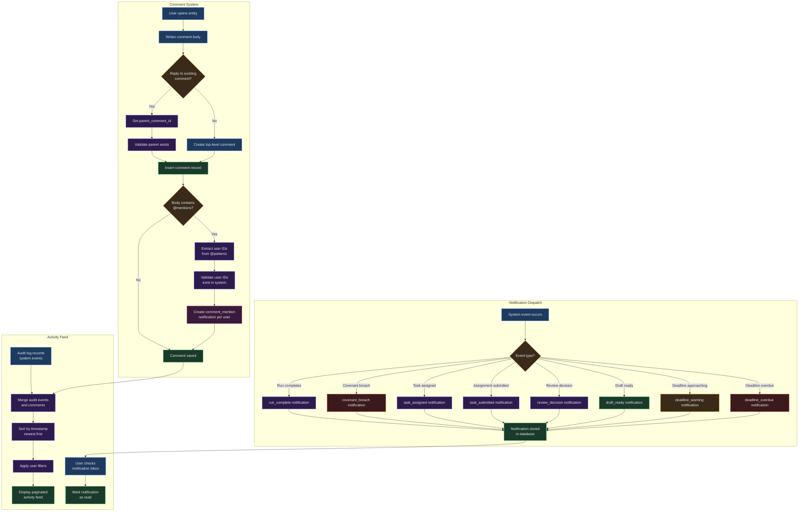

# Chapter 25 -- Collaboration: Comments, Activity Feed & Notifications

## Overview

Virtual Analyst provides built-in collaboration tools so your team can discuss assumptions, track changes, and stay informed without leaving the platform. Threaded comments let you attach conversations directly to runs, scenarios, assumptions, and other entities. The activity feed consolidates audit events and comments into a single timeline, while the notification system delivers alerts for completed runs, covenant breaches, task assignments, review decisions, and @mentions.

> **Instructions Button:** Every page in the application features a floating **Instructions** button in the bottom-right corner. Click it to open a help drawer showing step-by-step guidance for the current page, prerequisites, and links to related sections.

## Process Flow

```mermaid
flowchart TD
    A[User posts comment<br>on entity] --> B[Thread discussion<br>with replies]
    B --> C{Mentions<br>@user?}
    C -->|Yes| D[Notification sent<br>to mentioned user]
    C -->|No| E[Comment saved<br>to entity]
    D --> E
    E --> F[Activity feed updated]
    F --> G[Team reviews<br>activity & notifications]

    style A fill:#1e3a5f,stroke:#3b82f6,color:#e2e8f0
    style B fill:#1e3a5f,stroke:#3b82f6,color:#e2e8f0
    style C fill:#3a2a1a,stroke:#f59e0b,color:#e2e8f0
    style D fill:#2d1b4e,stroke:#8b5cf6,color:#e2e8f0
    style E fill:#1a3a2a,stroke:#22c55e,color:#e2e8f0
    style F fill:#1a3a2a,stroke:#22c55e,color:#e2e8f0
    style G fill:#1e3a5f,stroke:#3b82f6,color:#e2e8f0
```

## Key Concepts

| Term | Definition |
|------|-----------|
| **Comment** | A text annotation attached to a specific entity (run, scenario, assumption, etc.). Supports threading and @mentions. |
| **Thread** | A reply chain under a parent comment, used to keep related discussion grouped together. |
| **@Mention** | Referencing another user by their ID within a comment body (e.g., `@user-id`). Triggers an in-app notification to that user. |
| **Activity Feed** | A unified timeline that merges audit-log events and comments across your tenant, sorted by most recent first. |
| **Notification** | An in-app alert triggered by system events such as completed runs, covenant breaches, task assignments, review decisions, or comment mentions. |
| **Entity Type** | The kind of object a comment is attached to: `run`, `draft_session`, `memo_pack`, `baseline`, `scenario`, `venture`, or `assumption`. |
| **Audit Event** | An automatically recorded log entry capturing who did what and when -- created, updated, or deleted a resource. |
| **Unread Count** | The number of notifications you have not yet marked as read, displayed as a badge in the notifications view. |

## Step-by-Step Guide

### 1. Posting a Comment

Comments attach to any supported entity in Virtual Analyst. To add a comment:

1. Navigate to the entity you want to discuss (for example, open a specific run or scenario).
2. Locate the **Comments** section on the entity detail page.
3. Type your comment in the text field. Comments can be up to 10,000 characters.
4. To mention a teammate, type `@` followed by their user ID. The mentioned user receives a notification automatically.
5. Click **Post** to submit the comment. It appears immediately in the comment list.

### 2. Replying to a Comment (Threading)

Threaded replies keep conversations organized under the original comment:

1. Find the comment you want to respond to.
2. Click **Reply** beneath that comment.
3. Write your response. You can @mention additional users in replies.
4. Submit the reply. It appears indented under the parent comment, preserving the conversation hierarchy.

### 3. Deleting a Comment

Only the original author of a comment can delete it:

1. Locate your comment in the thread.
2. Click the **Delete** action on the comment.
3. Confirm the deletion. Any replies nested under the deleted comment are also removed automatically via cascade.

### 4. Viewing the Activity Feed

The activity feed provides a consolidated view of everything happening in your tenant:

1. Navigate to **Activity** in the main navigation.
2. The feed displays both audit events and comments, merged and sorted newest-first.
3. Each entry shows the event type, timestamp, a summary, and the associated resource type and ID.
4. Use the **Search** bar at the top to filter entries by keyword within summaries.

### 5. Filtering the Activity Feed

Narrow down the activity feed using the filter panel:

1. **User ID** -- Show only activity from a specific team member.
2. **Resource Type** -- Filter by entity kind (e.g., `run`, `scenario`, `assumption`).
3. **Resource ID** -- Focus on a single entity by its unique identifier.
4. **Since** -- Set a date-time cutoff to see only recent activity.
5. Click **Apply filters** to refresh the feed. Results are paginated at 20 items per page.

### 6. Managing Notifications

View and manage your notifications from the **Notifications** page:

1. Navigate to **Notifications** in the main navigation.
2. Your unread count is displayed at the top of the page.
3. Each notification displays its title, body preview, timestamp, and a link to the related entity.
4. Click **View** on any notification to navigate directly to the relevant run, draft, or other entity.
5. Click **Mark read** to dismiss a notification and reduce your unread count.

### 7. Filtering Notifications

Use the toolbar to narrow your notification list:

1. Toggle **Unread only** to hide notifications you have already read.
2. Use the **Search** field to find notifications by title or body content.
3. Click **Clear filters** to reset all filters and see the full list again.
4. Navigate through pages using the pagination controls at the bottom.

## Notification Types

Virtual Analyst generates notifications automatically across several workflows. The following table lists every notification type, what triggers it, and who receives it.

| Type | Trigger | Recipient | Linked Entity |
|------|---------|-----------|---------------|
| `comment_mention` | A user @mentions you in a comment | The mentioned user | The entity the comment is attached to |
| `run_complete` | A model run finishes executing | Tenant-wide (all users) | The completed run |
| `covenant_breach` | A run detects a covenant violation | Tenant-wide (all users) | The run with the breach |
| `task_assigned` | A task or assignment is delegated to you | The assigned user | The assignment |
| `task_submitted` | An assignee submits their work for review | The reviewer | The submitted assignment |
| `review_decision` | A reviewer approves or requests changes | The assignee | The reviewed assignment |
| `workflow_completed` | All review stages pass and work is approved | The original assignee | The completed workflow |
| `draft_ready` | A draft session finishes processing and is ready to commit | Tenant-wide (all users) | The draft session |
| `deadline_warning` | An assignment deadline is approaching | The assigned user | The assignment |
| `deadline_overdue` | An assignment deadline has passed without completion | The assigned user | The overdue assignment |

## Team Communication Patterns

Effective collaboration in Virtual Analyst follows a few recommended patterns:

**Assumption review threads.** When updating key assumptions in a scenario, post a comment on the assumption entity explaining the rationale for the change. @Mention the team members who need to validate the new value. The resulting thread serves as an auditable discussion record.

**Run result discussions.** After a model run completes, navigate to the run detail page and comment on notable outputs. Tag colleagues who own specific line items so they can review the results and confirm accuracy before the numbers are shared externally.

**Deadline coordination.** When assignments have approaching deadlines, the system sends `deadline_warning` notifications automatically. Use the linked entity to navigate directly to the assignment page where you can update progress, submit work, or request an extension from the reviewer.

**Daily activity review.** Start your day on the Activity Feed page to catch up on changes made overnight. Filter by **Since** (set to yesterday) to see only recent events. Combine with the **Resource Type** filter to focus on the entities most relevant to your role.

## Collaboration & Notification Workflow



## Quick Reference

| Action | Where | How |
|--------|-------|-----|
| Post a comment | Entity detail page | Type in comment field, click **Post** |
| Reply to a comment | Under existing comment | Click **Reply**, write response, submit |
| @Mention a teammate | Comment body | Type `@` followed by the user's ID |
| Delete your comment | Your own comment | Click **Delete**, confirm removal |
| View activity feed | **Activity** page | Browse merged audit events and comments |
| Filter activity | Activity filter panel | Set User ID, Resource Type, Resource ID, or Since date |
| Search activity | Activity toolbar | Type keyword in the search bar |
| View notifications | **Notifications** page | Browse alerts sorted newest-first |
| Filter to unread | Notifications toolbar | Toggle **Unread only** filter |
| Mark notification read | Individual notification | Click **Mark read** button |
| Navigate to entity | Notification detail | Click **View** link on the notification |

## Page Help

Every page in Virtual Analyst includes a floating **Instructions** button positioned in the bottom-right corner of the screen. On the Collaboration, Activity, and Notifications pages, clicking this button opens a help drawer that provides:

- Guidance on posting comments, threading replies, and using @mentions.
- An explanation of the supported entity types for comments (`run`, `draft_session`, `baseline`, `scenario`, `venture`, `assumption`, `memo_pack`).
- Tips for filtering the activity feed and managing notifications effectively.
- Prerequisites and links to related chapters.

The help drawer can be dismissed by clicking outside it or pressing the close button. It is available on every page, so you can access context-sensitive guidance wherever you are in the platform.

---

## Troubleshooting

| Symptom | Cause | Resolution |
|---------|-------|------------|
| Comment does not appear after posting | Invalid entity type provided | Verify the entity type is one of: `run`, `draft_session`, `memo_pack`, `baseline`, `scenario`, `venture`, or `assumption`. Check the browser console for a 400 error response. |
| @Mention does not trigger a notification | User ID format is incorrect or the mentioned user does not exist | Ensure you use the full UUID format for the user ID (e.g., `@550e8400-e29b-41d4-a716-446655440000`). The system validates mentioned IDs against the user table and silently skips invalid ones. You also do not receive a notification for mentioning yourself. |
| Notifications not appearing | Unread-only filter is active or pagination has advanced past recent items | Toggle off the **Unread only** filter and return to page 1. Also verify you are logged in as the correct user, since notifications are scoped to your user ID. |
| Activity feed shows no results | Filters are too restrictive or no activity has been recorded yet | Clear all filter fields and click **Apply filters**. If the feed is still empty, the tenant has no audit events or comments recorded. Perform an action (e.g., run a model) to generate activity. |
| Cannot delete another user's comment | Deletion is restricted to the comment author | Only the user who created a comment can delete it. If the comment needs to be removed, ask the original author or a tenant administrator to handle it. |

## Supported Comment Entities

You can attach comments to any of the following entity types. Each entity type corresponds to a core area of the platform. Comments across the platform use these specific entity type identifiers internally when posting, filtering, and querying. When you see comments on a draft, the system uses the entity type `draft_session`; on a model run, it uses `run`; and so on. Understanding these identifiers is helpful when filtering the activity feed or troubleshooting comment visibility.

| Entity Type | Description | Example Use Case |
|-------------|-------------|------------------|
| `run` | A model run with computed outputs | Discuss unexpected forecast results |
| `draft_session` | A pending changeset before commit | Review proposed assumption changes |
| `memo_pack` | A packaged memo or report | Annotate report sections before distribution |
| `baseline` | A locked baseline snapshot | Note why a baseline was frozen at a point in time |
| `scenario` | A what-if analysis scenario | Debate alternative growth-rate assumptions |
| `venture` | A venture or investment entity | Coordinate due-diligence findings |
| `assumption` | An individual model assumption | Justify a specific input value |

## Related Chapters

- **[Chapter 11 -- Drafts](11-drafts.md)** -- Draft sessions generate `draft_ready` notifications when processing completes.
- **[Chapter 14 -- Runs](14-runs.md)** -- Completed runs trigger `run_complete` notifications and covenant breaches trigger `covenant_breach` alerts.
- **[Chapter 18 -- Covenants](18-covenants.md)** -- Covenant breach notifications link directly to the affected run for immediate review.
- **[Chapter 12 -- Scenarios](12-scenarios.md)** -- Scenarios support threaded comments for discussing assumption changes.
- **[Chapter 10 -- Baselines](10-baselines.md)** -- Baseline entities can have comments attached for team discussion during the review process.
- **[Chapter 21 -- Ventures](21-ventures.md)** -- Venture entities support comments for coordinating investment analysis across team members.
