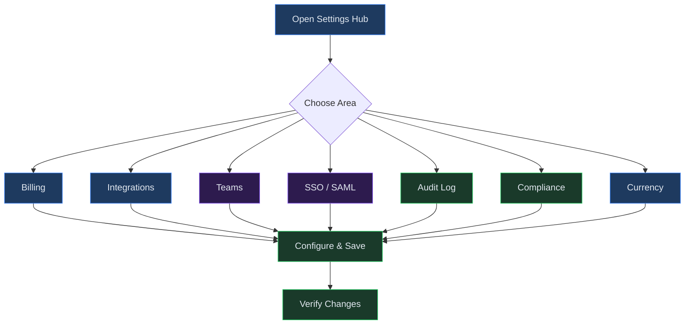
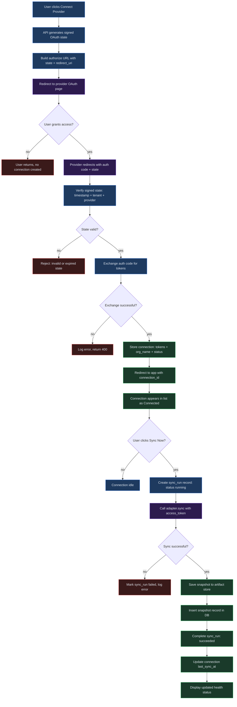

# Chapter 26 -- Settings & Administration

## Overview

The Settings hub centralizes account-level configuration for billing, integrations, team management, single sign-on, audit logging, compliance, and multi-currency support. You access it from the sidebar and land on a card-based menu linking to each area. These controls are typically restricted to users with the **Owner** or **Admin** role, and changes made here affect all users across the tenant.

Whether you need to connect your Xero or QuickBooks account, configure SAML-based SSO for your organization, review an immutable audit trail, or manage FX rates for multi-currency models, this chapter walks through each area in detail.

---

## Process Flow

---

## Key Concepts

| Concept | Definition |
|---------|-----------|
| **Tenant** | The top-level organizational boundary in Virtual Analyst. All settings, data, and users belong to a single tenant. |
| **Plan** | A billing tier (e.g., Starter, Professional) that determines feature availability, usage limits, and pricing. |
| **Subscription** | The active billing agreement between the tenant and Virtual Analyst, tied to a specific plan with a defined billing period. |
| **Usage Meter** | A tracked consumption counter (LLM tokens, Monte Carlo runs, sync events) that measures resource usage against plan limits. |
| **Integration Connection** | An authenticated link to an external accounting system (Xero or QuickBooks) established through OAuth 2.0. |
| **Sync Run** | A single data-fetch operation against a connected provider, producing a snapshot of financial data. |
| **Snapshot** | An immutable, timestamped capture of financial data retrieved from an integration sync, stored as a canonical artifact. |
| **Team** | A named group of users with defined roles and reporting hierarchy. Teams organize users by department or function. |
| **Job Function** | A role label assigned to team members (e.g., Analyst, Manager, CFO). Default functions are seeded automatically for new tenants. |
| **SAML Config** | The identity provider metadata, entity IDs, ACS URL, and certificate configuration required for SSO login. |
| **Audit Event** | An immutable, append-only record of a significant action within the tenant, categorized by event type and resource. |
| **GDPR Export** | A data-portability operation (GDPR Article 15) that bundles all personal data for a specific user into a single JSON response. |
| **Anonymization** | An irreversible GDPR right-to-erasure operation that removes or nullifies all personally identifiable references for a user. |
| **Base Currency** | The primary currency in which your organization records financial transactions (e.g., USD, GBP, EUR). |
| **Reporting Currency** | The currency used for consolidated reporting and output. May differ from the base currency for multinational organizations. |
| **FX Rate** | An exchange rate between two currencies effective on a specific date, used for currency conversion in models and reports. |

---

## Step-by-Step Guide

### 1. Navigating to Settings

1. Click **Settings** in the application sidebar.
2. The Settings hub displays a two-column grid of cards: Billing, Integrations, Audit Log, Currency, SSO / SAML, Compliance, and Teams. Each card includes a short description of the area it controls.
3. Click any card to enter that configuration area.
4. All settings pages share a consistent layout with a breadcrumb-style heading, descriptive subtitle, and error banner when a problem occurs. Changes are saved per-section; there is no global "save all" button.

### 2. Billing & Subscription

1. Open **Settings > Billing**.
2. The page loads three sections: available plans, usage meters, and subscription details.
3. **Selecting a plan** -- Review the plan cards displayed in a three-column grid. Each card shows the plan name, tier level, and feature count. Click **Select plan** on any non-current plan to upgrade or downgrade. A confirmation toast confirms the change.
4. **Reviewing usage** -- The usage meters section shows bar-chart indicators for:
   - **LLM tokens** -- Total tokens consumed versus your plan limit (or "Unlimited").
   - **Monte Carlo runs** -- Number of simulation runs executed during the current billing period.
   - **Sync events** -- Count of integration sync operations performed.
5. **Subscription details** -- View your current plan ID, status (active, trialing, past_due, cancelled), and billing period dates. To cancel, click **Cancel subscription**, confirm in the dialog, and your plan will remain active until the end of the current billing period.
6. Stripe webhook events automatically update subscription status when changes occur externally. The system handles `subscription.updated` (for status transitions such as active, past_due, and trialing) and `subscription.deleted` events.

> **Note:** Only users with the **Owner** role can change or cancel subscriptions. Admins can view plans and usage but cannot modify the billing relationship.

> **Tip:** If usage meters show you are approaching plan limits, consider upgrading before hitting the cap. Usage data is refreshed each time you visit the Billing page.

### 3. Integrations (Xero & QuickBooks)

1. Open **Settings > Integrations**.
2. Click **Connect Xero** or **Connect QuickBooks** at the top of the page. You will be redirected to the provider's OAuth authorization page.
3. After granting access, you are redirected back to Virtual Analyst. The new connection appears in the list with status "Connected".
4. **Health indicators** -- Each connection shows a health label:
   - "Healthy" (green) -- Last sync within the past 30 days.
   - "Stale" (yellow) -- Last sync older than 30 days.
   - "Never synced" (yellow) -- Connection established but no data pulled yet.
5. **Syncing data** -- Click **Sync now** on any connection. You can optionally specify a date range for the sync. A sync run is created and, on success, generates a snapshot with a unique ID.
6. **Viewing snapshots** -- Click **View snapshots** to expand a table of previous syncs showing snapshot ID, as-of date, and period range.
7. **Disconnecting** -- Click **Disconnect**, confirm in the dialog, and the connection is removed. You will need to re-authenticate to reconnect.
8. Use the **filter input** to narrow the connection list by provider name or organization.

> **Security note:** OAuth state tokens are cryptographically signed with HMAC-SHA256 and expire after 10 minutes. If the callback takes longer (for example, due to a slow provider page), the connection attempt will fail and you will need to start over.

> **Tip:** Schedule regular syncs to keep your connection health status green. Connections that have not synced in over 30 days are flagged as "Stale" in the interface.

### 4. Team Management

1. Open **Settings > Teams**.
2. **Creating a team** -- Click **Create team**, enter a name (required, max 255 characters) and an optional description (max 2,000 characters), then click **Create**.
3. **Viewing a team** -- Click any team row to open the team detail page, which shows the team name, description, and a visual hierarchy tree of members.
4. **Editing team details** -- On the detail page, update the team name or description and click **Save changes**.
5. **Adding a member** -- Click **Add member**, then:
   - Enter the member's user ID (Supabase auth UUID).
   - Select a **Job function** from the dropdown. Default functions (Analyst, Senior Analyst, Manager, Director, CFO) are automatically seeded for new tenants.
   - Optionally select a **Reports to** manager from existing team members.
   - Click **Add**. The hierarchy tree updates immediately.
6. **Editing a member** -- Click **Edit** on any member in the hierarchy tree. Change their job function or reporting line and click **Save**.
7. **Removing a member** -- Click **Remove** on a member, confirm in the dialog, and the member is detached from the team.
8. **Hierarchy validation** -- The system enforces that a member cannot report to themselves, and the reports-to target must be an existing member of the same team.
9. **Deleting a team** -- Teams can be deleted from the teams list or detail page. Deleting a team removes the team and all its member associations permanently. This action does not delete the underlying user accounts.

> **Note:** Default job functions (Analyst, Senior Analyst, Manager, Director, CFO) are created automatically when the first team is set up for a new tenant. These cannot be deleted through the UI, but custom job functions can be added via the API.

### 5. SSO / SAML Configuration

1. Open **Settings > SSO / SAML**.
2. The status indicator shows whether SAML is currently configured for your tenant.
3. Fill in the configuration form:
   - **IdP Metadata URL** -- The URL where your identity provider publishes its SAML metadata document.
   - **IdP Metadata XML** -- Alternatively, paste the full XML metadata directly.
   - **Entity ID** -- The SP entity identifier for Virtual Analyst (e.g., `urn:yourorg:virtualanalyst`).
   - **ACS URL** -- The Assertion Consumer Service URL, typically `https://api.yourdomain.com/api/v1/auth/saml/acs`.
   - **IdP SSO URL** -- The identity provider's single sign-on endpoint URL.
   - **IdP Certificate (PEM)** -- Paste the PEM-formatted X.509 certificate from your IdP for signature verification. Required in production environments.
   - **Attribute Mapping (JSON)** -- A JSON object mapping IdP attribute names to Virtual Analyst fields. Example: `{"email": "http://schemas.xmlsoap.org/ws/2005/05/identity/claims/emailaddress", "name": "displayName"}`.
4. Click **Save configuration**. The system validates that at least one of `idp_metadata_url`, `idp_metadata_xml`, or `idp_sso_url` is provided.

**SSO Login Flow (how it works behind the scenes):**

Once SAML is configured, the SSO login proceeds through these steps:

1. The user navigates to the SSO login URL with `?tenant=<tenant_id>`.
2. Virtual Analyst builds a SAML 2.0 AuthnRequest XML document containing the entity ID and ACS URL.
3. The AuthnRequest is DEFLATE-compressed and Base64-encoded per the SAML HTTP-Redirect binding specification.
4. The user's browser is redirected to the IdP SSO URL with the encoded `SAMLRequest` and a `RelayState` parameter.
5. The user authenticates at the IdP (e.g., enters corporate credentials, completes MFA).
6. The IdP POSTs a signed SAMLResponse to the ACS callback URL.
7. Virtual Analyst performs the following verifications:
   - **Issuer lookup** -- The response Issuer (entity_id) is used to look up the tenant. The tenant is never derived from untrusted parameters like RelayState.
   - **Signature verification** -- In production, the response signature is verified against the stored IdP certificate using XML signature verification. An invalid signature results in an immediate rejection.
   - **Time validation** -- NotBefore and NotOnOrAfter conditions are checked with a 5-minute clock skew tolerance.
   - **Audience restriction** -- The Audience element must match the configured SP entity ID.
8. User attributes (email, name) are extracted using the configured attribute mapping.
9. A deterministic user ID is derived by hashing the tenant ID and NameID, prefixed with `saml_`. The user is created or linked in the database.
10. A JWT is issued with a 1-hour lifetime, set as an HTTP-only cookie, and the user is redirected to the application callback page.

> **Important:** The IdP certificate is required in production environments. In development and test environments, signature verification is attempted if a certificate is configured but will not block login on failure.

### 6. Audit Log

1. Open **Settings > Audit Log**.
2. The audit log is an immutable, append-only record of all significant actions across your tenant.
3. **Filtering events** -- Use the filter bar to narrow results by:
   - **User ID** -- Show events for a specific user.
   - **Event type** -- Select from the event catalog dropdown (loaded automatically from the backend).
   - **Resource type** -- Filter by the type of resource affected (e.g., `baseline`, `draft_session`, `user`).
   - **Start date / End date** -- Restrict to a date range.
4. Click **Refresh** to reload the event list with current filters.
5. **Exporting** -- Click **Export CSV** to download a CSV file containing all events matching the current filters (up to 50,000 rows). The export includes columns for event ID, tenant ID, user ID, event type, event category, resource type, resource ID, timestamp, and event data. JSON export is also available via the API.
6. Events are displayed in a table with four columns: **Time**, **Type**, **Resource** (type and ID), and **User**. Each row represents a single auditable action.
7. The event catalog endpoint provides a complete list of all event types recognized by the system, which populates the event type dropdown filter. This catalog serves as documentation for understanding what actions are being tracked.

> **Note:** The audit log is append-only and immutable. Events cannot be edited or deleted, even by account owners. This ensures a tamper-proof record for regulatory and internal compliance purposes.

> **Tip:** For periodic compliance reporting, set up a recurring workflow to export audit events for the previous month using date range filters. The CSV format is compatible with most spreadsheet and SIEM tools.

### 7. Compliance & GDPR

1. Open **Settings > Compliance**.
2. **Data export (GDPR Article 15)** -- Enter the user ID in the input field and click **Export data**. The system compiles a comprehensive JSON report containing:
   - Audit events associated with the user.
   - Draft sessions created by the user.
   - Notifications sent to the user.
   - Scenarios created by the user.
   - Integration connections created by the user.
   - Excel connections and sync events initiated by the user.
   - Memo packs created by the user.
3. The export preview displays as formatted JSON in a scrollable card. You can copy this data for the user's records.
4. **User anonymization (GDPR Article 17)** -- Click **Anonymize user** and confirm in the dialog. This operation is irreversible and:
   - Sets `user_id` or `created_by` to NULL across audit_log, draft_sessions, scenarios, integration_connections, excel_connections, excel_sync_events, and memo_packs.
   - Deletes all notifications for the user.
   - Creates an audit event recording the anonymization action and listing all affected tables.
5. Both operations create audit trail entries. Currently, users can only export or anonymize their own data; admin override for other users is planned for a future release.

> **Warning:** Anonymization is permanent and cannot be reversed. Always perform a data export first so the user has a copy of their data before proceeding with anonymization.

> **Tip:** The GDPR export includes data from eight different tables. If you need a narrower export (for example, only audit events), use the Audit Log export feature instead.

The following tables are affected by anonymization:

| Table | Action |
|-------|--------|
| `audit_log` | `user_id` set to NULL |
| `draft_sessions` | `created_by` set to NULL |
| `scenarios` | `created_by` set to NULL |
| `integration_connections` | `created_by` set to NULL |
| `notifications` | All rows for the user are deleted |
| `excel_connections` | `created_by` set to NULL |
| `excel_sync_events` | `initiated_by` set to NULL |
| `memo_packs` | `created_by` set to NULL |

### 8. Currency Settings

1. Open **Settings > Currency**.
2. **Tenant settings** -- Configure three fields:
   - **Base currency** -- Your organization's primary transaction currency (3-letter ISO code, e.g., USD). Defaults to USD if not set.
   - **Reporting currency** -- The currency used for consolidated outputs (e.g., GBP for a UK-headquartered group). Defaults to USD.
   - **FX source** -- Select "Manual" to enter rates by hand, or "Feed" to use an automated rate feed.
3. Click **Save settings** to persist the configuration.
4. **Managing FX rates** -- In the FX rates section:
   - Enter the "From" currency, "To" currency, effective date, and rate value, then click **Add rate**. Validation ensures 3-letter currency codes, a valid date, and a positive numeric rate.
   - Existing rates appear in a table showing the currency pair, effective date, and rate value.
   - Click **Delete** on any rate row, confirm in the dialog, and the rate is removed.
   - If a rate already exists for the same pair and date, it is replaced (upsert behavior).
5. **Conversion calculator** -- Enter a "From" currency, "To" currency, and optional as-of date, then click **Convert**. The system looks up the most recent rate on or before the specified date and returns the applicable rate. This is useful for quick spot-check calculations. If no rate exists for the requested pair on or before the as-of date, an error is returned.

> **Tip:** When setting up multi-currency models, enter FX rates for the first day of each reporting period. The conversion calculator uses the most recent rate on or before the requested date, so monthly opening rates provide good coverage.

> **Note:** FX rates are directional. A USD-to-EUR rate of 0.92 does not automatically create a EUR-to-USD rate. You must enter both directions if you need bidirectional conversion. Each rate is stored with a `created_by` field for auditability.

---

## Integration Connection Flow

This detailed diagram illustrates the end-to-end process for establishing an integration connection, including OAuth authorization, token exchange, sync operations, and error handling.

---

## Quick Reference

| Task | Navigation | Key Action | Role Required |
|------|-----------|------------|---------------|
| View available plans | Settings > Billing | Review plan cards, click **Select plan** | Owner or Admin |
| Change subscription plan | Settings > Billing | Click **Select plan** on desired tier | Owner only |
| Cancel subscription | Settings > Billing | Click **Cancel subscription**, confirm | Owner only |
| View usage meters | Settings > Billing | Check LLM tokens, MC runs, sync events | Owner or Admin |
| Connect Xero | Settings > Integrations | Click **Connect Xero**, authorize via OAuth | Owner or Admin |
| Connect QuickBooks | Settings > Integrations | Click **Connect QuickBooks**, authorize via OAuth | Owner or Admin |
| Trigger data sync | Settings > Integrations | Click **Sync now** on a connection | Owner or Admin |
| Disconnect integration | Settings > Integrations | Click **Disconnect**, confirm | Owner or Admin |
| Create a team | Settings > Teams | Click **Create team**, enter name | Owner or Admin |
| Add team member | Settings > Teams > [Team] | Click **Add member**, enter user ID + function | Owner or Admin |
| Edit reporting hierarchy | Settings > Teams > [Team] | Click **Edit** on member, change reports-to | Owner or Admin |
| Configure SAML SSO | Settings > SSO / SAML | Fill IdP metadata, entity ID, ACS URL, certificate | Owner or Admin |
| Search audit events | Settings > Audit Log | Apply filters, click **Refresh** | Owner or Admin |
| Export audit log | Settings > Audit Log | Click **Export CSV** | Owner or Admin |
| Export user data (GDPR) | Settings > Compliance | Enter user ID, click **Export data** | Owner or Admin |
| Anonymize user (GDPR) | Settings > Compliance | Click **Anonymize user**, confirm | Owner or Admin |
| Set base/reporting currency | Settings > Currency | Enter codes, select FX source, click **Save** | Any write-enabled user |
| Add FX rate | Settings > Currency | Enter pair, date, rate, click **Add rate** | Any write-enabled user |
| Convert currencies | Settings > Currency | Enter pair + as-of date, click **Convert** | Any write-enabled user |

---

## Page Help

Every page in Virtual Analyst includes a floating **Instructions** button positioned in the bottom-right corner of the screen. On the Settings and Administration pages, clicking this button opens a help drawer that provides:

- Guidance on managing billing plans, integrations, teams, SSO/SAML configuration, and audit logs.
- Step-by-step instructions for GDPR compliance features including data export and user anonymization.
- Tips for configuring currency settings, FX rates, and the conversion calculator.
- Prerequisites and links to related chapters.

The help drawer can be dismissed by clicking outside it or pressing the close button. It is available on every page, so you can access context-sensitive guidance wherever you are in the platform.

---

## Troubleshooting

| Symptom | Cause | Resolution |
|---------|-------|------------|
| SSO login redirects but returns "SAML not configured for this tenant" | The SAML configuration has not been saved for your tenant, or the `idp_sso_url` field is empty. | Go to Settings > SSO / SAML and verify that all required fields (Entity ID, ACS URL, and at least one of IdP Metadata URL, IdP Metadata XML, or IdP SSO URL) are filled in and saved. |
| SSO login fails with "Invalid SAML response signature" | The IdP certificate stored in Virtual Analyst does not match the certificate used by your identity provider to sign the SAML response. This can happen after an IdP certificate rotation. | Obtain the current PEM-formatted X.509 certificate from your IdP and update it in Settings > SSO / SAML > IdP Certificate. Ensure there are no extra whitespace or newline characters. |
| Integration sync fails with "Connection missing tokens" or "Sync failed" | The OAuth access token has expired or been revoked by the provider. This commonly occurs after 30-60 days of inactivity or when provider permissions are changed. | Disconnect the integration and re-connect it by clicking **Connect Xero** or **Connect QuickBooks** again. This initiates a fresh OAuth flow and obtains new tokens. |
| Audit log export times out or returns incomplete data | The date range or filter criteria match a very large number of events (approaching the 50,000-row export limit). | Narrow the export by applying tighter date ranges, filtering by event type, or filtering by user ID. If you need the full dataset, perform multiple exports with non-overlapping date ranges and concatenate the results. |
| Billing plan change fails with error | The plan ID is invalid, the subscription is in a cancelled state, or a Stripe webhook has not yet processed. | Refresh the page to ensure the subscription state is current. If the error persists, verify the plan exists in the plan catalog by reviewing the plan cards. Contact support if the issue continues. |

---

## Related Chapters

- [Chapter 01 -- Getting Started](01-getting-started.md) -- Initial account setup and first login.
- [Chapter 04 -- Data Import](04-data-import.md) -- One-time data import workflows that complement integration sync.
- [Chapter 05 -- Excel Live Connections](05-excel-connections.md) -- Bidirectional sync with Excel workbooks, managed alongside integrations.
- [Chapter 09 -- Org Structures](09-org-structures.md) -- Entity hierarchies that work alongside team management.
- [Chapter 06 -- AFS Module](06-afs-module.md) -- Financial statement preparation that uses currency settings for multi-currency consolidation.
- [Chapter 08 -- AFS Consolidation & Output](08-afs-consolidation-and-output.md) -- Multi-entity consolidation that relies on FX rates from the Currency settings.
