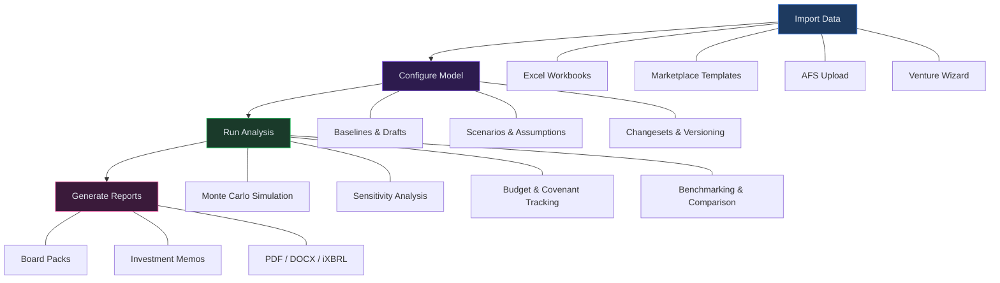

# Virtual Analyst User Manual

## Welcome

Virtual Analyst is a deterministic financial modeling platform that takes you from raw data to board-ready reports in a single workflow. Whether you are importing Excel workbooks, uploading annual financial statements, or starting from an industry template, Virtual Analyst provides AI-powered modeling, Monte Carlo simulation, sensitivity analysis, covenant monitoring, and automated report generation -- all in one place. This manual walks you through every feature of the platform so you can get the most out of your financial modeling work.

---

## Quick-Start Checklist

Follow these steps to go from zero to your first analysis:

1. **Create your account.** Visit the landing page and click **Get started free**. You can sign up with your email address or use Google or Microsoft single sign-on.
2. **Verify your email.** If you signed up with email and password, check your inbox for a confirmation link. Click it to activate your account. (OAuth users skip this step.)
3. **Log in.** After verification, sign in at the login page. You will be redirected to your Dashboard.
4. **Get your first data in.** Choose one of four paths:
   - **Marketplace** -- Browse pre-built industry templates and apply one to create a baseline instantly.
   - **Import Excel** -- Upload an existing Excel workbook. The AI-assisted importer will map your rows to revenue streams, cost items, and capital expenditures.
   - **AFS Import** -- Upload annual financial statements for IFRS or GAAP-compliant disclosure drafting and review.
   - **Ventures** -- Answer a guided questionnaire and let AI generate initial financial assumptions for your business.
5. **Create a baseline.** Whether from a template, Excel import, AFS upload, or venture wizard, your data becomes a baseline -- the foundation for all modeling.
6. **Configure your model.** Open a baseline to create a draft. Adjust assumptions, apply scenarios, and set up correlations.
7. **Run your analysis.** Execute a run to generate Monte Carlo simulations, sensitivity tables, and financial projections.
8. **Generate reports.** Package results into board packs, investment memos, or standalone documents for stakeholders.

---

## Navigation Map

After you sign in, the sidebar gives you access to every area of the platform. The sections below describe how the pages are organized.

### SETUP

| Page | Description |
|------|-------------|
| **Dashboard** | Your home screen. Shows summary cards for recent runs, pending tasks, unread notifications, and API performance metrics. Links to recent activity and assignments. |
| **Marketplace** | Browse and search pre-built financial templates by industry and type. Apply a template to create a new baseline with a label and fiscal year. |
| **Import Excel** | Upload Excel workbooks through an AI-assisted, multi-step import wizard. The system detects revenue streams, cost items, and CapEx lines, then lets you review and confirm mappings before creating a baseline. |
| **Excel Connections** | Create persistent bidirectional sync links between Excel workbooks and financial model runs or baselines. Pull live values or push changes back. |
| **AFS** | Annual Financial Statements module. Create engagements, draft disclosures with AI assistance, run tax computations, consolidate multi-entity structures, and generate PDF, DOCX, or iXBRL output. |
| **Groups** | Manage organizational structures -- define parent-subsidiary hierarchies and entity groupings for consolidation and multi-entity reporting. |

### CONFIGURE

| Page | Description |
|------|-------------|
| **Baselines** | Your master data records. Each baseline holds a complete set of financial line items and assumptions. Search, paginate, and drill into any baseline to view its configuration and version history. |
| **Drafts** | Working copies of baselines where you adjust assumptions, tweak drivers, and prepare for analysis runs. Includes AI chat assistance. |
| **Scenarios** | Define alternative assumption sets (e.g., best case, worst case, base case) to compare outcomes side by side. |
| **Changesets** | Create immutable snapshots of targeted overrides, test them with dry-runs, and merge them into new baseline versions. |

### ANALYZE

| Page | Description |
|------|-------------|
| **Runs** | Execute financial model runs against a draft. Each run produces financial statements, KPIs, Monte Carlo distributions, sensitivity analyses, and valuation outputs. Drill into any run for detailed results. |
| **Budgets** | Track budget performance with variance analysis and visual charts. Compare actuals to projections period by period. |
| **Covenants** | Monitor debt covenant compliance. Set thresholds and receive alerts when ratios approach or breach limits. |
| **Benchmarking** | Compare your metrics against anonymized industry peers. Opt in to share data and view percentile rankings. |
| **Compare** | Side-by-side comparison of entities or runs. Analyze KPI differences and variance drivers. |
| **Ventures** | Guided questionnaire-to-model wizard. Answer questions about your business, and AI generates initial financial assumptions as a draft. |

### COLLABORATE & REPORT

| Page | Description |
|------|-------------|
| **Workflows** | Approval workflows for baselines, drafts, and reports. Route items through review chains with role-based sign-off. |
| **Board Packs** | Assemble presentation-ready packages for board meetings. Use the builder to select sections, charts, and narratives. Schedule recurring generation. |
| **Memos** | Create investment memos with structured narratives and supporting data from your runs. |
| **Documents** | Central document repository for all generated outputs -- PDFs, spreadsheets, and exports. |
| **Collaboration** | Threaded comments, activity feed, and notification management across the platform. |

### ADMIN

| Page | Description |
|------|-------------|
| **Settings** | Account and tenant configuration -- billing, integrations (Xero, QuickBooks), audit log, currency management, SSO/SAML setup, GDPR compliance tools, and team management. |

---

## Platform Overview Flow

The following diagram shows the high-level workflow through Virtual Analyst:

---

## Chapters

### Getting Started

| # | Chapter | Description |
|---|---------|-------------|
| 01 | [Getting Started](01-getting-started.md) | Account creation, email verification, first login, and platform orientation. |
| 02 | [Dashboard](02-dashboard.md) | Understanding your dashboard: summary cards, recent activity, and performance metrics. |

### Setup

| # | Chapter | Description |
|---|---------|-------------|
| 03 | [Marketplace](03-marketplace.md) | Browsing, filtering, and applying industry templates to create baselines. |
| 04 | [Data Import](04-data-import.md) | Importing Excel workbooks and CSV files using the AI-assisted wizard. |
| 05 | [Excel Live Connections](05-excel-connections.md) | Bidirectional sync between Excel workbooks and Virtual Analyst models. |
| 06 | [AFS Module](06-afs-module.md) | Annual Financial Statements: engagements, AI disclosure drafting, and section editing. |
| 07 | [AFS Review and Tax](07-afs-review-and-tax.md) | Three-stage review workflow and tax computation with AI-generated notes. |
| 08 | [AFS Consolidation and Output](08-afs-consolidation-and-output.md) | Multi-entity consolidation and PDF/DOCX/iXBRL output generation. |
| 09 | [Org Structures](09-org-structures.md) | Managing organizational hierarchies, entity groups, and consolidation rules. |

### Configure

| # | Chapter | Description |
|---|---------|-------------|
| 10 | [Baselines](10-baselines.md) | Creating, searching, and managing baselines -- the foundation of every financial model. |
| 11 | [Drafts](11-drafts.md) | Working with drafts: adjusting assumptions, AI chat assistance, and committing changes. |
| 12 | [Scenarios](12-scenarios.md) | Defining and comparing alternative assumption sets across best, base, and worst cases. |
| 13 | [Changesets](13-changesets.md) | Creating targeted overrides, testing with dry-runs, and merging into new baseline versions. |

### Analyze

| # | Chapter | Description |
|---|---------|-------------|
| 14 | [Runs](14-runs.md) | Executing model runs, reviewing results, and exporting financial statements. |
| 15 | [Monte Carlo and Sensitivity](15-monte-carlo-and-sensitivity.md) | Interpreting Monte Carlo fan charts, tornado diagrams, and sensitivity tables. |
| 16 | [Valuation](16-valuation.md) | DCF and multiples-based valuation outputs from model runs. |
| 17 | [Budgets](17-budgets.md) | Budget creation, variance tracking, and period-by-period performance charts. |
| 18 | [Covenants](18-covenants.md) | Setting up covenant monitors, threshold alerts, and compliance dashboards. |
| 19 | [Benchmarking and Competitor Analysis](19-benchmarking.md) | Peer benchmarking, industry segmentation, and competitive positioning. |
| 20 | [Entity Comparison](20-entity-comparison.md) | Side-by-side entity and run comparisons with variance analysis. |
| 21 | [Ventures](21-ventures.md) | Guided questionnaire-to-model wizard with AI-generated assumptions. |

### Collaborate & Report

| # | Chapter | Description |
|---|---------|-------------|
| 22 | [Workflows, Tasks, and Inbox](22-workflows-and-tasks.md) | Configuring approval chains, routing review requests, and managing your inbox. |
| 23 | [Board Packs](23-board-packs.md) | Assembling, customizing, and scheduling board pack generation. |
| 24 | [Memos and Documents](24-memos-and-documents.md) | Creating investment memos and managing your document library. |
| 25 | [Collaboration](25-collaboration.md) | Comments, activity feed, and notifications across the platform. |

### Admin

| # | Chapter | Description |
|---|---------|-------------|
| 26 | [Settings and Administration](26-settings-and-admin.md) | Billing, integrations, teams, SSO, audit log, compliance, and currency management. |
| A | [Glossary](appendix-a-glossary.md) | Definitions of key terms used throughout this manual. |

---

## Getting Help

- **In-app notifications** -- The bell icon in the sidebar shows unread alerts. Click any notification to navigate directly to the relevant item.
- **Inbox** -- Your inbox collects review requests, feedback, and assigned tasks in one place.
- **Settings > Teams** -- If you need to add colleagues or adjust permissions, your tenant administrator can manage team membership from the Settings page.

For additional support, contact your organization's Virtual Analyst administrator or reach out to the platform support team.
